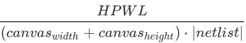
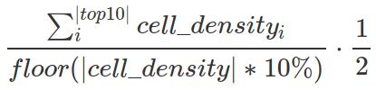
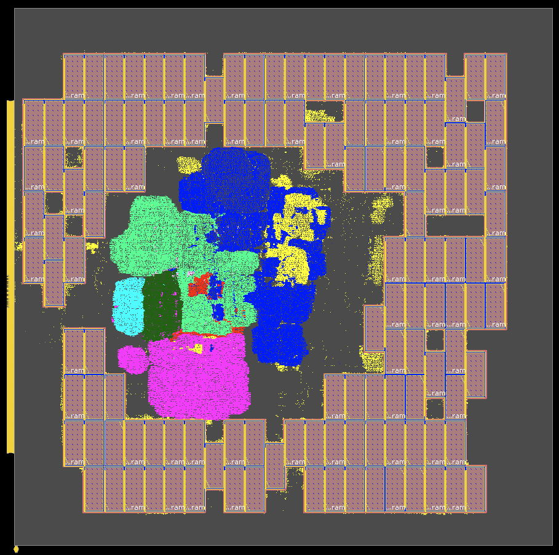
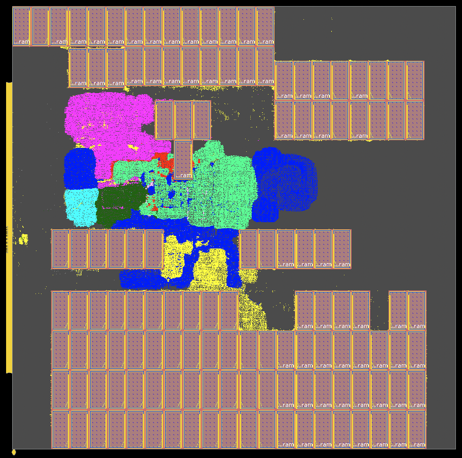

<html>
<head>
<meta content="text/html; charset=UTF-8" http-equiv="content-type">
<style type="text/css">.lst-kix_cjrioth2l6xe-0>li:before{content:"\0025cf  "}ul.lst-kix_ahsoyisgr3l-0{list-style-type:none}.lst-kix_vrmyzyqc1ytl-4>li{counter-increment:lst-ctn-kix_vrmyzyqc1ytl-4}ul.lst-kix_ahsoyisgr3l-2{list-style-type:none}.lst-kix_cjrioth2l6xe-2>li:before{content:"\0025a0  "}.lst-kix_yaib7rgtdms0-2>li:before{content:"\0025a0  "}ul.lst-kix_ahsoyisgr3l-1{list-style-type:none}ul.lst-kix_ahsoyisgr3l-4{list-style-type:none}ul.lst-kix_ahsoyisgr3l-3{list-style-type:none}ul.lst-kix_ahsoyisgr3l-6{list-style-type:none}.lst-kix_yaib7rgtdms0-4>li:before{content:"\0025cb  "}ul.lst-kix_ahsoyisgr3l-5{list-style-type:none}ul.lst-kix_ahsoyisgr3l-8{list-style-type:none}ul.lst-kix_ahsoyisgr3l-7{list-style-type:none}.lst-kix_9dphf43vbd9t-1>li:before{content:"\0025cb  "}.lst-kix_9dphf43vbd9t-3>li:before{content:"\0025cf  "}.lst-kix_65355zgkdrn-1>li:before{content:"\0025cb  "}.lst-kix_pk7ufnh1ilvk-5>li:before{content:"\0025a0  "}.lst-kix_yaib7rgtdms0-8>li:before{content:"\0025a0  "}.lst-kix_9dphf43vbd9t-5>li:before{content:"\0025a0  "}.lst-kix_65355zgkdrn-3>li:before{content:"\0025cf  "}.lst-kix_65355zgkdrn-5>li:before{content:"\0025a0  "}.lst-kix_yaib7rgtdms0-6>li:before{content:"\0025cf  "}.lst-kix_pk7ufnh1ilvk-7>li:before{content:"\0025cb  "}ul.lst-kix_l1859i68vbof-1{list-style-type:none}ul.lst-kix_l1859i68vbof-0{list-style-type:none}.lst-kix_pk7ufnh1ilvk-1>li:before{content:"\0025cb  "}ul.lst-kix_l1859i68vbof-8{list-style-type:none}ul.lst-kix_l1859i68vbof-7{list-style-type:none}.lst-kix_9dphf43vbd9t-7>li:before{content:"\0025cb  "}ul.lst-kix_l1859i68vbof-6{list-style-type:none}ul.lst-kix_l1859i68vbof-5{list-style-type:none}ul.lst-kix_l1859i68vbof-4{list-style-type:none}ul.lst-kix_l1859i68vbof-3{list-style-type:none}ul.lst-kix_l1859i68vbof-2{list-style-type:none}.lst-kix_pk7ufnh1ilvk-3>li:before{content:"\0025cf  "}.lst-kix_z5d93gwj9bm3-6>li{counter-increment:lst-ctn-kix_z5d93gwj9bm3-6}.lst-kix_vrmyzyqc1ytl-3>li:before{content:"" counter(lst-ctn-kix_vrmyzyqc1ytl-3,decimal) ". "}.lst-kix_vrmyzyqc1ytl-7>li:before{content:"" counter(lst-ctn-kix_vrmyzyqc1ytl-7,lower-latin) ". "}.lst-kix_xb2n6g3wp9y8-6>li:before{content:"\0025cf  "}.lst-kix_xb2n6g3wp9y8-8>li:before{content:"\0025a0  "}.lst-kix_vrmyzyqc1ytl-1>li:before{content:"" counter(lst-ctn-kix_vrmyzyqc1ytl-1,lower-latin) ". "}.lst-kix_xb2n6g3wp9y8-2>li:before{content:"\0025a0  "}.lst-kix_v6lj3exglirr-5>li:before{content:"\0025a0  "}.lst-kix_rqjhateb97e7-1>li:before{content:"\0025cb  "}.lst-kix_v6lj3exglirr-7>li:before{content:"\0025cb  "}.lst-kix_xb2n6g3wp9y8-4>li:before{content:"\0025cb  "}.lst-kix_vrmyzyqc1ytl-5>li:before{content:"" counter(lst-ctn-kix_vrmyzyqc1ytl-5,lower-roman) ". "}ul.lst-kix_eh7klsyec453-8{list-style-type:none}.lst-kix_z3fm3ws3scwe-5>li:before{content:"\0025a0  "}.lst-kix_ehtlkhm3zctq-6>li:before{content:"\0025cf  "}.lst-kix_ehtlkhm3zctq-8>li:before{content:"\0025a0  "}.lst-kix_65355zgkdrn-7>li:before{content:"\0025cb  "}.lst-kix_z3fm3ws3scwe-3>li:before{content:"\0025cf  "}.lst-kix_z3fm3ws3scwe-7>li:before{content:"\0025cb  "}.lst-kix_ehtlkhm3zctq-4>li:before{content:"\0025cb  "}.lst-kix_v6lj3exglirr-3>li:before{content:"\0025cf  "}.lst-kix_ehtlkhm3zctq-0>li:before{content:"\0025cf  "}.lst-kix_rqjhateb97e7-3>li:before{content:"\0025cf  "}ul.lst-kix_t3bfo2a79sq4-5{list-style-type:none}ul.lst-kix_t3bfo2a79sq4-4{list-style-type:none}.lst-kix_z3fm3ws3scwe-1>li:before{content:"\0025cb  "}ul.lst-kix_t3bfo2a79sq4-7{list-style-type:none}.lst-kix_v6lj3exglirr-1>li:before{content:"\0025cb  "}.lst-kix_ehtlkhm3zctq-2>li:before{content:"\0025a0  "}ul.lst-kix_t3bfo2a79sq4-6{list-style-type:none}.lst-kix_rqjhateb97e7-5>li:before{content:"\0025a0  "}.lst-kix_rqjhateb97e7-7>li:before{content:"\0025cb  "}ul.lst-kix_t3bfo2a79sq4-1{list-style-type:none}ul.lst-kix_t3bfo2a79sq4-0{list-style-type:none}ul.lst-kix_t3bfo2a79sq4-3{list-style-type:none}ul.lst-kix_t3bfo2a79sq4-2{list-style-type:none}ul.lst-kix_t3bfo2a79sq4-8{list-style-type:none}.lst-kix_ahsoyisgr3l-5>li:before{content:"\0025a0  "}.lst-kix_ahsoyisgr3l-7>li:before{content:"\0025cb  "}ol.lst-kix_z5d93gwj9bm3-7.start{counter-reset:lst-ctn-kix_z5d93gwj9bm3-7 0}ul.lst-kix_eh7klsyec453-7{list-style-type:none}ul.lst-kix_eh7klsyec453-6{list-style-type:none}ul.lst-kix_eh7klsyec453-5{list-style-type:none}ul.lst-kix_eh7klsyec453-4{list-style-type:none}ul.lst-kix_eh7klsyec453-3{list-style-type:none}ul.lst-kix_eh7klsyec453-2{list-style-type:none}ul.lst-kix_eh7klsyec453-1{list-style-type:none}.lst-kix_yhen7yylxv8m-3>li:before{content:"\0025cf  "}ul.lst-kix_eh7klsyec453-0{list-style-type:none}.lst-kix_38971rejrtm5-6>li:before{content:"\0025cf  "}.lst-kix_t4xx94jkp4no-0>li:before{content:"\0025cf  "}.lst-kix_ahsoyisgr3l-3>li:before{content:"\0025cf  "}.lst-kix_xb2n6g3wp9y8-0>li:before{content:"\0025cf  "}.lst-kix_38971rejrtm5-8>li:before{content:"\0025a0  "}.lst-kix_t4xx94jkp4no-2>li:before{content:"\0025a0  "}.lst-kix_yhen7yylxv8m-5>li:before{content:"\0025a0  "}.lst-kix_t3bfo2a79sq4-1>li:before{content:"\0025cb  "}.lst-kix_ahsoyisgr3l-1>li:before{content:"\0025cb  "}.lst-kix_yhen7yylxv8m-1>li:before{content:"\0025cb  "}ul.lst-kix_v6lj3exglirr-0{list-style-type:none}ul.lst-kix_v6lj3exglirr-4{list-style-type:none}ul.lst-kix_v6lj3exglirr-3{list-style-type:none}.lst-kix_rruhbgqttg0u-3>li:before{content:"\0025cf  "}.lst-kix_rruhbgqttg0u-7>li:before{content:"\0025cb  "}ul.lst-kix_v6lj3exglirr-2{list-style-type:none}.lst-kix_t3bfo2a79sq4-5>li:before{content:"\0025a0  "}ul.lst-kix_v6lj3exglirr-1{list-style-type:none}.lst-kix_t4xx94jkp4no-8>li:before{content:"\0025a0  "}.lst-kix_ng6gi3ebnmw8-0>li:before{content:"\0025cf  "}.lst-kix_38971rejrtm5-0>li:before{content:"\0025cf  "}.lst-kix_rruhbgqttg0u-5>li:before{content:"\0025a0  "}.lst-kix_t3bfo2a79sq4-3>li:before{content:"\0025cf  "}.lst-kix_xqo6mrk1h5h1-8>li:before{content:"\0025a0  "}.lst-kix_ng6gi3ebnmw8-2>li:before{content:"\0025a0  "}.lst-kix_38971rejrtm5-2>li:before{content:"\0025a0  "}.lst-kix_t4xx94jkp4no-4>li:before{content:"\0025cb  "}ul.lst-kix_c9860buvq4qk-0{list-style-type:none}ul.lst-kix_c9860buvq4qk-2{list-style-type:none}.lst-kix_xqo6mrk1h5h1-6>li:before{content:"\0025cf  "}ul.lst-kix_c9860buvq4qk-1{list-style-type:none}ul.lst-kix_c9860buvq4qk-4{list-style-type:none}ul.lst-kix_c9860buvq4qk-3{list-style-type:none}ul.lst-kix_c9860buvq4qk-6{list-style-type:none}ul.lst-kix_c9860buvq4qk-5{list-style-type:none}.lst-kix_ng6gi3ebnmw8-6>li:before{content:"\0025cf  "}ul.lst-kix_c9860buvq4qk-8{list-style-type:none}ul.lst-kix_c9860buvq4qk-7{list-style-type:none}.lst-kix_ng6gi3ebnmw8-4>li:before{content:"\0025cb  "}.lst-kix_38971rejrtm5-4>li:before{content:"\0025cb  "}.lst-kix_t4xx94jkp4no-6>li:before{content:"\0025cf  "}.lst-kix_t3bfo2a79sq4-7>li:before{content:"\0025cb  "}.lst-kix_xqo6mrk1h5h1-0>li:before{content:"\0025cf  "}.lst-kix_63lqho3p6504-2>li{counter-increment:lst-ctn-kix_63lqho3p6504-2}.lst-kix_j78x2icbqcxa-7>li{counter-increment:lst-ctn-kix_j78x2icbqcxa-7}.lst-kix_xqo6mrk1h5h1-2>li:before{content:"\0025a0  "}.lst-kix_xqo6mrk1h5h1-4>li:before{content:"\0025cb  "}.lst-kix_4jdlaiovmzbl-5>li:before{content:"\0025a0  "}.lst-kix_s056mis41jc7-7>li:before{content:"\0025cb  "}.lst-kix_ng6gi3ebnmw8-8>li:before{content:"\0025a0  "}.lst-kix_4jdlaiovmzbl-7>li:before{content:"\0025cb  "}.lst-kix_cjrioth2l6xe-8>li:before{content:"\0025a0  "}.lst-kix_4jdlaiovmzbl-1>li:before{content:"\0025cb  "}.lst-kix_s056mis41jc7-3>li:before{content:"\0025cf  "}.lst-kix_s056mis41jc7-5>li:before{content:"\0025a0  "}.lst-kix_cjrioth2l6xe-4>li:before{content:"\0025cb  "}ul.lst-kix_v6lj3exglirr-8{list-style-type:none}.lst-kix_yaib7rgtdms0-0>li:before{content:"\0025cf  "}ul.lst-kix_v6lj3exglirr-7{list-style-type:none}ul.lst-kix_v6lj3exglirr-6{list-style-type:none}.lst-kix_s056mis41jc7-1>li:before{content:"\0025cb  "}ul.lst-kix_v6lj3exglirr-5{list-style-type:none}.lst-kix_cjrioth2l6xe-6>li:before{content:"\0025cf  "}.lst-kix_4jdlaiovmzbl-3>li:before{content:"\0025cf  "}.lst-kix_rruhbgqttg0u-1>li:before{content:"\0025cb  "}.lst-kix_i8v5lxsqrjaq-7>li:before{content:"\0025cb  "}.lst-kix_j78x2icbqcxa-0>li{counter-increment:lst-ctn-kix_j78x2icbqcxa-0}.lst-kix_lw10i1842pnx-6>li:before{content:"\0025cf  "}.lst-kix_tk70kg3xxyj5-3>li:before{content:"\0025cf  "}.lst-kix_hv43fggz723m-2>li:before{content:"\0025a0  "}.lst-kix_i8v5lxsqrjaq-3>li:before{content:"\0025cf  "}.lst-kix_hv43fggz723m-6>li:before{content:"\0025cf  "}.lst-kix_i8zzc2rs1erx-3>li:before{content:"\0025cf  "}.lst-kix_i8zzc2rs1erx-7>li:before{content:"\0025cb  "}.lst-kix_8rbp2tnit6w3-5>li:before{content:"\0025a0  "}.lst-kix_8rbp2tnit6w3-1>li:before{content:"\0025cb  "}.lst-kix_tk70kg3xxyj5-7>li:before{content:"\0025cb  "}.lst-kix_56alipnoti5x-8>li:before{content:"" counter(lst-ctn-kix_56alipnoti5x-8,lower-roman) ". "}.lst-kix_f99fx36vr3cy-7>li:before{content:"\0025cb  "}.lst-kix_yhen7yylxv8m-7>li:before{content:"\0025cb  "}.lst-kix_56alipnoti5x-8>li{counter-increment:lst-ctn-kix_56alipnoti5x-8}.lst-kix_qtjcludte0cj-5>li:before{content:"\0025a0  "}.lst-kix_xq1zso1xiwjl-3>li:before{content:"\0025cf  "}ul.lst-kix_s056mis41jc7-3{list-style-type:none}ul.lst-kix_s056mis41jc7-4{list-style-type:none}ul.lst-kix_s056mis41jc7-1{list-style-type:none}ul.lst-kix_s056mis41jc7-2{list-style-type:none}ul.lst-kix_s056mis41jc7-7{list-style-type:none}.lst-kix_hyjiprpb2tie-2>li:before{content:"\0025a0  "}.lst-kix_hyjiprpb2tie-6>li:before{content:"\0025cf  "}ul.lst-kix_s056mis41jc7-8{list-style-type:none}.lst-kix_qtjcludte0cj-1>li:before{content:"\0025cb  "}ul.lst-kix_s056mis41jc7-5{list-style-type:none}ul.lst-kix_s056mis41jc7-6{list-style-type:none}ul.lst-kix_s056mis41jc7-0{list-style-type:none}.lst-kix_xq1zso1xiwjl-7>li:before{content:"\0025cb  "}.lst-kix_7t1ytz5swccn-3>li:before{content:"\0025cf  "}ul.lst-kix_6jqml4mgbltf-5{list-style-type:none}.lst-kix_y0vl3dy5tjrx-7>li:before{content:"\0025cb  "}ul.lst-kix_6jqml4mgbltf-6{list-style-type:none}.lst-kix_7t1ytz5swccn-7>li:before{content:"\0025cb  "}ul.lst-kix_6jqml4mgbltf-3{list-style-type:none}ul.lst-kix_6jqml4mgbltf-4{list-style-type:none}ul.lst-kix_6jqml4mgbltf-7{list-style-type:none}ul.lst-kix_6jqml4mgbltf-8{list-style-type:none}.lst-kix_p1v1fuvndf2g-3>li:before{content:"\0025cf  "}ul.lst-kix_6jqml4mgbltf-1{list-style-type:none}ul.lst-kix_6jqml4mgbltf-2{list-style-type:none}.lst-kix_po7f4xw3on6f-6>li:before{content:"\0025cf  "}ul.lst-kix_6jqml4mgbltf-0{list-style-type:none}ul.lst-kix_y0vl3dy5tjrx-1{list-style-type:none}ul.lst-kix_y0vl3dy5tjrx-2{list-style-type:none}ul.lst-kix_y0vl3dy5tjrx-0{list-style-type:none}.lst-kix_pfx55fd5knc5-0>li:before{content:"\0025cf  "}.lst-kix_anph2dusxzug-7>li:before{content:"\0025cb  "}.lst-kix_ir2jvtmtyi6e-7>li:before{content:"\0025cb  "}ul.lst-kix_y0vl3dy5tjrx-7{list-style-type:none}ul.lst-kix_y0vl3dy5tjrx-8{list-style-type:none}ul.lst-kix_y0vl3dy5tjrx-5{list-style-type:none}ul.lst-kix_y0vl3dy5tjrx-6{list-style-type:none}ul.lst-kix_y0vl3dy5tjrx-3{list-style-type:none}ul.lst-kix_y0vl3dy5tjrx-4{list-style-type:none}.lst-kix_y0vl3dy5tjrx-3>li:before{content:"\0025cf  "}.lst-kix_j78x2icbqcxa-5>li{counter-increment:lst-ctn-kix_j78x2icbqcxa-5}.lst-kix_ir2jvtmtyi6e-3>li:before{content:"\0025cf  "}.lst-kix_k7al8sp4zhhj-6>li:before{content:"\0025cf  "}.lst-kix_56alipnoti5x-6>li{counter-increment:lst-ctn-kix_56alipnoti5x-6}.lst-kix_po7f4xw3on6f-2>li:before{content:"\0025a0  "}.lst-kix_l2ufoyx06c3n-3>li:before{content:"\0025cf  "}.lst-kix_l2ufoyx06c3n-7>li:before{content:"\0025cb  "}.lst-kix_k7al8sp4zhhj-2>li:before{content:"\0025a0  "}.lst-kix_g2pxj98zjijh-7>li:before{content:"\0025cb  "}.lst-kix_56alipnoti5x-4>li:before{content:"" counter(lst-ctn-kix_56alipnoti5x-4,lower-latin) ". "}.lst-kix_f99fx36vr3cy-3>li:before{content:"\0025cf  "}.lst-kix_g2pxj98zjijh-3>li:before{content:"\0025cf  "}.lst-kix_evpegdwufny8-8>li:before{content:"\0025a0  "}.lst-kix_56alipnoti5x-0>li:before{content:"" counter(lst-ctn-kix_56alipnoti5x-0,decimal) ". "}ol.lst-kix_z5d93gwj9bm3-2.start{counter-reset:lst-ctn-kix_z5d93gwj9bm3-2 0}.lst-kix_1al6jbleid7k-3>li:before{content:"\0025cf  "}.lst-kix_anph2dusxzug-3>li:before{content:"\0025cf  "}.lst-kix_56alipnoti5x-1>li{counter-increment:lst-ctn-kix_56alipnoti5x-1}.lst-kix_rqymwfb5dwcj-2>li:before{content:"\0025a0  "}ul.lst-kix_urytuhcy92gz-0{list-style-type:none}ul.lst-kix_urytuhcy92gz-1{list-style-type:none}ul.lst-kix_urytuhcy92gz-2{list-style-type:none}ul.lst-kix_urytuhcy92gz-3{list-style-type:none}.lst-kix_rqymwfb5dwcj-6>li:before{content:"\0025cf  "}ul.lst-kix_9xutnrioleg-0{list-style-type:none}ul.lst-kix_9xutnrioleg-1{list-style-type:none}ul.lst-kix_9xutnrioleg-2{list-style-type:none}ul.lst-kix_9xutnrioleg-3{list-style-type:none}ul.lst-kix_9xutnrioleg-4{list-style-type:none}ul.lst-kix_9xutnrioleg-5{list-style-type:none}ul.lst-kix_9xutnrioleg-6{list-style-type:none}ul.lst-kix_9xutnrioleg-7{list-style-type:none}ul.lst-kix_t4xx94jkp4no-8{list-style-type:none}ul.lst-kix_9xutnrioleg-8{list-style-type:none}ul.lst-kix_t4xx94jkp4no-5{list-style-type:none}ul.lst-kix_urytuhcy92gz-4{list-style-type:none}ul.lst-kix_t4xx94jkp4no-4{list-style-type:none}ul.lst-kix_urytuhcy92gz-5{list-style-type:none}ul.lst-kix_t4xx94jkp4no-7{list-style-type:none}.lst-kix_p1v1fuvndf2g-7>li:before{content:"\0025cb  "}ul.lst-kix_urytuhcy92gz-6{list-style-type:none}ul.lst-kix_t4xx94jkp4no-6{list-style-type:none}ul.lst-kix_urytuhcy92gz-7{list-style-type:none}ul.lst-kix_t4xx94jkp4no-1{list-style-type:none}ul.lst-kix_urytuhcy92gz-8{list-style-type:none}ul.lst-kix_t4xx94jkp4no-0{list-style-type:none}ul.lst-kix_t4xx94jkp4no-3{list-style-type:none}ul.lst-kix_t4xx94jkp4no-2{list-style-type:none}.lst-kix_jjhe7v9ohcvx-0>li:before{content:"\0025cf  "}.lst-kix_63lqho3p6504-4>li:before{content:"" counter(lst-ctn-kix_63lqho3p6504-4,lower-latin) ". "}.lst-kix_r9phsp2ympsl-5>li:before{content:"\0025a0  "}ul.lst-kix_2zueov1inw82-4{list-style-type:none}.lst-kix_63lqho3p6504-2>li:before{content:"" counter(lst-ctn-kix_63lqho3p6504-2,lower-roman) ". "}ul.lst-kix_2zueov1inw82-3{list-style-type:none}ul.lst-kix_2zueov1inw82-6{list-style-type:none}.lst-kix_jjhe7v9ohcvx-6>li:before{content:"\0025cf  "}ul.lst-kix_2zueov1inw82-5{list-style-type:none}ul.lst-kix_2zueov1inw82-0{list-style-type:none}.lst-kix_mzp6q7ke9kvh-8>li:before{content:"\0025a0  "}ul.lst-kix_2zueov1inw82-2{list-style-type:none}.lst-kix_shwlqzp276p5-6>li:before{content:"\0025cf  "}ul.lst-kix_2zueov1inw82-1{list-style-type:none}.lst-kix_jjhe7v9ohcvx-8>li:before{content:"\0025a0  "}.lst-kix_v98uoiyohixm-4>li:before{content:"\0025cb  "}.lst-kix_f89xd07vvwpw-2>li:before{content:"\0025a0  "}ul.lst-kix_qo5pnqh75mdb-8{list-style-type:none}ul.lst-kix_qo5pnqh75mdb-7{list-style-type:none}ul.lst-kix_qo5pnqh75mdb-6{list-style-type:none}.lst-kix_r9phsp2ympsl-3>li:before{content:"\0025cf  "}ul.lst-kix_qo5pnqh75mdb-5{list-style-type:none}ul.lst-kix_qo5pnqh75mdb-4{list-style-type:none}ul.lst-kix_qo5pnqh75mdb-3{list-style-type:none}ul.lst-kix_qo5pnqh75mdb-2{list-style-type:none}ul.lst-kix_qo5pnqh75mdb-1{list-style-type:none}.lst-kix_v98uoiyohixm-2>li:before{content:"\0025a0  "}.lst-kix_f89xd07vvwpw-4>li:before{content:"\0025cb  "}ul.lst-kix_qo5pnqh75mdb-0{list-style-type:none}.lst-kix_32uhfe1aphxb-1>li:before{content:"\0025cb  "}.lst-kix_mzp6q7ke9kvh-0>li:before{content:"\0025cf  "}.lst-kix_32uhfe1aphxb-3>li:before{content:"\0025cf  "}ol.lst-kix_63lqho3p6504-6.start{counter-reset:lst-ctn-kix_63lqho3p6504-6 0}.lst-kix_mzp6q7ke9kvh-6>li:before{content:"\0025cf  "}.lst-kix_c9860buvq4qk-6>li:before{content:"\0025cf  "}.lst-kix_c9860buvq4qk-8>li:before{content:"\0025a0  "}.lst-kix_shwlqzp276p5-4>li:before{content:"\0025cb  "}.lst-kix_evpegdwufny8-6>li:before{content:"\0025cf  "}ul.lst-kix_yhen7yylxv8m-1{list-style-type:none}ul.lst-kix_yhen7yylxv8m-2{list-style-type:none}ul.lst-kix_yhen7yylxv8m-3{list-style-type:none}ul.lst-kix_yhen7yylxv8m-4{list-style-type:none}ul.lst-kix_yhen7yylxv8m-5{list-style-type:none}ul.lst-kix_yhen7yylxv8m-6{list-style-type:none}ul.lst-kix_yhen7yylxv8m-7{list-style-type:none}ul.lst-kix_yhen7yylxv8m-8{list-style-type:none}.lst-kix_px2s6shusid9-7>li:before{content:"\0025cb  "}.lst-kix_2zueov1inw82-5>li:before{content:"\0025a0  "}.lst-kix_2zueov1inw82-7>li:before{content:"\0025cb  "}.lst-kix_j3ii4g604r93-5>li:before{content:"\0025a0  "}ul.lst-kix_yhen7yylxv8m-0{list-style-type:none}.lst-kix_913im7j30b1n-6>li:before{content:"\0025cf  "}.lst-kix_km3wf8atq88q-6>li:before{content:"\0025cf  "}.lst-kix_evpegdwufny8-0>li:before{content:"\0025cf  "}.lst-kix_px2s6shusid9-1>li:before{content:"\0025cb  "}.lst-kix_j3ii4g604r93-7>li:before{content:"\0025cb  "}.lst-kix_lq0xet2ail9z-0>li:before{content:"\0025cf  "}.lst-kix_lq0xet2ail9z-8>li:before{content:"\0025a0  "}.lst-kix_x25jpw84pliv-1>li:before{content:"\0025cb  "}.lst-kix_eh39fa3yxyb1-0>li:before{content:"\0025cf  "}.lst-kix_4rthn2a1b3cj-3>li:before{content:"\0025cf  "}.lst-kix_vrmyzyqc1ytl-2>li{counter-increment:lst-ctn-kix_vrmyzyqc1ytl-2}.lst-kix_4rthn2a1b3cj-5>li:before{content:"\0025a0  "}.lst-kix_913im7j30b1n-8>li:before{content:"\0025a0  "}.lst-kix_pfx55fd5knc5-2>li:before{content:"\0025a0  "}ul.lst-kix_3meva1vbpli9-3{list-style-type:none}ul.lst-kix_3meva1vbpli9-2{list-style-type:none}ul.lst-kix_3meva1vbpli9-5{list-style-type:none}ul.lst-kix_3meva1vbpli9-4{list-style-type:none}.lst-kix_q87digpaonv3-5>li:before{content:"\0025a0  "}.lst-kix_u9ld7n1rnpqf-1>li:before{content:"\0025cb  "}ul.lst-kix_3meva1vbpli9-1{list-style-type:none}ul.lst-kix_3meva1vbpli9-0{list-style-type:none}.lst-kix_hzq0ehzhxmwi-4>li:before{content:"\0025cb  "}ul.lst-kix_3meva1vbpli9-7{list-style-type:none}ul.lst-kix_3meva1vbpli9-6{list-style-type:none}ul.lst-kix_3meva1vbpli9-8{list-style-type:none}.lst-kix_hzq0ehzhxmwi-2>li:before{content:"\0025a0  "}.lst-kix_pfx55fd5knc5-8>li:before{content:"\0025a0  "}.lst-kix_lq0xet2ail9z-2>li:before{content:"\0025a0  "}.lst-kix_913im7j30b1n-0>li:before{content:"\0025cf  "}.lst-kix_km3wf8atq88q-4>li:before{content:"\0025cb  "}.lst-kix_q87digpaonv3-3>li:before{content:"\0025cf  "}ul.lst-kix_6pqawvsimeex-7{list-style-type:none}ul.lst-kix_6pqawvsimeex-8{list-style-type:none}.lst-kix_sk464okejvq3-3>li:before{content:"\0025cf  "}ul.lst-kix_fytdd5ub013p-6{list-style-type:none}ul.lst-kix_6pqawvsimeex-0{list-style-type:none}ul.lst-kix_fytdd5ub013p-7{list-style-type:none}ul.lst-kix_6pqawvsimeex-1{list-style-type:none}ul.lst-kix_fytdd5ub013p-8{list-style-type:none}ul.lst-kix_6pqawvsimeex-2{list-style-type:none}ul.lst-kix_6pqawvsimeex-3{list-style-type:none}ul.lst-kix_fytdd5ub013p-2{list-style-type:none}ul.lst-kix_6pqawvsimeex-4{list-style-type:none}ul.lst-kix_fytdd5ub013p-3{list-style-type:none}ul.lst-kix_6pqawvsimeex-5{list-style-type:none}ul.lst-kix_fytdd5ub013p-4{list-style-type:none}.lst-kix_u9ld7n1rnpqf-3>li:before{content:"\0025cf  "}ul.lst-kix_6pqawvsimeex-6{list-style-type:none}ul.lst-kix_fytdd5ub013p-5{list-style-type:none}ul.lst-kix_q87digpaonv3-8{list-style-type:none}ul.lst-kix_fytdd5ub013p-0{list-style-type:none}ul.lst-kix_q87digpaonv3-6{list-style-type:none}ul.lst-kix_fytdd5ub013p-1{list-style-type:none}ul.lst-kix_q87digpaonv3-7{list-style-type:none}ul.lst-kix_q87digpaonv3-4{list-style-type:none}ul.lst-kix_q87digpaonv3-5{list-style-type:none}.lst-kix_ovkokag2bmcb-7>li:before{content:"\0025cb  "}ul.lst-kix_q87digpaonv3-2{list-style-type:none}ul.lst-kix_q87digpaonv3-3{list-style-type:none}.lst-kix_x25jpw84pliv-3>li:before{content:"\0025cf  "}.lst-kix_1o02hnjw2td8-5>li:before{content:"\0025a0  "}ul.lst-kix_rngpnbwje6gd-3{list-style-type:none}ul.lst-kix_rngpnbwje6gd-4{list-style-type:none}.lst-kix_3lp6f2pjz5bw-8>li:before{content:"\0025a0  "}.lst-kix_c9860buvq4qk-0>li:before{content:"\0025cf  "}ul.lst-kix_rngpnbwje6gd-5{list-style-type:none}.lst-kix_3q7jadzi0ptk-4>li:before{content:"\0025cb  "}.lst-kix_3q7jadzi0ptk-6>li:before{content:"\0025cf  "}ul.lst-kix_rngpnbwje6gd-6{list-style-type:none}ul.lst-kix_ir2jvtmtyi6e-0{list-style-type:none}ul.lst-kix_rngpnbwje6gd-0{list-style-type:none}ul.lst-kix_ir2jvtmtyi6e-1{list-style-type:none}ul.lst-kix_rngpnbwje6gd-1{list-style-type:none}ul.lst-kix_ir2jvtmtyi6e-2{list-style-type:none}ul.lst-kix_rngpnbwje6gd-2{list-style-type:none}.lst-kix_nuguhpge4nuz-0>li:before{content:"\0025cf  "}ul.lst-kix_ir2jvtmtyi6e-3{list-style-type:none}ul.lst-kix_ir2jvtmtyi6e-4{list-style-type:none}ul.lst-kix_ir2jvtmtyi6e-5{list-style-type:none}ul.lst-kix_ir2jvtmtyi6e-6{list-style-type:none}.lst-kix_1o02hnjw2td8-7>li:before{content:"\0025cb  "}ul.lst-kix_ir2jvtmtyi6e-7{list-style-type:none}ul.lst-kix_ir2jvtmtyi6e-8{list-style-type:none}.lst-kix_nuguhpge4nuz-6>li:before{content:"\0025cf  "}.lst-kix_ovkokag2bmcb-1>li:before{content:"\0025cb  "}ol.lst-kix_63lqho3p6504-8.start{counter-reset:lst-ctn-kix_63lqho3p6504-8 0}.lst-kix_d3zzjbyv5m0n-4>li:before{content:"\0025cb  "}.lst-kix_d3zzjbyv5m0n-2>li:before{content:"\0025a0  "}.lst-kix_3lp6f2pjz5bw-0>li:before{content:"\0025cf  "}.lst-kix_lw10i1842pnx-4>li:before{content:"\0025cb  "}.lst-kix_3lp6f2pjz5bw-2>li:before{content:"\0025a0  "}.lst-kix_vrmyzyqc1ytl-6>li{counter-increment:lst-ctn-kix_vrmyzyqc1ytl-6}ul.lst-kix_rngpnbwje6gd-7{list-style-type:none}ul.lst-kix_rngpnbwje6gd-8{list-style-type:none}.lst-kix_ikllt7lwwvr-0>li:before{content:"\0025cf  "}ul.lst-kix_se1dd3u69kn3-6{list-style-type:none}ul.lst-kix_32uhfe1aphxb-7{list-style-type:none}ul.lst-kix_se1dd3u69kn3-5{list-style-type:none}ul.lst-kix_32uhfe1aphxb-6{list-style-type:none}ul.lst-kix_se1dd3u69kn3-8{list-style-type:none}ul.lst-kix_se1dd3u69kn3-7{list-style-type:none}ul.lst-kix_32uhfe1aphxb-8{list-style-type:none}.lst-kix_hv43fggz723m-0>li:before{content:"\0025cf  "}.lst-kix_3meva1vbpli9-0>li:before{content:"\0025cf  "}ul.lst-kix_32uhfe1aphxb-1{list-style-type:none}.lst-kix_27r9okw59ofv-5>li:before{content:"\0025a0  "}ul.lst-kix_32uhfe1aphxb-0{list-style-type:none}ul.lst-kix_32uhfe1aphxb-3{list-style-type:none}ul.lst-kix_32uhfe1aphxb-2{list-style-type:none}ul.lst-kix_32uhfe1aphxb-5{list-style-type:none}ul.lst-kix_32uhfe1aphxb-4{list-style-type:none}ul.lst-kix_xq1zso1xiwjl-1{list-style-type:none}ul.lst-kix_4rthn2a1b3cj-8{list-style-type:none}ul.lst-kix_xq1zso1xiwjl-0{list-style-type:none}ul.lst-kix_4rthn2a1b3cj-7{list-style-type:none}ul.lst-kix_xq1zso1xiwjl-3{list-style-type:none}ul.lst-kix_xq1zso1xiwjl-2{list-style-type:none}.lst-kix_fpcfuqktj4il-0>li:before{content:"\0025cf  "}ul.lst-kix_4rthn2a1b3cj-4{list-style-type:none}ul.lst-kix_4rthn2a1b3cj-3{list-style-type:none}.lst-kix_hv43fggz723m-8>li:before{content:"\0025a0  "}ul.lst-kix_4rthn2a1b3cj-6{list-style-type:none}ul.lst-kix_4rthn2a1b3cj-5{list-style-type:none}.lst-kix_3meva1vbpli9-8>li:before{content:"\0025a0  "}.lst-kix_tk70kg3xxyj5-1>li:before{content:"\0025cb  "}ul.lst-kix_xq1zso1xiwjl-8{list-style-type:none}ol.lst-kix_63lqho3p6504-3.start{counter-reset:lst-ctn-kix_63lqho3p6504-3 0}.lst-kix_mm246v3wx7pg-5>li:before{content:"\0025a0  "}.lst-kix_i8v5lxsqrjaq-5>li:before{content:"\0025a0  "}ul.lst-kix_se1dd3u69kn3-0{list-style-type:none}ul.lst-kix_xq1zso1xiwjl-5{list-style-type:none}ul.lst-kix_se1dd3u69kn3-2{list-style-type:none}ul.lst-kix_xq1zso1xiwjl-4{list-style-type:none}.lst-kix_3rxqlrcsxlk0-4>li:before{content:"\0025cb  "}ul.lst-kix_se1dd3u69kn3-1{list-style-type:none}ul.lst-kix_xq1zso1xiwjl-7{list-style-type:none}ul.lst-kix_se1dd3u69kn3-4{list-style-type:none}ul.lst-kix_xq1zso1xiwjl-6{list-style-type:none}ul.lst-kix_se1dd3u69kn3-3{list-style-type:none}.lst-kix_8rbp2tnit6w3-7>li:before{content:"\0025cb  "}.lst-kix_fpcfuqktj4il-8>li:before{content:"\0025a0  "}ul.lst-kix_sk464okejvq3-3{list-style-type:none}ul.lst-kix_sk464okejvq3-2{list-style-type:none}ul.lst-kix_sk464okejvq3-1{list-style-type:none}ul.lst-kix_sk464okejvq3-0{list-style-type:none}.lst-kix_i8zzc2rs1erx-1>li:before{content:"\0025cb  "}ul.lst-kix_evpegdwufny8-2{list-style-type:none}ul.lst-kix_tttlg1yk1y81-4{list-style-type:none}ul.lst-kix_evpegdwufny8-1{list-style-type:none}ul.lst-kix_tttlg1yk1y81-5{list-style-type:none}ul.lst-kix_evpegdwufny8-4{list-style-type:none}ul.lst-kix_tttlg1yk1y81-6{list-style-type:none}ul.lst-kix_evpegdwufny8-3{list-style-type:none}ul.lst-kix_tttlg1yk1y81-7{list-style-type:none}ul.lst-kix_evpegdwufny8-6{list-style-type:none}ul.lst-kix_tttlg1yk1y81-8{list-style-type:none}.lst-kix_uli084ykuvp-7>li:before{content:"\0025cb  "}ul.lst-kix_evpegdwufny8-5{list-style-type:none}ul.lst-kix_evpegdwufny8-8{list-style-type:none}ul.lst-kix_evpegdwufny8-7{list-style-type:none}ul.lst-kix_tttlg1yk1y81-0{list-style-type:none}.lst-kix_r2lad9iocvnl-2>li:before{content:"\0025a0  "}ul.lst-kix_tttlg1yk1y81-1{list-style-type:none}ul.lst-kix_evpegdwufny8-0{list-style-type:none}ul.lst-kix_tttlg1yk1y81-2{list-style-type:none}ul.lst-kix_tttlg1yk1y81-3{list-style-type:none}.lst-kix_f99fx36vr3cy-5>li:before{content:"\0025a0  "}.lst-kix_hyjiprpb2tie-0>li:before{content:"\0025cf  "}.lst-kix_9xutnrioleg-0>li:before{content:"\0025cf  "}ul.lst-kix_cjrioth2l6xe-4{list-style-type:none}ul.lst-kix_cjrioth2l6xe-3{list-style-type:none}.lst-kix_rleiipw8yujd-5>li:before{content:"\0025a0  "}ul.lst-kix_cjrioth2l6xe-2{list-style-type:none}ul.lst-kix_cjrioth2l6xe-1{list-style-type:none}ul.lst-kix_cjrioth2l6xe-0{list-style-type:none}.lst-kix_qo5pnqh75mdb-3>li:before{content:"\0025cf  "}.lst-kix_9fx14elw3n6c-7>li:before{content:"\0025cb  "}ul.lst-kix_q87digpaonv3-0{list-style-type:none}ul.lst-kix_q87digpaonv3-1{list-style-type:none}.lst-kix_whx7hgxnrw0o-1>li:before{content:"\0025cb  "}ul.lst-kix_cjrioth2l6xe-8{list-style-type:none}ul.lst-kix_cjrioth2l6xe-7{list-style-type:none}ul.lst-kix_cjrioth2l6xe-6{list-style-type:none}ul.lst-kix_cjrioth2l6xe-5{list-style-type:none}.lst-kix_tttlg1yk1y81-1>li:before{content:"\0025cb  "}.lst-kix_xq1zso1xiwjl-1>li:before{content:"\0025cb  "}.lst-kix_al965p1abbzc-5>li:before{content:"\0025a0  "}ul.lst-kix_4rthn2a1b3cj-0{list-style-type:none}.lst-kix_hyjiprpb2tie-8>li:before{content:"\0025a0  "}ul.lst-kix_4rthn2a1b3cj-2{list-style-type:none}ul.lst-kix_4rthn2a1b3cj-1{list-style-type:none}.lst-kix_qtjcludte0cj-3>li:before{content:"\0025cf  "}.lst-kix_9xutnrioleg-8>li:before{content:"\0025a0  "}.lst-kix_ikllt7lwwvr-8>li:before{content:"\0025a0  "}.lst-kix_7t1ytz5swccn-5>li:before{content:"\0025a0  "}.lst-kix_rngpnbwje6gd-6>li:before{content:"\0025cf  "}.lst-kix_po7f4xw3on6f-4>li:before{content:"\0025cb  "}.lst-kix_jd50kek5so1f-1>li:before{content:"\0025cb  "}.lst-kix_p1v1fuvndf2g-1>li:before{content:"\0025cb  "}.lst-kix_3buqntvf5ji1-5>li:before{content:"\0025a0  "}.lst-kix_gd9q3ewgzu3a-4>li:before{content:"\0025cb  "}.lst-kix_rqymwfb5dwcj-0>li:before{content:"\0025cf  "}.lst-kix_hwel6grnkgdp-1>li:before{content:"\0025cb  "}.lst-kix_k7al8sp4zhhj-4>li:before{content:"\0025cb  "}.lst-kix_y0vl3dy5tjrx-5>li:before{content:"\0025a0  "}.lst-kix_ir2jvtmtyi6e-1>li:before{content:"\0025cb  "}.lst-kix_eh39fa3yxyb1-6>li:before{content:"\0025cf  "}.lst-kix_txt8a7xdskx-8>li:before{content:"\0025a0  "}.lst-kix_ds93uqv1paam-5>li:before{content:"\0025cf  "}.lst-kix_56alipnoti5x-2>li:before{content:"" counter(lst-ctn-kix_56alipnoti5x-2,lower-roman) ". "}.lst-kix_g2pxj98zjijh-5>li:before{content:"\0025a0  "}.lst-kix_l2ufoyx06c3n-1>li:before{content:"\0025cb  "}ul.lst-kix_sk464okejvq3-8{list-style-type:none}.lst-kix_6jqml4mgbltf-7>li:before{content:"\0025cb  "}ul.lst-kix_sk464okejvq3-7{list-style-type:none}.lst-kix_1al6jbleid7k-5>li:before{content:"\0025a0  "}ul.lst-kix_sk464okejvq3-6{list-style-type:none}ul.lst-kix_sk464okejvq3-5{list-style-type:none}ul.lst-kix_sk464okejvq3-4{list-style-type:none}.lst-kix_txt8a7xdskx-0>li:before{content:"\0025cf  "}ol.lst-kix_63lqho3p6504-1.start{counter-reset:lst-ctn-kix_63lqho3p6504-1 0}.lst-kix_2k9euy51wcj7-7>li:before{content:"\0025cb  "}.lst-kix_eh7klsyec453-5>li:before{content:"\0025a0  "}.lst-kix_anph2dusxzug-1>li:before{content:"\0025cb  "}.lst-kix_en237cfa07lb-6>li:before{content:"\0025cf  "}.lst-kix_rqymwfb5dwcj-8>li:before{content:"\0025a0  "}ul.lst-kix_2zueov1inw82-8{list-style-type:none}ul.lst-kix_2zueov1inw82-7{list-style-type:none}ol.lst-kix_vrmyzyqc1ytl-1{list-style-type:none}ol.lst-kix_vrmyzyqc1ytl-0{list-style-type:none}ol.lst-kix_vrmyzyqc1ytl-3{list-style-type:none}ol.lst-kix_vrmyzyqc1ytl-2{list-style-type:none}.lst-kix_ww92s9u94nm-0>li:before{content:"\0025cf  "}.lst-kix_z5d93gwj9bm3-8>li:before{content:"" counter(lst-ctn-kix_z5d93gwj9bm3-8,lower-roman) ". "}ol.lst-kix_vrmyzyqc1ytl-5{list-style-type:none}ol.lst-kix_vrmyzyqc1ytl-4{list-style-type:none}.lst-kix_26n6gq4t3wd2-7>li:before{content:"\0025cb  "}ol.lst-kix_vrmyzyqc1ytl-7{list-style-type:none}ol.lst-kix_vrmyzyqc1ytl-6{list-style-type:none}ol.lst-kix_vrmyzyqc1ytl-8{list-style-type:none}.lst-kix_26n6gq4t3wd2-6>li:before{content:"\0025cf  "}.lst-kix_ww92s9u94nm-6>li:before{content:"\0025cf  "}.lst-kix_z5d93gwj9bm3-6>li:before{content:"" counter(lst-ctn-kix_z5d93gwj9bm3-6,decimal) ". "}.lst-kix_z5d93gwj9bm3-3>li:before{content:"" counter(lst-ctn-kix_z5d93gwj9bm3-3,decimal) ". "}.lst-kix_j78x2icbqcxa-4>li:before{content:"" counter(lst-ctn-kix_j78x2icbqcxa-4,lower-latin) ". "}.lst-kix_j78x2icbqcxa-6>li:before{content:"" counter(lst-ctn-kix_j78x2icbqcxa-6,decimal) ". "}.lst-kix_26n6gq4t3wd2-4>li:before{content:"\0025cb  "}.lst-kix_z5d93gwj9bm3-5>li:before{content:"" counter(lst-ctn-kix_z5d93gwj9bm3-5,lower-roman) ". "}.lst-kix_26n6gq4t3wd2-3>li:before{content:"\0025cf  "}ol.lst-kix_63lqho3p6504-0.start{counter-reset:lst-ctn-kix_63lqho3p6504-0 0}.lst-kix_26n6gq4t3wd2-0>li:before{content:"\0025cf  "}.lst-kix_z5d93gwj9bm3-2>li:before{content:"" counter(lst-ctn-kix_z5d93gwj9bm3-2,lower-roman) ". "}.lst-kix_j78x2icbqcxa-7>li:before{content:"" counter(lst-ctn-kix_j78x2icbqcxa-7,lower-latin) ". "}.lst-kix_iizh2v331mf7-5>li:before{content:"\0025a0  "}.lst-kix_iizh2v331mf7-6>li:before{content:"\0025cf  "}ol.lst-kix_z5d93gwj9bm3-0.start{counter-reset:lst-ctn-kix_z5d93gwj9bm3-0 0}.lst-kix_urytuhcy92gz-2>li:before{content:"\0025a0  "}.lst-kix_iizh2v331mf7-8>li:before{content:"\0025a0  "}.lst-kix_urytuhcy92gz-1>li:before{content:"\0025cb  "}ul.lst-kix_al965p1abbzc-8{list-style-type:none}ul.lst-kix_al965p1abbzc-7{list-style-type:none}ul.lst-kix_al965p1abbzc-6{list-style-type:none}ul.lst-kix_al965p1abbzc-5{list-style-type:none}.lst-kix_6pqawvsimeex-4>li:before{content:"\0025cb  "}.lst-kix_iizh2v331mf7-2>li:before{content:"\0025a0  "}.lst-kix_6pqawvsimeex-3>li:before{content:"\0025cf  "}.lst-kix_olbr6uc2umm2-8>li:before{content:"\0025a0  "}.lst-kix_olbr6uc2umm2-5>li:before{content:"\0025a0  "}.lst-kix_6pqawvsimeex-6>li:before{content:"\0025cf  "}.lst-kix_6pqawvsimeex-7>li:before{content:"\0025cb  "}ul.lst-kix_al965p1abbzc-4{list-style-type:none}ul.lst-kix_al965p1abbzc-3{list-style-type:none}.lst-kix_vrmyzyqc1ytl-8>li{counter-increment:lst-ctn-kix_vrmyzyqc1ytl-8}ul.lst-kix_al965p1abbzc-2{list-style-type:none}ul.lst-kix_al965p1abbzc-1{list-style-type:none}ul.lst-kix_al965p1abbzc-0{list-style-type:none}.lst-kix_urytuhcy92gz-4>li:before{content:"\0025cb  "}.lst-kix_fytdd5ub013p-7>li:before{content:"\0025cb  "}.lst-kix_ti7x85kk22vo-7>li:before{content:"\0025cb  "}.lst-kix_ti7x85kk22vo-8>li:before{content:"\0025a0  "}.lst-kix_urytuhcy92gz-5>li:before{content:"\0025a0  "}.lst-kix_l1859i68vbof-0>li:before{content:"\0025cf  "}.lst-kix_l1859i68vbof-3>li:before{content:"\0025cf  "}ol.lst-kix_z5d93gwj9bm3-5.start{counter-reset:lst-ctn-kix_z5d93gwj9bm3-5 0}.lst-kix_fytdd5ub013p-0>li:before{content:"\0025cf  "}.lst-kix_urytuhcy92gz-8>li:before{content:"\0025a0  "}.lst-kix_fytdd5ub013p-1>li:before{content:"\0025cb  "}.lst-kix_ww92s9u94nm-5>li:before{content:"\0025a0  "}.lst-kix_l1859i68vbof-7>li:before{content:"\0025cb  "}.lst-kix_ww92s9u94nm-3>li:before{content:"\0025cf  "}.lst-kix_l1859i68vbof-6>li:before{content:"\0025cf  "}.lst-kix_jd50kek5so1f-8>li:before{content:"\0025a0  "}.lst-kix_fytdd5ub013p-4>li:before{content:"\0025cb  "}.lst-kix_ww92s9u94nm-2>li:before{content:"\0025a0  "}.lst-kix_itndpgb19q97-2>li:before{content:"\0025a0  "}.lst-kix_itndpgb19q97-8>li:before{content:"\0025a0  "}.lst-kix_3buqntvf5ji1-8>li:before{content:"\0025a0  "}ul.lst-kix_mm246v3wx7pg-0{list-style-type:none}.lst-kix_jd50kek5so1f-2>li:before{content:"\0025a0  "}ul.lst-kix_mm246v3wx7pg-4{list-style-type:none}ul.lst-kix_mm246v3wx7pg-3{list-style-type:none}ul.lst-kix_mm246v3wx7pg-2{list-style-type:none}ul.lst-kix_mm246v3wx7pg-1{list-style-type:none}.lst-kix_3buqntvf5ji1-4>li:before{content:"\0025cb  "}.lst-kix_ti7x85kk22vo-4>li:before{content:"\0025cb  "}.lst-kix_gd9q3ewgzu3a-3>li:before{content:"\0025cf  "}.lst-kix_uz0g4q67cpsa-0>li:before{content:"\0025cf  "}.lst-kix_qo5pnqh75mdb-1>li:before{content:"\0025cb  "}ul.lst-kix_mm246v3wx7pg-8{list-style-type:none}.lst-kix_gd9q3ewgzu3a-7>li:before{content:"\0025cb  "}ul.lst-kix_mm246v3wx7pg-7{list-style-type:none}ul.lst-kix_mm246v3wx7pg-6{list-style-type:none}ul.lst-kix_mm246v3wx7pg-5{list-style-type:none}ol.lst-kix_vrmyzyqc1ytl-0.start{counter-reset:lst-ctn-kix_vrmyzyqc1ytl-0 0}.lst-kix_9fx14elw3n6c-0>li:before{content:"\0025cf  "}.lst-kix_uz0g4q67cpsa-4>li:before{content:"\0025cb  "}.lst-kix_56alipnoti5x-3>li{counter-increment:lst-ctn-kix_56alipnoti5x-3}.lst-kix_ds93uqv1paam-2>li:before{content:"\0025cf  "}.lst-kix_6jqml4mgbltf-0>li:before{content:"\0025cf  "}.lst-kix_se1dd3u69kn3-2>li:before{content:"\0025a0  "}.lst-kix_se1dd3u69kn3-6>li:before{content:"\0025cf  "}.lst-kix_ds93uqv1paam-0>li:before{content:"\0025cf  "}.lst-kix_6pqawvsimeex-1>li:before{content:"\0025cb  "}.lst-kix_se1dd3u69kn3-8>li:before{content:"\0025a0  "}.lst-kix_ds93uqv1paam-6>li:before{content:"\0025cf  "}.lst-kix_6jqml4mgbltf-6>li:before{content:"\0025cf  "}.lst-kix_eh7klsyec453-8>li:before{content:"\0025a0  "}.lst-kix_2k9euy51wcj7-8>li:before{content:"\0025a0  "}.lst-kix_vrmyzyqc1ytl-0>li{counter-increment:lst-ctn-kix_vrmyzyqc1ytl-0}.lst-kix_h7u0vg3yqvzi-5>li:before{content:"\0025a0  "}.lst-kix_eh7klsyec453-4>li:before{content:"\0025cb  "}.lst-kix_3rxqlrcsxlk0-0>li:before{content:"\0025cf  "}.lst-kix_j78x2icbqcxa-3>li:before{content:"" counter(lst-ctn-kix_j78x2icbqcxa-3,decimal) ". "}.lst-kix_2k9euy51wcj7-2>li:before{content:"\0025a0  "}.lst-kix_j78x2icbqcxa-1>li:before{content:"" counter(lst-ctn-kix_j78x2icbqcxa-1,lower-latin) ". "}.lst-kix_2k9euy51wcj7-4>li:before{content:"\0025cb  "}.lst-kix_uli084ykuvp-1>li:before{content:"\0025cb  "}.lst-kix_ikllt7lwwvr-3>li:before{content:"\0025cf  "}.lst-kix_uli084ykuvp-5>li:before{content:"\0025a0  "}.lst-kix_ikllt7lwwvr-6>li:before{content:"\0025cf  "}.lst-kix_fpcfuqktj4il-1>li:before{content:"\0025cb  "}.lst-kix_3rxqlrcsxlk0-6>li:before{content:"\0025cf  "}.lst-kix_3rxqlrcsxlk0-7>li:before{content:"\0025cb  "}.lst-kix_27r9okw59ofv-7>li:before{content:"\0025cb  "}.lst-kix_3meva1vbpli9-7>li:before{content:"\0025cb  "}.lst-kix_3rxqlrcsxlk0-3>li:before{content:"\0025cf  "}.lst-kix_ikllt7lwwvr-2>li:before{content:"\0025a0  "}.lst-kix_mm246v3wx7pg-7>li:before{content:"\0025cb  "}.lst-kix_uli084ykuvp-2>li:before{content:"\0025a0  "}.lst-kix_r2lad9iocvnl-3>li:before{content:"\0025cf  "}.lst-kix_nuguhpge4nuz-8>li:before{content:"\0025a0  "}.lst-kix_r2lad9iocvnl-0>li:before{content:"\0025cf  "}.lst-kix_rleiipw8yujd-7>li:before{content:"\0025cb  "}.lst-kix_rleiipw8yujd-8>li:before{content:"\0025a0  "}.lst-kix_whx7hgxnrw0o-2>li:before{content:"\0025a0  "}ul.lst-kix_v98uoiyohixm-7{list-style-type:none}ul.lst-kix_v98uoiyohixm-8{list-style-type:none}ul.lst-kix_v98uoiyohixm-3{list-style-type:none}ul.lst-kix_v98uoiyohixm-4{list-style-type:none}ul.lst-kix_v98uoiyohixm-5{list-style-type:none}ul.lst-kix_v98uoiyohixm-6{list-style-type:none}ul.lst-kix_v98uoiyohixm-0{list-style-type:none}ul.lst-kix_v98uoiyohixm-1{list-style-type:none}ul.lst-kix_v98uoiyohixm-2{list-style-type:none}.lst-kix_al965p1abbzc-0>li:before{content:"\0025cf  "}.lst-kix_rleiipw8yujd-4>li:before{content:"\0025cb  "}ul.lst-kix_k7al8sp4zhhj-0{list-style-type:none}.lst-kix_9xutnrioleg-2>li:before{content:"\0025a0  "}.lst-kix_tttlg1yk1y81-8>li:before{content:"\0025a0  "}ul.lst-kix_k7al8sp4zhhj-1{list-style-type:none}ul.lst-kix_k7al8sp4zhhj-2{list-style-type:none}ul.lst-kix_k7al8sp4zhhj-7{list-style-type:none}ul.lst-kix_k7al8sp4zhhj-8{list-style-type:none}.lst-kix_9xutnrioleg-5>li:before{content:"\0025a0  "}.lst-kix_9xutnrioleg-6>li:before{content:"\0025cf  "}ul.lst-kix_k7al8sp4zhhj-3{list-style-type:none}ul.lst-kix_k7al8sp4zhhj-4{list-style-type:none}ul.lst-kix_k7al8sp4zhhj-5{list-style-type:none}ul.lst-kix_k7al8sp4zhhj-6{list-style-type:none}.lst-kix_al965p1abbzc-3>li:before{content:"\0025cf  "}.lst-kix_3buqntvf5ji1-7>li:before{content:"\0025cb  "}.lst-kix_sk464okejvq3-8>li:before{content:"\0025a0  "}ul.lst-kix_d3zzjbyv5m0n-3{list-style-type:none}ul.lst-kix_d3zzjbyv5m0n-4{list-style-type:none}ul.lst-kix_d3zzjbyv5m0n-5{list-style-type:none}ul.lst-kix_d3zzjbyv5m0n-6{list-style-type:none}ul.lst-kix_d3zzjbyv5m0n-0{list-style-type:none}ul.lst-kix_d3zzjbyv5m0n-1{list-style-type:none}ul.lst-kix_d3zzjbyv5m0n-2{list-style-type:none}ol.lst-kix_z5d93gwj9bm3-1.start{counter-reset:lst-ctn-kix_z5d93gwj9bm3-1 0}ol.lst-kix_z5d93gwj9bm3-4.start{counter-reset:lst-ctn-kix_z5d93gwj9bm3-4 0}.lst-kix_eh39fa3yxyb1-8>li:before{content:"\0025a0  "}.lst-kix_txt8a7xdskx-2>li:before{content:"\0025a0  "}.lst-kix_en237cfa07lb-0>li:before{content:"\0025cf  "}.lst-kix_x25jpw84pliv-4>li:before{content:"\0025cb  "}.lst-kix_u9ld7n1rnpqf-8>li:before{content:"\0025a0  "}.lst-kix_gd9q3ewgzu3a-6>li:before{content:"\0025cf  "}.lst-kix_uz0g4q67cpsa-1>li:before{content:"\0025cb  "}ul.lst-kix_xb2n6g3wp9y8-6{list-style-type:none}ul.lst-kix_xb2n6g3wp9y8-7{list-style-type:none}ul.lst-kix_xb2n6g3wp9y8-8{list-style-type:none}ul.lst-kix_3buqntvf5ji1-0{list-style-type:none}ul.lst-kix_d3zzjbyv5m0n-7{list-style-type:none}ul.lst-kix_d3zzjbyv5m0n-8{list-style-type:none}ul.lst-kix_3buqntvf5ji1-2{list-style-type:none}.lst-kix_txt8a7xdskx-6>li:before{content:"\0025cf  "}ul.lst-kix_3buqntvf5ji1-1{list-style-type:none}ul.lst-kix_xb2n6g3wp9y8-0{list-style-type:none}.lst-kix_63lqho3p6504-4>li{counter-increment:lst-ctn-kix_63lqho3p6504-4}ul.lst-kix_xb2n6g3wp9y8-1{list-style-type:none}ul.lst-kix_xb2n6g3wp9y8-2{list-style-type:none}ul.lst-kix_xb2n6g3wp9y8-3{list-style-type:none}ul.lst-kix_xb2n6g3wp9y8-4{list-style-type:none}ul.lst-kix_xb2n6g3wp9y8-5{list-style-type:none}.lst-kix_6pqawvsimeex-0>li:before{content:"\0025cf  "}.lst-kix_ds93uqv1paam-3>li:before{content:"\0025cf  "}.lst-kix_se1dd3u69kn3-5>li:before{content:"\0025a0  "}ul.lst-kix_3buqntvf5ji1-4{list-style-type:none}ul.lst-kix_3buqntvf5ji1-3{list-style-type:none}ul.lst-kix_3buqntvf5ji1-6{list-style-type:none}ul.lst-kix_3buqntvf5ji1-5{list-style-type:none}ul.lst-kix_3buqntvf5ji1-8{list-style-type:none}ul.lst-kix_3buqntvf5ji1-7{list-style-type:none}ul.lst-kix_4jdlaiovmzbl-7{list-style-type:none}ul.lst-kix_4jdlaiovmzbl-8{list-style-type:none}ul.lst-kix_4jdlaiovmzbl-5{list-style-type:none}ul.lst-kix_h7u0vg3yqvzi-8{list-style-type:none}ul.lst-kix_4jdlaiovmzbl-6{list-style-type:none}.lst-kix_nuguhpge4nuz-5>li:before{content:"\0025a0  "}ul.lst-kix_h7u0vg3yqvzi-6{list-style-type:none}ul.lst-kix_h7u0vg3yqvzi-7{list-style-type:none}ul.lst-kix_h7u0vg3yqvzi-4{list-style-type:none}ul.lst-kix_h7u0vg3yqvzi-5{list-style-type:none}ul.lst-kix_h7u0vg3yqvzi-2{list-style-type:none}ul.lst-kix_4jdlaiovmzbl-0{list-style-type:none}ul.lst-kix_h7u0vg3yqvzi-3{list-style-type:none}ul.lst-kix_h7u0vg3yqvzi-0{list-style-type:none}ul.lst-kix_h7u0vg3yqvzi-1{list-style-type:none}ul.lst-kix_4jdlaiovmzbl-3{list-style-type:none}ul.lst-kix_4jdlaiovmzbl-4{list-style-type:none}ul.lst-kix_4jdlaiovmzbl-1{list-style-type:none}ul.lst-kix_4jdlaiovmzbl-2{list-style-type:none}.lst-kix_h7u0vg3yqvzi-8>li:before{content:"\0025a0  "}.lst-kix_en237cfa07lb-4>li:before{content:"\0025cb  "}.lst-kix_2k9euy51wcj7-1>li:before{content:"\0025cb  "}.lst-kix_rngpnbwje6gd-8>li:before{content:"\0025a0  "}.lst-kix_j78x2icbqcxa-0>li:before{content:"" counter(lst-ctn-kix_j78x2icbqcxa-0,decimal) ". "}.lst-kix_eh7klsyec453-7>li:before{content:"\0025cb  "}.lst-kix_2k9euy51wcj7-5>li:before{content:"\0025a0  "}ul.lst-kix_lq0xet2ail9z-8{list-style-type:none}.lst-kix_r9phsp2ympsl-6>li:before{content:"\0025cf  "}ul.lst-kix_lq0xet2ail9z-7{list-style-type:none}.lst-kix_jjhe7v9ohcvx-2>li:before{content:"\0025a0  "}ul.lst-kix_hyjiprpb2tie-8{list-style-type:none}ul.lst-kix_lq0xet2ail9z-6{list-style-type:none}ul.lst-kix_hyjiprpb2tie-7{list-style-type:none}ul.lst-kix_lq0xet2ail9z-5{list-style-type:none}.lst-kix_63lqho3p6504-5>li:before{content:"" counter(lst-ctn-kix_63lqho3p6504-5,lower-roman) ". "}.lst-kix_63lqho3p6504-8>li:before{content:"" counter(lst-ctn-kix_63lqho3p6504-8,lower-roman) ". "}ul.lst-kix_lq0xet2ail9z-4{list-style-type:none}ul.lst-kix_lq0xet2ail9z-3{list-style-type:none}ul.lst-kix_lq0xet2ail9z-2{list-style-type:none}ul.lst-kix_pfx55fd5knc5-5{list-style-type:none}ul.lst-kix_hyjiprpb2tie-2{list-style-type:none}ul.lst-kix_pfx55fd5knc5-6{list-style-type:none}ul.lst-kix_hyjiprpb2tie-1{list-style-type:none}ul.lst-kix_pfx55fd5knc5-3{list-style-type:none}ul.lst-kix_hyjiprpb2tie-0{list-style-type:none}ul.lst-kix_pfx55fd5knc5-4{list-style-type:none}ul.lst-kix_pfx55fd5knc5-1{list-style-type:none}ul.lst-kix_tk70kg3xxyj5-1{list-style-type:none}ul.lst-kix_hyjiprpb2tie-6{list-style-type:none}ul.lst-kix_pfx55fd5knc5-2{list-style-type:none}ul.lst-kix_tk70kg3xxyj5-0{list-style-type:none}ul.lst-kix_hyjiprpb2tie-5{list-style-type:none}ul.lst-kix_iizh2v331mf7-0{list-style-type:none}ul.lst-kix_tk70kg3xxyj5-3{list-style-type:none}.lst-kix_v98uoiyohixm-6>li:before{content:"\0025cf  "}ul.lst-kix_hyjiprpb2tie-4{list-style-type:none}.lst-kix_f89xd07vvwpw-8>li:before{content:"\0025a0  "}ul.lst-kix_iizh2v331mf7-1{list-style-type:none}ul.lst-kix_pfx55fd5knc5-0{list-style-type:none}ul.lst-kix_tk70kg3xxyj5-2{list-style-type:none}ul.lst-kix_hyjiprpb2tie-3{list-style-type:none}.lst-kix_v98uoiyohixm-3>li:before{content:"\0025cf  "}.lst-kix_shwlqzp276p5-7>li:before{content:"\0025cb  "}ul.lst-kix_pfx55fd5knc5-7{list-style-type:none}.lst-kix_v98uoiyohixm-0>li:before{content:"\0025cf  "}ul.lst-kix_pfx55fd5knc5-8{list-style-type:none}ul.lst-kix_lq0xet2ail9z-1{list-style-type:none}ul.lst-kix_lq0xet2ail9z-0{list-style-type:none}ol.lst-kix_vrmyzyqc1ytl-1.start{counter-reset:lst-ctn-kix_vrmyzyqc1ytl-1 0}.lst-kix_shwlqzp276p5-0>li:before{content:"\0025cf  "}.lst-kix_32uhfe1aphxb-2>li:before{content:"\0025a0  "}.lst-kix_1al6jbleid7k-7>li:before{content:"\0025cb  "}.lst-kix_evpegdwufny8-7>li:before{content:"\0025cb  "}.lst-kix_mzp6q7ke9kvh-2>li:before{content:"\0025a0  "}.lst-kix_c9860buvq4qk-5>li:before{content:"\0025a0  "}.lst-kix_evpegdwufny8-4>li:before{content:"\0025cb  "}.lst-kix_63lqho3p6504-7>li{counter-increment:lst-ctn-kix_63lqho3p6504-7}.lst-kix_2zueov1inw82-6>li:before{content:"\0025cf  "}.lst-kix_913im7j30b1n-1>li:before{content:"\0025cb  "}.lst-kix_km3wf8atq88q-2>li:before{content:"\0025a0  "}.lst-kix_px2s6shusid9-8>li:before{content:"\0025a0  "}.lst-kix_1o02hnjw2td8-3>li:before{content:"\0025cf  "}.lst-kix_km3wf8atq88q-5>li:before{content:"\0025a0  "}.lst-kix_j3ii4g604r93-1>li:before{content:"\0025cb  "}.lst-kix_lq0xet2ail9z-6>li:before{content:"\0025cf  "}.lst-kix_j3ii4g604r93-8>li:before{content:"\0025a0  "}.lst-kix_2zueov1inw82-3>li:before{content:"\0025cf  "}.lst-kix_913im7j30b1n-4>li:before{content:"\0025cb  "}.lst-kix_km3wf8atq88q-8>li:before{content:"\0025a0  "}.lst-kix_1o02hnjw2td8-0>li:before{content:"\0025cf  "}.lst-kix_4rthn2a1b3cj-4>li:before{content:"\0025cb  "}.lst-kix_913im7j30b1n-7>li:before{content:"\0025cb  "}.lst-kix_px2s6shusid9-2>li:before{content:"\0025a0  "}.lst-kix_pfx55fd5knc5-4>li:before{content:"\0025cb  "}.lst-kix_4rthn2a1b3cj-7>li:before{content:"\0025cb  "}.lst-kix_32uhfe1aphxb-5>li:before{content:"\0025a0  "}.lst-kix_px2s6shusid9-5>li:before{content:"\0025a0  "}.lst-kix_z5d93gwj9bm3-4>li{counter-increment:lst-ctn-kix_z5d93gwj9bm3-4}ul.lst-kix_pk7ufnh1ilvk-7{list-style-type:none}.lst-kix_u9ld7n1rnpqf-2>li:before{content:"\0025a0  "}ul.lst-kix_pk7ufnh1ilvk-8{list-style-type:none}.lst-kix_hzq0ehzhxmwi-6>li:before{content:"\0025cf  "}ol.lst-kix_vrmyzyqc1ytl-8.start{counter-reset:lst-ctn-kix_vrmyzyqc1ytl-8 0}ul.lst-kix_pk7ufnh1ilvk-0{list-style-type:none}ul.lst-kix_pk7ufnh1ilvk-1{list-style-type:none}.lst-kix_f89xd07vvwpw-1>li:before{content:"\0025cb  "}ul.lst-kix_pk7ufnh1ilvk-2{list-style-type:none}ul.lst-kix_pk7ufnh1ilvk-3{list-style-type:none}ul.lst-kix_pk7ufnh1ilvk-4{list-style-type:none}.lst-kix_hzq0ehzhxmwi-3>li:before{content:"\0025cf  "}.lst-kix_q87digpaonv3-7>li:before{content:"\0025cb  "}ul.lst-kix_pk7ufnh1ilvk-5{list-style-type:none}ul.lst-kix_pk7ufnh1ilvk-6{list-style-type:none}.lst-kix_hzq0ehzhxmwi-0>li:before{content:"\0025cf  "}ul.lst-kix_iizh2v331mf7-2{list-style-type:none}ul.lst-kix_iizh2v331mf7-3{list-style-type:none}ul.lst-kix_iizh2v331mf7-4{list-style-type:none}ul.lst-kix_iizh2v331mf7-5{list-style-type:none}ul.lst-kix_iizh2v331mf7-6{list-style-type:none}ul.lst-kix_iizh2v331mf7-7{list-style-type:none}ul.lst-kix_iizh2v331mf7-8{list-style-type:none}.lst-kix_q87digpaonv3-1>li:before{content:"\0025cb  "}.lst-kix_lq0xet2ail9z-3>li:before{content:"\0025cf  "}.lst-kix_q87digpaonv3-4>li:before{content:"\0025cb  "}ul.lst-kix_j3ii4g604r93-8{list-style-type:none}ul.lst-kix_j3ii4g604r93-7{list-style-type:none}.lst-kix_7t1ytz5swccn-4>li:before{content:"\0025cb  "}ul.lst-kix_j3ii4g604r93-4{list-style-type:none}ul.lst-kix_j3ii4g604r93-3{list-style-type:none}ul.lst-kix_j3ii4g604r93-6{list-style-type:none}ul.lst-kix_j3ii4g604r93-5{list-style-type:none}.lst-kix_po7f4xw3on6f-5>li:before{content:"\0025a0  "}.lst-kix_rngpnbwje6gd-5>li:before{content:"\0025a0  "}ul.lst-kix_j3ii4g604r93-0{list-style-type:none}.lst-kix_sk464okejvq3-5>li:before{content:"\0025a0  "}ul.lst-kix_j3ii4g604r93-2{list-style-type:none}ul.lst-kix_j3ii4g604r93-1{list-style-type:none}.lst-kix_p1v1fuvndf2g-0>li:before{content:"\0025cf  "}ul.lst-kix_ds93uqv1paam-1{list-style-type:none}ul.lst-kix_ds93uqv1paam-0{list-style-type:none}ul.lst-kix_ds93uqv1paam-3{list-style-type:none}ul.lst-kix_ds93uqv1paam-2{list-style-type:none}.lst-kix_hwel6grnkgdp-2>li:before{content:"\0025a0  "}.lst-kix_pfx55fd5knc5-1>li:before{content:"\0025cb  "}.lst-kix_ir2jvtmtyi6e-8>li:before{content:"\0025a0  "}.lst-kix_z5d93gwj9bm3-1>li{counter-increment:lst-ctn-kix_z5d93gwj9bm3-1}.lst-kix_u9ld7n1rnpqf-5>li:before{content:"\0025a0  "}.lst-kix_eh39fa3yxyb1-5>li:before{content:"\0025a0  "}ul.lst-kix_2k9euy51wcj7-6{list-style-type:none}ul.lst-kix_2k9euy51wcj7-5{list-style-type:none}ul.lst-kix_2k9euy51wcj7-4{list-style-type:none}ul.lst-kix_2k9euy51wcj7-3{list-style-type:none}ul.lst-kix_2k9euy51wcj7-8{list-style-type:none}ul.lst-kix_2k9euy51wcj7-7{list-style-type:none}.lst-kix_k7al8sp4zhhj-5>li:before{content:"\0025a0  "}.lst-kix_ir2jvtmtyi6e-2>li:before{content:"\0025a0  "}.lst-kix_f99fx36vr3cy-4>li:before{content:"\0025cb  "}.lst-kix_x25jpw84pliv-7>li:before{content:"\0025cb  "}.lst-kix_3lp6f2pjz5bw-6>li:before{content:"\0025cf  "}.lst-kix_56alipnoti5x-1>li:before{content:"" counter(lst-ctn-kix_56alipnoti5x-1,lower-latin) ". "}.lst-kix_c9860buvq4qk-2>li:before{content:"\0025a0  "}.lst-kix_3q7jadzi0ptk-2>li:before{content:"\0025a0  "}.lst-kix_3q7jadzi0ptk-8>li:before{content:"\0025a0  "}.lst-kix_g2pxj98zjijh-4>li:before{content:"\0025cb  "}ul.lst-kix_g2pxj98zjijh-8{list-style-type:none}ul.lst-kix_9dphf43vbd9t-8{list-style-type:none}.lst-kix_ovkokag2bmcb-3>li:before{content:"\0025cf  "}ul.lst-kix_9dphf43vbd9t-6{list-style-type:none}ul.lst-kix_po7f4xw3on6f-8{list-style-type:none}ul.lst-kix_g2pxj98zjijh-2{list-style-type:none}ul.lst-kix_9dphf43vbd9t-7{list-style-type:none}.lst-kix_1al6jbleid7k-4>li:before{content:"\0025cb  "}ul.lst-kix_g2pxj98zjijh-3{list-style-type:none}ul.lst-kix_9dphf43vbd9t-4{list-style-type:none}ul.lst-kix_g2pxj98zjijh-0{list-style-type:none}ul.lst-kix_9dphf43vbd9t-5{list-style-type:none}ul.lst-kix_g2pxj98zjijh-1{list-style-type:none}ul.lst-kix_9dphf43vbd9t-2{list-style-type:none}ul.lst-kix_po7f4xw3on6f-4{list-style-type:none}ul.lst-kix_g2pxj98zjijh-6{list-style-type:none}ul.lst-kix_9dphf43vbd9t-3{list-style-type:none}ul.lst-kix_po7f4xw3on6f-5{list-style-type:none}ul.lst-kix_g2pxj98zjijh-7{list-style-type:none}ul.lst-kix_9dphf43vbd9t-0{list-style-type:none}ul.lst-kix_po7f4xw3on6f-6{list-style-type:none}ul.lst-kix_g2pxj98zjijh-4{list-style-type:none}ul.lst-kix_9dphf43vbd9t-1{list-style-type:none}ul.lst-kix_po7f4xw3on6f-7{list-style-type:none}.lst-kix_nuguhpge4nuz-2>li:before{content:"\0025a0  "}ul.lst-kix_g2pxj98zjijh-5{list-style-type:none}ul.lst-kix_po7f4xw3on6f-0{list-style-type:none}ul.lst-kix_po7f4xw3on6f-1{list-style-type:none}ul.lst-kix_po7f4xw3on6f-2{list-style-type:none}ul.lst-kix_po7f4xw3on6f-3{list-style-type:none}.lst-kix_d3zzjbyv5m0n-8>li:before{content:"\0025a0  "}.lst-kix_anph2dusxzug-0>li:before{content:"\0025cf  "}.lst-kix_en237cfa07lb-7>li:before{content:"\0025cb  "}ul.lst-kix_tk70kg3xxyj5-5{list-style-type:none}ul.lst-kix_l2ufoyx06c3n-2{list-style-type:none}.lst-kix_lw10i1842pnx-2>li:before{content:"\0025a0  "}ul.lst-kix_tk70kg3xxyj5-4{list-style-type:none}ul.lst-kix_l2ufoyx06c3n-3{list-style-type:none}ul.lst-kix_tk70kg3xxyj5-7{list-style-type:none}ul.lst-kix_l2ufoyx06c3n-0{list-style-type:none}ul.lst-kix_tk70kg3xxyj5-6{list-style-type:none}ul.lst-kix_l2ufoyx06c3n-1{list-style-type:none}ul.lst-kix_l2ufoyx06c3n-6{list-style-type:none}ul.lst-kix_tk70kg3xxyj5-8{list-style-type:none}ul.lst-kix_l2ufoyx06c3n-7{list-style-type:none}ul.lst-kix_l2ufoyx06c3n-4{list-style-type:none}ul.lst-kix_l2ufoyx06c3n-5{list-style-type:none}ul.lst-kix_l2ufoyx06c3n-8{list-style-type:none}ul.lst-kix_7t1ytz5swccn-1{list-style-type:none}ul.lst-kix_7t1ytz5swccn-2{list-style-type:none}ul.lst-kix_7t1ytz5swccn-3{list-style-type:none}.lst-kix_27r9okw59ofv-1>li:before{content:"\0025cb  "}ul.lst-kix_7t1ytz5swccn-4{list-style-type:none}.lst-kix_3meva1vbpli9-1>li:before{content:"\0025cb  "}ul.lst-kix_7t1ytz5swccn-5{list-style-type:none}ul.lst-kix_7t1ytz5swccn-6{list-style-type:none}.lst-kix_lw10i1842pnx-8>li:before{content:"\0025a0  "}.lst-kix_hv43fggz723m-4>li:before{content:"\0025cb  "}ul.lst-kix_7t1ytz5swccn-7{list-style-type:none}ul.lst-kix_7t1ytz5swccn-8{list-style-type:none}.lst-kix_27r9okw59ofv-4>li:before{content:"\0025cb  "}.lst-kix_lw10i1842pnx-5>li:before{content:"\0025a0  "}.lst-kix_i8v5lxsqrjaq-1>li:before{content:"\0025cb  "}.lst-kix_mm246v3wx7pg-4>li:before{content:"\0025cb  "}.lst-kix_3meva1vbpli9-4>li:before{content:"\0025cb  "}.lst-kix_hv43fggz723m-7>li:before{content:"\0025cb  "}ol.lst-kix_vrmyzyqc1ytl-4.start{counter-reset:lst-ctn-kix_vrmyzyqc1ytl-4 0}.lst-kix_tk70kg3xxyj5-0>li:before{content:"\0025cf  "}.lst-kix_fpcfuqktj4il-7>li:before{content:"\0025cb  "}ul.lst-kix_uli084ykuvp-4{list-style-type:none}ul.lst-kix_ti7x85kk22vo-7{list-style-type:none}ul.lst-kix_uli084ykuvp-5{list-style-type:none}ul.lst-kix_ti7x85kk22vo-8{list-style-type:none}ul.lst-kix_uli084ykuvp-2{list-style-type:none}ul.lst-kix_ti7x85kk22vo-5{list-style-type:none}ul.lst-kix_uli084ykuvp-3{list-style-type:none}ul.lst-kix_ti7x85kk22vo-6{list-style-type:none}ul.lst-kix_uli084ykuvp-0{list-style-type:none}ul.lst-kix_uli084ykuvp-1{list-style-type:none}.lst-kix_r2lad9iocvnl-6>li:before{content:"\0025cf  "}.lst-kix_mm246v3wx7pg-1>li:before{content:"\0025cb  "}.lst-kix_uli084ykuvp-8>li:before{content:"\0025a0  "}ul.lst-kix_ti7x85kk22vo-0{list-style-type:none}ul.lst-kix_uli084ykuvp-8{list-style-type:none}ul.lst-kix_ti7x85kk22vo-3{list-style-type:none}ul.lst-kix_ti7x85kk22vo-4{list-style-type:none}ul.lst-kix_uli084ykuvp-6{list-style-type:none}ul.lst-kix_ti7x85kk22vo-1{list-style-type:none}ul.lst-kix_uli084ykuvp-7{list-style-type:none}ul.lst-kix_ti7x85kk22vo-2{list-style-type:none}.lst-kix_fpcfuqktj4il-4>li:before{content:"\0025cb  "}.lst-kix_j78x2icbqcxa-2>li{counter-increment:lst-ctn-kix_j78x2icbqcxa-2}.lst-kix_hyjiprpb2tie-1>li:before{content:"\0025cb  "}.lst-kix_whx7hgxnrw0o-5>li:before{content:"\0025a0  "}ul.lst-kix_2k9euy51wcj7-2{list-style-type:none}.lst-kix_qo5pnqh75mdb-7>li:before{content:"\0025cb  "}.lst-kix_9fx14elw3n6c-6>li:before{content:"\0025cf  "}ul.lst-kix_2k9euy51wcj7-1{list-style-type:none}ul.lst-kix_2k9euy51wcj7-0{list-style-type:none}.lst-kix_qo5pnqh75mdb-4>li:before{content:"\0025cb  "}ul.lst-kix_ds93uqv1paam-5{list-style-type:none}ul.lst-kix_ds93uqv1paam-4{list-style-type:none}ul.lst-kix_ds93uqv1paam-7{list-style-type:none}ul.lst-kix_ds93uqv1paam-6{list-style-type:none}.lst-kix_xq1zso1xiwjl-2>li:before{content:"\0025a0  "}ul.lst-kix_ds93uqv1paam-8{list-style-type:none}.lst-kix_xq1zso1xiwjl-5>li:before{content:"\0025a0  "}.lst-kix_hwel6grnkgdp-5>li:before{content:"\0025a0  "}.lst-kix_al965p1abbzc-6>li:before{content:"\0025cf  "}.lst-kix_hwel6grnkgdp-8>li:before{content:"\0025a0  "}.lst-kix_tttlg1yk1y81-2>li:before{content:"\0025a0  "}.lst-kix_hyjiprpb2tie-4>li:before{content:"\0025cb  "}ul.lst-kix_3lp6f2pjz5bw-8{list-style-type:none}ul.lst-kix_3lp6f2pjz5bw-5{list-style-type:none}ul.lst-kix_3lp6f2pjz5bw-4{list-style-type:none}ul.lst-kix_3lp6f2pjz5bw-7{list-style-type:none}ul.lst-kix_3lp6f2pjz5bw-6{list-style-type:none}ul.lst-kix_3lp6f2pjz5bw-1{list-style-type:none}ul.lst-kix_3lp6f2pjz5bw-0{list-style-type:none}.lst-kix_rleiipw8yujd-1>li:before{content:"\0025cb  "}.lst-kix_tttlg1yk1y81-5>li:before{content:"\0025a0  "}ul.lst-kix_3lp6f2pjz5bw-3{list-style-type:none}ul.lst-kix_3lp6f2pjz5bw-2{list-style-type:none}ul.lst-kix_7t1ytz5swccn-0{list-style-type:none}ul.lst-kix_yaib7rgtdms0-1{list-style-type:none}ul.lst-kix_yaib7rgtdms0-0{list-style-type:none}.lst-kix_jd50kek5so1f-5>li:before{content:"\0025a0  "}.lst-kix_3buqntvf5ji1-1>li:before{content:"\0025cb  "}.lst-kix_sk464okejvq3-2>li:before{content:"\0025a0  "}ul.lst-kix_ww92s9u94nm-1{list-style-type:none}ul.lst-kix_ww92s9u94nm-2{list-style-type:none}ul.lst-kix_ww92s9u94nm-3{list-style-type:none}ul.lst-kix_ww92s9u94nm-4{list-style-type:none}ul.lst-kix_ww92s9u94nm-5{list-style-type:none}ul.lst-kix_ww92s9u94nm-6{list-style-type:none}ul.lst-kix_ww92s9u94nm-7{list-style-type:none}ul.lst-kix_ww92s9u94nm-8{list-style-type:none}ul.lst-kix_yaib7rgtdms0-3{list-style-type:none}.lst-kix_po7f4xw3on6f-8>li:before{content:"\0025a0  "}ul.lst-kix_yaib7rgtdms0-2{list-style-type:none}ul.lst-kix_yaib7rgtdms0-5{list-style-type:none}ul.lst-kix_yaib7rgtdms0-4{list-style-type:none}ul.lst-kix_yaib7rgtdms0-7{list-style-type:none}.lst-kix_itndpgb19q97-5>li:before{content:"\0025a0  "}.lst-kix_7t1ytz5swccn-1>li:before{content:"\0025cb  "}ul.lst-kix_yaib7rgtdms0-6{list-style-type:none}.lst-kix_rngpnbwje6gd-2>li:before{content:"\0025a0  "}ul.lst-kix_ww92s9u94nm-0{list-style-type:none}ul.lst-kix_yaib7rgtdms0-8{list-style-type:none}ol.lst-kix_vrmyzyqc1ytl-3.start{counter-reset:lst-ctn-kix_vrmyzyqc1ytl-3 0}ul.lst-kix_whx7hgxnrw0o-1{list-style-type:none}ul.lst-kix_whx7hgxnrw0o-0{list-style-type:none}.lst-kix_k7al8sp4zhhj-8>li:before{content:"\0025a0  "}ul.lst-kix_whx7hgxnrw0o-3{list-style-type:none}ul.lst-kix_whx7hgxnrw0o-2{list-style-type:none}.lst-kix_ti7x85kk22vo-1>li:before{content:"\0025cb  "}ul.lst-kix_whx7hgxnrw0o-5{list-style-type:none}.lst-kix_eh39fa3yxyb1-2>li:before{content:"\0025a0  "}ul.lst-kix_whx7hgxnrw0o-4{list-style-type:none}ul.lst-kix_whx7hgxnrw0o-7{list-style-type:none}ul.lst-kix_whx7hgxnrw0o-6{list-style-type:none}ul.lst-kix_whx7hgxnrw0o-8{list-style-type:none}.lst-kix_y0vl3dy5tjrx-1>li:before{content:"\0025cb  "}.lst-kix_ir2jvtmtyi6e-5>li:before{content:"\0025a0  "}.lst-kix_olbr6uc2umm2-2>li:before{content:"\0025a0  "}.lst-kix_4rthn2a1b3cj-1>li:before{content:"\0025cb  "}.lst-kix_9fx14elw3n6c-3>li:before{content:"\0025cf  "}.lst-kix_f99fx36vr3cy-1>li:before{content:"\0025cb  "}.lst-kix_uz0g4q67cpsa-7>li:before{content:"\0025cb  "}.lst-kix_1o02hnjw2td8-6>li:before{content:"\0025cf  "}ol.lst-kix_z5d93gwj9bm3-0{list-style-type:none}.lst-kix_gd9q3ewgzu3a-0>li:before{content:"\0025cf  "}.lst-kix_whx7hgxnrw0o-8>li:before{content:"\0025a0  "}.lst-kix_ahsoyisgr3l-0>li:before{content:"\0025cf  "}.lst-kix_l2ufoyx06c3n-5>li:before{content:"\0025a0  "}.lst-kix_rruhbgqttg0u-6>li:before{content:"\0025cf  "}ol.lst-kix_z5d93gwj9bm3-8{list-style-type:none}.lst-kix_g2pxj98zjijh-1>li:before{content:"\0025cb  "}ul.lst-kix_i8zzc2rs1erx-8{list-style-type:none}ol.lst-kix_z5d93gwj9bm3-7{list-style-type:none}ol.lst-kix_z5d93gwj9bm3-6{list-style-type:none}ol.lst-kix_z5d93gwj9bm3-5{list-style-type:none}.lst-kix_6jqml4mgbltf-3>li:before{content:"\0025cf  "}ol.lst-kix_z5d93gwj9bm3-4{list-style-type:none}.lst-kix_1al6jbleid7k-1>li:before{content:"\0025cb  "}ol.lst-kix_z5d93gwj9bm3-3{list-style-type:none}ol.lst-kix_z5d93gwj9bm3-2{list-style-type:none}ol.lst-kix_z5d93gwj9bm3-1{list-style-type:none}.lst-kix_ng6gi3ebnmw8-1>li:before{content:"\0025cb  "}.lst-kix_eh7klsyec453-1>li:before{content:"\0025cb  "}.lst-kix_ovkokag2bmcb-0>li:before{content:"\0025cf  "}ol.lst-kix_vrmyzyqc1ytl-6.start{counter-reset:lst-ctn-kix_vrmyzyqc1ytl-6 0}.lst-kix_t4xx94jkp4no-3>li:before{content:"\0025cf  "}.lst-kix_h7u0vg3yqvzi-2>li:before{content:"\0025a0  "}.lst-kix_3q7jadzi0ptk-5>li:before{content:"\0025a0  "}.lst-kix_rqymwfb5dwcj-4>li:before{content:"\0025cb  "}.lst-kix_4jdlaiovmzbl-2>li:before{content:"\0025a0  "}ul.lst-kix_i8zzc2rs1erx-0{list-style-type:none}ul.lst-kix_i8zzc2rs1erx-1{list-style-type:none}ul.lst-kix_i8zzc2rs1erx-2{list-style-type:none}ul.lst-kix_i8zzc2rs1erx-3{list-style-type:none}ul.lst-kix_i8zzc2rs1erx-4{list-style-type:none}.lst-kix_s056mis41jc7-2>li:before{content:"\0025a0  "}ol.lst-kix_vrmyzyqc1ytl-5.start{counter-reset:lst-ctn-kix_vrmyzyqc1ytl-5 0}ul.lst-kix_i8zzc2rs1erx-5{list-style-type:none}ul.lst-kix_i8zzc2rs1erx-6{list-style-type:none}ul.lst-kix_i8zzc2rs1erx-7{list-style-type:none}.lst-kix_cjrioth2l6xe-1>li:before{content:"\0025cb  "}ol.lst-kix_j78x2icbqcxa-3.start{counter-reset:lst-ctn-kix_j78x2icbqcxa-3 0}.lst-kix_cjrioth2l6xe-3>li:before{content:"\0025cf  "}.lst-kix_yaib7rgtdms0-1>li:before{content:"\0025cb  "}.lst-kix_9dphf43vbd9t-0>li:before{content:"\0025cf  "}.lst-kix_65355zgkdrn-0>li:before{content:"\0025cf  "}ol.lst-kix_vrmyzyqc1ytl-7.start{counter-reset:lst-ctn-kix_vrmyzyqc1ytl-7 0}.lst-kix_yaib7rgtdms0-3>li:before{content:"\0025cf  "}.lst-kix_yaib7rgtdms0-5>li:before{content:"\0025a0  "}.lst-kix_pk7ufnh1ilvk-8>li:before{content:"\0025a0  "}.lst-kix_9dphf43vbd9t-2>li:before{content:"\0025a0  "}.lst-kix_65355zgkdrn-2>li:before{content:"\0025a0  "}.lst-kix_s056mis41jc7-8>li:before{content:"\0025a0  "}.lst-kix_yaib7rgtdms0-7>li:before{content:"\0025cb  "}.lst-kix_pk7ufnh1ilvk-6>li:before{content:"\0025cf  "}.lst-kix_9dphf43vbd9t-4>li:before{content:"\0025cb  "}.lst-kix_65355zgkdrn-4>li:before{content:"\0025cb  "}.lst-kix_pk7ufnh1ilvk-0>li:before{content:"\0025cf  "}.lst-kix_pk7ufnh1ilvk-2>li:before{content:"\0025a0  "}.lst-kix_9dphf43vbd9t-6>li:before{content:"\0025cf  "}.lst-kix_pk7ufnh1ilvk-4>li:before{content:"\0025cb  "}.lst-kix_9dphf43vbd9t-8>li:before{content:"\0025a0  "}.lst-kix_56alipnoti5x-0>li{counter-increment:lst-ctn-kix_56alipnoti5x-0}.lst-kix_vrmyzyqc1ytl-4>li:before{content:"" counter(lst-ctn-kix_vrmyzyqc1ytl-4,lower-latin) ". "}.lst-kix_vrmyzyqc1ytl-0>li:before{content:"" counter(lst-ctn-kix_vrmyzyqc1ytl-0,decimal) ". "}.lst-kix_vrmyzyqc1ytl-8>li:before{content:"" counter(lst-ctn-kix_vrmyzyqc1ytl-8,lower-roman) ". "}ol.lst-kix_vrmyzyqc1ytl-2.start{counter-reset:lst-ctn-kix_vrmyzyqc1ytl-2 0}.lst-kix_vrmyzyqc1ytl-2>li:before{content:"" counter(lst-ctn-kix_vrmyzyqc1ytl-2,lower-roman) ". "}.lst-kix_xb2n6g3wp9y8-7>li:before{content:"\0025cb  "}ul.lst-kix_26n6gq4t3wd2-4{list-style-type:none}.lst-kix_v6lj3exglirr-4>li:before{content:"\0025cb  "}ul.lst-kix_26n6gq4t3wd2-3{list-style-type:none}ul.lst-kix_txt8a7xdskx-7{list-style-type:none}ul.lst-kix_26n6gq4t3wd2-2{list-style-type:none}ul.lst-kix_txt8a7xdskx-8{list-style-type:none}ul.lst-kix_26n6gq4t3wd2-1{list-style-type:none}ul.lst-kix_txt8a7xdskx-5{list-style-type:none}ul.lst-kix_26n6gq4t3wd2-8{list-style-type:none}.lst-kix_v6lj3exglirr-6>li:before{content:"\0025cf  "}ol.lst-kix_j78x2icbqcxa-8.start{counter-reset:lst-ctn-kix_j78x2icbqcxa-8 0}ul.lst-kix_txt8a7xdskx-6{list-style-type:none}ul.lst-kix_26n6gq4t3wd2-7{list-style-type:none}.lst-kix_xb2n6g3wp9y8-1>li:before{content:"\0025cb  "}.lst-kix_xb2n6g3wp9y8-5>li:before{content:"\0025a0  "}ul.lst-kix_txt8a7xdskx-3{list-style-type:none}ul.lst-kix_26n6gq4t3wd2-6{list-style-type:none}ul.lst-kix_shwlqzp276p5-8{list-style-type:none}.lst-kix_rqjhateb97e7-0>li:before{content:"\0025cf  "}ul.lst-kix_txt8a7xdskx-4{list-style-type:none}ul.lst-kix_26n6gq4t3wd2-5{list-style-type:none}ul.lst-kix_rqjhateb97e7-6{list-style-type:none}.lst-kix_v6lj3exglirr-8>li:before{content:"\0025a0  "}ul.lst-kix_rqjhateb97e7-7{list-style-type:none}ul.lst-kix_px2s6shusid9-0{list-style-type:none}ul.lst-kix_rqjhateb97e7-4{list-style-type:none}ul.lst-kix_px2s6shusid9-1{list-style-type:none}ul.lst-kix_rqjhateb97e7-5{list-style-type:none}ul.lst-kix_px2s6shusid9-2{list-style-type:none}.lst-kix_vrmyzyqc1ytl-6>li:before{content:"" counter(lst-ctn-kix_vrmyzyqc1ytl-6,decimal) ". "}ul.lst-kix_26n6gq4t3wd2-0{list-style-type:none}.lst-kix_xb2n6g3wp9y8-3>li:before{content:"\0025cf  "}ul.lst-kix_rqjhateb97e7-8{list-style-type:none}ul.lst-kix_px2s6shusid9-7{list-style-type:none}ul.lst-kix_px2s6shusid9-8{list-style-type:none}.lst-kix_z3fm3ws3scwe-6>li:before{content:"\0025cf  "}ul.lst-kix_px2s6shusid9-3{list-style-type:none}ul.lst-kix_px2s6shusid9-4{list-style-type:none}.lst-kix_z3fm3ws3scwe-4>li:before{content:"\0025cb  "}.lst-kix_z3fm3ws3scwe-8>li:before{content:"\0025a0  "}ul.lst-kix_px2s6shusid9-5{list-style-type:none}.lst-kix_ehtlkhm3zctq-3>li:before{content:"\0025cf  "}.lst-kix_ehtlkhm3zctq-7>li:before{content:"\0025cb  "}.lst-kix_rqjhateb97e7-8>li:before{content:"\0025a0  "}.lst-kix_65355zgkdrn-6>li:before{content:"\0025cf  "}ul.lst-kix_px2s6shusid9-6{list-style-type:none}ul.lst-kix_txt8a7xdskx-1{list-style-type:none}ul.lst-kix_shwlqzp276p5-6{list-style-type:none}ul.lst-kix_txt8a7xdskx-2{list-style-type:none}ul.lst-kix_shwlqzp276p5-7{list-style-type:none}ul.lst-kix_shwlqzp276p5-4{list-style-type:none}ul.lst-kix_txt8a7xdskx-0{list-style-type:none}ul.lst-kix_shwlqzp276p5-5{list-style-type:none}ul.lst-kix_shwlqzp276p5-2{list-style-type:none}ul.lst-kix_shwlqzp276p5-3{list-style-type:none}ul.lst-kix_shwlqzp276p5-0{list-style-type:none}.lst-kix_ehtlkhm3zctq-5>li:before{content:"\0025a0  "}.lst-kix_rqjhateb97e7-2>li:before{content:"\0025a0  "}.lst-kix_65355zgkdrn-8>li:before{content:"\0025a0  "}ul.lst-kix_shwlqzp276p5-1{list-style-type:none}.lst-kix_v6lj3exglirr-2>li:before{content:"\0025a0  "}.lst-kix_z3fm3ws3scwe-0>li:before{content:"\0025cf  "}.lst-kix_rqjhateb97e7-4>li:before{content:"\0025cb  "}.lst-kix_v6lj3exglirr-0>li:before{content:"\0025cf  "}.lst-kix_z3fm3ws3scwe-2>li:before{content:"\0025a0  "}.lst-kix_ehtlkhm3zctq-1>li:before{content:"\0025cb  "}.lst-kix_rqjhateb97e7-6>li:before{content:"\0025cf  "}ol.lst-kix_63lqho3p6504-7.start{counter-reset:lst-ctn-kix_63lqho3p6504-7 0}.lst-kix_y0vl3dy5tjrx-8>li:before{content:"\0025a0  "}.lst-kix_y0vl3dy5tjrx-6>li:before{content:"\0025cf  "}.lst-kix_j78x2icbqcxa-6>li{counter-increment:lst-ctn-kix_j78x2icbqcxa-6}ol.lst-kix_56alipnoti5x-0{list-style-type:none}ol.lst-kix_56alipnoti5x-1{list-style-type:none}ol.lst-kix_56alipnoti5x-2{list-style-type:none}ol.lst-kix_56alipnoti5x-3{list-style-type:none}ol.lst-kix_56alipnoti5x-4{list-style-type:none}ol.lst-kix_56alipnoti5x-5{list-style-type:none}ol.lst-kix_56alipnoti5x-6{list-style-type:none}ol.lst-kix_56alipnoti5x-7{list-style-type:none}ol.lst-kix_56alipnoti5x-8{list-style-type:none}.lst-kix_rqymwfb5dwcj-1>li:before{content:"\0025cb  "}ul.lst-kix_rqjhateb97e7-2{list-style-type:none}ul.lst-kix_rqjhateb97e7-3{list-style-type:none}ul.lst-kix_rqjhateb97e7-0{list-style-type:none}ul.lst-kix_rqjhateb97e7-1{list-style-type:none}ul.lst-kix_9fx14elw3n6c-0{list-style-type:none}.lst-kix_l2ufoyx06c3n-8>li:before{content:"\0025a0  "}ul.lst-kix_9fx14elw3n6c-2{list-style-type:none}ul.lst-kix_9fx14elw3n6c-1{list-style-type:none}ul.lst-kix_9fx14elw3n6c-4{list-style-type:none}ul.lst-kix_9fx14elw3n6c-3{list-style-type:none}ul.lst-kix_9fx14elw3n6c-6{list-style-type:none}ul.lst-kix_9fx14elw3n6c-5{list-style-type:none}ul.lst-kix_9fx14elw3n6c-8{list-style-type:none}.lst-kix_l2ufoyx06c3n-4>li:before{content:"\0025cb  "}ul.lst-kix_9fx14elw3n6c-7{list-style-type:none}.lst-kix_63lqho3p6504-1>li{counter-increment:lst-ctn-kix_63lqho3p6504-1}.lst-kix_y0vl3dy5tjrx-0>li:before{content:"\0025cf  "}.lst-kix_y0vl3dy5tjrx-4>li:before{content:"\0025cb  "}.lst-kix_l2ufoyx06c3n-6>li:before{content:"\0025cf  "}.lst-kix_y0vl3dy5tjrx-2>li:before{content:"\0025a0  "}.lst-kix_l2ufoyx06c3n-0>li:before{content:"\0025cf  "}.lst-kix_l2ufoyx06c3n-2>li:before{content:"\0025a0  "}ul.lst-kix_hwel6grnkgdp-8{list-style-type:none}ul.lst-kix_hwel6grnkgdp-7{list-style-type:none}ul.lst-kix_hwel6grnkgdp-6{list-style-type:none}ul.lst-kix_hwel6grnkgdp-5{list-style-type:none}ul.lst-kix_hwel6grnkgdp-4{list-style-type:none}ul.lst-kix_hwel6grnkgdp-3{list-style-type:none}ul.lst-kix_hwel6grnkgdp-2{list-style-type:none}ul.lst-kix_hwel6grnkgdp-1{list-style-type:none}ul.lst-kix_hwel6grnkgdp-0{list-style-type:none}.lst-kix_rqymwfb5dwcj-3>li:before{content:"\0025cf  "}.lst-kix_rqymwfb5dwcj-5>li:before{content:"\0025a0  "}.lst-kix_rqymwfb5dwcj-7>li:before{content:"\0025cb  "}ol.lst-kix_56alipnoti5x-2.start{counter-reset:lst-ctn-kix_56alipnoti5x-2 0}.lst-kix_i8v5lxsqrjaq-8>li:before{content:"\0025a0  "}.lst-kix_hv43fggz723m-1>li:before{content:"\0025cb  "}.lst-kix_hv43fggz723m-5>li:before{content:"\0025a0  "}.lst-kix_lw10i1842pnx-7>li:before{content:"\0025cb  "}.lst-kix_vrmyzyqc1ytl-5>li{counter-increment:lst-ctn-kix_vrmyzyqc1ytl-5}.lst-kix_tk70kg3xxyj5-2>li:before{content:"\0025a0  "}.lst-kix_i8v5lxsqrjaq-4>li:before{content:"\0025cb  "}.lst-kix_z5d93gwj9bm3-7>li{counter-increment:lst-ctn-kix_z5d93gwj9bm3-7}.lst-kix_8rbp2tnit6w3-8>li:before{content:"\0025a0  "}.lst-kix_i8zzc2rs1erx-0>li:before{content:"\0025cf  "}.lst-kix_i8zzc2rs1erx-8>li:before{content:"\0025a0  "}.lst-kix_i8v5lxsqrjaq-0>li:before{content:"\0025cf  "}.lst-kix_8rbp2tnit6w3-0>li:before{content:"\0025cf  "}ol.lst-kix_z5d93gwj9bm3-3.start{counter-reset:lst-ctn-kix_z5d93gwj9bm3-3 0}.lst-kix_tk70kg3xxyj5-6>li:before{content:"\0025cf  "}.lst-kix_8rbp2tnit6w3-4>li:before{content:"\0025cb  "}.lst-kix_i8zzc2rs1erx-4>li:before{content:"\0025cb  "}.lst-kix_56alipnoti5x-7>li:before{content:"" counter(lst-ctn-kix_56alipnoti5x-7,lower-latin) ". "}.lst-kix_f99fx36vr3cy-6>li:before{content:"\0025cf  "}.lst-kix_z5d93gwj9bm3-0>li{counter-increment:lst-ctn-kix_z5d93gwj9bm3-0}.lst-kix_xq1zso1xiwjl-0>li:before{content:"\0025cf  "}ul.lst-kix_i8v5lxsqrjaq-8{list-style-type:none}ul.lst-kix_i8v5lxsqrjaq-7{list-style-type:none}ul.lst-kix_i8v5lxsqrjaq-6{list-style-type:none}ul.lst-kix_i8v5lxsqrjaq-5{list-style-type:none}ul.lst-kix_i8v5lxsqrjaq-4{list-style-type:none}.lst-kix_yhen7yylxv8m-8>li:before{content:"\0025a0  "}ul.lst-kix_i8v5lxsqrjaq-3{list-style-type:none}ul.lst-kix_i8v5lxsqrjaq-2{list-style-type:none}ul.lst-kix_i8v5lxsqrjaq-1{list-style-type:none}.lst-kix_xq1zso1xiwjl-4>li:before{content:"\0025cb  "}.lst-kix_qtjcludte0cj-6>li:before{content:"\0025cf  "}ul.lst-kix_i8v5lxsqrjaq-0{list-style-type:none}.lst-kix_qtjcludte0cj-2>li:before{content:"\0025a0  "}.lst-kix_hyjiprpb2tie-3>li:before{content:"\0025cf  "}.lst-kix_hyjiprpb2tie-7>li:before{content:"\0025cb  "}ul.lst-kix_itndpgb19q97-3{list-style-type:none}.lst-kix_xq1zso1xiwjl-8>li:before{content:"\0025a0  "}ul.lst-kix_itndpgb19q97-2{list-style-type:none}ul.lst-kix_itndpgb19q97-1{list-style-type:none}ul.lst-kix_itndpgb19q97-0{list-style-type:none}ul.lst-kix_itndpgb19q97-8{list-style-type:none}ul.lst-kix_itndpgb19q97-7{list-style-type:none}ul.lst-kix_itndpgb19q97-6{list-style-type:none}ul.lst-kix_itndpgb19q97-5{list-style-type:none}ul.lst-kix_itndpgb19q97-4{list-style-type:none}.lst-kix_ahsoyisgr3l-6>li:before{content:"\0025cf  "}ul.lst-kix_eh39fa3yxyb1-5{list-style-type:none}ul.lst-kix_eh39fa3yxyb1-6{list-style-type:none}ul.lst-kix_eh39fa3yxyb1-3{list-style-type:none}ul.lst-kix_eh39fa3yxyb1-4{list-style-type:none}ul.lst-kix_eh39fa3yxyb1-1{list-style-type:none}ul.lst-kix_eh39fa3yxyb1-2{list-style-type:none}ul.lst-kix_eh39fa3yxyb1-0{list-style-type:none}.lst-kix_ovkokag2bmcb-6>li:before{content:"\0025cf  "}ul.lst-kix_eh39fa3yxyb1-7{list-style-type:none}ul.lst-kix_eh39fa3yxyb1-8{list-style-type:none}.lst-kix_ahsoyisgr3l-2>li:before{content:"\0025a0  "}.lst-kix_38971rejrtm5-7>li:before{content:"\0025cb  "}.lst-kix_t4xx94jkp4no-1>li:before{content:"\0025cb  "}.lst-kix_yhen7yylxv8m-4>li:before{content:"\0025cb  "}.lst-kix_yhen7yylxv8m-0>li:before{content:"\0025cf  "}.lst-kix_1o02hnjw2td8-4>li:before{content:"\0025cb  "}.lst-kix_3lp6f2pjz5bw-7>li:before{content:"\0025cb  "}.lst-kix_t3bfo2a79sq4-6>li:before{content:"\0025cf  "}.lst-kix_rruhbgqttg0u-4>li:before{content:"\0025cb  "}.lst-kix_rruhbgqttg0u-8>li:before{content:"\0025a0  "}.lst-kix_3lp6f2pjz5bw-3>li:before{content:"\0025cf  "}.lst-kix_z5d93gwj9bm3-5>li{counter-increment:lst-ctn-kix_z5d93gwj9bm3-5}.lst-kix_t3bfo2a79sq4-2>li:before{content:"\0025a0  "}.lst-kix_1o02hnjw2td8-8>li:before{content:"\0025a0  "}.lst-kix_ng6gi3ebnmw8-3>li:before{content:"\0025cf  "}.lst-kix_38971rejrtm5-3>li:before{content:"\0025cf  "}.lst-kix_t4xx94jkp4no-5>li:before{content:"\0025a0  "}.lst-kix_ovkokag2bmcb-2>li:before{content:"\0025a0  "}ul.lst-kix_x25jpw84pliv-0{list-style-type:none}ul.lst-kix_x25jpw84pliv-1{list-style-type:none}ul.lst-kix_x25jpw84pliv-2{list-style-type:none}ul.lst-kix_x25jpw84pliv-3{list-style-type:none}.lst-kix_xqo6mrk1h5h1-7>li:before{content:"\0025cb  "}ul.lst-kix_x25jpw84pliv-4{list-style-type:none}ul.lst-kix_x25jpw84pliv-5{list-style-type:none}ol.lst-kix_63lqho3p6504-3{list-style-type:none}ul.lst-kix_x25jpw84pliv-6{list-style-type:none}ol.lst-kix_63lqho3p6504-2{list-style-type:none}.lst-kix_d3zzjbyv5m0n-5>li:before{content:"\0025a0  "}ul.lst-kix_x25jpw84pliv-7{list-style-type:none}ol.lst-kix_63lqho3p6504-5{list-style-type:none}ul.lst-kix_x25jpw84pliv-8{list-style-type:none}ol.lst-kix_63lqho3p6504-4{list-style-type:none}.lst-kix_4jdlaiovmzbl-8>li:before{content:"\0025a0  "}ol.lst-kix_63lqho3p6504-1{list-style-type:none}ol.lst-kix_63lqho3p6504-0{list-style-type:none}ul.lst-kix_jjhe7v9ohcvx-1{list-style-type:none}.lst-kix_ng6gi3ebnmw8-7>li:before{content:"\0025cb  "}.lst-kix_d3zzjbyv5m0n-1>li:before{content:"\0025cb  "}ul.lst-kix_jjhe7v9ohcvx-0{list-style-type:none}ol.lst-kix_63lqho3p6504-7{list-style-type:none}ol.lst-kix_63lqho3p6504-6{list-style-type:none}.lst-kix_xqo6mrk1h5h1-3>li:before{content:"\0025cf  "}ol.lst-kix_63lqho3p6504-8{list-style-type:none}.lst-kix_s056mis41jc7-4>li:before{content:"\0025cb  "}ul.lst-kix_jjhe7v9ohcvx-8{list-style-type:none}ul.lst-kix_jjhe7v9ohcvx-7{list-style-type:none}ul.lst-kix_jjhe7v9ohcvx-6{list-style-type:none}.lst-kix_rruhbgqttg0u-0>li:before{content:"\0025cf  "}ul.lst-kix_jjhe7v9ohcvx-5{list-style-type:none}.lst-kix_4jdlaiovmzbl-0>li:before{content:"\0025cf  "}.lst-kix_4jdlaiovmzbl-4>li:before{content:"\0025cb  "}ul.lst-kix_jjhe7v9ohcvx-4{list-style-type:none}.lst-kix_lw10i1842pnx-3>li:before{content:"\0025cf  "}ul.lst-kix_jjhe7v9ohcvx-3{list-style-type:none}ul.lst-kix_jjhe7v9ohcvx-2{list-style-type:none}.lst-kix_s056mis41jc7-0>li:before{content:"\0025cf  "}.lst-kix_cjrioth2l6xe-5>li:before{content:"\0025a0  "}.lst-kix_vrmyzyqc1ytl-3>li{counter-increment:lst-ctn-kix_vrmyzyqc1ytl-3}.lst-kix_63lqho3p6504-7>li:before{content:"" counter(lst-ctn-kix_63lqho3p6504-7,lower-latin) ". "}.lst-kix_jjhe7v9ohcvx-3>li:before{content:"\0025cf  "}.lst-kix_jjhe7v9ohcvx-5>li:before{content:"\0025a0  "}.lst-kix_f89xd07vvwpw-7>li:before{content:"\0025cb  "}.lst-kix_v98uoiyohixm-7>li:before{content:"\0025cb  "}.lst-kix_r9phsp2ympsl-0>li:before{content:"\0025cf  "}.lst-kix_r9phsp2ympsl-8>li:before{content:"\0025a0  "}ul.lst-kix_z3fm3ws3scwe-1{list-style-type:none}ul.lst-kix_z3fm3ws3scwe-2{list-style-type:none}.lst-kix_f89xd07vvwpw-5>li:before{content:"\0025a0  "}ul.lst-kix_z3fm3ws3scwe-0{list-style-type:none}.lst-kix_63lqho3p6504-1>li:before{content:"" counter(lst-ctn-kix_63lqho3p6504-1,lower-latin) ". "}ul.lst-kix_z3fm3ws3scwe-5{list-style-type:none}.lst-kix_v98uoiyohixm-5>li:before{content:"\0025a0  "}ul.lst-kix_z3fm3ws3scwe-6{list-style-type:none}ul.lst-kix_z3fm3ws3scwe-3{list-style-type:none}ul.lst-kix_z3fm3ws3scwe-4{list-style-type:none}.lst-kix_r9phsp2ympsl-2>li:before{content:"\0025a0  "}ul.lst-kix_z3fm3ws3scwe-7{list-style-type:none}ul.lst-kix_z3fm3ws3scwe-8{list-style-type:none}.lst-kix_hzq0ehzhxmwi-7>li:before{content:"\0025cb  "}.lst-kix_32uhfe1aphxb-0>li:before{content:"\0025cf  "}ul.lst-kix_u9ld7n1rnpqf-6{list-style-type:none}ul.lst-kix_u9ld7n1rnpqf-7{list-style-type:none}ul.lst-kix_u9ld7n1rnpqf-8{list-style-type:none}.lst-kix_1al6jbleid7k-8>li:before{content:"\0025a0  "}.lst-kix_2zueov1inw82-0>li:before{content:"\0025cf  "}.lst-kix_shwlqzp276p5-3>li:before{content:"\0025cf  "}.lst-kix_mzp6q7ke9kvh-5>li:before{content:"\0025a0  "}.lst-kix_shwlqzp276p5-1>li:before{content:"\0025cb  "}ul.lst-kix_u9ld7n1rnpqf-2{list-style-type:none}ul.lst-kix_u9ld7n1rnpqf-3{list-style-type:none}ul.lst-kix_u9ld7n1rnpqf-4{list-style-type:none}ul.lst-kix_u9ld7n1rnpqf-5{list-style-type:none}.lst-kix_mzp6q7ke9kvh-3>li:before{content:"\0025cf  "}ul.lst-kix_u9ld7n1rnpqf-0{list-style-type:none}ul.lst-kix_u9ld7n1rnpqf-1{list-style-type:none}.lst-kix_j3ii4g604r93-4>li:before{content:"\0025cb  "}.lst-kix_km3wf8atq88q-3>li:before{content:"\0025cf  "}.lst-kix_lq0xet2ail9z-7>li:before{content:"\0025cb  "}ol.lst-kix_z5d93gwj9bm3-6.start{counter-reset:lst-ctn-kix_z5d93gwj9bm3-6 0}.lst-kix_2zueov1inw82-8>li:before{content:"\0025a0  "}.lst-kix_913im7j30b1n-3>li:before{content:"\0025cf  "}.lst-kix_km3wf8atq88q-1>li:before{content:"\0025cb  "}.lst-kix_px2s6shusid9-6>li:before{content:"\0025cf  "}.lst-kix_evpegdwufny8-3>li:before{content:"\0025cf  "}.lst-kix_1o02hnjw2td8-2>li:before{content:"\0025a0  "}.lst-kix_2zueov1inw82-2>li:before{content:"\0025a0  "}.lst-kix_913im7j30b1n-5>li:before{content:"\0025a0  "}.lst-kix_56alipnoti5x-2>li{counter-increment:lst-ctn-kix_56alipnoti5x-2}.lst-kix_evpegdwufny8-1>li:before{content:"\0025cb  "}.lst-kix_32uhfe1aphxb-8>li:before{content:"\0025a0  "}.lst-kix_x25jpw84pliv-0>li:before{content:"\0025cf  "}.lst-kix_pfx55fd5knc5-5>li:before{content:"\0025a0  "}.lst-kix_eh39fa3yxyb1-1>li:before{content:"\0025cb  "}.lst-kix_4rthn2a1b3cj-8>li:before{content:"\0025a0  "}.lst-kix_px2s6shusid9-4>li:before{content:"\0025cb  "}.lst-kix_32uhfe1aphxb-6>li:before{content:"\0025cf  "}.lst-kix_hzq0ehzhxmwi-5>li:before{content:"\0025a0  "}.lst-kix_q87digpaonv3-0>li:before{content:"\0025cf  "}.lst-kix_q87digpaonv3-8>li:before{content:"\0025a0  "}.lst-kix_u9ld7n1rnpqf-0>li:before{content:"\0025cf  "}.lst-kix_pfx55fd5knc5-7>li:before{content:"\0025cb  "}.lst-kix_q87digpaonv3-2>li:before{content:"\0025a0  "}.lst-kix_lq0xet2ail9z-5>li:before{content:"\0025a0  "}.lst-kix_j3ii4g604r93-2>li:before{content:"\0025a0  "}.lst-kix_56alipnoti5x-5>li{counter-increment:lst-ctn-kix_56alipnoti5x-5}.lst-kix_7t1ytz5swccn-0>li:before{content:"\0025cf  "}.lst-kix_rngpnbwje6gd-1>li:before{content:"\0025cb  "}.lst-kix_rngpnbwje6gd-3>li:before{content:"\0025cf  "}.lst-kix_hwel6grnkgdp-4>li:before{content:"\0025cb  "}.lst-kix_po7f4xw3on6f-7>li:before{content:"\0025cb  "}.lst-kix_7t1ytz5swccn-2>li:before{content:"\0025a0  "}.lst-kix_en237cfa07lb-1>li:before{content:"\0025cb  "}.lst-kix_txt8a7xdskx-3>li:before{content:"\0025cf  "}.lst-kix_txt8a7xdskx-5>li:before{content:"\0025a0  "}.lst-kix_ir2jvtmtyi6e-6>li:before{content:"\0025cf  "}.lst-kix_k7al8sp4zhhj-7>li:before{content:"\0025cb  "}.lst-kix_4rthn2a1b3cj-2>li:before{content:"\0025a0  "}.lst-kix_eh39fa3yxyb1-3>li:before{content:"\0025cf  "}.lst-kix_f99fx36vr3cy-0>li:before{content:"\0025cf  "}.lst-kix_ir2jvtmtyi6e-4>li:before{content:"\0025cb  "}.lst-kix_j78x2icbqcxa-8>li{counter-increment:lst-ctn-kix_j78x2icbqcxa-8}.lst-kix_4rthn2a1b3cj-0>li:before{content:"\0025cf  "}.lst-kix_po7f4xw3on6f-1>li:before{content:"\0025cb  "}.lst-kix_7t1ytz5swccn-8>li:before{content:"\0025a0  "}.lst-kix_f99fx36vr3cy-2>li:before{content:"\0025a0  "}.lst-kix_g2pxj98zjijh-8>li:before{content:"\0025a0  "}.lst-kix_1al6jbleid7k-0>li:before{content:"\0025cf  "}ul.lst-kix_ovkokag2bmcb-2{list-style-type:none}ul.lst-kix_ovkokag2bmcb-1{list-style-type:none}ul.lst-kix_ovkokag2bmcb-0{list-style-type:none}.lst-kix_g2pxj98zjijh-2>li:before{content:"\0025a0  "}ul.lst-kix_ovkokag2bmcb-6{list-style-type:none}ul.lst-kix_ovkokag2bmcb-5{list-style-type:none}ul.lst-kix_ovkokag2bmcb-4{list-style-type:none}ul.lst-kix_ovkokag2bmcb-3{list-style-type:none}ul.lst-kix_ovkokag2bmcb-8{list-style-type:none}ul.lst-kix_ovkokag2bmcb-7{list-style-type:none}.lst-kix_anph2dusxzug-6>li:before{content:"\0025cf  "}.lst-kix_1al6jbleid7k-2>li:before{content:"\0025a0  "}.lst-kix_g2pxj98zjijh-0>li:before{content:"\0025cf  "}.lst-kix_anph2dusxzug-4>li:before{content:"\0025cb  "}.lst-kix_63lqho3p6504-8>li{counter-increment:lst-ctn-kix_63lqho3p6504-8}.lst-kix_en237cfa07lb-3>li:before{content:"\0025cf  "}.lst-kix_j78x2icbqcxa-1>li{counter-increment:lst-ctn-kix_j78x2icbqcxa-1}.lst-kix_p1v1fuvndf2g-4>li:before{content:"\0025cb  "}.lst-kix_p1v1fuvndf2g-6>li:before{content:"\0025cf  "}ol.lst-kix_z5d93gwj9bm3-8.start{counter-reset:lst-ctn-kix_z5d93gwj9bm3-8 0}.lst-kix_hv43fggz723m-3>li:before{content:"\0025cf  "}.lst-kix_27r9okw59ofv-0>li:before{content:"\0025cf  "}ul.lst-kix_rleiipw8yujd-5{list-style-type:none}.lst-kix_mm246v3wx7pg-8>li:before{content:"\0025a0  "}ul.lst-kix_rleiipw8yujd-6{list-style-type:none}ul.lst-kix_rleiipw8yujd-7{list-style-type:none}ul.lst-kix_rleiipw8yujd-8{list-style-type:none}ul.lst-kix_1o02hnjw2td8-0{list-style-type:none}.lst-kix_uli084ykuvp-4>li:before{content:"\0025cb  "}ul.lst-kix_1o02hnjw2td8-1{list-style-type:none}ul.lst-kix_1o02hnjw2td8-2{list-style-type:none}ul.lst-kix_1o02hnjw2td8-3{list-style-type:none}ul.lst-kix_1o02hnjw2td8-4{list-style-type:none}ul.lst-kix_1o02hnjw2td8-5{list-style-type:none}.lst-kix_ikllt7lwwvr-5>li:before{content:"\0025a0  "}ul.lst-kix_1o02hnjw2td8-6{list-style-type:none}ul.lst-kix_1o02hnjw2td8-7{list-style-type:none}ul.lst-kix_1o02hnjw2td8-8{list-style-type:none}.lst-kix_27r9okw59ofv-8>li:before{content:"\0025a0  "}.lst-kix_i8v5lxsqrjaq-2>li:before{content:"\0025a0  "}.lst-kix_3meva1vbpli9-5>li:before{content:"\0025a0  "}.lst-kix_r2lad9iocvnl-5>li:before{content:"\0025a0  "}.lst-kix_tk70kg3xxyj5-4>li:before{content:"\0025cb  "}.lst-kix_mm246v3wx7pg-0>li:before{content:"\0025cf  "}.lst-kix_fpcfuqktj4il-3>li:before{content:"\0025cf  "}ul.lst-kix_rleiipw8yujd-1{list-style-type:none}.lst-kix_i8zzc2rs1erx-6>li:before{content:"\0025cf  "}ul.lst-kix_rleiipw8yujd-2{list-style-type:none}ul.lst-kix_rleiipw8yujd-3{list-style-type:none}ul.lst-kix_rleiipw8yujd-4{list-style-type:none}.lst-kix_8rbp2tnit6w3-2>li:before{content:"\0025a0  "}ul.lst-kix_rleiipw8yujd-0{list-style-type:none}.lst-kix_56alipnoti5x-5>li:before{content:"" counter(lst-ctn-kix_56alipnoti5x-5,lower-roman) ". "}.lst-kix_f99fx36vr3cy-8>li:before{content:"\0025a0  "}.lst-kix_k7al8sp4zhhj-1>li:before{content:"\0025cb  "}ul.lst-kix_qtjcludte0cj-6{list-style-type:none}ul.lst-kix_mzp6q7ke9kvh-1{list-style-type:none}ul.lst-kix_qtjcludte0cj-7{list-style-type:none}ul.lst-kix_mzp6q7ke9kvh-0{list-style-type:none}.lst-kix_whx7hgxnrw0o-4>li:before{content:"\0025cb  "}ul.lst-kix_qtjcludte0cj-8{list-style-type:none}ul.lst-kix_qtjcludte0cj-2{list-style-type:none}ul.lst-kix_qtjcludte0cj-3{list-style-type:none}.lst-kix_qo5pnqh75mdb-8>li:before{content:"\0025a0  "}ul.lst-kix_qtjcludte0cj-4{list-style-type:none}ul.lst-kix_qtjcludte0cj-5{list-style-type:none}ul.lst-kix_mzp6q7ke9kvh-8{list-style-type:none}ul.lst-kix_qtjcludte0cj-0{list-style-type:none}ul.lst-kix_mzp6q7ke9kvh-7{list-style-type:none}ul.lst-kix_qtjcludte0cj-1{list-style-type:none}ul.lst-kix_mzp6q7ke9kvh-6{list-style-type:none}.lst-kix_qtjcludte0cj-8>li:before{content:"\0025a0  "}ul.lst-kix_mzp6q7ke9kvh-5{list-style-type:none}ul.lst-kix_mzp6q7ke9kvh-4{list-style-type:none}ul.lst-kix_mzp6q7ke9kvh-3{list-style-type:none}ul.lst-kix_mzp6q7ke9kvh-2{list-style-type:none}.lst-kix_al965p1abbzc-2>li:before{content:"\0025a0  "}.lst-kix_xq1zso1xiwjl-6>li:before{content:"\0025cf  "}ol.lst-kix_j78x2icbqcxa-2{list-style-type:none}ol.lst-kix_j78x2icbqcxa-1{list-style-type:none}ol.lst-kix_j78x2icbqcxa-4{list-style-type:none}ol.lst-kix_j78x2icbqcxa-3{list-style-type:none}ol.lst-kix_j78x2icbqcxa-6{list-style-type:none}ol.lst-kix_j78x2icbqcxa-5{list-style-type:none}.lst-kix_9xutnrioleg-3>li:before{content:"\0025cf  "}ol.lst-kix_j78x2icbqcxa-8{list-style-type:none}ol.lst-kix_j78x2icbqcxa-7{list-style-type:none}.lst-kix_rleiipw8yujd-2>li:before{content:"\0025a0  "}ol.lst-kix_63lqho3p6504-4.start{counter-reset:lst-ctn-kix_63lqho3p6504-4 0}.lst-kix_qtjcludte0cj-0>li:before{content:"\0025cf  "}.lst-kix_tttlg1yk1y81-6>li:before{content:"\0025cf  "}ol.lst-kix_j78x2icbqcxa-0{list-style-type:none}.lst-kix_hyjiprpb2tie-5>li:before{content:"\0025a0  "}.lst-kix_itndpgb19q97-1>li:before{content:"\0025cb  "}.lst-kix_ti7x85kk22vo-5>li:before{content:"\0025a0  "}.lst-kix_sk464okejvq3-6>li:before{content:"\0025cf  "}.lst-kix_yhen7yylxv8m-2>li:before{content:"\0025a0  "}.lst-kix_qo5pnqh75mdb-0>li:before{content:"\0025cf  "}.lst-kix_uz0g4q67cpsa-3>li:before{content:"\0025cf  "}.lst-kix_ovkokag2bmcb-4>li:before{content:"\0025cb  "}.lst-kix_u9ld7n1rnpqf-6>li:before{content:"\0025cf  "}.lst-kix_ahsoyisgr3l-4>li:before{content:"\0025cb  "}.lst-kix_t3bfo2a79sq4-0>li:before{content:"\0025cf  "}.lst-kix_x25jpw84pliv-6>li:before{content:"\0025cf  "}ol.lst-kix_63lqho3p6504-2.start{counter-reset:lst-ctn-kix_63lqho3p6504-2 0}.lst-kix_se1dd3u69kn3-3>li:before{content:"\0025cf  "}.lst-kix_t3bfo2a79sq4-8>li:before{content:"\0025a0  "}ul.lst-kix_nuguhpge4nuz-7{list-style-type:none}ul.lst-kix_nuguhpge4nuz-8{list-style-type:none}.lst-kix_c9860buvq4qk-3>li:before{content:"\0025cf  "}.lst-kix_3lp6f2pjz5bw-5>li:before{content:"\0025a0  "}.lst-kix_3q7jadzi0ptk-1>li:before{content:"\0025cb  "}.lst-kix_38971rejrtm5-5>li:before{content:"\0025a0  "}.lst-kix_t4xx94jkp4no-7>li:before{content:"\0025cb  "}.lst-kix_xqo6mrk1h5h1-5>li:before{content:"\0025a0  "}.lst-kix_nuguhpge4nuz-3>li:before{content:"\0025cf  "}.lst-kix_ng6gi3ebnmw8-5>li:before{content:"\0025a0  "}ul.lst-kix_hv43fggz723m-0{list-style-type:none}ul.lst-kix_hv43fggz723m-2{list-style-type:none}ul.lst-kix_hv43fggz723m-1{list-style-type:none}.lst-kix_d3zzjbyv5m0n-7>li:before{content:"\0025cb  "}.lst-kix_3rxqlrcsxlk0-1>li:before{content:"\0025cb  "}.lst-kix_j78x2icbqcxa-4>li{counter-increment:lst-ctn-kix_j78x2icbqcxa-4}.lst-kix_63lqho3p6504-5>li{counter-increment:lst-ctn-kix_63lqho3p6504-5}ul.lst-kix_hv43fggz723m-8{list-style-type:none}.lst-kix_4jdlaiovmzbl-6>li:before{content:"\0025cf  "}ul.lst-kix_hv43fggz723m-7{list-style-type:none}ul.lst-kix_hv43fggz723m-4{list-style-type:none}.lst-kix_s056mis41jc7-6>li:before{content:"\0025cf  "}ul.lst-kix_hv43fggz723m-3{list-style-type:none}li.li-bullet-0:before{margin-left:-18pt;white-space:nowrap;display:inline-block;min-width:18pt}ul.lst-kix_hv43fggz723m-6{list-style-type:none}.lst-kix_h7u0vg3yqvzi-6>li:before{content:"\0025cf  "}ul.lst-kix_hv43fggz723m-5{list-style-type:none}ul.lst-kix_uz0g4q67cpsa-3{list-style-type:none}ul.lst-kix_uz0g4q67cpsa-2{list-style-type:none}.lst-kix_lw10i1842pnx-1>li:before{content:"\0025cb  "}ul.lst-kix_uz0g4q67cpsa-1{list-style-type:none}ul.lst-kix_uz0g4q67cpsa-0{list-style-type:none}ul.lst-kix_nuguhpge4nuz-3{list-style-type:none}.lst-kix_rruhbgqttg0u-2>li:before{content:"\0025a0  "}ul.lst-kix_nuguhpge4nuz-4{list-style-type:none}ul.lst-kix_nuguhpge4nuz-5{list-style-type:none}ul.lst-kix_uz0g4q67cpsa-8{list-style-type:none}ul.lst-kix_nuguhpge4nuz-6{list-style-type:none}ul.lst-kix_uz0g4q67cpsa-7{list-style-type:none}ul.lst-kix_uz0g4q67cpsa-6{list-style-type:none}ul.lst-kix_nuguhpge4nuz-0{list-style-type:none}ul.lst-kix_uz0g4q67cpsa-5{list-style-type:none}ul.lst-kix_nuguhpge4nuz-1{list-style-type:none}ul.lst-kix_uz0g4q67cpsa-4{list-style-type:none}ul.lst-kix_nuguhpge4nuz-2{list-style-type:none}.lst-kix_ww92s9u94nm-1>li:before{content:"\0025cb  "}.lst-kix_z5d93gwj9bm3-7>li:before{content:"" counter(lst-ctn-kix_z5d93gwj9bm3-7,lower-latin) ". "}ul.lst-kix_65355zgkdrn-0{list-style-type:none}ul.lst-kix_65355zgkdrn-2{list-style-type:none}ul.lst-kix_65355zgkdrn-1{list-style-type:none}.lst-kix_26n6gq4t3wd2-5>li:before{content:"\0025a0  "}.lst-kix_ww92s9u94nm-7>li:before{content:"\0025cb  "}.lst-kix_26n6gq4t3wd2-2>li:before{content:"\0025a0  "}.lst-kix_z5d93gwj9bm3-1>li:before{content:"" counter(lst-ctn-kix_z5d93gwj9bm3-1,lower-latin) ". "}.lst-kix_ww92s9u94nm-8>li:before{content:"\0025a0  "}.lst-kix_z5d93gwj9bm3-0>li:before{content:"" counter(lst-ctn-kix_z5d93gwj9bm3-0,decimal) ". "}.lst-kix_z5d93gwj9bm3-4>li:before{content:"" counter(lst-ctn-kix_z5d93gwj9bm3-4,lower-latin) ". "}.lst-kix_j78x2icbqcxa-5>li:before{content:"" counter(lst-ctn-kix_j78x2icbqcxa-5,lower-roman) ". "}.lst-kix_j78x2icbqcxa-8>li:before{content:"" counter(lst-ctn-kix_j78x2icbqcxa-8,lower-roman) ". "}.lst-kix_26n6gq4t3wd2-1>li:before{content:"\0025cb  "}.lst-kix_iizh2v331mf7-4>li:before{content:"\0025cb  "}.lst-kix_iizh2v331mf7-0>li:before{content:"\0025cf  "}.lst-kix_iizh2v331mf7-7>li:before{content:"\0025cb  "}.lst-kix_urytuhcy92gz-0>li:before{content:"\0025cf  "}ul.lst-kix_65355zgkdrn-4{list-style-type:none}ul.lst-kix_65355zgkdrn-3{list-style-type:none}ul.lst-kix_65355zgkdrn-6{list-style-type:none}ul.lst-kix_65355zgkdrn-5{list-style-type:none}ul.lst-kix_65355zgkdrn-8{list-style-type:none}ul.lst-kix_65355zgkdrn-7{list-style-type:none}.lst-kix_6pqawvsimeex-5>li:before{content:"\0025a0  "}.lst-kix_iizh2v331mf7-1>li:before{content:"\0025cb  "}.lst-kix_26n6gq4t3wd2-8>li:before{content:"\0025a0  "}.lst-kix_6pqawvsimeex-2>li:before{content:"\0025a0  "}.lst-kix_iizh2v331mf7-3>li:before{content:"\0025cf  "}.lst-kix_olbr6uc2umm2-7>li:before{content:"\0025cb  "}.lst-kix_j78x2icbqcxa-3>li{counter-increment:lst-ctn-kix_j78x2icbqcxa-3}.lst-kix_olbr6uc2umm2-6>li:before{content:"\0025cf  "}.lst-kix_olbr6uc2umm2-4>li:before{content:"\0025cb  "}.lst-kix_olbr6uc2umm2-3>li:before{content:"\0025cf  "}.lst-kix_6pqawvsimeex-8>li:before{content:"\0025a0  "}ol.lst-kix_63lqho3p6504-5.start{counter-reset:lst-ctn-kix_63lqho3p6504-5 0}.lst-kix_urytuhcy92gz-3>li:before{content:"\0025cf  "}.lst-kix_ti7x85kk22vo-6>li:before{content:"\0025cf  "}.lst-kix_l1859i68vbof-2>li:before{content:"\0025a0  "}.lst-kix_urytuhcy92gz-7>li:before{content:"\0025cb  "}.lst-kix_fytdd5ub013p-5>li:before{content:"\0025a0  "}.lst-kix_fytdd5ub013p-6>li:before{content:"\0025cf  "}.lst-kix_urytuhcy92gz-6>li:before{content:"\0025cf  "}.lst-kix_fytdd5ub013p-8>li:before{content:"\0025a0  "}.lst-kix_l1859i68vbof-1>li:before{content:"\0025cb  "}ul.lst-kix_r2lad9iocvnl-3{list-style-type:none}ul.lst-kix_r2lad9iocvnl-2{list-style-type:none}ul.lst-kix_r2lad9iocvnl-1{list-style-type:none}.lst-kix_l1859i68vbof-8>li:before{content:"\0025a0  "}ul.lst-kix_r2lad9iocvnl-0{list-style-type:none}ul.lst-kix_r2lad9iocvnl-7{list-style-type:none}ul.lst-kix_r2lad9iocvnl-6{list-style-type:none}.lst-kix_fytdd5ub013p-2>li:before{content:"\0025a0  "}.lst-kix_ww92s9u94nm-4>li:before{content:"\0025cb  "}ul.lst-kix_r2lad9iocvnl-5{list-style-type:none}ul.lst-kix_r2lad9iocvnl-4{list-style-type:none}.lst-kix_fytdd5ub013p-3>li:before{content:"\0025cf  "}.lst-kix_jd50kek5so1f-6>li:before{content:"\0025cf  "}.lst-kix_l1859i68vbof-4>li:before{content:"\0025cb  "}ul.lst-kix_r2lad9iocvnl-8{list-style-type:none}.lst-kix_jd50kek5so1f-7>li:before{content:"\0025cb  "}.lst-kix_l1859i68vbof-5>li:before{content:"\0025a0  "}ul.lst-kix_38971rejrtm5-7{list-style-type:none}.lst-kix_itndpgb19q97-6>li:before{content:"\0025cf  "}ul.lst-kix_38971rejrtm5-6{list-style-type:none}ul.lst-kix_38971rejrtm5-8{list-style-type:none}.lst-kix_3buqntvf5ji1-6>li:before{content:"\0025cf  "}ul.lst-kix_38971rejrtm5-1{list-style-type:none}ul.lst-kix_38971rejrtm5-0{list-style-type:none}ul.lst-kix_38971rejrtm5-3{list-style-type:none}.lst-kix_itndpgb19q97-0>li:before{content:"\0025cf  "}ul.lst-kix_38971rejrtm5-2{list-style-type:none}.lst-kix_jd50kek5so1f-4>li:before{content:"\0025cb  "}.lst-kix_z5d93gwj9bm3-3>li{counter-increment:lst-ctn-kix_z5d93gwj9bm3-3}ul.lst-kix_38971rejrtm5-5{list-style-type:none}ul.lst-kix_38971rejrtm5-4{list-style-type:none}ul.lst-kix_ng6gi3ebnmw8-8{list-style-type:none}.lst-kix_3buqntvf5ji1-2>li:before{content:"\0025a0  "}ul.lst-kix_ng6gi3ebnmw8-0{list-style-type:none}ul.lst-kix_ng6gi3ebnmw8-1{list-style-type:none}ul.lst-kix_ng6gi3ebnmw8-2{list-style-type:none}ul.lst-kix_ng6gi3ebnmw8-3{list-style-type:none}ul.lst-kix_ng6gi3ebnmw8-4{list-style-type:none}.lst-kix_itndpgb19q97-4>li:before{content:"\0025cb  "}ul.lst-kix_ng6gi3ebnmw8-5{list-style-type:none}.lst-kix_jd50kek5so1f-0>li:before{content:"\0025cf  "}ul.lst-kix_ng6gi3ebnmw8-6{list-style-type:none}ul.lst-kix_ng6gi3ebnmw8-7{list-style-type:none}ul.lst-kix_anph2dusxzug-8{list-style-type:none}.lst-kix_ti7x85kk22vo-2>li:before{content:"\0025a0  "}.lst-kix_uz0g4q67cpsa-2>li:before{content:"\0025a0  "}.lst-kix_gd9q3ewgzu3a-5>li:before{content:"\0025a0  "}.lst-kix_9fx14elw3n6c-4>li:before{content:"\0025cb  "}ol.lst-kix_56alipnoti5x-4.start{counter-reset:lst-ctn-kix_56alipnoti5x-4 0}.lst-kix_ti7x85kk22vo-0>li:before{content:"\0025cf  "}.lst-kix_olbr6uc2umm2-1>li:before{content:"\0025cb  "}.lst-kix_uz0g4q67cpsa-6>li:before{content:"\0025cf  "}.lst-kix_uz0g4q67cpsa-8>li:before{content:"\0025a0  "}.lst-kix_9fx14elw3n6c-2>li:before{content:"\0025a0  "}.lst-kix_whx7hgxnrw0o-7>li:before{content:"\0025cb  "}ul.lst-kix_anph2dusxzug-4{list-style-type:none}ul.lst-kix_anph2dusxzug-5{list-style-type:none}ul.lst-kix_anph2dusxzug-6{list-style-type:none}ul.lst-kix_anph2dusxzug-7{list-style-type:none}ul.lst-kix_anph2dusxzug-0{list-style-type:none}ul.lst-kix_anph2dusxzug-1{list-style-type:none}.lst-kix_gd9q3ewgzu3a-1>li:before{content:"\0025cb  "}ul.lst-kix_anph2dusxzug-2{list-style-type:none}ul.lst-kix_anph2dusxzug-3{list-style-type:none}ul.lst-kix_p1v1fuvndf2g-8{list-style-type:none}.lst-kix_se1dd3u69kn3-4>li:before{content:"\0025cb  "}ul.lst-kix_p1v1fuvndf2g-7{list-style-type:none}.lst-kix_6jqml4mgbltf-2>li:before{content:"\0025a0  "}ul.lst-kix_hzq0ehzhxmwi-8{list-style-type:none}ol.lst-kix_j78x2icbqcxa-5.start{counter-reset:lst-ctn-kix_j78x2icbqcxa-5 0}.lst-kix_ds93uqv1paam-4>li:before{content:"\0025cf  "}.lst-kix_se1dd3u69kn3-0>li:before{content:"\0025cf  "}.lst-kix_6jqml4mgbltf-4>li:before{content:"\0025cb  "}.lst-kix_h7u0vg3yqvzi-1>li:before{content:"\0025cb  "}.lst-kix_6jqml4mgbltf-8>li:before{content:"\0025a0  "}.lst-kix_2k9euy51wcj7-0>li:before{content:"\0025cf  "}.lst-kix_h7u0vg3yqvzi-3>li:before{content:"\0025cf  "}.lst-kix_eh7klsyec453-2>li:before{content:"\0025a0  "}ul.lst-kix_fpcfuqktj4il-1{list-style-type:none}ul.lst-kix_fpcfuqktj4il-0{list-style-type:none}ul.lst-kix_hzq0ehzhxmwi-2{list-style-type:none}ul.lst-kix_hzq0ehzhxmwi-3{list-style-type:none}.lst-kix_r2lad9iocvnl-8>li:before{content:"\0025a0  "}ul.lst-kix_hzq0ehzhxmwi-0{list-style-type:none}ul.lst-kix_hzq0ehzhxmwi-1{list-style-type:none}ul.lst-kix_hzq0ehzhxmwi-6{list-style-type:none}ul.lst-kix_hzq0ehzhxmwi-7{list-style-type:none}.lst-kix_eh7klsyec453-0>li:before{content:"\0025cf  "}ul.lst-kix_hzq0ehzhxmwi-4{list-style-type:none}ul.lst-kix_hzq0ehzhxmwi-5{list-style-type:none}ul.lst-kix_ehtlkhm3zctq-8{list-style-type:none}ul.lst-kix_ehtlkhm3zctq-7{list-style-type:none}ul.lst-kix_ehtlkhm3zctq-6{list-style-type:none}.lst-kix_56alipnoti5x-4>li{counter-increment:lst-ctn-kix_56alipnoti5x-4}ul.lst-kix_ehtlkhm3zctq-5{list-style-type:none}.lst-kix_h7u0vg3yqvzi-7>li:before{content:"\0025cb  "}.lst-kix_eh7klsyec453-6>li:before{content:"\0025cf  "}ul.lst-kix_ehtlkhm3zctq-0{list-style-type:none}ul.lst-kix_ehtlkhm3zctq-4{list-style-type:none}ul.lst-kix_ehtlkhm3zctq-3{list-style-type:none}ul.lst-kix_ehtlkhm3zctq-2{list-style-type:none}ul.lst-kix_ehtlkhm3zctq-1{list-style-type:none}.lst-kix_3buqntvf5ji1-0>li:before{content:"\0025cf  "}.lst-kix_ds93uqv1paam-8>li:before{content:"\0025cf  "}ul.lst-kix_p1v1fuvndf2g-0{list-style-type:none}.lst-kix_z5d93gwj9bm3-2>li{counter-increment:lst-ctn-kix_z5d93gwj9bm3-2}ul.lst-kix_p1v1fuvndf2g-2{list-style-type:none}.lst-kix_2k9euy51wcj7-6>li:before{content:"\0025cf  "}ul.lst-kix_p1v1fuvndf2g-1{list-style-type:none}ul.lst-kix_p1v1fuvndf2g-4{list-style-type:none}ul.lst-kix_p1v1fuvndf2g-3{list-style-type:none}ul.lst-kix_p1v1fuvndf2g-6{list-style-type:none}ul.lst-kix_p1v1fuvndf2g-5{list-style-type:none}ol.lst-kix_56alipnoti5x-0.start{counter-reset:lst-ctn-kix_56alipnoti5x-0 0}.lst-kix_3meva1vbpli9-3>li:before{content:"\0025cf  "}.lst-kix_27r9okw59ofv-6>li:before{content:"\0025cf  "}.lst-kix_mm246v3wx7pg-3>li:before{content:"\0025cf  "}.lst-kix_uli084ykuvp-6>li:before{content:"\0025cf  "}.lst-kix_3meva1vbpli9-2>li:before{content:"\0025a0  "}.lst-kix_mm246v3wx7pg-6>li:before{content:"\0025cf  "}.lst-kix_3rxqlrcsxlk0-2>li:before{content:"\0025a0  "}ol.lst-kix_j78x2icbqcxa-0.start{counter-reset:lst-ctn-kix_j78x2icbqcxa-0 0}.lst-kix_3meva1vbpli9-6>li:before{content:"\0025cf  "}.lst-kix_r2lad9iocvnl-4>li:before{content:"\0025cb  "}.lst-kix_r2lad9iocvnl-7>li:before{content:"\0025cb  "}ul.lst-kix_fpcfuqktj4il-3{list-style-type:none}ul.lst-kix_fpcfuqktj4il-2{list-style-type:none}ul.lst-kix_fpcfuqktj4il-5{list-style-type:none}ul.lst-kix_fpcfuqktj4il-4{list-style-type:none}ul.lst-kix_fpcfuqktj4il-7{list-style-type:none}ul.lst-kix_fpcfuqktj4il-6{list-style-type:none}ul.lst-kix_fpcfuqktj4il-8{list-style-type:none}ul.lst-kix_lw10i1842pnx-5{list-style-type:none}.lst-kix_mm246v3wx7pg-2>li:before{content:"\0025a0  "}ul.lst-kix_lw10i1842pnx-6{list-style-type:none}ul.lst-kix_lw10i1842pnx-3{list-style-type:none}ul.lst-kix_lw10i1842pnx-4{list-style-type:none}.lst-kix_fpcfuqktj4il-2>li:before{content:"\0025a0  "}ul.lst-kix_lw10i1842pnx-7{list-style-type:none}ul.lst-kix_lw10i1842pnx-8{list-style-type:none}.lst-kix_27r9okw59ofv-3>li:before{content:"\0025cf  "}.lst-kix_fpcfuqktj4il-6>li:before{content:"\0025cf  "}ul.lst-kix_lw10i1842pnx-1{list-style-type:none}.lst-kix_27r9okw59ofv-2>li:before{content:"\0025a0  "}ul.lst-kix_lw10i1842pnx-2{list-style-type:none}ul.lst-kix_lw10i1842pnx-0{list-style-type:none}.lst-kix_fpcfuqktj4il-5>li:before{content:"\0025a0  "}ul.lst-kix_km3wf8atq88q-6{list-style-type:none}ul.lst-kix_km3wf8atq88q-7{list-style-type:none}ul.lst-kix_km3wf8atq88q-8{list-style-type:none}.lst-kix_vrmyzyqc1ytl-1>li{counter-increment:lst-ctn-kix_vrmyzyqc1ytl-1}ul.lst-kix_27r9okw59ofv-5{list-style-type:none}ul.lst-kix_27r9okw59ofv-6{list-style-type:none}ul.lst-kix_27r9okw59ofv-7{list-style-type:none}.lst-kix_63lqho3p6504-6>li{counter-increment:lst-ctn-kix_63lqho3p6504-6}ul.lst-kix_27r9okw59ofv-8{list-style-type:none}.lst-kix_whx7hgxnrw0o-6>li:before{content:"\0025cf  "}.lst-kix_qo5pnqh75mdb-5>li:before{content:"\0025a0  "}ul.lst-kix_27r9okw59ofv-0{list-style-type:none}ul.lst-kix_27r9okw59ofv-1{list-style-type:none}.lst-kix_whx7hgxnrw0o-3>li:before{content:"\0025cf  "}ul.lst-kix_27r9okw59ofv-2{list-style-type:none}ul.lst-kix_27r9okw59ofv-3{list-style-type:none}ul.lst-kix_27r9okw59ofv-4{list-style-type:none}.lst-kix_9fx14elw3n6c-8>li:before{content:"\0025a0  "}ul.lst-kix_km3wf8atq88q-2{list-style-type:none}ul.lst-kix_km3wf8atq88q-3{list-style-type:none}ul.lst-kix_km3wf8atq88q-4{list-style-type:none}ul.lst-kix_km3wf8atq88q-5{list-style-type:none}.lst-kix_qo5pnqh75mdb-6>li:before{content:"\0025cf  "}ul.lst-kix_km3wf8atq88q-0{list-style-type:none}ul.lst-kix_km3wf8atq88q-1{list-style-type:none}.lst-kix_al965p1abbzc-4>li:before{content:"\0025cb  "}.lst-kix_tttlg1yk1y81-3>li:before{content:"\0025cf  "}.lst-kix_tttlg1yk1y81-0>li:before{content:"\0025cf  "}.lst-kix_tttlg1yk1y81-4>li:before{content:"\0025cb  "}.lst-kix_hwel6grnkgdp-6>li:before{content:"\0025cf  "}ul.lst-kix_jd50kek5so1f-7{list-style-type:none}ul.lst-kix_jd50kek5so1f-8{list-style-type:none}.lst-kix_al965p1abbzc-8>li:before{content:"\0025a0  "}.lst-kix_hwel6grnkgdp-7>li:before{content:"\0025cb  "}.lst-kix_al965p1abbzc-7>li:before{content:"\0025cb  "}ul.lst-kix_xqo6mrk1h5h1-1{list-style-type:none}.lst-kix_sk464okejvq3-0>li:before{content:"\0025cf  "}.lst-kix_sk464okejvq3-1>li:before{content:"\0025cb  "}ul.lst-kix_xqo6mrk1h5h1-0{list-style-type:none}ul.lst-kix_jd50kek5so1f-0{list-style-type:none}.lst-kix_9xutnrioleg-1>li:before{content:"\0025cb  "}ul.lst-kix_xqo6mrk1h5h1-3{list-style-type:none}ul.lst-kix_jd50kek5so1f-1{list-style-type:none}ul.lst-kix_xqo6mrk1h5h1-2{list-style-type:none}ul.lst-kix_jd50kek5so1f-2{list-style-type:none}ul.lst-kix_xqo6mrk1h5h1-5{list-style-type:none}ul.lst-kix_jd50kek5so1f-3{list-style-type:none}ul.lst-kix_xqo6mrk1h5h1-4{list-style-type:none}ul.lst-kix_jd50kek5so1f-4{list-style-type:none}.lst-kix_rleiipw8yujd-3>li:before{content:"\0025cf  "}.lst-kix_tttlg1yk1y81-7>li:before{content:"\0025cb  "}ul.lst-kix_xqo6mrk1h5h1-7{list-style-type:none}ul.lst-kix_jd50kek5so1f-5{list-style-type:none}.lst-kix_ikllt7lwwvr-7>li:before{content:"\0025cb  "}ol.lst-kix_j78x2icbqcxa-1.start{counter-reset:lst-ctn-kix_j78x2icbqcxa-1 0}ul.lst-kix_xqo6mrk1h5h1-6{list-style-type:none}ul.lst-kix_jd50kek5so1f-6{list-style-type:none}ul.lst-kix_xqo6mrk1h5h1-8{list-style-type:none}.lst-kix_rleiipw8yujd-0>li:before{content:"\0025cf  "}.lst-kix_itndpgb19q97-7>li:before{content:"\0025cb  "}.lst-kix_rngpnbwje6gd-0>li:before{content:"\0025cf  "}.lst-kix_jd50kek5so1f-3>li:before{content:"\0025cf  "}.lst-kix_rngpnbwje6gd-4>li:before{content:"\0025cb  "}.lst-kix_itndpgb19q97-3>li:before{content:"\0025cf  "}.lst-kix_3buqntvf5ji1-3>li:before{content:"\0025cf  "}.lst-kix_sk464okejvq3-4>li:before{content:"\0025cb  "}.lst-kix_u9ld7n1rnpqf-4>li:before{content:"\0025cb  "}.lst-kix_hwel6grnkgdp-3>li:before{content:"\0025cf  "}.lst-kix_x25jpw84pliv-8>li:before{content:"\0025a0  "}.lst-kix_ti7x85kk22vo-3>li:before{content:"\0025cf  "}.lst-kix_eh39fa3yxyb1-4>li:before{content:"\0025cb  "}ul.lst-kix_gd9q3ewgzu3a-0{list-style-type:none}.lst-kix_qo5pnqh75mdb-2>li:before{content:"\0025a0  "}.lst-kix_9fx14elw3n6c-5>li:before{content:"\0025a0  "}.lst-kix_olbr6uc2umm2-0>li:before{content:"\0025cf  "}.lst-kix_gd9q3ewgzu3a-2>li:before{content:"\0025a0  "}.lst-kix_9fx14elw3n6c-1>li:before{content:"\0025cb  "}.lst-kix_uz0g4q67cpsa-5>li:before{content:"\0025a0  "}.lst-kix_6jqml4mgbltf-1>li:before{content:"\0025cb  "}.lst-kix_3q7jadzi0ptk-3>li:before{content:"\0025cf  "}.lst-kix_3q7jadzi0ptk-7>li:before{content:"\0025cb  "}.lst-kix_6jqml4mgbltf-5>li:before{content:"\0025a0  "}.lst-kix_ds93uqv1paam-7>li:before{content:"\0025cf  "}.lst-kix_se1dd3u69kn3-1>li:before{content:"\0025cb  "}.lst-kix_c9860buvq4qk-1>li:before{content:"\0025cb  "}ul.lst-kix_gd9q3ewgzu3a-4{list-style-type:none}ul.lst-kix_rruhbgqttg0u-7{list-style-type:none}ul.lst-kix_gd9q3ewgzu3a-3{list-style-type:none}ul.lst-kix_rruhbgqttg0u-6{list-style-type:none}ul.lst-kix_gd9q3ewgzu3a-2{list-style-type:none}ul.lst-kix_gd9q3ewgzu3a-1{list-style-type:none}ul.lst-kix_rruhbgqttg0u-8{list-style-type:none}ul.lst-kix_gd9q3ewgzu3a-8{list-style-type:none}ul.lst-kix_gd9q3ewgzu3a-7{list-style-type:none}ul.lst-kix_gd9q3ewgzu3a-6{list-style-type:none}.lst-kix_h7u0vg3yqvzi-0>li:before{content:"\0025cf  "}.lst-kix_h7u0vg3yqvzi-4>li:before{content:"\0025cb  "}ul.lst-kix_gd9q3ewgzu3a-5{list-style-type:none}ul.lst-kix_rruhbgqttg0u-1{list-style-type:none}.lst-kix_nuguhpge4nuz-1>li:before{content:"\0025cb  "}ul.lst-kix_rruhbgqttg0u-0{list-style-type:none}ul.lst-kix_rruhbgqttg0u-3{list-style-type:none}ul.lst-kix_rruhbgqttg0u-2{list-style-type:none}ul.lst-kix_rruhbgqttg0u-5{list-style-type:none}ul.lst-kix_rruhbgqttg0u-4{list-style-type:none}ul.lst-kix_ikllt7lwwvr-5{list-style-type:none}ul.lst-kix_ikllt7lwwvr-4{list-style-type:none}ul.lst-kix_ikllt7lwwvr-3{list-style-type:none}ul.lst-kix_ikllt7lwwvr-2{list-style-type:none}ul.lst-kix_ikllt7lwwvr-1{list-style-type:none}.lst-kix_eh7klsyec453-3>li:before{content:"\0025cf  "}ul.lst-kix_ikllt7lwwvr-0{list-style-type:none}ul.lst-kix_ikllt7lwwvr-8{list-style-type:none}ul.lst-kix_ikllt7lwwvr-7{list-style-type:none}ul.lst-kix_ikllt7lwwvr-6{list-style-type:none}.lst-kix_en237cfa07lb-8>li:before{content:"\0025a0  "}.lst-kix_jjhe7v9ohcvx-1>li:before{content:"\0025cb  "}ul.lst-kix_rqymwfb5dwcj-8{list-style-type:none}.lst-kix_63lqho3p6504-6>li:before{content:"" counter(lst-ctn-kix_63lqho3p6504-6,decimal) ". "}.lst-kix_r9phsp2ympsl-7>li:before{content:"\0025cb  "}ul.lst-kix_rqymwfb5dwcj-6{list-style-type:none}ul.lst-kix_rqymwfb5dwcj-7{list-style-type:none}ul.lst-kix_rqymwfb5dwcj-4{list-style-type:none}ul.lst-kix_rqymwfb5dwcj-5{list-style-type:none}ul.lst-kix_rqymwfb5dwcj-2{list-style-type:none}ul.lst-kix_rqymwfb5dwcj-3{list-style-type:none}.lst-kix_v98uoiyohixm-8>li:before{content:"\0025a0  "}.lst-kix_63lqho3p6504-3>li:before{content:"" counter(lst-ctn-kix_63lqho3p6504-3,decimal) ". "}.lst-kix_jjhe7v9ohcvx-4>li:before{content:"\0025cb  "}.lst-kix_z5d93gwj9bm3-8>li{counter-increment:lst-ctn-kix_z5d93gwj9bm3-8}.lst-kix_mzp6q7ke9kvh-7>li:before{content:"\0025cb  "}.lst-kix_63lqho3p6504-0>li:before{content:"" counter(lst-ctn-kix_63lqho3p6504-0,decimal) ". "}ul.lst-kix_r9phsp2ympsl-1{list-style-type:none}.lst-kix_f89xd07vvwpw-3>li:before{content:"\0025cf  "}ul.lst-kix_r9phsp2ympsl-0{list-style-type:none}.lst-kix_jjhe7v9ohcvx-7>li:before{content:"\0025cb  "}.lst-kix_v98uoiyohixm-1>li:before{content:"\0025cb  "}.lst-kix_r9phsp2ympsl-1>li:before{content:"\0025cb  "}.lst-kix_shwlqzp276p5-8>li:before{content:"\0025a0  "}.lst-kix_f89xd07vvwpw-6>li:before{content:"\0025cf  "}ul.lst-kix_3q7jadzi0ptk-7{list-style-type:none}ul.lst-kix_rqymwfb5dwcj-0{list-style-type:none}ul.lst-kix_3q7jadzi0ptk-8{list-style-type:none}ul.lst-kix_rqymwfb5dwcj-1{list-style-type:none}ol.lst-kix_56alipnoti5x-3.start{counter-reset:lst-ctn-kix_56alipnoti5x-3 0}.lst-kix_r9phsp2ympsl-4>li:before{content:"\0025cb  "}.lst-kix_hzq0ehzhxmwi-8>li:before{content:"\0025a0  "}ul.lst-kix_3q7jadzi0ptk-0{list-style-type:none}ul.lst-kix_3q7jadzi0ptk-1{list-style-type:none}ul.lst-kix_3q7jadzi0ptk-2{list-style-type:none}ul.lst-kix_3q7jadzi0ptk-3{list-style-type:none}ul.lst-kix_3q7jadzi0ptk-4{list-style-type:none}ul.lst-kix_3q7jadzi0ptk-5{list-style-type:none}.lst-kix_mzp6q7ke9kvh-1>li:before{content:"\0025cb  "}ul.lst-kix_3q7jadzi0ptk-6{list-style-type:none}.lst-kix_32uhfe1aphxb-4>li:before{content:"\0025cb  "}.lst-kix_c9860buvq4qk-7>li:before{content:"\0025cb  "}.lst-kix_shwlqzp276p5-5>li:before{content:"\0025a0  "}.lst-kix_c9860buvq4qk-4>li:before{content:"\0025cb  "}.lst-kix_mzp6q7ke9kvh-4>li:before{content:"\0025cb  "}.lst-kix_shwlqzp276p5-2>li:before{content:"\0025a0  "}.lst-kix_evpegdwufny8-5>li:before{content:"\0025a0  "}.lst-kix_evpegdwufny8-2>li:before{content:"\0025a0  "}.lst-kix_913im7j30b1n-2>li:before{content:"\0025a0  "}.lst-kix_1o02hnjw2td8-1>li:before{content:"\0025cb  "}.lst-kix_2zueov1inw82-4>li:before{content:"\0025cb  "}.lst-kix_j3ii4g604r93-0>li:before{content:"\0025cf  "}.lst-kix_km3wf8atq88q-7>li:before{content:"\0025cb  "}.lst-kix_2zueov1inw82-1>li:before{content:"\0025cb  "}.lst-kix_j3ii4g604r93-6>li:before{content:"\0025cf  "}.lst-kix_km3wf8atq88q-0>li:before{content:"\0025cf  "}.lst-kix_x25jpw84pliv-2>li:before{content:"\0025a0  "}.lst-kix_32uhfe1aphxb-7>li:before{content:"\0025cb  "}.lst-kix_pfx55fd5knc5-3>li:before{content:"\0025cf  "}.lst-kix_px2s6shusid9-3>li:before{content:"\0025cf  "}.lst-kix_4rthn2a1b3cj-6>li:before{content:"\0025cf  "}.lst-kix_q87digpaonv3-6>li:before{content:"\0025cf  "}ul.lst-kix_r9phsp2ympsl-7{list-style-type:none}ul.lst-kix_r9phsp2ympsl-6{list-style-type:none}ul.lst-kix_r9phsp2ympsl-8{list-style-type:none}ul.lst-kix_r9phsp2ympsl-3{list-style-type:none}ul.lst-kix_r9phsp2ympsl-2{list-style-type:none}.lst-kix_pfx55fd5knc5-6>li:before{content:"\0025cf  "}ul.lst-kix_r9phsp2ympsl-5{list-style-type:none}.lst-kix_f89xd07vvwpw-0>li:before{content:"\0025cf  "}ul.lst-kix_r9phsp2ympsl-4{list-style-type:none}.lst-kix_px2s6shusid9-0>li:before{content:"\0025cf  "}.lst-kix_lq0xet2ail9z-1>li:before{content:"\0025cb  "}.lst-kix_63lqho3p6504-0>li{counter-increment:lst-ctn-kix_63lqho3p6504-0}.lst-kix_hzq0ehzhxmwi-1>li:before{content:"\0025cb  "}.lst-kix_j3ii4g604r93-3>li:before{content:"\0025cf  "}.lst-kix_lq0xet2ail9z-4>li:before{content:"\0025cb  "}.lst-kix_sk464okejvq3-7>li:before{content:"\0025cb  "}.lst-kix_7t1ytz5swccn-6>li:before{content:"\0025cf  "}.lst-kix_63lqho3p6504-3>li{counter-increment:lst-ctn-kix_63lqho3p6504-3}.lst-kix_p1v1fuvndf2g-2>li:before{content:"\0025a0  "}.lst-kix_d3zzjbyv5m0n-0>li:before{content:"\0025cf  "}ol.lst-kix_56alipnoti5x-1.start{counter-reset:lst-ctn-kix_56alipnoti5x-1 0}.lst-kix_txt8a7xdskx-1>li:before{content:"\0025cb  "}.lst-kix_anph2dusxzug-8>li:before{content:"\0025a0  "}.lst-kix_hwel6grnkgdp-0>li:before{content:"\0025cf  "}ol.lst-kix_j78x2icbqcxa-2.start{counter-reset:lst-ctn-kix_j78x2icbqcxa-2 0}.lst-kix_po7f4xw3on6f-3>li:before{content:"\0025cf  "}.lst-kix_ovkokag2bmcb-5>li:before{content:"\0025a0  "}.lst-kix_u9ld7n1rnpqf-7>li:before{content:"\0025cb  "}.lst-kix_txt8a7xdskx-7>li:before{content:"\0025cb  "}.lst-kix_g2pxj98zjijh-6>li:before{content:"\0025cf  "}.lst-kix_x25jpw84pliv-5>li:before{content:"\0025a0  "}.lst-kix_k7al8sp4zhhj-3>li:before{content:"\0025cf  "}.lst-kix_eh39fa3yxyb1-7>li:before{content:"\0025cb  "}.lst-kix_56alipnoti5x-3>li:before{content:"" counter(lst-ctn-kix_56alipnoti5x-3,decimal) ". "}.lst-kix_3lp6f2pjz5bw-4>li:before{content:"\0025cb  "}.lst-kix_ir2jvtmtyi6e-0>li:before{content:"\0025cf  "}.lst-kix_3q7jadzi0ptk-0>li:before{content:"\0025cf  "}.lst-kix_1al6jbleid7k-6>li:before{content:"\0025cf  "}.lst-kix_nuguhpge4nuz-4>li:before{content:"\0025cb  "}.lst-kix_d3zzjbyv5m0n-6>li:before{content:"\0025cf  "}.lst-kix_anph2dusxzug-2>li:before{content:"\0025a0  "}ol.lst-kix_j78x2icbqcxa-4.start{counter-reset:lst-ctn-kix_j78x2icbqcxa-4 0}ul.lst-kix_en237cfa07lb-0{list-style-type:none}ul.lst-kix_en237cfa07lb-1{list-style-type:none}ul.lst-kix_en237cfa07lb-2{list-style-type:none}.lst-kix_en237cfa07lb-5>li:before{content:"\0025a0  "}ul.lst-kix_en237cfa07lb-7{list-style-type:none}ul.lst-kix_en237cfa07lb-8{list-style-type:none}.lst-kix_rngpnbwje6gd-7>li:before{content:"\0025cb  "}ul.lst-kix_en237cfa07lb-3{list-style-type:none}.lst-kix_lw10i1842pnx-0>li:before{content:"\0025cf  "}ul.lst-kix_en237cfa07lb-4{list-style-type:none}ul.lst-kix_en237cfa07lb-5{list-style-type:none}ul.lst-kix_en237cfa07lb-6{list-style-type:none}.lst-kix_p1v1fuvndf2g-8>li:before{content:"\0025a0  "}.lst-kix_uli084ykuvp-0>li:before{content:"\0025cf  "}.lst-kix_i8v5lxsqrjaq-6>li:before{content:"\0025cf  "}.lst-kix_uli084ykuvp-3>li:before{content:"\0025cf  "}.lst-kix_ikllt7lwwvr-4>li:before{content:"\0025cb  "}.lst-kix_3rxqlrcsxlk0-8>li:before{content:"\0025a0  "}.lst-kix_3rxqlrcsxlk0-5>li:before{content:"\0025a0  "}.lst-kix_ikllt7lwwvr-1>li:before{content:"\0025cb  "}.lst-kix_i8zzc2rs1erx-2>li:before{content:"\0025a0  "}ol.lst-kix_j78x2icbqcxa-6.start{counter-reset:lst-ctn-kix_j78x2icbqcxa-6 0}.lst-kix_8rbp2tnit6w3-6>li:before{content:"\0025cf  "}.lst-kix_tk70kg3xxyj5-5>li:before{content:"\0025a0  "}.lst-kix_nuguhpge4nuz-7>li:before{content:"\0025cb  "}.lst-kix_tk70kg3xxyj5-8>li:before{content:"\0025a0  "}.lst-kix_r2lad9iocvnl-1>li:before{content:"\0025cb  "}.lst-kix_8rbp2tnit6w3-3>li:before{content:"\0025cf  "}.lst-kix_i8zzc2rs1erx-5>li:before{content:"\0025a0  "}ul.lst-kix_olbr6uc2umm2-0{list-style-type:none}.lst-kix_56alipnoti5x-6>li:before{content:"" counter(lst-ctn-kix_56alipnoti5x-6,decimal) ". "}ul.lst-kix_olbr6uc2umm2-5{list-style-type:none}ul.lst-kix_olbr6uc2umm2-6{list-style-type:none}.lst-kix_k7al8sp4zhhj-0>li:before{content:"\0025cf  "}ul.lst-kix_olbr6uc2umm2-7{list-style-type:none}ul.lst-kix_olbr6uc2umm2-8{list-style-type:none}.lst-kix_vrmyzyqc1ytl-7>li{counter-increment:lst-ctn-kix_vrmyzyqc1ytl-7}ul.lst-kix_olbr6uc2umm2-1{list-style-type:none}ol.lst-kix_56alipnoti5x-5.start{counter-reset:lst-ctn-kix_56alipnoti5x-5 0}ul.lst-kix_olbr6uc2umm2-2{list-style-type:none}ul.lst-kix_olbr6uc2umm2-3{list-style-type:none}ul.lst-kix_olbr6uc2umm2-4{list-style-type:none}.lst-kix_rleiipw8yujd-6>li:before{content:"\0025cf  "}.lst-kix_gd9q3ewgzu3a-8>li:before{content:"\0025a0  "}.lst-kix_whx7hgxnrw0o-0>li:before{content:"\0025cf  "}.lst-kix_qtjcludte0cj-7>li:before{content:"\0025cb  "}.lst-kix_9xutnrioleg-7>li:before{content:"\0025cb  "}ol.lst-kix_56alipnoti5x-6.start{counter-reset:lst-ctn-kix_56alipnoti5x-6 0}.lst-kix_al965p1abbzc-1>li:before{content:"\0025cb  "}.lst-kix_qtjcludte0cj-4>li:before{content:"\0025cb  "}ol.lst-kix_j78x2icbqcxa-7.start{counter-reset:lst-ctn-kix_j78x2icbqcxa-7 0}.lst-kix_9xutnrioleg-4>li:before{content:"\0025cb  "}ul.lst-kix_3rxqlrcsxlk0-8{list-style-type:none}ul.lst-kix_3rxqlrcsxlk0-7{list-style-type:none}ul.lst-kix_3rxqlrcsxlk0-6{list-style-type:none}ul.lst-kix_3rxqlrcsxlk0-5{list-style-type:none}ul.lst-kix_3rxqlrcsxlk0-4{list-style-type:none}ul.lst-kix_3rxqlrcsxlk0-3{list-style-type:none}ul.lst-kix_3rxqlrcsxlk0-2{list-style-type:none}ul.lst-kix_1al6jbleid7k-0{list-style-type:none}ul.lst-kix_3rxqlrcsxlk0-1{list-style-type:none}ul.lst-kix_3rxqlrcsxlk0-0{list-style-type:none}ul.lst-kix_1al6jbleid7k-2{list-style-type:none}ul.lst-kix_1al6jbleid7k-1{list-style-type:none}.lst-kix_ahsoyisgr3l-8>li:before{content:"\0025a0  "}ul.lst-kix_1al6jbleid7k-4{list-style-type:none}ul.lst-kix_1al6jbleid7k-3{list-style-type:none}ul.lst-kix_1al6jbleid7k-6{list-style-type:none}ul.lst-kix_1al6jbleid7k-5{list-style-type:none}.lst-kix_en237cfa07lb-2>li:before{content:"\0025a0  "}ul.lst-kix_1al6jbleid7k-8{list-style-type:none}.lst-kix_ovkokag2bmcb-8>li:before{content:"\0025a0  "}ul.lst-kix_1al6jbleid7k-7{list-style-type:none}ul.lst-kix_f89xd07vvwpw-5{list-style-type:none}ul.lst-kix_f89xd07vvwpw-6{list-style-type:none}ul.lst-kix_f89xd07vvwpw-7{list-style-type:none}ul.lst-kix_f89xd07vvwpw-8{list-style-type:none}ul.lst-kix_f89xd07vvwpw-1{list-style-type:none}.lst-kix_yhen7yylxv8m-6>li:before{content:"\0025cf  "}ul.lst-kix_f89xd07vvwpw-2{list-style-type:none}ul.lst-kix_f89xd07vvwpw-3{list-style-type:none}ul.lst-kix_f89xd07vvwpw-4{list-style-type:none}.lst-kix_txt8a7xdskx-4>li:before{content:"\0025cb  "}ul.lst-kix_f89xd07vvwpw-0{list-style-type:none}ul.lst-kix_913im7j30b1n-0{list-style-type:none}ul.lst-kix_913im7j30b1n-1{list-style-type:none}ul.lst-kix_913im7j30b1n-2{list-style-type:none}ul.lst-kix_913im7j30b1n-3{list-style-type:none}ul.lst-kix_913im7j30b1n-4{list-style-type:none}ul.lst-kix_913im7j30b1n-5{list-style-type:none}ul.lst-kix_913im7j30b1n-6{list-style-type:none}ul.lst-kix_913im7j30b1n-7{list-style-type:none}ul.lst-kix_913im7j30b1n-8{list-style-type:none}.lst-kix_po7f4xw3on6f-0>li:before{content:"\0025cf  "}ol.lst-kix_56alipnoti5x-7.start{counter-reset:lst-ctn-kix_56alipnoti5x-7 0}.lst-kix_ds93uqv1paam-1>li:before{content:"\0025cf  "}.lst-kix_se1dd3u69kn3-7>li:before{content:"\0025cb  "}.lst-kix_t3bfo2a79sq4-4>li:before{content:"\0025cb  "}ul.lst-kix_8rbp2tnit6w3-6{list-style-type:none}ul.lst-kix_8rbp2tnit6w3-7{list-style-type:none}ul.lst-kix_8rbp2tnit6w3-8{list-style-type:none}ul.lst-kix_f99fx36vr3cy-7{list-style-type:none}.lst-kix_38971rejrtm5-1>li:before{content:"\0025cb  "}ul.lst-kix_f99fx36vr3cy-8{list-style-type:none}ul.lst-kix_f99fx36vr3cy-3{list-style-type:none}ul.lst-kix_f99fx36vr3cy-4{list-style-type:none}ul.lst-kix_8rbp2tnit6w3-0{list-style-type:none}ul.lst-kix_f99fx36vr3cy-5{list-style-type:none}ul.lst-kix_8rbp2tnit6w3-1{list-style-type:none}ul.lst-kix_f99fx36vr3cy-6{list-style-type:none}.lst-kix_anph2dusxzug-5>li:before{content:"\0025a0  "}ul.lst-kix_8rbp2tnit6w3-2{list-style-type:none}ul.lst-kix_8rbp2tnit6w3-3{list-style-type:none}ul.lst-kix_f99fx36vr3cy-0{list-style-type:none}ul.lst-kix_8rbp2tnit6w3-4{list-style-type:none}ul.lst-kix_f99fx36vr3cy-1{list-style-type:none}ul.lst-kix_8rbp2tnit6w3-5{list-style-type:none}ul.lst-kix_f99fx36vr3cy-2{list-style-type:none}ol.lst-kix_56alipnoti5x-8.start{counter-reset:lst-ctn-kix_56alipnoti5x-8 0}.lst-kix_d3zzjbyv5m0n-3>li:before{content:"\0025cf  "}.lst-kix_xqo6mrk1h5h1-1>li:before{content:"\0025cb  "}.lst-kix_p1v1fuvndf2g-5>li:before{content:"\0025a0  "}.lst-kix_j78x2icbqcxa-2>li:before{content:"" counter(lst-ctn-kix_j78x2icbqcxa-2,lower-roman) ". "}.lst-kix_56alipnoti5x-7>li{counter-increment:lst-ctn-kix_56alipnoti5x-7}.lst-kix_cjrioth2l6xe-7>li:before{content:"\0025cb  "}.lst-kix_2k9euy51wcj7-3>li:before{content:"\0025cf  "}.lst-kix_3lp6f2pjz5bw-1>li:before{content:"\0025cb  "}ol{margin:0;padding:0}table td,table th{padding:0}.c145{border-right-style:solid;padding:2pt 2pt 2pt 2pt;border-bottom-color:#0d1117;border-top-width:1pt;border-right-width:1pt;border-left-color:#0d1117;vertical-align:bottom;border-right-color:#0d1117;border-left-width:1pt;border-top-style:solid;background-color:#cccccc;border-left-style:solid;border-bottom-width:1pt;width:87pt;border-top-color:#0d1117;border-bottom-style:solid}.c37{border-right-style:solid;padding:2pt 2pt 2pt 2pt;border-bottom-color:#0d1117;border-top-width:1pt;border-right-width:1pt;border-left-color:#0d1117;vertical-align:bottom;border-right-color:#0d1117;border-left-width:1pt;border-top-style:solid;background-color:#fff2cc;border-left-style:solid;border-bottom-width:1pt;width:78pt;border-top-color:#0d1117;border-bottom-style:solid}.c23{border-right-style:solid;padding:2pt 2pt 2pt 2pt;border-bottom-color:#0d1117;border-top-width:1pt;border-right-width:1pt;border-left-color:#0d1117;vertical-align:bottom;border-right-color:#0d1117;border-left-width:1pt;border-top-style:solid;background-color:#fff2cc;border-left-style:solid;border-bottom-width:1pt;width:87pt;border-top-color:#0d1117;border-bottom-style:solid}.c102{border-right-style:solid;padding:2pt 2pt 2pt 2pt;border-bottom-color:#0d1117;border-top-width:1pt;border-right-width:1pt;border-left-color:#0d1117;vertical-align:bottom;border-right-color:#0d1117;border-left-width:1pt;border-top-style:solid;background-color:#cccccc;border-left-style:solid;border-bottom-width:1pt;width:57pt;border-top-color:#0d1117;border-bottom-style:solid}.c118{border-right-style:solid;padding:2pt 2pt 2pt 2pt;border-bottom-color:#0d1117;border-top-width:1pt;border-right-width:1pt;border-left-color:#0d1117;vertical-align:bottom;border-right-color:#0d1117;border-left-width:1pt;border-top-style:solid;background-color:#c9d1d9;border-left-style:solid;border-bottom-width:1pt;width:108pt;border-top-color:#0d1117;border-bottom-style:solid}.c116{border-right-style:solid;padding:2pt 2pt 2pt 2pt;border-bottom-color:#0d1117;border-top-width:1pt;border-right-width:1pt;border-left-color:#0d1117;vertical-align:bottom;border-right-color:#0d1117;border-left-width:1pt;border-top-style:solid;background-color:#c9d1d9;border-left-style:solid;border-bottom-width:1pt;width:110.2pt;border-top-color:#0d1117;border-bottom-style:solid}.c101{border-right-style:solid;padding:2pt 2pt 2pt 2pt;border-bottom-color:#0d1117;border-top-width:1pt;border-right-width:1pt;border-left-color:#0d1117;vertical-align:bottom;border-right-color:#0d1117;border-left-width:1pt;border-top-style:solid;background-color:#c9d1d9;border-left-style:solid;border-bottom-width:1pt;width:106.5pt;border-top-color:#0d1117;border-bottom-style:solid}.c122{border-right-style:solid;padding:2pt 2pt 2pt 2pt;border-bottom-color:#0d1117;border-top-width:1pt;border-right-width:1pt;border-left-color:#0d1117;vertical-align:bottom;border-right-color:#0d1117;border-left-width:1pt;border-top-style:solid;background-color:#c9d1d9;border-left-style:solid;border-bottom-width:1pt;width:111pt;border-top-color:#0d1117;border-bottom-style:solid}.c10{border-right-style:solid;padding:2pt 2pt 2pt 2pt;border-bottom-color:#0d1117;border-top-width:1pt;border-right-width:1pt;border-left-color:#0d1117;vertical-align:bottom;border-right-color:#0d1117;border-left-width:1pt;border-top-style:solid;background-color:#fff2cc;border-left-style:solid;border-bottom-width:1pt;width:57pt;border-top-color:#0d1117;border-bottom-style:solid}.c141{border-right-style:solid;padding:2pt 2pt 2pt 2pt;border-bottom-color:#0d1117;border-top-width:1pt;border-right-width:1pt;border-left-color:#0d1117;vertical-align:bottom;border-right-color:#0d1117;border-left-width:1pt;border-top-style:solid;background-color:#cccccc;border-left-style:solid;border-bottom-width:1pt;width:78pt;border-top-color:#0d1117;border-bottom-style:solid}.c96{border-right-style:solid;padding:2pt 2pt 2pt 2pt;border-bottom-color:#0d1117;border-top-width:1pt;border-right-width:1pt;border-left-color:#0d1117;vertical-align:bottom;border-right-color:#0d1117;border-left-width:1pt;border-top-style:solid;background-color:#fff2cc;border-left-style:solid;border-bottom-width:1pt;width:96pt;border-top-color:#0d1117;border-bottom-style:solid}.c191{border-right-style:solid;padding:2pt 2pt 2pt 2pt;border-bottom-color:#0d1117;border-top-width:1pt;border-right-width:1pt;border-left-color:#0d1117;vertical-align:bottom;border-right-color:#0d1117;border-left-width:1pt;border-top-style:solid;border-left-style:solid;border-bottom-width:1pt;width:33pt;border-top-color:#0d1117;border-bottom-style:solid}.c135{border-right-style:solid;padding:2pt 2pt 2pt 2pt;border-bottom-color:#0d1117;border-top-width:1pt;border-right-width:1pt;border-left-color:#000000;vertical-align:bottom;border-right-color:#0d1117;border-left-width:1pt;border-top-style:solid;border-left-style:solid;border-bottom-width:1pt;width:48pt;border-top-color:#0d1117;border-bottom-style:solid}.c139{border-right-style:solid;padding:2pt 2pt 2pt 2pt;border-bottom-color:#0d1117;border-top-width:1pt;border-right-width:1pt;border-left-color:#0d1117;vertical-align:bottom;border-right-color:#0d1117;border-left-width:1pt;border-top-style:solid;border-left-style:solid;border-bottom-width:1pt;width:48.8pt;border-top-color:#0d1117;border-bottom-style:solid}.c188{border-right-style:solid;padding:2pt 2pt 2pt 2pt;border-bottom-color:#000000;border-top-width:1pt;border-right-width:1pt;border-left-color:#000000;vertical-align:bottom;border-right-color:#000000;border-left-width:1pt;border-top-style:solid;border-left-style:solid;border-bottom-width:1pt;width:208.8pt;border-top-color:#000000;border-bottom-style:solid}.c124{border-right-style:solid;padding:2pt 2pt 2pt 2pt;border-bottom-color:#0d1117;border-top-width:1pt;border-right-width:1pt;border-left-color:#0d1117;vertical-align:bottom;border-right-color:#0d1117;border-left-width:1pt;border-top-style:solid;border-left-style:solid;border-bottom-width:1pt;width:110pt;border-top-color:#0d1117;border-bottom-style:solid}.c81{border-right-style:solid;padding:2pt 2pt 2pt 2pt;border-bottom-color:#000000;border-top-width:1pt;border-right-width:1pt;border-left-color:#000000;vertical-align:middle;border-right-color:#000000;border-left-width:1pt;border-top-style:solid;border-left-style:solid;border-bottom-width:1pt;width:38.2pt;border-top-color:#0d1117;border-bottom-style:solid}.c171{border-right-style:solid;padding:2pt 2pt 2pt 2pt;border-bottom-color:#000000;border-top-width:1pt;border-right-width:1pt;border-left-color:#000000;vertical-align:middle;border-right-color:#000000;border-left-width:1pt;border-top-style:solid;border-left-style:solid;border-bottom-width:1pt;width:47.7pt;border-top-color:#0d1117;border-bottom-style:solid}.c192{border-right-style:solid;padding:2pt 2pt 2pt 2pt;border-bottom-color:#000000;border-top-width:1pt;border-right-width:1pt;border-left-color:#000000;vertical-align:middle;border-right-color:#000000;border-left-width:1pt;border-top-style:solid;border-left-style:solid;border-bottom-width:1pt;width:31.5pt;border-top-color:#0d1117;border-bottom-style:solid}.c75{border-right-style:solid;padding:2pt 2pt 2pt 2pt;border-bottom-color:#000000;border-top-width:1pt;border-right-width:1pt;border-left-color:#000000;vertical-align:bottom;border-right-color:#000000;border-left-width:1pt;border-top-style:solid;border-left-style:solid;border-bottom-width:1pt;width:75.8pt;border-top-color:#000000;border-bottom-style:solid}.c93{border-right-style:solid;padding:2pt 2pt 2pt 2pt;border-bottom-color:#000000;border-top-width:1pt;border-right-width:1pt;border-left-color:#000000;vertical-align:middle;border-right-color:#000000;border-left-width:1pt;border-top-style:solid;border-left-style:solid;border-bottom-width:1pt;width:53.2pt;border-top-color:#000000;border-bottom-style:solid}.c31{border-right-style:solid;padding:2pt 2pt 2pt 2pt;border-bottom-color:#0d1117;border-top-width:1pt;border-right-width:1pt;border-left-color:#0d1117;vertical-align:bottom;border-right-color:#0d1117;border-left-width:1pt;border-top-style:solid;border-left-style:solid;border-bottom-width:1pt;width:73.5pt;border-top-color:#0d1117;border-bottom-style:solid}.c62{border-right-style:solid;padding:2pt 2pt 2pt 2pt;border-bottom-color:#000000;border-top-width:1pt;border-right-width:1pt;border-left-color:#000000;vertical-align:bottom;border-right-color:#000000;border-left-width:1pt;border-top-style:solid;border-left-style:solid;border-bottom-width:1pt;width:48pt;border-top-color:#000000;border-bottom-style:solid}.c21{border-right-style:solid;padding:2pt 2pt 2pt 2pt;border-bottom-color:#0d1117;border-top-width:1pt;border-right-width:1pt;border-left-color:#0d1117;vertical-align:bottom;border-right-color:#0d1117;border-left-width:1pt;border-top-style:solid;border-left-style:solid;border-bottom-width:1pt;width:48pt;border-top-color:#0d1117;border-bottom-style:solid}.c158{border-right-style:solid;padding:2pt 2pt 2pt 2pt;border-bottom-color:#0d1117;border-top-width:1pt;border-right-width:1pt;border-left-color:#0d1117;vertical-align:bottom;border-right-color:#0d1117;border-left-width:1pt;border-top-style:solid;border-left-style:solid;border-bottom-width:1pt;width:442.2pt;border-top-color:#0d1117;border-bottom-style:solid}.c169{border-right-style:solid;padding:5pt 5pt 5pt 5pt;border-bottom-color:#000000;border-top-width:1pt;border-right-width:0pt;border-left-color:#000000;vertical-align:top;border-right-color:#000000;border-left-width:0pt;border-top-style:solid;border-left-style:solid;border-bottom-width:1pt;width:53.2pt;border-top-color:#000000;border-bottom-style:solid}.c150{border-right-style:solid;padding:2pt 2pt 2pt 2pt;border-bottom-color:#0d1117;border-top-width:1pt;border-right-width:1pt;border-left-color:#0d1117;vertical-align:bottom;border-right-color:#0d1117;border-left-width:1pt;border-top-style:solid;border-left-style:solid;border-bottom-width:1pt;width:108pt;border-top-color:#0d1117;border-bottom-style:solid}.c128{border-right-style:solid;padding:2pt 2pt 2pt 2pt;border-bottom-color:#000000;border-top-width:1pt;border-right-width:1pt;border-left-color:#000000;vertical-align:middle;border-right-color:#000000;border-left-width:1pt;border-top-style:solid;border-left-style:solid;border-bottom-width:1pt;width:33pt;border-top-color:#000000;border-bottom-style:solid}.c33{border-right-style:solid;padding:2pt 2pt 2pt 2pt;border-bottom-color:#0d1117;border-top-width:1pt;border-right-width:1pt;border-left-color:#0d1117;vertical-align:bottom;border-right-color:#0d1117;border-left-width:1pt;border-top-style:solid;border-left-style:solid;border-bottom-width:1pt;width:47.2pt;border-top-color:#0d1117;border-bottom-style:solid}.c5{border-right-style:solid;padding:5pt 5pt 5pt 5pt;border-bottom-color:#000000;border-top-width:1pt;border-right-width:1pt;border-left-color:#000000;vertical-align:top;border-right-color:#000000;border-left-width:1pt;border-top-style:solid;border-left-style:solid;border-bottom-width:1pt;width:72pt;border-top-color:#000000;border-bottom-style:solid}.c179{border-right-style:solid;padding:2pt 2pt 2pt 2pt;border-bottom-color:#000000;border-top-width:1pt;border-right-width:1pt;border-left-color:#000000;vertical-align:middle;border-right-color:#000000;border-left-width:1pt;border-top-style:solid;border-left-style:solid;border-bottom-width:1pt;width:48.8pt;border-top-color:#000000;border-bottom-style:solid}.c78{border-right-style:solid;padding:2pt 2pt 2pt 2pt;border-bottom-color:#000000;border-top-width:1pt;border-right-width:1pt;border-left-color:#000000;vertical-align:middle;border-right-color:#000000;border-left-width:1pt;border-top-style:solid;border-left-style:solid;border-bottom-width:1pt;width:31.5pt;border-top-color:#000000;border-bottom-style:solid}.c170{border-right-style:solid;padding:2pt 2pt 2pt 2pt;border-bottom-color:#0d1117;border-top-width:1pt;border-right-width:1pt;border-left-color:#0d1117;vertical-align:bottom;border-right-color:#0d1117;border-left-width:1pt;border-top-style:solid;border-left-style:solid;border-bottom-width:1pt;width:31.5pt;border-top-color:#0d1117;border-bottom-style:solid}.c147{border-right-style:solid;padding:2pt 2pt 2pt 2pt;border-bottom-color:#0d1117;border-top-width:1pt;border-right-width:1pt;border-left-color:#0d1117;vertical-align:bottom;border-right-color:#0d1117;border-left-width:1pt;border-top-style:solid;border-left-style:solid;border-bottom-width:1pt;width:110.2pt;border-top-color:#0d1117;border-bottom-style:solid}.c19{border-right-style:solid;padding:2pt 2pt 2pt 2pt;border-bottom-color:#000000;border-top-width:1pt;border-right-width:1pt;border-left-color:#000000;vertical-align:bottom;border-right-color:#000000;border-left-width:1pt;border-top-style:solid;border-left-style:solid;border-bottom-width:1pt;width:45.8pt;border-top-color:#0d1117;border-bottom-style:solid}.c152{border-right-style:solid;padding:5pt 5pt 5pt 5pt;border-bottom-color:#000000;border-top-width:1pt;border-right-width:0pt;border-left-color:#000000;vertical-align:top;border-right-color:#000000;border-left-width:0pt;border-top-style:solid;border-left-style:solid;border-bottom-width:1pt;width:51.8pt;border-top-color:#000000;border-bottom-style:solid}.c176{border-right-style:solid;padding:2pt 2pt 2pt 2pt;border-bottom-color:#0d1117;border-top-width:1pt;border-right-width:1pt;border-left-color:#0d1117;vertical-align:bottom;border-right-color:#0d1117;border-left-width:1pt;border-top-style:solid;border-left-style:solid;border-bottom-width:1pt;width:66pt;border-top-color:#0d1117;border-bottom-style:solid}.c113{border-right-style:solid;padding:2pt 2pt 2pt 2pt;border-bottom-color:#0d1117;border-top-width:1pt;border-right-width:1pt;border-left-color:#0d1117;vertical-align:bottom;border-right-color:#0d1117;border-left-width:1pt;border-top-style:solid;border-left-style:solid;border-bottom-width:1pt;width:105pt;border-top-color:#0d1117;border-bottom-style:solid}.c60{border-right-style:solid;padding:2pt 2pt 2pt 2pt;border-bottom-color:#000000;border-top-width:1pt;border-right-width:1pt;border-left-color:#000000;vertical-align:bottom;border-right-color:#000000;border-left-width:1pt;border-top-style:solid;border-left-style:solid;border-bottom-width:1pt;width:72pt;border-top-color:#000000;border-bottom-style:solid}.c57{border-right-style:solid;padding:2pt 2pt 2pt 2pt;border-bottom-color:#000000;border-top-width:1pt;border-right-width:1pt;border-left-color:#000000;vertical-align:bottom;border-right-color:#000000;border-left-width:1pt;border-top-style:solid;border-left-style:solid;border-bottom-width:1pt;width:160.5pt;border-top-color:#000000;border-bottom-style:solid}.c87{border-right-style:solid;padding:2pt 2pt 2pt 2pt;border-bottom-color:#000000;border-top-width:1pt;border-right-width:1pt;border-left-color:#000000;vertical-align:middle;border-right-color:#000000;border-left-width:1pt;border-top-style:solid;border-left-style:solid;border-bottom-width:1pt;width:42pt;border-top-color:#0d1117;border-bottom-style:solid}.c180{border-right-style:solid;padding:2pt 2pt 2pt 2pt;border-bottom-color:#000000;border-top-width:1pt;border-right-width:1pt;border-left-color:#0d1117;vertical-align:bottom;border-right-color:#0d1117;border-left-width:1pt;border-top-style:solid;border-left-style:solid;border-bottom-width:1pt;width:45.8pt;border-top-color:#0d1117;border-bottom-style:solid}.c142{border-right-style:solid;padding:2pt 2pt 2pt 2pt;border-bottom-color:#000000;border-top-width:1pt;border-right-width:1pt;border-left-color:#000000;vertical-align:bottom;border-right-color:#000000;border-left-width:1pt;border-top-style:solid;border-left-style:solid;border-bottom-width:1pt;width:47.7pt;border-top-color:#000000;border-bottom-style:solid}.c156{border-right-style:solid;padding:2pt 2pt 2pt 2pt;border-bottom-color:#000000;border-top-width:1pt;border-right-width:1pt;border-left-color:#0d1117;vertical-align:bottom;border-right-color:#000000;border-left-width:1pt;border-top-style:solid;border-left-style:solid;border-bottom-width:1pt;width:59.2pt;border-top-color:#0d1117;border-bottom-style:solid}.c175{border-right-style:solid;padding:2pt 2pt 2pt 2pt;border-bottom-color:#0d1117;border-top-width:1pt;border-right-width:1pt;border-left-color:#0d1117;vertical-align:bottom;border-right-color:#0d1117;border-left-width:1pt;border-top-style:solid;border-left-style:solid;border-bottom-width:1pt;width:106.5pt;border-top-color:#0d1117;border-bottom-style:solid}.c88{border-right-style:solid;padding:2pt 2pt 2pt 2pt;border-bottom-color:#000000;border-top-width:1pt;border-right-width:1pt;border-left-color:#000000;vertical-align:bottom;border-right-color:#000000;border-left-width:1pt;border-top-style:solid;border-left-style:solid;border-bottom-width:1pt;width:53.2pt;border-top-color:#000000;border-bottom-style:solid}.c131{border-right-style:solid;padding:5pt 5pt 5pt 5pt;border-bottom-color:#000000;border-top-width:1pt;border-right-width:1pt;border-left-color:#000000;vertical-align:top;border-right-color:#000000;border-left-width:0pt;border-top-style:solid;border-left-style:solid;border-bottom-width:1pt;width:47.7pt;border-top-color:#000000;border-bottom-style:solid}.c82{border-right-style:solid;padding:2pt 2pt 2pt 2pt;border-bottom-color:#000000;border-top-width:1pt;border-right-width:1pt;border-left-color:#0d1117;vertical-align:bottom;border-right-color:#0d1117;border-left-width:1pt;border-top-style:solid;border-left-style:solid;border-bottom-width:1pt;width:44.2pt;border-top-color:#0d1117;border-bottom-style:solid}.c125{border-right-style:solid;padding:2pt 2pt 2pt 2pt;border-bottom-color:#000000;border-top-width:1pt;border-right-width:1pt;border-left-color:#000000;vertical-align:bottom;border-right-color:#000000;border-left-width:1pt;border-top-style:solid;border-left-style:solid;border-bottom-width:1pt;width:48.8pt;border-top-color:#000000;border-bottom-style:solid}.c148{border-right-style:solid;padding:2pt 2pt 2pt 2pt;border-bottom-color:#000000;border-top-width:1pt;border-right-width:1pt;border-left-color:#000000;vertical-align:middle;border-right-color:#000000;border-left-width:1pt;border-top-style:solid;border-left-style:solid;border-bottom-width:1pt;width:45pt;border-top-color:#000000;border-bottom-style:solid}.c79{border-right-style:solid;padding:2pt 2pt 2pt 2pt;border-bottom-color:#000000;border-top-width:1pt;border-right-width:1pt;border-left-color:#000000;vertical-align:middle;border-right-color:#000000;border-left-width:1pt;border-top-style:solid;border-left-style:solid;border-bottom-width:1pt;width:45pt;border-top-color:#0d1117;border-bottom-style:solid}.c123{border-right-style:solid;padding:2pt 2pt 2pt 2pt;border-bottom-color:#0d1117;border-top-width:1pt;border-right-width:1pt;border-left-color:#0d1117;vertical-align:bottom;border-right-color:#0d1117;border-left-width:1pt;border-top-style:solid;border-left-style:solid;border-bottom-width:1pt;width:81pt;border-top-color:#0d1117;border-bottom-style:solid}.c90{border-right-style:solid;padding:2pt 2pt 2pt 2pt;border-bottom-color:#000000;border-top-width:1pt;border-right-width:1pt;border-left-color:#0d1117;vertical-align:bottom;border-right-color:#000000;border-left-width:1pt;border-top-style:solid;border-left-style:solid;border-bottom-width:1pt;width:59.2pt;border-top-color:#000000;border-bottom-style:solid}.c108{border-right-style:solid;padding:2pt 2pt 2pt 2pt;border-bottom-color:#000000;border-top-width:1pt;border-right-width:1pt;border-left-color:#0d1117;vertical-align:bottom;border-right-color:#000000;border-left-width:1pt;border-top-style:solid;border-left-style:solid;border-bottom-width:1pt;width:48pt;border-top-color:#0d1117;border-bottom-style:solid}.c184{border-right-style:solid;padding:2pt 2pt 2pt 2pt;border-bottom-color:#000000;border-top-width:1pt;border-right-width:1pt;border-left-color:#000000;vertical-align:middle;border-right-color:#000000;border-left-width:1pt;border-top-style:solid;border-left-style:solid;border-bottom-width:1pt;width:33pt;border-top-color:#0d1117;border-bottom-style:solid}.c63{border-right-style:solid;padding:2pt 2pt 2pt 2pt;border-bottom-color:#0d1117;border-top-width:1pt;border-right-width:1pt;border-left-color:#0d1117;vertical-align:bottom;border-right-color:#0d1117;border-left-width:1pt;border-top-style:solid;border-left-style:solid;border-bottom-width:1pt;width:47.7pt;border-top-color:#0d1117;border-bottom-style:solid}.c26{border-right-style:solid;padding:2pt 2pt 2pt 2pt;border-bottom-color:#0d1117;border-top-width:1pt;border-right-width:1pt;border-left-color:#0d1117;vertical-align:bottom;border-right-color:#0d1117;border-left-width:1pt;border-top-style:solid;border-left-style:solid;border-bottom-width:1pt;width:45.8pt;border-top-color:#0d1117;border-bottom-style:solid}.c164{border-right-style:solid;padding:2pt 2pt 2pt 2pt;border-bottom-color:#0d1117;border-top-width:1pt;border-right-width:1pt;border-left-color:#0d1117;vertical-align:bottom;border-right-color:#0d1117;border-left-width:1pt;border-top-style:solid;border-left-style:solid;border-bottom-width:1pt;width:38.2pt;border-top-color:#0d1117;border-bottom-style:solid}.c109{border-right-style:solid;padding:2pt 2pt 2pt 2pt;border-bottom-color:#0d1117;border-top-width:1pt;border-right-width:1pt;border-left-color:#0d1117;vertical-align:bottom;border-right-color:#0d1117;border-left-width:1pt;border-top-style:solid;border-left-style:solid;border-bottom-width:1pt;width:90pt;border-top-color:#0d1117;border-bottom-style:solid}.c65{border-right-style:solid;padding:2pt 2pt 2pt 2pt;border-bottom-color:#0d1117;border-top-width:1pt;border-right-width:1pt;border-left-color:#0d1117;vertical-align:bottom;border-right-color:#0d1117;border-left-width:1pt;border-top-style:solid;border-left-style:solid;border-bottom-width:1pt;width:33.8pt;border-top-color:#0d1117;border-bottom-style:solid}.c66{border-right-style:solid;padding:2pt 2pt 2pt 2pt;border-bottom-color:#0d1117;border-top-width:1pt;border-right-width:1pt;border-left-color:#0d1117;vertical-align:bottom;border-right-color:#0d1117;border-left-width:1pt;border-top-style:solid;border-left-style:solid;border-bottom-width:1pt;width:59.2pt;border-top-color:#0d1117;border-bottom-style:solid}.c149{border-right-style:solid;padding:2pt 2pt 2pt 2pt;border-bottom-color:#000000;border-top-width:1pt;border-right-width:1pt;border-left-color:#0d1117;vertical-align:bottom;border-right-color:#0d1117;border-left-width:1pt;border-top-style:solid;border-left-style:solid;border-bottom-width:1pt;width:33.8pt;border-top-color:#0d1117;border-bottom-style:solid}.c195{border-right-style:solid;padding:2pt 2pt 2pt 2pt;border-bottom-color:#0d1117;border-top-width:1pt;border-right-width:1pt;border-left-color:#0d1117;vertical-align:bottom;border-right-color:#0d1117;border-left-width:1pt;border-top-style:solid;border-left-style:solid;border-bottom-width:1pt;width:45pt;border-top-color:#0d1117;border-bottom-style:solid}.c173{border-right-style:solid;padding:2pt 2pt 2pt 2pt;border-bottom-color:#000000;border-top-width:1pt;border-right-width:1pt;border-left-color:#000000;vertical-align:middle;border-right-color:#000000;border-left-width:1pt;border-top-style:solid;border-left-style:solid;border-bottom-width:1pt;width:442.2pt;border-top-color:#000000;border-bottom-style:solid}.c83{border-right-style:solid;padding:2pt 2pt 2pt 2pt;border-bottom-color:#000000;border-top-width:1pt;border-right-width:1pt;border-left-color:#0d1117;vertical-align:bottom;border-right-color:#0d1117;border-left-width:1pt;border-top-style:solid;border-left-style:solid;border-bottom-width:1pt;width:48pt;border-top-color:#0d1117;border-bottom-style:solid}.c46{border-right-style:solid;padding:2pt 2pt 2pt 2pt;border-bottom-color:#000000;border-top-width:1pt;border-right-width:1pt;border-left-color:#000000;vertical-align:bottom;border-right-color:#000000;border-left-width:1pt;border-top-style:solid;border-left-style:solid;border-bottom-width:1pt;width:44.2pt;border-top-color:#000000;border-bottom-style:solid}.c38{border-right-style:solid;padding:2pt 2pt 2pt 2pt;border-bottom-color:#0d1117;border-top-width:1pt;border-right-width:1pt;border-left-color:#0d1117;vertical-align:bottom;border-right-color:#0d1117;border-left-width:1pt;border-top-style:solid;border-left-style:solid;border-bottom-width:1pt;width:489.8pt;border-top-color:#0d1117;border-bottom-style:solid}.c127{border-right-style:solid;padding:2pt 2pt 2pt 2pt;border-bottom-color:#000000;border-top-width:1pt;border-right-width:1pt;border-left-color:#0d1117;vertical-align:bottom;border-right-color:#0d1117;border-left-width:1pt;border-top-style:solid;border-left-style:solid;border-bottom-width:1pt;width:42.8pt;border-top-color:#0d1117;border-bottom-style:solid}.c166{border-right-style:solid;padding:2pt 2pt 2pt 2pt;border-bottom-color:#0d1117;border-top-width:1pt;border-right-width:1pt;border-left-color:#0d1117;vertical-align:bottom;border-right-color:#0d1117;border-left-width:1pt;border-top-style:solid;border-left-style:solid;border-bottom-width:1pt;width:114pt;border-top-color:#0d1117;border-bottom-style:solid}.c112{border-right-style:solid;padding:2pt 2pt 2pt 2pt;border-bottom-color:#000000;border-top-width:1pt;border-right-width:1pt;border-left-color:#0d1117;vertical-align:bottom;border-right-color:#0d1117;border-left-width:1pt;border-top-style:solid;border-left-style:solid;border-bottom-width:1pt;width:59.2pt;border-top-color:#0d1117;border-bottom-style:solid}.c7{border-right-style:solid;padding:2pt 2pt 2pt 2pt;border-bottom-color:#000000;border-top-width:1pt;border-right-width:1pt;border-left-color:#000000;vertical-align:bottom;border-right-color:#000000;border-left-width:1pt;border-top-style:solid;border-left-style:solid;border-bottom-width:1pt;width:61.5pt;border-top-color:#000000;border-bottom-style:solid}.c54{border-right-style:solid;padding:2pt 2pt 2pt 2pt;border-bottom-color:#000000;border-top-width:1pt;border-right-width:1pt;border-left-color:#000000;vertical-align:middle;border-right-color:#000000;border-left-width:1pt;border-top-style:solid;border-left-style:solid;border-bottom-width:1pt;width:105pt;border-top-color:#000000;border-bottom-style:solid}.c14{border-right-style:solid;padding:2pt 2pt 2pt 2pt;border-bottom-color:#000000;border-top-width:1pt;border-right-width:1pt;border-left-color:#0d1117;vertical-align:bottom;border-right-color:#000000;border-left-width:1pt;border-top-style:solid;border-left-style:solid;border-bottom-width:1pt;width:48pt;border-top-color:#000000;border-bottom-style:solid}.c11{border-right-style:solid;padding:2pt 2pt 2pt 2pt;border-bottom-color:#000000;border-top-width:1pt;border-right-width:1pt;border-left-color:#000000;vertical-align:bottom;border-right-color:#000000;border-left-width:1pt;border-top-style:solid;border-left-style:solid;border-bottom-width:1pt;width:64.8pt;border-top-color:#000000;border-bottom-style:solid}.c165{border-right-style:solid;padding:2pt 2pt 2pt 2pt;border-bottom-color:#000000;border-top-width:1pt;border-right-width:1pt;border-left-color:#000000;vertical-align:middle;border-right-color:#000000;border-left-width:1pt;border-top-style:solid;border-left-style:solid;border-bottom-width:1pt;width:53.2pt;border-top-color:#0d1117;border-bottom-style:solid}.c190{border-right-style:solid;padding:5pt 5pt 5pt 5pt;border-bottom-color:#000000;border-top-width:1pt;border-right-width:0pt;border-left-color:#000000;vertical-align:top;border-right-color:#000000;border-left-width:0pt;border-top-style:solid;border-left-style:solid;border-bottom-width:1pt;width:33pt;border-top-color:#000000;border-bottom-style:solid}.c105{border-right-style:solid;padding:2pt 2pt 2pt 2pt;border-bottom-color:#0d1117;border-top-width:1pt;border-right-width:1pt;border-left-color:#0d1117;vertical-align:bottom;border-right-color:#0d1117;border-left-width:1pt;border-top-style:solid;border-left-style:solid;border-bottom-width:1pt;width:53.2pt;border-top-color:#0d1117;border-bottom-style:solid}.c99{border-right-style:solid;padding:2pt 2pt 2pt 2pt;border-bottom-color:#000000;border-top-width:1pt;border-right-width:1pt;border-left-color:#000000;vertical-align:middle;border-right-color:#000000;border-left-width:1pt;border-top-style:solid;border-left-style:solid;border-bottom-width:1pt;width:116.2pt;border-top-color:#000000;border-bottom-style:solid}.c161{border-right-style:solid;padding:5pt 5pt 5pt 5pt;border-bottom-color:#000000;border-top-width:1pt;border-right-width:0pt;border-left-color:#000000;vertical-align:top;border-right-color:#000000;border-left-width:0pt;border-top-style:solid;border-left-style:solid;border-bottom-width:1pt;width:45pt;border-top-color:#000000;border-bottom-style:solid}.c111{border-right-style:solid;padding:2pt 2pt 2pt 2pt;border-bottom-color:#000000;border-top-width:1pt;border-right-width:1pt;border-left-color:#000000;vertical-align:bottom;border-right-color:#000000;border-left-width:1pt;border-top-style:solid;border-left-style:solid;border-bottom-width:1pt;width:51.8pt;border-top-color:#000000;border-bottom-style:solid}.c53{border-right-style:solid;padding:2pt 2pt 2pt 2pt;border-bottom-color:#000000;border-top-width:1pt;border-right-width:1pt;border-left-color:#000000;vertical-align:bottom;border-right-color:#000000;border-left-width:1pt;border-top-style:solid;border-left-style:solid;border-bottom-width:1pt;width:33.8pt;border-top-color:#000000;border-bottom-style:solid}.c183{border-right-style:solid;padding:2pt 2pt 2pt 2pt;border-bottom-color:#0d1117;border-top-width:1pt;border-right-width:1pt;border-left-color:#0d1117;vertical-align:bottom;border-right-color:#0d1117;border-left-width:1pt;border-top-style:solid;border-left-style:solid;border-bottom-width:1pt;width:51pt;border-top-color:#0d1117;border-bottom-style:solid}.c50{border-right-style:solid;padding:2pt 2pt 2pt 2pt;border-bottom-color:#000000;border-top-width:1pt;border-right-width:1pt;border-left-color:#000000;vertical-align:bottom;border-right-color:#000000;border-left-width:1pt;border-top-style:solid;border-left-style:solid;border-bottom-width:1pt;width:44.2pt;border-top-color:#0d1117;border-bottom-style:solid}.c86{border-right-style:solid;padding:2pt 2pt 2pt 2pt;border-bottom-color:#000000;border-top-width:1pt;border-right-width:1pt;border-left-color:#0d1117;vertical-align:bottom;border-right-color:#000000;border-left-width:1pt;border-top-style:solid;border-left-style:solid;border-bottom-width:1pt;width:47.2pt;border-top-color:#000000;border-bottom-style:solid}.c106{border-right-style:solid;padding:2pt 2pt 2pt 2pt;border-bottom-color:#0d1117;border-top-width:1pt;border-right-width:1pt;border-left-color:#0d1117;vertical-align:bottom;border-right-color:#0d1117;border-left-width:1pt;border-top-style:solid;border-left-style:solid;border-bottom-width:1pt;width:56.2pt;border-top-color:#0d1117;border-bottom-style:solid}.c94{border-right-style:solid;padding:2pt 2pt 2pt 2pt;border-bottom-color:#000000;border-top-width:1pt;border-right-width:1pt;border-left-color:#000000;vertical-align:bottom;border-right-color:#000000;border-left-width:1pt;border-top-style:solid;border-left-style:solid;border-bottom-width:1pt;width:48pt;border-top-color:#0d1117;border-bottom-style:solid}.c6{border-right-style:solid;padding:2pt 2pt 2pt 2pt;border-bottom-color:#0d1117;border-top-width:1pt;border-right-width:1pt;border-left-color:#0d1117;vertical-align:bottom;border-right-color:#0d1117;border-left-width:1pt;border-top-style:solid;border-left-style:solid;border-bottom-width:1pt;width:44.2pt;border-top-color:#0d1117;border-bottom-style:solid}.c146{border-right-style:solid;padding:2pt 2pt 2pt 2pt;border-bottom-color:#0d1117;border-top-width:1pt;border-right-width:1pt;border-left-color:#0d1117;vertical-align:bottom;border-right-color:#0d1117;border-left-width:1pt;border-top-style:solid;border-left-style:solid;border-bottom-width:1pt;width:121pt;border-top-color:#0d1117;border-bottom-style:solid}.c114{border-right-style:solid;padding:2pt 2pt 2pt 2pt;border-bottom-color:#000000;border-top-width:1pt;border-right-width:1pt;border-left-color:#000000;vertical-align:bottom;border-right-color:#000000;border-left-width:1pt;border-top-style:solid;border-left-style:solid;border-bottom-width:1pt;width:33pt;border-top-color:#000000;border-bottom-style:solid}.c189{border-right-style:solid;padding:2pt 2pt 2pt 2pt;border-bottom-color:#000000;border-top-width:1pt;border-right-width:1pt;border-left-color:#000000;vertical-align:middle;border-right-color:#000000;border-left-width:1pt;border-top-style:solid;border-left-style:solid;border-bottom-width:1pt;width:51pt;border-top-color:#0d1117;border-bottom-style:solid}.c4{border-right-style:solid;padding:2pt 2pt 2pt 2pt;border-bottom-color:#000000;border-top-width:1pt;border-right-width:1pt;border-left-color:#000000;vertical-align:bottom;border-right-color:#000000;border-left-width:1pt;border-top-style:solid;border-left-style:solid;border-bottom-width:1pt;width:33.8pt;border-top-color:#0d1117;border-bottom-style:solid}.c51{border-right-style:solid;padding:2pt 2pt 2pt 2pt;border-bottom-color:#000000;border-top-width:1pt;border-right-width:1pt;border-left-color:#000000;vertical-align:bottom;border-right-color:#000000;border-left-width:1pt;border-top-style:solid;border-left-style:solid;border-bottom-width:1pt;width:45pt;border-top-color:#000000;border-bottom-style:solid}.c177{border-right-style:solid;padding:5pt 5pt 5pt 5pt;border-bottom-color:#000000;border-top-width:1pt;border-right-width:0pt;border-left-color:#000000;vertical-align:top;border-right-color:#000000;border-left-width:0pt;border-top-style:solid;border-left-style:solid;border-bottom-width:1pt;width:48.8pt;border-top-color:#000000;border-bottom-style:solid}.c55{border-right-style:solid;padding:2pt 2pt 2pt 2pt;border-bottom-color:#000000;border-top-width:1pt;border-right-width:1pt;border-left-color:#000000;vertical-align:bottom;border-right-color:#000000;border-left-width:1pt;border-top-style:solid;border-left-style:solid;border-bottom-width:1pt;width:47.2pt;border-top-color:#0d1117;border-bottom-style:solid}.c174{border-right-style:solid;padding:5pt 5pt 5pt 5pt;border-bottom-color:#000000;border-top-width:1pt;border-right-width:0pt;border-left-color:#000000;vertical-align:top;border-right-color:#000000;border-left-width:1pt;border-top-style:solid;border-left-style:solid;border-bottom-width:1pt;width:38.2pt;border-top-color:#000000;border-bottom-style:solid}.c95{border-right-style:solid;padding:2pt 2pt 2pt 2pt;border-bottom-color:#000000;border-top-width:1pt;border-right-width:1pt;border-left-color:#000000;vertical-align:bottom;border-right-color:#000000;border-left-width:1pt;border-top-style:solid;border-left-style:solid;border-bottom-width:1pt;width:59.2pt;border-top-color:#0d1117;border-bottom-style:solid}.c129{border-right-style:solid;padding:2pt 2pt 2pt 2pt;border-bottom-color:#0d1117;border-top-width:1pt;border-right-width:1pt;border-left-color:#0d1117;vertical-align:bottom;border-right-color:#0d1117;border-left-width:1pt;border-top-style:solid;border-left-style:solid;border-bottom-width:1pt;width:72pt;border-top-color:#0d1117;border-bottom-style:solid}.c186{border-right-style:solid;padding:5pt 5pt 5pt 5pt;border-bottom-color:#000000;border-top-width:1pt;border-right-width:1pt;border-left-color:#000000;vertical-align:top;border-right-color:#000000;border-left-width:1pt;border-top-style:solid;border-left-style:solid;border-bottom-width:1pt;width:47.7pt;border-top-color:#000000;border-bottom-style:solid}.c73{border-right-style:solid;padding:2pt 2pt 2pt 2pt;border-bottom-color:#000000;border-top-width:1pt;border-right-width:1pt;border-left-color:#000000;vertical-align:bottom;border-right-color:#000000;border-left-width:1pt;border-top-style:solid;border-left-style:solid;border-bottom-width:1pt;width:42.8pt;border-top-color:#0d1117;border-bottom-style:solid}.c182{border-right-style:solid;padding:2pt 2pt 2pt 2pt;border-bottom-color:#0d1117;border-top-width:1pt;border-right-width:1pt;border-left-color:#0d1117;vertical-align:bottom;border-right-color:#0d1117;border-left-width:1pt;border-top-style:solid;border-left-style:solid;border-bottom-width:1pt;width:96pt;border-top-color:#0d1117;border-bottom-style:solid}.c193{border-right-style:solid;padding:2pt 2pt 2pt 2pt;border-bottom-color:#000000;border-top-width:1pt;border-right-width:1pt;border-left-color:#000000;vertical-align:middle;border-right-color:#000000;border-left-width:1pt;border-top-style:solid;border-left-style:solid;border-bottom-width:1pt;width:48.8pt;border-top-color:#0d1117;border-bottom-style:solid}.c43{border-right-style:solid;padding:2pt 2pt 2pt 2pt;border-bottom-color:#000000;border-top-width:1pt;border-right-width:1pt;border-left-color:#000000;vertical-align:bottom;border-right-color:#000000;border-left-width:1pt;border-top-style:solid;border-left-style:solid;border-bottom-width:1pt;width:31.5pt;border-top-color:#000000;border-bottom-style:solid}.c132{border-right-style:solid;padding:2pt 2pt 2pt 2pt;border-bottom-color:#000000;border-top-width:1pt;border-right-width:1pt;border-left-color:#000000;vertical-align:middle;border-right-color:#000000;border-left-width:1pt;border-top-style:solid;border-left-style:solid;border-bottom-width:1pt;width:51.8pt;border-top-color:#000000;border-bottom-style:solid}.c181{border-right-style:solid;padding:2pt 2pt 2pt 2pt;border-bottom-color:#000000;border-top-width:1pt;border-right-width:1pt;border-left-color:#0d1117;vertical-align:bottom;border-right-color:#000000;border-left-width:1pt;border-top-style:solid;border-left-style:solid;border-bottom-width:1pt;width:47.2pt;border-top-color:#0d1117;border-bottom-style:solid}.c115{border-right-style:solid;padding:2pt 2pt 2pt 2pt;border-bottom-color:#000000;border-top-width:1pt;border-right-width:1pt;border-left-color:#000000;vertical-align:bottom;border-right-color:#000000;border-left-width:1pt;border-top-style:solid;border-left-style:solid;border-bottom-width:1pt;width:38.2pt;border-top-color:#000000;border-bottom-style:solid}.c143{border-right-style:solid;padding:2pt 2pt 2pt 2pt;border-bottom-color:#0d1117;border-top-width:1pt;border-right-width:1pt;border-left-color:#0d1117;vertical-align:bottom;border-right-color:#0d1117;border-left-width:1pt;border-top-style:solid;border-left-style:solid;border-bottom-width:1pt;width:50.2pt;border-top-color:#0d1117;border-bottom-style:solid}.c49{border-right-style:solid;padding:2pt 2pt 2pt 2pt;border-bottom-color:#000000;border-top-width:1pt;border-right-width:1pt;border-left-color:#000000;vertical-align:bottom;border-right-color:#000000;border-left-width:1pt;border-top-style:solid;border-left-style:solid;border-bottom-width:1pt;width:59.2pt;border-top-color:#000000;border-bottom-style:solid}.c154{border-right-style:solid;padding:2pt 2pt 2pt 2pt;border-bottom-color:#0d1117;border-top-width:1pt;border-right-width:1pt;border-left-color:#0d1117;vertical-align:bottom;border-right-color:#0d1117;border-left-width:1pt;border-top-style:solid;border-left-style:solid;border-bottom-width:1pt;width:118pt;border-top-color:#0d1117;border-bottom-style:solid}.c136{border-right-style:solid;padding:2pt 2pt 2pt 2pt;border-bottom-color:#0d1117;border-top-width:1pt;border-right-width:1pt;border-left-color:#0d1117;vertical-align:bottom;border-right-color:#000000;border-left-width:1pt;border-top-style:solid;border-left-style:solid;border-bottom-width:1pt;width:48pt;border-top-color:#0d1117;border-bottom-style:solid}.c44{border-right-style:solid;padding:2pt 2pt 2pt 2pt;border-bottom-color:#000000;border-top-width:1pt;border-right-width:1pt;border-left-color:#000000;vertical-align:bottom;border-right-color:#000000;border-left-width:1pt;border-top-style:solid;border-left-style:solid;border-bottom-width:1pt;width:45.8pt;border-top-color:#000000;border-bottom-style:solid}.c80{border-right-style:solid;padding:2pt 2pt 2pt 2pt;border-bottom-color:#000000;border-top-width:1pt;border-right-width:1pt;border-left-color:#0d1117;vertical-align:bottom;border-right-color:#0d1117;border-left-width:1pt;border-top-style:solid;border-left-style:solid;border-bottom-width:1pt;width:48pt;border-top-color:#000000;border-bottom-style:solid}.c144{border-right-style:solid;padding:2pt 2pt 2pt 2pt;border-bottom-color:#0d1117;border-top-width:1pt;border-right-width:1pt;border-left-color:#0d1117;vertical-align:bottom;border-right-color:#0d1117;border-left-width:1pt;border-top-style:solid;border-left-style:solid;border-bottom-width:1pt;width:111pt;border-top-color:#0d1117;border-bottom-style:solid}.c121{border-right-style:solid;padding:2pt 2pt 2pt 2pt;border-bottom-color:#000000;border-top-width:1pt;border-right-width:1pt;border-left-color:#000000;vertical-align:middle;border-right-color:#000000;border-left-width:1pt;border-top-style:solid;border-left-style:solid;border-bottom-width:1pt;width:42pt;border-top-color:#000000;border-bottom-style:solid}.c130{border-right-style:solid;padding:2pt 2pt 2pt 2pt;border-bottom-color:#0d1117;border-top-width:1pt;border-right-width:1pt;border-left-color:#0d1117;vertical-align:bottom;border-right-color:#0d1117;border-left-width:1pt;border-top-style:solid;border-left-style:solid;border-bottom-width:1pt;width:86.2pt;border-top-color:#0d1117;border-bottom-style:solid}.c22{border-right-style:solid;padding:2pt 2pt 2pt 2pt;border-bottom-color:#000000;border-top-width:1pt;border-right-width:1pt;border-left-color:#000000;vertical-align:bottom;border-right-color:#000000;border-left-width:1pt;border-top-style:solid;border-left-style:solid;border-bottom-width:1pt;width:42.8pt;border-top-color:#000000;border-bottom-style:solid}.c56{border-right-style:solid;padding:2pt 2pt 2pt 2pt;border-bottom-color:#000000;border-top-width:1pt;border-right-width:1pt;border-left-color:#0d1117;vertical-align:bottom;border-right-color:#0d1117;border-left-width:1pt;border-top-style:solid;border-left-style:solid;border-bottom-width:1pt;width:47.2pt;border-top-color:#0d1117;border-bottom-style:solid}.c137{border-right-style:solid;padding:2pt 2pt 2pt 2pt;border-bottom-color:#000000;border-top-width:1pt;border-right-width:1pt;border-left-color:#000000;vertical-align:middle;border-right-color:#000000;border-left-width:1pt;border-top-style:solid;border-left-style:solid;border-bottom-width:1pt;width:139.5pt;border-top-color:#000000;border-bottom-style:solid}.c28{border-right-style:solid;padding:2pt 2pt 2pt 2pt;border-bottom-color:#0d1117;border-top-width:1pt;border-right-width:1pt;border-left-color:#0d1117;vertical-align:bottom;border-right-color:#0d1117;border-left-width:1pt;border-top-style:solid;border-left-style:solid;border-bottom-width:1pt;width:42.8pt;border-top-color:#0d1117;border-bottom-style:solid}.c15{border-right-style:solid;padding:2pt 2pt 2pt 2pt;border-bottom-color:#000000;border-top-width:1pt;border-right-width:1pt;border-left-color:#000000;vertical-align:bottom;border-right-color:#000000;border-left-width:1pt;border-top-style:solid;border-left-style:solid;border-bottom-width:1pt;width:76.5pt;border-top-color:#000000;border-bottom-style:solid}.c134{border-right-style:solid;padding:2pt 2pt 2pt 2pt;border-bottom-color:#000000;border-top-width:1pt;border-right-width:1pt;border-left-color:#000000;vertical-align:middle;border-right-color:#000000;border-left-width:1pt;border-top-style:solid;border-left-style:solid;border-bottom-width:1pt;width:51.8pt;border-top-color:#0d1117;border-bottom-style:solid}.c140{border-right-style:solid;padding:2pt 2pt 2pt 2pt;border-bottom-color:#000000;border-top-width:1pt;border-right-width:1pt;border-left-color:#000000;vertical-align:middle;border-right-color:#000000;border-left-width:1pt;border-top-style:solid;border-left-style:solid;border-bottom-width:1pt;width:51pt;border-top-color:#000000;border-bottom-style:solid}.c178{border-right-style:solid;padding:2pt 2pt 2pt 2pt;border-bottom-color:#0d1117;border-top-width:1pt;border-right-width:1pt;border-left-color:#0d1117;vertical-align:bottom;border-right-color:#0d1117;border-left-width:1pt;border-top-style:solid;border-left-style:solid;border-bottom-width:1pt;width:51.8pt;border-top-color:#0d1117;border-bottom-style:solid}.c159{border-right-style:solid;padding:5pt 5pt 5pt 5pt;border-bottom-color:#000000;border-top-width:1pt;border-right-width:0pt;border-left-color:#000000;vertical-align:top;border-right-color:#000000;border-left-width:0pt;border-top-style:solid;border-left-style:solid;border-bottom-width:1pt;width:31.5pt;border-top-color:#000000;border-bottom-style:solid}.c103{border-right-style:solid;padding:2pt 2pt 2pt 2pt;border-bottom-color:#000000;border-top-width:1pt;border-right-width:1pt;border-left-color:#000000;vertical-align:bottom;border-right-color:#000000;border-left-width:1pt;border-top-style:solid;border-left-style:solid;border-bottom-width:1pt;width:51pt;border-top-color:#000000;border-bottom-style:solid}.c91{border-right-style:solid;padding:2pt 2pt 2pt 2pt;border-bottom-color:#000000;border-top-width:1pt;border-right-width:1pt;border-left-color:#000000;vertical-align:middle;border-right-color:#000000;border-left-width:1pt;border-top-style:solid;border-left-style:solid;border-bottom-width:1pt;width:47.7pt;border-top-color:#000000;border-bottom-style:solid}.c126{border-right-style:solid;padding:2pt 2pt 2pt 2pt;border-bottom-color:#000000;border-top-width:1pt;border-right-width:1pt;border-left-color:#000000;vertical-align:middle;border-right-color:#000000;border-left-width:1pt;border-top-style:solid;border-left-style:solid;border-bottom-width:1pt;width:38.2pt;border-top-color:#000000;border-bottom-style:solid}.c25{border-right-style:solid;padding:2pt 2pt 2pt 2pt;border-bottom-color:#000000;border-top-width:1pt;border-right-width:1pt;border-left-color:#000000;vertical-align:bottom;border-right-color:#000000;border-left-width:1pt;border-top-style:solid;border-left-style:solid;border-bottom-width:1pt;width:47.2pt;border-top-color:#000000;border-bottom-style:solid}.c153{border-right-style:solid;padding:5pt 5pt 5pt 5pt;border-bottom-color:#000000;border-top-width:1pt;border-right-width:0pt;border-left-color:#000000;vertical-align:top;border-right-color:#000000;border-left-width:0pt;border-top-style:solid;border-left-style:solid;border-bottom-width:1pt;width:51pt;border-top-color:#000000;border-bottom-style:solid}.c110{border-right-style:solid;padding:2pt 2pt 2pt 2pt;border-bottom-color:#000000;border-top-width:1pt;border-right-width:1pt;border-left-color:#000000;vertical-align:bottom;border-right-color:#000000;border-left-width:1pt;border-top-style:solid;border-left-style:solid;border-bottom-width:1pt;width:42pt;border-top-color:#000000;border-bottom-style:solid}.c162{-webkit-text-decoration-skip:none;color:#000000;font-weight:400;text-decoration:line-through;vertical-align:baseline;text-decoration-skip-ink:none;font-size:1pt;font-style:normal}.c12{-webkit-text-decoration-skip:none;color:#1155cc;font-weight:400;text-decoration:underline;text-decoration-skip-ink:none;font-size:13pt;font-family:"Times New Roman"}.c0{color:#000000;font-weight:400;text-decoration:none;vertical-align:baseline;font-size:9pt;font-family:"Arial";font-style:normal}.c1{color:#000000;font-weight:400;text-decoration:none;vertical-align:baseline;font-size:8pt;font-family:"Arial";font-style:normal}.c2{color:#000000;font-weight:700;text-decoration:none;vertical-align:baseline;font-size:11pt;font-family:"Arial";font-style:normal}.c30{color:#000000;font-weight:400;text-decoration:none;vertical-align:baseline;font-size:3pt;font-family:"Arial";font-style:normal}.c18{color:#000000;font-weight:400;text-decoration:none;vertical-align:baseline;font-size:10pt;font-family:"Arial";font-style:normal}.c68{-webkit-text-decoration-skip:none;font-weight:400;text-decoration:underline;text-decoration-skip-ink:none;font-size:12pt;font-family:"Times New Roman"}.c8{padding-top:0pt;padding-bottom:0pt;line-height:1.15;orphans:2;widows:2;text-align:center}.c35{background-color:#ffffff;color:#000000;text-decoration:none;vertical-align:baseline;font-style:normal}.c17{padding-top:0pt;padding-bottom:0pt;line-height:1.0;text-align:center;height:11pt}.c71{padding-top:0pt;padding-bottom:0pt;line-height:1.0;text-align:left}.c13{padding-top:0pt;padding-bottom:0pt;line-height:1.15;text-align:left}.c16{font-size:13pt;font-family:"Times New Roman";color:#222222;font-weight:400}.c9{padding-top:0pt;padding-bottom:0pt;line-height:1.15;text-align:center}.c89{margin-left:auto;border-spacing:0;border-collapse:collapse;margin-right:auto}.c85{-webkit-text-decoration-skip:none;color:#1155cc;text-decoration:underline;text-decoration-skip-ink:none}.c3{padding-top:0pt;padding-bottom:0pt;line-height:1.15;text-align:right}.c160{margin-left:9.5pt;border-spacing:0;border-collapse:collapse;margin-right:auto}.c52{padding-top:0pt;padding-bottom:0pt;line-height:1.15;text-align:justify}.c36{color:#000000;text-decoration:none;vertical-align:baseline;font-style:normal}.c194{margin-left:129.6pt;border-spacing:0;border-collapse:collapse;margin-right:auto}.c48{font-weight:400;font-size:7pt;font-family:"Arial"}.c74{font-size:12pt;font-family:"Times New Roman";font-weight:400}.c34{font-size:13pt;font-family:"Times New Roman";font-weight:400}.c92{color:#000000;text-decoration:none;vertical-align:baseline}.c29{background-color:#ffffff;orphans:2;widows:2}.c39{font-weight:400;font-size:11pt;font-family:"Arial"}.c97{text-decoration:none;vertical-align:baseline;font-style:normal}.c163{font-weight:400;font-size:11pt;font-family:"Times New Roman"}.c42{font-size:13pt;font-family:"Times New Roman"}.c187{margin-left:-103pt;margin-right:-103pt}.c107{border:1px solid black;margin:5px}.c172{font-size:11pt;font-family:"Times New Roman"}.c84{margin-left:36pt;padding-left:0pt}.c119{font-size:14pt;font-family:"Times New Roman"}.c47{orphans:2;widows:2}.c24{color:inherit;text-decoration:inherit}.c167{max-width:468pt;padding:72pt 72pt 72pt 72pt}.c61{padding:0;margin:0}.c157{text-decoration:none;vertical-align:baseline}.c120{height:37.5pt}.c27{height:11pt}.c70{color:#0000ff}.c72{height:27.8pt}.c98{height:28.7pt}.c77{font-size:9pt}.c40{background-color:#ffffff}.c168{color:#1155cc}.c104{height:26.2pt}.c59{color:#24292e}.c185{height:15.7pt}.c64{margin-left:72pt}.c100{background-color:#fff2cc}.c67{font-family:"Arial"}.c117{color:#ff0000}.c151{background-color:#c9d1d9}.c76{height:17.2pt}.c133{margin-left:108pt}.c155{background-color:#cccccc}.c58{font-style:italic}.c45{color:#0d1117}.c32{font-weight:700}.c69{height:0pt}.c20{font-size:8pt}.c138{color:#a31515}.c41{height:15.8pt}.title{padding-top:0pt;color:#000000;font-size:26pt;padding-bottom:3pt;font-family:"Arial";line-height:1.15;page-break-after:avoid;orphans:2;widows:2;text-align:left}.subtitle{padding-top:0pt;color:#666666;font-size:15pt;padding-bottom:16pt;font-family:"Arial";line-height:1.15;page-break-after:avoid;orphans:2;widows:2;text-align:left}li{color:#000000;font-size:11pt;font-family:"Arial"}p{margin:0;color:#000000;font-size:11pt;font-family:"Arial"}h1{padding-top:20pt;color:#000000;font-size:20pt;padding-bottom:6pt;font-family:"Arial";line-height:1.15;page-break-after:avoid;orphans:2;widows:2;text-align:left}h2{padding-top:18pt;color:#000000;font-size:16pt;padding-bottom:6pt;font-family:"Arial";line-height:1.15;page-break-after:avoid;orphans:2;widows:2;text-align:left}h3{padding-top:16pt;color:#434343;font-size:14pt;padding-bottom:4pt;font-family:"Arial";line-height:1.15;page-break-after:avoid;orphans:2;widows:2;text-align:left}h4{padding-top:14pt;color:#666666;font-size:12pt;padding-bottom:4pt;font-family:"Arial";line-height:1.15;page-break-after:avoid;orphans:2;widows:2;text-align:left}h5{padding-top:12pt;color:#666666;font-size:11pt;padding-bottom:4pt;font-family:"Arial";line-height:1.15;page-break-after:avoid;orphans:2;widows:2;text-align:left}h6{padding-top:12pt;color:#666666;font-size:11pt;padding-bottom:4pt;font-family:"Arial";line-height:1.15;page-break-after:avoid;font-style:italic;orphans:2;widows:2;text-align:left}
</style>
</head>
<body class="c40 c167 doc-content">

Our Progress: A Chronology

<a class="c24" href="https://www.google.com/url?q=https://github.com/TILOS-AI-Institute/MacroPlacement&amp;sa=D&amp;source=editors&amp;ust=1663419420211908&amp;usg=AOvVaw0WFmnGCYiZrBh-01Mhuu3_">MacroPlacement</a>

&nbsp;is an open, transparent effort to provide a public, baseline implementation of 

<a class="c24" href="https://www.google.com/url?q=https://github.com/google-research/circuit_training&amp;sa=D&amp;source=editors&amp;ust=1663419420212483&amp;usg=AOvVaw2qKY-q2BtXsZPZZMtHgNJY">Google Brain&rsquo;s Circuit Training</a>

&nbsp;(Morpheus) deep RL-based placement method. &nbsp;In this repo, &nbsp;we aim to achieve the following.

<ul class="c61 lst-kix_6pqawvsimeex-0 start">
<li class="c13 c84 c47 li-bullet-0">
We want to enable anyone to perform RL-based macro placement on their own design, starting from design RTL files.
</li>
<li class="c13 c84 c47 li-bullet-0">
We want to enable anyone to train their own RL models based on their own designs in any design enablements, starting from design RTL files.
</li>
<li class="c13 c84 c47 li-bullet-0">
We want to demystify important aspects of the 

<a class="c24" href="https://www.google.com/url?q=https://www.nature.com/articles/s41586-021-03544-w&amp;sa=D&amp;source=editors&amp;ust=1663419420213421&amp;usg=AOvVaw1RIrJr1oYSSaz5noZGCdzh">Google Nature paper</a>

, including aspects unavailable in 

<a class="c24" href="https://www.google.com/url?q=https://github.com/google-research/circuit_training&amp;sa=D&amp;source=editors&amp;ust=1663419420213818&amp;usg=AOvVaw0JXcLA2xzs8vKTyfbOBRv8">Circuit Training</a>

&nbsp;and aspects where the Nature paper and Circuit Training clearly diverge, in order to help researchers and users better understand the methodology.
</li>
<li class="c13 c84 c47 li-bullet-0">
We want to apply learnings from the community&rsquo;s collective experiences with the Google Brain team&rsquo;s arXiv result, Nature paper and Circuit Training repo &ndash; and demonstrate how communication of research results might be improved in our community going forward. &nbsp;
A clear theme from the past months&rsquo; experience: &nbsp;&ldquo;There is no substitute for source code.&rdquo;
</li>
</ul>

In order to achieve the above goals, &nbsp;our initial focus has been on the following efforts.

<ul class="c61 lst-kix_r9phsp2ympsl-0 start">
<li class="c13 c84 c47 li-bullet-0">
Generating correct inputs and setup for Circuit Training.
&nbsp;Since Circuit Training uses protocol buffer format to represent designs, we must translate standard LEF/DEF representation to the protocol buffer format. We must also determine how to correctly feed all necessary design information into the 

<a class="c24" href="https://www.google.com/url?q=https://github.com/google-research/circuit_training&amp;sa=D&amp;source=editors&amp;ust=1663419420215137&amp;usg=AOvVaw3-paH9pCh6GMLmKC3LMZGo">Google Brain&rsquo;s Circuit Training</a>

&nbsp; flow, e.g., halo width, canvas size, and constraints. &nbsp;If we accomplish this, then we can run 

<a class="c24" href="https://www.google.com/url?q=https://github.com/google-research/circuit_training&amp;sa=D&amp;source=editors&amp;ust=1663419420215631&amp;usg=AOvVaw1K3hS6VXRMdgF41sB6TQWR">Google Brain&rsquo;s Circuit Training</a>

&nbsp;to train our own RL models or perform RL-based macro placement for our own designs.
</li>
<li class="c13 c84 c47 li-bullet-0">
Replicating important but missing parts of the 

<a class="c24" href="https://www.google.com/url?q=https://www.nature.com/articles/s41586-021-03544-w&amp;sa=D&amp;source=editors&amp;ust=1663419420216285&amp;usg=AOvVaw3PR4Y7vgqmqdiivk9UmhnP">Google Nature paper</a>

.
&nbsp;Several aspects of Circuit Training are not clearly documented in the Nature paper, nor in the code and scripts that are visible in Circuit Training. Over time, these have included hypergraph-to-graph conversion; gridding, grouping and clustering; force-directed placement; various hyperparameter settings; and more. As we keep moving forward, based on our experiments and continued Q&amp;A and feedback from Google, we will summarize the miscorrelations between the 

<a class="c24" href="https://www.google.com/url?q=https://www.nature.com/articles/s41586-021-03544-w&amp;sa=D&amp;source=editors&amp;ust=1663419420216801&amp;usg=AOvVaw1C5KK90LyQNUTIjauhVZSg">Google Nature paper</a>

&nbsp;and 

<a class="c24" href="https://www.google.com/url?q=https://github.com/google-research/circuit_training&amp;sa=D&amp;source=editors&amp;ust=1663419420217199&amp;usg=AOvVaw3gBomGIGIVkdOnV5tG0xcE">Google Brain&rsquo;s Circuit Training</a>

, as well as corrective steps. In this way, the Circuit Training methodology and the results published in the Nature paper can be better understood by all.
</li>
</ul>

June 6 - Aug 5: 
We have developed and made publicly available the SP&amp;R 

<a class="c24" href="https://www.google.com/url?q=https://github.com/TILOS-AI-Institute/MacroPlacement/tree/flow_scripts/Flows&amp;sa=D&amp;source=editors&amp;ust=1663419420218089&amp;usg=AOvVaw1QZ43KZjCvha3cU8sE1yW0">flow</a>

&nbsp;using commercial tools Cadence Genus and Innovus, and open-source tools Yosys and OpenROAD, for 

<a class="c24" href="https://www.google.com/url?q=https://github.com/TILOS-AI-Institute/MacroPlacement/tree/flow_scripts/Testcases/ariane136&amp;sa=D&amp;source=editors&amp;ust=1663419420218567&amp;usg=AOvVaw0vzpiafAub6UXVOh-rme_I">Ariane</a>

&nbsp;(two variants &ndash; one with 

<a class="c24" href="https://www.google.com/url?q=https://github.com/TILOS-AI-Institute/MacroPlacement/tree/flow_scripts/Testcases/ariane136&amp;sa=D&amp;source=editors&amp;ust=1663419420219008&amp;usg=AOvVaw3QHrLwawxY6coVuMeh5gH8">136 SRAMs</a>

&nbsp;and another with 

<a class="c24" href="https://www.google.com/url?q=https://github.com/TILOS-AI-Institute/MacroPlacement/tree/flow_scripts/Testcases/ariane133&amp;sa=D&amp;source=editors&amp;ust=1663419420219478&amp;usg=AOvVaw1bA7hrVhal8y1ahcImgvmI">133 SRAMs</a>

), 

<a class="c24" href="https://www.google.com/url?q=https://github.com/TILOS-AI-Institute/MacroPlacement/tree/flow_scripts/Testcases/mempool&amp;sa=D&amp;source=editors&amp;ust=1663419420219913&amp;usg=AOvVaw2TNIvOxNu5QWMRkbyfGRTM">MemPool tile</a>

&nbsp;and 

<a class="c24" href="https://www.google.com/url?q=https://github.com/TILOS-AI-Institute/MacroPlacement/tree/flow_scripts/Testcases/nvdla&amp;sa=D&amp;source=editors&amp;ust=1663419420220329&amp;usg=AOvVaw2JI_5iL855DK6K0cCOVkQV">NVDLA</a>

&nbsp;designs on 

<a class="c24" href="https://www.google.com/url?q=https://github.com/TILOS-AI-Institute/MacroPlacement/tree/flow_scripts/Enablements/NanGate45&amp;sa=D&amp;source=editors&amp;ust=1663419420220799&amp;usg=AOvVaw3bPDK3nryHVE3NZ8e6dsIA">NanGate45</a>

, 

<a class="c24" href="https://www.google.com/url?q=https://github.com/TILOS-AI-Institute/MacroPlacement/tree/flow_scripts/Enablements/ASAP7&amp;sa=D&amp;source=editors&amp;ust=1663419420221269&amp;usg=AOvVaw2do6U9q62qEqDcJRUcCj2N">ASAP7</a>

&nbsp;and 

<a class="c24" href="https://www.google.com/url?q=https://github.com/TILOS-AI-Institute/MacroPlacement/tree/flow_scripts/Enablements/SKY130HD&amp;sa=D&amp;source=editors&amp;ust=1663419420221737&amp;usg=AOvVaw3NZy5g7ToSZKAeEJTYpM2Y">SKY130HD</a>

&nbsp;open enablement. 
We applaud and thank Cadence Design Systems for allowing their tool runscripts to be shared openly by researchers, enabling reproducibility of results obtained via use of Cadence tools
. This was an important milestone for the EDA research community. 
Please see Dr. David Junkin&rsquo;s 

<a class="c24" href="https://www.google.com/url?q=https://open-source-eda-birds-of-a-feather.github.io/doc/slides/BOAF-Junkin-DAC-Presentation.pdf&amp;sa=D&amp;source=editors&amp;ust=1663419420222481&amp;usg=AOvVaw3ICbnPtyv9_xubVB7Njg3Y">presentation</a>

&nbsp;at the recent DAC-2022 &ldquo;Open-Source EDA and Benchmarking Summit&rdquo; birds-of-a-feather 

<a class="c24" href="https://www.google.com/url?q=https://open-source-eda-birds-of-a-feather.github.io/&amp;sa=D&amp;source=editors&amp;ust=1663419420222995&amp;usg=AOvVaw0opDb9CdBxmiy6e6aV2hTd">meeting</a>

. 

The following describes our learning related to testcase generation and its implementation using different tools on different platforms.

<ol class="c61 lst-kix_z5d93gwj9bm3-0 start" start="1">
<li class="c13 c29 c84 li-bullet-0">
The 

<a class="c24" href="https://www.google.com/url?q=https://www.nature.com/articles/s41586-021-03544-w&amp;sa=D&amp;source=editors&amp;ust=1663419420223942&amp;usg=AOvVaw1SKVFqnZipMR6Fr3dXH1tt">Google Nature paper</a>

&nbsp;uses the Ariane testcase (contains 133 256x16-bit SRAMs) for their experiment. 

<a class="c24" href="https://www.google.com/url?q=https://github.com/TILOS-AI-Institute/MacroPlacement/tree/main/Testcases/ariane136%23netlist-preparation-of-ariane-136-macro-version&amp;sa=D&amp;source=editors&amp;ust=1663419420224478&amp;usg=AOvVaw2oftR27AE9l-jIsg0MjJTC">Here</a>

&nbsp;we show that just instantiating 256x16 bit SRAMs results in 136 SRAMs in the synthesized netlist. Based on our investigations, we have provided the 

<a class="c24" href="https://www.google.com/url?q=https://github.com/TILOS-AI-Institute/MacroPlacement/tree/main/Testcases/ariane133%23netlist-preparation-of-ariane-133-macro-version&amp;sa=D&amp;source=editors&amp;ust=1663419420225053&amp;usg=AOvVaw3am0An6GlENuwxGPHkERhy">detailed steps</a>

&nbsp;to convert the Ariane design with 136 SRAMs to a Ariane design with 133 SRAMs.
</li>
<li class="c13 c29 c84 li-bullet-0">
We provide the required SRAM lef, lib along with the description to reproduce the provided SRAMs or generate a new SRAM for each 

<a class="c24" href="https://www.google.com/url?q=https://github.com/TILOS-AI-Institute/MacroPlacement/tree/flow_scripts/Enablements/&amp;sa=D&amp;source=editors&amp;ust=1663419420225784&amp;usg=AOvVaw2E7MTobjZcc47gL_xzepDd">enablement</a>

.
</li>
<li class="c13 c29 c84 li-bullet-0">
The SKY130HD enablement has only five metal layers, while SRAMs have routing up through the M4 layer. This causes P&amp;R failure due to very high routing congestion. We therefore developed FakeStack-extended P&amp;R enablement, where we replicate the first four metal layers to generate a nine metal layer enablement. We call this 

<a class="c24" href="https://www.google.com/url?q=https://github.com/TILOS-AI-Institute/MacroPlacement/tree/flow_scripts/Enablements/SKY130HD%23sky130hd-fakestack-sky130hd-library-bsg_fakeram-memory-generation-9m-fakestack&amp;sa=D&amp;source=editors&amp;ust=1663419420226636&amp;usg=AOvVaw1-DxAjaaOjgQUVsmdf5oMk">SKY130HD-FakeStack</a>

&nbsp;and have used it to implement our testcases. We also provide a 

<a class="c24" href="https://www.google.com/url?q=https://github.com/TILOS-AI-Institute/MacroPlacement/blob/flow_scripts/Enablements/SKY130HD/lef/genTechLef.tcl&amp;sa=D&amp;source=editors&amp;ust=1663419420227159&amp;usg=AOvVaw1qMiOWz9Wc2t_6eNCHf9ln">script</a>

&nbsp;for researchers to generate FakeStack enablements with different configurations.
</li>
<li class="c13 c29 c84 li-bullet-0">
We provide power grid generation 

<a class="c24" href="https://www.google.com/url?q=https://github.com/TILOS-AI-Institute/MacroPlacement/blob/flow_scripts/Flows/util/pdn_flow.tcl&amp;sa=D&amp;source=editors&amp;ust=1663419420227781&amp;usg=AOvVaw39UvZS5PxBK8h9-NbLpjA5">scripts</a>

&nbsp;for Cadence Innovus. During the power grid (PG) generation process we made sure the routing resource used by the PG is in the range of ~20%, matching the guidance given in Circuit Training.
</li>
<li class="c13 c29 c84 li-bullet-0">
Also we provide an Innovus Tcl 

<a class="c24" href="https://www.google.com/url?q=https://github.com/TILOS-AI-Institute/MacroPlacement/blob/flow_scripts/Flows/util/extract_report.tcl&amp;sa=D&amp;source=editors&amp;ust=1663419420228396&amp;usg=AOvVaw0ccfFDrauLf0_KiQFUi4Ey">script</a>

&nbsp;to extract the metrics reported in Table 1 of &ldquo;

<a class="c24" href="https://www.google.com/url?q=https://www.nature.com/articles/s41586-021-03544-w&amp;sa=D&amp;source=editors&amp;ust=1663419420228797&amp;usg=AOvVaw33PZzptN_83EoONHHIQwei">A graph placement methodology for fast chip design</a>

&rdquo;, 
at three stages of the post-floorplanning P&amp;R flow, i.e., pre-CTS, post-CTSOpt, and post-RouteOpt (final).
&nbsp;This 

<a class="c24" href="https://www.google.com/url?q=https://github.com/TILOS-AI-Institute/MacroPlacement/blob/flow_scripts/Flows/util/extract_report.tcl&amp;sa=D&amp;source=editors&amp;ust=1663419420229314&amp;usg=AOvVaw3QFf0enPEuURYM-po-QrVI">script</a>

&nbsp;is included in the P&amp;R flow. The extracted metrics for all of our designs, on different enablements, are available 

<a class="c24" href="https://www.google.com/url?q=https://github.com/TILOS-AI-Institute/MacroPlacement/tree/flow_scripts/ExperimentalData&amp;sa=D&amp;source=editors&amp;ust=1663419420229787&amp;usg=AOvVaw0381VBRUVKCP1D6VcT6QZB">here</a>

.
</li>
</ol>

June 10: 

<a class="c24" href="https://www.google.com/url?q=https://github.com/google-research/circuit_training/blob/main/circuit_training/grouping/grouper.py&amp;sa=D&amp;source=editors&amp;ust=1663419420230755&amp;usg=AOvVaw3wHgf4wWuB-H0CPQIfz402">grouper.py</a>

&nbsp;was released in CircuitTraining. 
This revealed that protobuf input to the hypergraph clustering into soft macros included the (x,y) locations of the nodes.
&nbsp;(A 

<a class="c24" href="https://www.google.com/url?q=https://github.com/google-research/circuit_training/blob/main/circuit_training/grouping/grouper.py&amp;sa=D&amp;source=editors&amp;ust=1663419420231415&amp;usg=AOvVaw38j_3jxEnmAOIyVdf3BWIL">grouper.py</a>

&nbsp;script had been shown to Prof. Kahng during a meeting at Google on May 19.) The use of (x,y) locations from a physical synthesis tool was very unexpected, since it is not mentioned in &ldquo;Methods&rdquo; or other descriptions given in the Nature paper. We raised 

<a class="c24" href="https://www.google.com/url?q=https://github.com/google-research/circuit_training/issues/25%23issue-1268683034&amp;sa=D&amp;source=editors&amp;ust=1663419420231776&amp;usg=AOvVaw3qXvwfT_i3ycjU5vPa4PUu">issue #25</a>

&nbsp;to get clarification about this. [
July 10: 
&nbsp;The 

<a class="c24" href="https://www.google.com/url?q=https://github.com/google-research/circuit_training/blob/main/circuit_training/grouping/README.md%23faq&amp;sa=D&amp;source=editors&amp;ust=1663419420232200&amp;usg=AOvVaw3rxMFXsjR11FOrSXEcTfIU">README</a>

&nbsp;added to 

<a class="c24" href="https://www.google.com/url?q=https://github.com/google-research/circuit_training/tree/main/circuit_training/grouping&amp;sa=D&amp;source=editors&amp;ust=1663419420232496&amp;usg=AOvVaw3sG_kVoOYxpQ82a4c2Gff8">the grouping area</a>

&nbsp;of CircuitTraining confirmed that the input netlist has all of its nodes 
already placed
.]

We currently use the physical synthesis tool 
Cadence Genus iSpatial
&nbsp;to obtain (x,y) placed locations per instance as part of the input to Grouping. The Genus iSpatial post-physical-synthesis netlist is the starting point for how we produce the clustered netlist and the *.plc file which we provide as open inputs to CircuitTraining. From post-physical-synthesis netlist to clustered netlist generation can be divided into the following steps, which we have implemented as open-source in our CodeElements area:

<ol class="c61 lst-kix_63lqho3p6504-0 start" start="1">
<li class="c13 c29 c84 li-bullet-0">
June 6
: 

<a class="c24" href="https://www.google.com/url?q=https://github.com/TILOS-AI-Institute/MacroPlacement/tree/main/CodeElements/Gridding&amp;sa=D&amp;source=editors&amp;ust=1663419420233663&amp;usg=AOvVaw01TJvVVzHj00oiCVtLV7w-">Gridding</a>

&nbsp;determines a dissection of the layout canvas into some number of rows and some number of columns of gridcells.
</li>
<li class="c13 c29 c84 li-bullet-0">
June 10
: 

<a class="c24" href="https://www.google.com/url?q=https://github.com/TILOS-AI-Institute/MacroPlacement/tree/main/CodeElements/Grouping&amp;sa=D&amp;source=editors&amp;ust=1663419420234401&amp;usg=AOvVaw2TA-o3nlf0AeYED5DHe5bS">Grouping</a>

&nbsp;groups closely-related logic with the corresponding hard macros and clumps of IOs.
</li>
<li class="c13 c29 c84 li-bullet-0">
June 12:
&nbsp;

<a class="c24" href="https://www.google.com/url?q=https://github.com/TILOS-AI-Institute/MacroPlacement/tree/main/CodeElements/Clustering&amp;sa=D&amp;source=editors&amp;ust=1663419420235116&amp;usg=AOvVaw3N1UvubpZwm_kj0-D8fspm">Clustering</a>

&nbsp;clusters of millions of standard cells into a few thousand clusters (soft macros).
</li>
</ol>

June 22:
&nbsp;We added our 

<a class="c24" href="https://www.google.com/url?q=https://github.com/TILOS-AI-Institute/MacroPlacement/tree/main/CodeElements/CodeFlowIntegration&amp;sa=D&amp;source=editors&amp;ust=1663419420235764&amp;usg=AOvVaw0t0cypbmcF4cdotKCTn-u5">flow-scripts</a>

&nbsp;that run our gridding, grouping and clustering implementations to generate a final clustered netlist 
in protocol buffer format
. Google&rsquo;s 

<a class="c24" href="https://www.google.com/url?q=https://github.com/google-research/circuit_training/blob/main/docs/NETLIST_FORMAT.md&amp;sa=D&amp;source=editors&amp;ust=1663419420236287&amp;usg=AOvVaw1ZyF2SODshlUe99wYmBP-b">netlist protocol buffer format</a>

&nbsp;documentation available in the 

<a class="c24" href="https://www.google.com/url?q=https://github.com/google-research/circuit_training&amp;sa=D&amp;source=editors&amp;ust=1663419420236548&amp;usg=AOvVaw2rfw_JBkw2efrH539e4fzG">CircuitTraining repo</a>

&nbsp;was very helpful to our understanding of how to convert a placed netlist to protobuf format. Our 

<a class="c24" href="https://www.google.com/url?q=https://github.com/TILOS-AI-Institute/MacroPlacement/tree/main/CodeElements/FormatTranslators&amp;sa=D&amp;source=editors&amp;ust=1663419420236804&amp;usg=AOvVaw0g-5YLoAPKUqI4xzq5xoe9">scripts</a>

&nbsp;enable clustered netlists in protobuf format to be produced from placed netlists in either LEF/DEF or Bookshelf format.

July 12: &nbsp;
As stated in the &ldquo;What is your timeline?&rdquo; FAQ response [see also note [5] 

<a class="c24" href="https://www.google.com/url?q=https://docs.google.com/document/d/1vkPRgJEiLIyT22AkQNAxO8JtIKiL95diVdJ_O4AFtJ8/edit?usp%3Dsharing&amp;sa=D&amp;source=editors&amp;ust=1663419420237460&amp;usg=AOvVaw1JqZhqUyzByeZU_bU1I9tU">here</a>

], we presented progress to date in this
&nbsp;

<a class="c24" href="https://www.google.com/url?q=https://open-source-eda-birds-of-a-feather.github.io/doc/slides/MacroPlacement-SpecPart-DAC-BOF-v5.pdf&amp;sa=D&amp;source=editors&amp;ust=1663419420238086&amp;usg=AOvVaw398MoEPu9qX43zdqtZYcVc">MacroPlacement talk</a>

&nbsp;at the DAC-2022 &ldquo;Open-Source EDA and Benchmarking Summit&rdquo; birds-of-a-feather 

<a class="c24" href="https://www.google.com/url?q=https://open-source-eda-birds-of-a-feather.github.io/&amp;sa=D&amp;source=editors&amp;ust=1663419420238524&amp;usg=AOvVaw07_Ly8dwHauIOrGDPRBr6D">meeting</a>

. 

July 26: &nbsp;
Replication of the wirelength component of proxy cost.
&nbsp;
The wirelength is similar to HPWL where given a netlist, we take the width and height and sum them up for each net. One caveat is that for soft macro pins, there could be a weight factor which implies the total connections between the source and sink pins. If not defined, the default value is 1. This weight factor needs to be multiplied with the sum of width and height to replicate Google&rsquo;s API. We provide the following table as a comparison between 

<a class="c24" href="https://www.google.com/url?q=https://github.com/TILOS-AI-Institute/MacroPlacement/tree/main/CodeElements/Plc_client&amp;sa=D&amp;source=editors&amp;ust=1663419420239701&amp;usg=AOvVaw1WFyM8aim8AU0aeWUROlsk">our implementations</a>

&nbsp;and Google&rsquo;s API.

<table class="c89">
<tr class="c41">
<td class="c106 c151" colspan="1" rowspan="1">

Testcase

</td>
<td class="c122" colspan="1" rowspan="1">

Notes

</td>
<td class="c151 c182" colspan="1" rowspan="1">

Canvas width/height

</td>
<td class="c176 c151" colspan="1" rowspan="1">

Grid col/row

</td>
<td class="c101" colspan="1" rowspan="1">

Google

</td>
<td class="c113 c151" colspan="1" rowspan="1">

Our

</td>
</tr>
<tr class="c41">
<td class="c100 c106" colspan="1" rowspan="1">

Ariane

</td>
<td class="c100 c144" colspan="1" rowspan="1">

Google&rsquo;s Ariane

</td>
<td class="c96" colspan="1" rowspan="1">

356.592 / 356.640

</td>
<td class="c100 c176" colspan="1" rowspan="1">

35 / 33

</td>
<td class="c100 c175" colspan="1" rowspan="1">

0.7500626080261634

</td>
<td class="c113 c100" colspan="1" rowspan="1">

0.7500626224300161

</td>
</tr>
<tr class="c41">
<td class="c106 c100" colspan="1" rowspan="1">

Ariane133

</td>
<td class="c144 c100" colspan="1" rowspan="1">

From MacroPlacement

</td>
<td class="c96" colspan="1" rowspan="1">

1599.99 / 1598.8

</td>
<td class="c176 c100" colspan="1" rowspan="1">

50 / 50

</td>
<td class="c175 c100" colspan="1" rowspan="1">

0.6522555375409593

</td>
<td class="c100 c113" colspan="1" rowspan="1">

0.6522555172428797

</td>
</tr>
</table>

July 31:
&nbsp;The 

<a class="c24" href="https://www.google.com/url?q=https://github.com/google-research/circuit_training/blob/main/docs/NETLIST_FORMAT.md&amp;sa=D&amp;source=editors&amp;ust=1663419420246916&amp;usg=AOvVaw3qQW0m0pFH202_5EWTb6Bg">netlist protocol buffer format</a>

&nbsp;documentation also helped us to write this Innovus-based &nbsp;

<a class="c24" href="https://www.google.com/url?q=https://github.com/TILOS-AI-Institute/MacroPlacement/blob/flow_scripts/Flows/util/gen_pb.tcl&amp;sa=D&amp;source=editors&amp;ust=1663419420247400&amp;usg=AOvVaw1bugIDlv7V9drGb_deKL2N">tcl script</a>

&nbsp;which converts physical synthesized netlist to protobuf format in Innovus. &nbsp;
[This script was written and developed by ABKGroup students at UCSD. However, the underlying commands and reports are copyrighted by Cadence. We thank Cadence for granting permission to share our research to help promote and foster the next generation of innovators.]
&nbsp;We use this post-physical-synthesis protobuf netlist as input to the grouping code to generate the clustered netlist. Fixes that we made while running Google&rsquo;s grouping code resulted in 

<a class="c24" href="https://www.google.com/url?q=https://github.com/google-research/circuit_training/pull/33&amp;sa=D&amp;source=editors&amp;ust=1663419420248018&amp;usg=AOvVaw1oKV0Muo-ke0mUE73UREyq">this [08/01/2022] pull request</a>

. [08/05/2022: Google&rsquo;s grouping code has been updated based on this 

<a class="c24" href="https://www.google.com/url?q=https://github.com/google-research/circuit_training/pull/33&amp;sa=D&amp;source=editors&amp;ust=1663419420248493&amp;usg=AOvVaw3ToavXrY1WrQtotmfjF9E1">PR</a>

.]

July 22-August 4:
&nbsp;We shared with Google engineers our (flat) 

<a class="c24" href="https://www.google.com/url?q=https://drive.google.com/file/d/1dVltyKwjWcCAPRRKlcN2CRSeaxuaScPI/view?usp%3Dsharing&amp;sa=D&amp;source=editors&amp;ust=1663419420249285&amp;usg=AOvVaw0x2WAAjoAyjQA5RLm3JG-N">post-physical-synthesis-protobuf netlist (ariane.pb.txt)</a>

&nbsp;of 

<a class="c24" href="https://www.google.com/url?q=https://drive.google.com/file/d/1BvqqSngFiWXk5WNAFDO8KMPq3eqI5THf/view?usp%3Dsharing&amp;sa=D&amp;source=editors&amp;ust=1663419420249702&amp;usg=AOvVaw0OMZ06xl1TlbGe9qerc2Ju">our Ariane design with 133 SRAMs on the NanGate45 platform</a>

, along with the corresponding 

<a class="c24" href="https://www.google.com/url?q=https://drive.google.com/file/d/1dVltyKwjWcCAPRRKlcN2CRSeaxuaScPI/view?usp%3Dsharing&amp;sa=D&amp;source=editors&amp;ust=1663419420250100&amp;usg=AOvVaw15tam_KKrcW-IA-CllkVmz">clustered netlist and the legalized.plc file (clustered netlist: netlist.pb.txt)</a>

&nbsp; generated using the 

<a class="c24" href="https://www.google.com/url?q=https://github.com/google-research/circuit_training&amp;sa=D&amp;source=editors&amp;ust=1663419420250450&amp;usg=AOvVaw2zE8U4M86L2OV4bUJCYxxf">CircuitTraining grouping code</a>

. The goal here was to verify our steps and setup up to this point. Also, we provide 

<a class="c24" href="https://www.google.com/url?q=https://github.com/TILOS-AI-Institute/MacroPlacement/tree/flow_scripts/Flows/util&amp;sa=D&amp;source=editors&amp;ust=1663419420250827&amp;usg=AOvVaw3vyjfYNuwBJhX9NUjzsfJb">scripts</a>

&nbsp;(using both our 

<a class="c24" href="https://www.google.com/url?q=https://github.com/TILOS-AI-Institute/MacroPlacement/tree/flow_scripts/CodeElements&amp;sa=D&amp;source=editors&amp;ust=1663419420251194&amp;usg=AOvVaw1fImz3ZU-8gUWNhKSgQcIt">CodeElements</a>

&nbsp;and 

<a class="c24" href="https://www.google.com/url?q=https://github.com/google-research/circuit_training/tree/main/circuit_training/grouping&amp;sa=D&amp;source=editors&amp;ust=1663419420251594&amp;usg=AOvVaw26AI6xeA4BvsXQ8KMUwY0p">CT-grouping</a>

) to integrate the clustered netlist generation with the SP&amp;R flow. 

August 5: 
The following table compares the clustering results for 

<a class="c24" href="https://www.google.com/url?q=https://github.com/TILOS-AI-Institute/MacroPlacement/tree/main/Flows/NanGate45/ariane133&amp;sa=D&amp;source=editors&amp;ust=1663419420252406&amp;usg=AOvVaw1JjZtlz0VaWiC69yJNFFWE">Ariane133-NG45</a>

&nbsp;design generated by the Google engineer (internally to Google) and the clustering results generated by us using 

<a class="c24" href="https://www.google.com/url?q=https://github.com/google-research/circuit_training/tree/main/circuit_training/grouping&amp;sa=D&amp;source=editors&amp;ust=1663419420252734&amp;usg=AOvVaw1E37wqsSdNBcCi_loGYUDX">CT grouping code</a>

.

<table class="c89">
<tr class="c104">
<td class="c137" colspan="1" rowspan="1">

</td>
<td class="c99" colspan="1" rowspan="1">

Google Internal flow (from Google)

</td>
<td class="c54" colspan="1" rowspan="1">

Our use of CT Grouping code 

</td>
</tr>
<tr class="c41">
<td class="c137" colspan="1" rowspan="1">

Number of grid rows x columns

</td>
<td class="c99" colspan="1" rowspan="1">

21 x 24

</td>
<td class="c54" colspan="1" rowspan="1">

21 x 24

</td>
</tr>
<tr class="c41">
<td class="c137" colspan="1" rowspan="1">

Number of soft macros

</td>
<td class="c99" colspan="1" rowspan="1">

736

</td>
<td class="c54" colspan="1" rowspan="1">

738

</td>
</tr>
<tr class="c41">
<td class="c137" colspan="1" rowspan="1">

HPWL

</td>
<td class="c99 c40" colspan="1" rowspan="1">

4171594.811

</td>
<td class="c54 c40" colspan="1" rowspan="1">

4179069.884

</td>
</tr>
<tr class="c41">
<td class="c137" colspan="1" rowspan="1">

Wirelength cost

</td>
<td class="c99 c40" colspan="1" rowspan="1">

0.072595

</td>
<td class="c54 c40" colspan="1" rowspan="1">

0.072197

</td>
</tr>
<tr class="c41">
<td class="c137" colspan="1" rowspan="1">

Congestion cost

</td>
<td class="c99 c40" colspan="1" rowspan="1">

0.727798

</td>
<td class="c54 c40" colspan="1" rowspan="1">

0.72853

</td>
</tr>
</table>

August 11: 
We received information from Google that when a standard cell has multiple outputs, it merges all of them in the protobuf netlist (example: a full adder cell would have its outputs merged). The possible vertices of a hyperedge are macro pins, ports, and standard cells. Our Innovus-based protobuf netlist generation 

<a class="c24" href="https://www.google.com/url?q=https://github.com/TILOS-AI-Institute/MacroPlacement/blob/flow_scripts/Flows/util/gen_pb.tcl&amp;sa=D&amp;source=editors&amp;ust=1663419420259509&amp;usg=AOvVaw2E3Zw1t9dQ8qhp1iH_f-_P">tcl script</a>

&nbsp;takes care of this.

August 15: 
We received information from Google engineers that in the proxy cost function, the density weight is set to 0.5 for their internal runs.

August 17: 
The 
proxy wirelength cost which is usually a value between 0 and 1, is related to the HPWL we computed earlier. We deduce the formulation as the following:

|netlist|
&nbsp;is the total number of nets and it takes into account the weight factor defined on soft macro pins. Here is 

<a class="c24" href="https://www.google.com/url?q=https://github.com/TILOS-AI-Institute/MacroPlacement/tree/main/CodeElements/Plc_client&amp;sa=D&amp;source=editors&amp;ust=1663419420260527&amp;usg=AOvVaw2KqaGaDfQYYXK0MzYjCzHs">our proxy wirelength</a>

&nbsp;compared with Google&rsquo;s API:

<table class="c89">
<tr class="c41">
<td class="c123 c151" colspan="1" rowspan="1">

Testcase

</td>
<td class="c124 c151" colspan="1" rowspan="1">

Notes

</td>
<td class="c124 c151" colspan="1" rowspan="1">

Canvas width/height

</td>
<td class="c154 c151" colspan="1" rowspan="1">

Google

</td>
<td class="c146 c151" colspan="1" rowspan="1">

Our

</td>
</tr>
<tr class="c41">
<td class="c100 c123" colspan="1" rowspan="1">

Ariane

</td>
<td class="c124 c100" colspan="1" rowspan="1">

Google&rsquo;s Ariane

</td>
<td class="c124 c100" colspan="1" rowspan="1">

356.592 / 356.640

</td>
<td class="c100 c154" colspan="1" rowspan="1">

0.05018661999974192

</td>
<td class="c146 c100" colspan="1" rowspan="1">

0.05018662006439473

</td>
</tr>
<tr class="c41">
<td class="c123 c100" colspan="1" rowspan="1">

Ariane133

</td>
<td class="c124 c100" colspan="1" rowspan="1">

From MacroPlacement

</td>
<td class="c100 c124" colspan="1" rowspan="1">

1599.99 / 1598.8

</td>
<td class="c154 c100" colspan="1" rowspan="1">

0.04456188308735019

</td>
<td class="c100 c146" colspan="1" rowspan="1">

0.04456188299072617

</td>
</tr>
</table>

Replication of the density component of proxy cost.
&nbsp;
We now have a verified density cost computation. Density cost computation depends on gridcell density. Gridcell density is the ratio of the total area occupied by standard cells, soft macros and hard macros to the total area of the grid. If there are cell overlaps then it may result in grid density greater than one. To get the density cost, we take the average of the top 10% of the densest gridcells. Before outputting it, we multiply it by 0.5. Notice that this 
0.5 is not the &ldquo;weight&rdquo; of this cost function
, but simply another factor applied besides the weight factor from the cost function.

<table class="c89">
<tr class="c41">
<td class="c143 c151" colspan="1" rowspan="1">

Testcase

</td>
<td class="c116" colspan="1" rowspan="1">

Notes

</td>
<td class="c130 c151" colspan="1" rowspan="1">

Canvas width/height

</td>
<td class="c129 c151" colspan="1" rowspan="1">

Grid col/row

</td>
<td class="c166 c151" colspan="1" rowspan="1">

Google

</td>
<td class="c118" colspan="1" rowspan="1">

Our

</td>
</tr>
<tr class="c41">
<td class="c143 c100" colspan="1" rowspan="1">

Ariane

</td>
<td class="c147 c100" colspan="1" rowspan="1">

Google&rsquo;s Ariane

</td>
<td class="c130 c100" colspan="1" rowspan="1">

356.592 / 356.640

</td>
<td class="c100 c129" colspan="1" rowspan="1">

35 / 33

</td>
<td class="c166 c100" colspan="1" rowspan="1">

0.7500626080261634

</td>
<td class="c150 c100" colspan="1" rowspan="1">

0.7500626224300161

</td>
</tr>
<tr class="c41">
<td class="c100 c143" colspan="1" rowspan="1">

Ariane133

</td>
<td class="c100 c147" colspan="1" rowspan="1">

From MacroPlacement

</td>
<td class="c100 c130" colspan="1" rowspan="1">

1599.99 / 1598.8

</td>
<td class="c129 c100" colspan="1" rowspan="1">

50 / 50

</td>
<td class="c100 c166" colspan="1" rowspan="1">

0.6522555375409593

</td>
<td class="c100 c150" colspan="1" rowspan="1">

0.6522555172428797

</td>
</tr>
</table>

August 18:
&nbsp;The flat post-physical-synthesis protobuf netlist of 

<a class="c24" href="https://www.google.com/url?q=https://github.com/TILOS-AI-Institute/MacroPlacement/tree/flow_scripts/Flows/NanGate45/ariane133/netlist/output_CT_Grouping&amp;sa=D&amp;source=editors&amp;ust=1663419420301254&amp;usg=AOvVaw3ehAyCDQbmMLgJT585fIMM">Ariane133-NanGate45</a>

&nbsp;design is used as input to 

<a class="c24" href="https://www.google.com/url?q=https://github.com/google-research/circuit_training/tree/main/circuit_training/grouping&amp;sa=D&amp;source=editors&amp;ust=1663419420301625&amp;usg=AOvVaw22y8WbgBrMSh2m3CZI3RSJ">CT grouping</a>

&nbsp;code to generate the clustered netlist. We then use this clustered netlist in Circuit Training. 

<a class="c24" href="https://www.google.com/url?q=https://github.com/google-research/circuit_training/blob/main/circuit_training/environment/coordinate_descent_placer.py&amp;sa=D&amp;source=editors&amp;ust=1663419420301901&amp;usg=AOvVaw07Hx4F3RsOZWPNKkgVhjXr">Coordinate Descent</a>

&nbsp;is (by 

<a class="c24" href="https://www.google.com/url?q=https://github.com/google-research/circuit_training/blob/9e7097fa0c2a82030f43b298259941fc8ca6b7ae/circuit_training/learning/eval.py%23L50-L52&amp;sa=D&amp;source=editors&amp;ust=1663419420302371&amp;usg=AOvVaw0or7H7sdhSA2iISQ4TIXnC">default</a>

) not applied to any macro placement solution. Here is the 

<a class="c24" href="https://www.google.com/url?q=https://tensorboard.dev/experiment/eCRHe29LQvi1sdAPD61Q6A/%23scalars&amp;sa=D&amp;source=editors&amp;ust=1663419420302663&amp;usg=AOvVaw3TY4xgMkayeI6jooaRIk0H">link</a>

&nbsp;to our tensorboard. We ran Innovus P&amp;R starting from the macro placement generated using CT, through the end of detailed routing (RouteOpt) and collection of final PPA / &ldquo;Table 1&rdquo; metrics. Following are the metrics and screen shots of the P&amp;R 
database
. 
Throughout the SP&amp;R flow, the target clock period is 4ns. 
&nbsp;The power grid overhead is 18.46% in the actual P&amp;R setup, matching the 
18% 

<a class="c24" href="https://www.google.com/url?q=https://github.com/google-research/circuit_training/blob/9e7097fa0c2a82030f43b298259941fc8ca6b7ae/circuit_training/environment/placement_util.py%23L183-L186&amp;sa=D&amp;source=editors&amp;ust=1663419420303342&amp;usg=AOvVaw0rQiwvb12xV-i0UuMJrCkg">mentioned</a>

&nbsp;in the Circuit Training repo. 
All results are for DRC-clean final routing produced by the Innovus tool.
&nbsp;

[In the immediately-following content, we also show comparison results using other macro placement methods, collected since August 18.]

[As of August 24 onward, we refer to this testcase as &ldquo;
Our Ariane133-NanGate45_51
&rdquo; since it has 51% area utilization. A second testcase, &ldquo;
Our Ariane133-NanGate45_68
&rdquo;, has 68% area utilization which exactly matches that of the Ariane in Circuit Training.] 

Circuit Training Baseline Result on &ldquo;Our Ariane133-NanGate45_51&rdquo;. 

<table class="c89">
<tr class="c76">
<td class="c38" colspan="10" rowspan="1">

Macro placement generated by Circuit Training on Our Ariane-133 (NG45), with post-macro placement flow using Innovus
21
.
1

</td>
</tr>
<tr class="c72">
<td class="c31" colspan="1" rowspan="1">

Physical Design Stage

</td>
<td class="c21" colspan="1" rowspan="1">

Core Area (um^2)

</td>
<td class="c66" colspan="1" rowspan="1">

Standard Cell Area (um^2)

</td>
<td class="c33" colspan="1" rowspan="1">

Macro Area (um^2)

</td>
<td class="c21" colspan="1" rowspan="1">

Total Power (mW)

</td>
<td class="c28" colspan="1" rowspan="1">

Wirelength (um)

</td>
<td class="c6" colspan="1" rowspan="1">

WS 

(ns)

</td>
<td class="c65" colspan="1" rowspan="1">

TNS 

(ns)

</td>
<td class="c26" colspan="1" rowspan="1">

Congestion (H)

</td>
<td class="c33" colspan="1" rowspan="1">

Congestion (V)

</td>
</tr>
<tr class="c41">
<td class="c31" colspan="1" rowspan="1">

preCTS

</td>
<td class="c21" colspan="1" rowspan="1">

2560080

</td>
<td class="c156" colspan="1" rowspan="1">

214555

</td>
<td class="c55" colspan="1" rowspan="1">

1018356

</td>
<td class="c94" colspan="1" rowspan="1">

287.79

</td>
<td class="c73" colspan="1" rowspan="1">

4343214

</td>
<td class="c50" colspan="1" rowspan="1">

0.005

</td>
<td class="c4" colspan="1" rowspan="1">

0

</td>
<td class="c19" colspan="1" rowspan="1">

0.01%

</td>
<td class="c55" colspan="1" rowspan="1">

0.02%

</td>
</tr>
<tr class="c41">
<td class="c31" colspan="1" rowspan="1">

postCTS

</td>
<td class="c21" colspan="1" rowspan="1">

2560080

</td>
<td class="c90" colspan="1" rowspan="1">

216061

</td>
<td class="c25" colspan="1" rowspan="1">

1018356

</td>
<td class="c62" colspan="1" rowspan="1">

301.31

</td>
<td class="c22" colspan="1" rowspan="1">

4345969

</td>
<td class="c46" colspan="1" rowspan="1">

0.010

</td>
<td class="c53" colspan="1" rowspan="1">

0

</td>
<td class="c44" colspan="1" rowspan="1">

0.01%

</td>
<td class="c25" colspan="1" rowspan="1">

0.02%

</td>
</tr>
<tr class="c41">
<td class="c31" colspan="1" rowspan="1">

postRoute

</td>
<td class="c21" colspan="1" rowspan="1">

2560080

</td>
<td class="c90" colspan="1" rowspan="1">

216061

</td>
<td class="c25" colspan="1" rowspan="1">

1018356

</td>
<td class="c62" colspan="1" rowspan="1">

300.38

</td>
<td class="c22" colspan="1" rowspan="1">

4463660

</td>
<td class="c46" colspan="1" rowspan="1">

0.359

</td>
<td class="c53" colspan="1" rowspan="1">

0

</td>
<td class="c44" colspan="1" rowspan="1">

</td>
<td class="c25" colspan="1" rowspan="1">

</td>
</tr>
</table>

Comparison 1: &ldquo;Human Gridded&rdquo;. 
For comparison, a 
&nbsp;baseline &ldquo;human, gridded&rdquo; macro placement was generated by a human for the same canvas size, I/O placement and gridding, with results as follows.

<table class="c89">
<tr class="c76">
<td class="c38" colspan="10" rowspan="1">

Macro placement generated by a human on Our Ariane-133 (NG45), with post-macro placement flow using Innovus
21
.
1

</td>
</tr>
<tr class="c72">
<td class="c31" colspan="1" rowspan="1">

Physical Design Stage

</td>
<td class="c21" colspan="1" rowspan="1">

Core Area (um^2)

</td>
<td class="c66" colspan="1" rowspan="1">

Standard Cell Area (um^2)

</td>
<td class="c33" colspan="1" rowspan="1">

Macro Area (um^2)

</td>
<td class="c21" colspan="1" rowspan="1">

Total Power (mW)

</td>
<td class="c28" colspan="1" rowspan="1">

Wirelength (um)

</td>
<td class="c6" colspan="1" rowspan="1">

WS 

(ns)

</td>
<td class="c65" colspan="1" rowspan="1">

TNS 

(ns)

</td>
<td class="c26" colspan="1" rowspan="1">

Congestion (H)

</td>
<td class="c33" colspan="1" rowspan="1">

Congestion (V)

</td>
</tr>
<tr class="c41">
<td class="c31" colspan="1" rowspan="1">

preCTS

</td>
<td class="c21" colspan="1" rowspan="1">

2560080

</td>
<td class="c156" colspan="1" rowspan="1">

215188.9

</td>
<td class="c55" colspan="1" rowspan="1">

1018356

</td>
<td class="c94" colspan="1" rowspan="1">

285.96

</td>
<td class="c73" colspan="1" rowspan="1">

4470832

</td>
<td class="c50" colspan="1" rowspan="1">

-0.002

</td>
<td class="c4" colspan="1" rowspan="1">

-0.005

</td>
<td class="c19" colspan="1" rowspan="1">

0.00%

</td>
<td class="c55" colspan="1" rowspan="1">

0.00%

</td>
</tr>
<tr class="c41">
<td class="c31" colspan="1" rowspan="1">

postCTS

</td>
<td class="c21" colspan="1" rowspan="1">

2560080

</td>
<td class="c90" colspan="1" rowspan="1">

216322.9

</td>
<td class="c25" colspan="1" rowspan="1">

1018356

</td>
<td class="c62" colspan="1" rowspan="1">

299.62

</td>
<td class="c22" colspan="1" rowspan="1">

4472866

</td>
<td class="c46" colspan="1" rowspan="1">

0.001

</td>
<td class="c53" colspan="1" rowspan="1">

0

</td>
<td class="c44" colspan="1" rowspan="1">

0.00%

</td>
<td class="c25" colspan="1" rowspan="1">

0.00%

</td>
</tr>
<tr class="c41">
<td class="c31" colspan="1" rowspan="1">

postRoute

</td>
<td class="c21" colspan="1" rowspan="1">

2560080

</td>
<td class="c90" colspan="1" rowspan="1">

216322.9

</td>
<td class="c25" colspan="1" rowspan="1">

1018356

</td>
<td class="c62" colspan="1" rowspan="1">

298.60

</td>
<td class="c22" colspan="1" rowspan="1">

4587141

</td>
<td class="c46" colspan="1" rowspan="1">

0.284

</td>
<td class="c53" colspan="1" rowspan="1">

0

</td>
<td class="c44" colspan="1" rowspan="1">

</td>
<td class="c25" colspan="1" rowspan="1">

</td>
</tr>
</table>

Comparison 2: 
RePlAce

<a href="#cmnt1" id="cmnt_ref1">[a]</a>

. 
The standalone RePlAce placer was run on the same (flat) netlist with the same canvas size and I/O placement, with results as follows.

<table class="c89">
<tr class="c76">
<td class="c38" colspan="10" rowspan="1">

Macro placement generated by RePlAce (standalone, from 

<a class="c24" href="https://www.google.com/url?q=https://github.com/mgwoo/RePlAce&amp;sa=D&amp;source=editors&amp;ust=1663419420336188&amp;usg=AOvVaw2mZqQ3xM3lZV_BHdq58nE5">HERE</a>

) on Our Ariane-133 (NG45), with post-macro placement flow using Innovus
21
.
1

</td>
</tr>
<tr class="c72">
<td class="c31" colspan="1" rowspan="1">

Physical Design Stage

</td>
<td class="c21" colspan="1" rowspan="1">

Core Area (um^2)

</td>
<td class="c112" colspan="1" rowspan="1">

Standard Cell Area (um^2)

</td>
<td class="c33" colspan="1" rowspan="1">

Macro Area (um^2)

</td>
<td class="c83" colspan="1" rowspan="1">

Total Power (mW)

</td>
<td class="c127" colspan="1" rowspan="1">

Wirelength (um)

</td>
<td class="c82" colspan="1" rowspan="1">

WS 

(ns)

</td>
<td class="c149" colspan="1" rowspan="1">

TNS 

(ns)

</td>
<td class="c180" colspan="1" rowspan="1">

Congestion (H)

</td>
<td class="c56" colspan="1" rowspan="1">

Congestion (V)

</td>
</tr>
<tr class="c41">
<td class="c31" colspan="1" rowspan="1">

preCTS

</td>
<td class="c136" colspan="1" rowspan="1">

2560080

</td>
<td class="c49" colspan="1" rowspan="1">

214910.71

</td>
<td class="c55" colspan="1" rowspan="1">

1018356

</td>
<td class="c62" colspan="1" rowspan="1">

288.654

</td>
<td class="c22" colspan="1" rowspan="1">

4178509

</td>
<td class="c46" colspan="1" rowspan="1">

0.003

</td>
<td class="c53" colspan="1" rowspan="1">

0

</td>
<td class="c44" colspan="1" rowspan="1">

0.03%

</td>
<td class="c25" colspan="1" rowspan="1">

0.07%

</td>
</tr>
<tr class="c41">
<td class="c31" colspan="1" rowspan="1">

postCTS

</td>
<td class="c136" colspan="1" rowspan="1">

2560080

</td>
<td class="c49" colspan="1" rowspan="1">

216006.63

</td>
<td class="c25" colspan="1" rowspan="1">

1018356

</td>
<td class="c62" colspan="1" rowspan="1">

302.013

</td>
<td class="c22" colspan="1" rowspan="1">

4184690

</td>
<td class="c46" colspan="1" rowspan="1">

0.007

</td>
<td class="c53" colspan="1" rowspan="1">

0

</td>
<td class="c44" colspan="1" rowspan="1">

0.05%

</td>
<td class="c25" colspan="1" rowspan="1">

0.08%

</td>
</tr>
<tr class="c41">
<td class="c31" colspan="1" rowspan="1">

postRoute

</td>
<td class="c136" colspan="1" rowspan="1">

2560080

</td>
<td class="c49" colspan="1" rowspan="1">

216006.63

</td>
<td class="c25" colspan="1" rowspan="1">

1018356

</td>
<td class="c62" colspan="1" rowspan="1">

301.260

</td>
<td class="c22" colspan="1" rowspan="1">

4315157

</td>
<td class="c46" colspan="1" rowspan="1">

-0.207

</td>
<td class="c53" colspan="1" rowspan="1">

-0.41

</td>
<td class="c44" colspan="1" rowspan="1">

</td>
<td class="c25" colspan="1" rowspan="1">

</td>
</tr>
</table>

Comparison 3: 

<a class="c24" href="https://www.google.com/url?q=https://vlsicad.ucsd.edu/Publications/Conferences/389/c389.pdf&amp;sa=D&amp;source=editors&amp;ust=1663419420350546&amp;usg=AOvVaw20ZcVldQS8NpjnBalLoYt2">RTL-MP</a>

. &nbsp;
The RTL-MP macro 
placer described in 

<a class="c24" href="https://www.google.com/url?q=https://vlsicad.ucsd.edu/Publications/Conferences/389/c389.pdf&amp;sa=D&amp;source=editors&amp;ust=1663419420350929&amp;usg=AOvVaw3u8VC5Nvskj6XIPOPGJKhM">this ISPD-2022 paper</a>

&nbsp;and used as the default macro placer in OpenROAD 
was run on the same (flat) netlist with the same canvas size and I/O placement, with results as follows.

<table class="c89">
<tr class="c76">
<td class="c38" colspan="10" rowspan="1">

Macro placement generated using 

<a class="c24" href="https://www.google.com/url?q=https://vlsicad.ucsd.edu/Publications/Conferences/389/c389.pdf&amp;sa=D&amp;source=editors&amp;ust=1663419420351772&amp;usg=AOvVaw0s3HYlcI6CjERVnFn6zImW">RTL-MP</a>

&nbsp;on Our Ariane-133 (NG45), with post-macro placement flow using Innovus
21
.
1

</td>
</tr>
<tr class="c72">
<td class="c31" colspan="1" rowspan="1">

Physical Design Stage

</td>
<td class="c21" colspan="1" rowspan="1">

Core Area (um^2)

</td>
<td class="c66" colspan="1" rowspan="1">

Standard Cell Area (um^2)

</td>
<td class="c33" colspan="1" rowspan="1">

Macro Area (um^2)

</td>
<td class="c21" colspan="1" rowspan="1">

Total Power (mW)

</td>
<td class="c28" colspan="1" rowspan="1">

Wirelength (um)

</td>
<td class="c6" colspan="1" rowspan="1">

WS 

(ns)

</td>
<td class="c65" colspan="1" rowspan="1">

TNS 

(ns)

</td>
<td class="c26" colspan="1" rowspan="1">

Congestion (H)

</td>
<td class="c33" colspan="1" rowspan="1">

Congestion (V)

</td>
</tr>
<tr class="c41">
<td class="c31" colspan="1" rowspan="1">

preCTS

</td>
<td class="c21" colspan="1" rowspan="1">

2560080

</td>
<td class="c66" colspan="1" rowspan="1">

216420.26

</td>
<td class="c181" colspan="1" rowspan="1">

1018356

</td>
<td class="c135" colspan="1" rowspan="1">

289.435

</td>
<td class="c28" colspan="1" rowspan="1">

5164199

</td>
<td class="c6" colspan="1" rowspan="1">

0.020

</td>
<td class="c65" colspan="1" rowspan="1">

0

</td>
<td class="c26" colspan="1" rowspan="1">

0.04%

</td>
<td class="c33" colspan="1" rowspan="1">

0.05%

</td>
</tr>
<tr class="c41">
<td class="c31" colspan="1" rowspan="1">

postCTS

</td>
<td class="c21" colspan="1" rowspan="1">

2560080

</td>
<td class="c66" colspan="1" rowspan="1">

217938.32

</td>
<td class="c86" colspan="1" rowspan="1">

1018356

</td>
<td class="c135" colspan="1" rowspan="1">

303.757

</td>
<td class="c28" colspan="1" rowspan="1">

5185004

</td>
<td class="c6" colspan="1" rowspan="1">

0.001

</td>
<td class="c65" colspan="1" rowspan="1">

0

</td>
<td class="c26" colspan="1" rowspan="1">

0.05%

</td>
<td class="c33" colspan="1" rowspan="1">

0.07%

</td>
</tr>
<tr class="c41">
<td class="c31" colspan="1" rowspan="1">

postRoute

</td>
<td class="c21" colspan="1" rowspan="1">

2560080

</td>
<td class="c66" colspan="1" rowspan="1">

217938.32

</td>
<td class="c86" colspan="1" rowspan="1">

1018356

</td>
<td class="c135" colspan="1" rowspan="1">

302.844

</td>
<td class="c28" colspan="1" rowspan="1">

5306735

</td>
<td class="c6" colspan="1" rowspan="1">

0.104

</td>
<td class="c65" colspan="1" rowspan="1">

0

</td>
<td class="c26" colspan="1" rowspan="1">

</td>
<td class="c33" colspan="1" rowspan="1">

</td>
</tr>
</table>

Comparison 4: 
The Hier-RTLMP macro placer was run on the same (flat) netlist with the same canvas size and I/O placement, with results as follows. [The Hier-RTLMP paper is in submission as of August 2022; availability in OpenROAD and OpenROAD-flow-scripts is planned by end of September 2022. Please email 

<a class="c24" href="mailto:abk@eng.ucsd.edu">abk@eng.ucsd.edu</a>

&nbsp;if you would like a preprint, not for further redistribution.]

<table class="c89">
<tr class="c76">
<td class="c38" colspan="10" rowspan="1">

Macro placement generated using Hier-
RTLMP
&nbsp;on Our Ariane-133 (NG45), with post-macro placement flow using Innovus
21
.
1

</td>
</tr>
<tr class="c72">
<td class="c31" colspan="1" rowspan="1">

Physical Design Stage

</td>
<td class="c21" colspan="1" rowspan="1">

Core Area (um^2)

</td>
<td class="c66" colspan="1" rowspan="1">

Standard Cell Area (um^2)

</td>
<td class="c33" colspan="1" rowspan="1">

Macro Area (um^2)

</td>
<td class="c21" colspan="1" rowspan="1">

Total Power (mW)

</td>
<td class="c28" colspan="1" rowspan="1">

Wirelength (um)

</td>
<td class="c6" colspan="1" rowspan="1">

WS 

(ns)

</td>
<td class="c65" colspan="1" rowspan="1">

TNS 

(ns)

</td>
<td class="c26" colspan="1" rowspan="1">

Congestion (H)

</td>
<td class="c33" colspan="1" rowspan="1">

Congestion (V)

</td>
</tr>
<tr class="c41">
<td class="c31" colspan="1" rowspan="1">

preCTS

</td>
<td class="c21" colspan="1" rowspan="1">

2560080

</td>
<td class="c66" colspan="1" rowspan="1">

214783.83

</td>
<td class="c181" colspan="1" rowspan="1">

1018356

</td>
<td class="c135" colspan="1" rowspan="1">

288.356

</td>
<td class="c28" colspan="1" rowspan="1">

4397005

</td>
<td class="c6" colspan="1" rowspan="1">

0.005

</td>
<td class="c65" colspan="1" rowspan="1">

0

</td>
<td class="c26" colspan="1" rowspan="1">

0.02%

</td>
<td class="c33" colspan="1" rowspan="1">

0.05%

</td>
</tr>
<tr class="c41">
<td class="c31" colspan="1" rowspan="1">

postCTS

</td>
<td class="c21" colspan="1" rowspan="1">

2560080

</td>
<td class="c66" colspan="1" rowspan="1">

215911.67

</td>
<td class="c86" colspan="1" rowspan="1">

1018356

</td>
<td class="c135" colspan="1" rowspan="1">

302.176

</td>
<td class="c28" colspan="1" rowspan="1">

4419305

</td>
<td class="c6" colspan="1" rowspan="1">

0.009

</td>
<td class="c65" colspan="1" rowspan="1">

0

</td>
<td class="c26" colspan="1" rowspan="1">

0.04%

</td>
<td class="c33" colspan="1" rowspan="1">

0.06%

</td>
</tr>
<tr class="c41">
<td class="c31" colspan="1" rowspan="1">

postRoute

</td>
<td class="c21" colspan="1" rowspan="1">

2560080

</td>
<td class="c66" colspan="1" rowspan="1">

215911.67

</td>
<td class="c86" colspan="1" rowspan="1">

1018356

</td>
<td class="c135" colspan="1" rowspan="1">

301.468

</td>
<td class="c28" colspan="1" rowspan="1">

4537458

</td>
<td class="c6" colspan="1" rowspan="1">

0.311

</td>
<td class="c65" colspan="1" rowspan="1">

0

</td>
<td class="c26" colspan="1" rowspan="1">

</td>
<td class="c33" colspan="1" rowspan="1">

</td>
</tr>
</table>

August 20: 
Matching the area utilization.
&nbsp;We revisited the area utilization of Our Ariane133 and realized that it (51%) is lower than that of Google&rsquo;s Ariane (68%). So that this would not devalue our study, we created a second variant, 
&nbsp;&ldquo;Our Ariane133-NanGate45_68&rdquo;
, which matches the area utilization of Google&rsquo;s Ariane. Results are as given below.

Circuit Training Baseline

<a href="#cmnt2" id="cmnt_ref2">[b]</a>

<a href="#cmnt3" id="cmnt_ref3">[c]</a>

<a href="#cmnt4" id="cmnt_ref4">[d]</a>

&nbsp;Result on &ldquo;Our Ariane133-NanGate45
_68
&rdquo;. 

<table class="c89">
<tr class="c76">
<td class="c38" colspan="10" rowspan="1">

Macro Placement generated Using CT (Ariane 68% Utilization)

</td>
</tr>
<tr class="c72">
<td class="c31" colspan="1" rowspan="1">

Physical Design Stage

</td>
<td class="c21" colspan="1" rowspan="1">

Core Area (um^2)

</td>
<td class="c66" colspan="1" rowspan="1">

Standard Cell Area (um^2)

</td>
<td class="c33" colspan="1" rowspan="1">

Macro Area (um^2)

</td>
<td class="c21" colspan="1" rowspan="1">

Total Power (mW)

</td>
<td class="c28" colspan="1" rowspan="1">

Wirelength (um)

</td>
<td class="c6" colspan="1" rowspan="1">

WS 

(ns)

</td>
<td class="c65" colspan="1" rowspan="1">

TNS 

(ns)

</td>
<td class="c26" colspan="1" rowspan="1">

Congestion (H)

</td>
<td class="c33" colspan="1" rowspan="1">

Congestion (V)

</td>
</tr>
<tr class="c41">
<td class="c31" colspan="1" rowspan="1">

preCTS

</td>
<td class="c108" colspan="1" rowspan="1">

1814274

</td>
<td class="c95" colspan="1" rowspan="1">

215575.444

</td>
<td class="c55" colspan="1" rowspan="1">

1018355.73

</td>
<td class="c94" colspan="1" rowspan="1">

288.762

</td>
<td class="c73" colspan="1" rowspan="1">

4170253

</td>
<td class="c50" colspan="1" rowspan="1">

0.002

</td>
<td class="c4" colspan="1" rowspan="1">

0

</td>
<td class="c19" colspan="1" rowspan="1">

0.01%

</td>
<td class="c55" colspan="1" rowspan="1">

0.01%

</td>
</tr>
<tr class="c41">
<td class="c31" colspan="1" rowspan="1">

postCTS

</td>
<td class="c14" colspan="1" rowspan="1">

1814274

</td>
<td class="c49" colspan="1" rowspan="1">

217114.520

</td>
<td class="c25" colspan="1" rowspan="1">

1018355.73

</td>
<td class="c62" colspan="1" rowspan="1">

302.607

</td>
<td class="c22" colspan="1" rowspan="1">

4186888

</td>
<td class="c46" colspan="1" rowspan="1">

0.001

</td>
<td class="c53" colspan="1" rowspan="1">

0

</td>
<td class="c44" colspan="1" rowspan="1">

0.00%

</td>
<td class="c25" colspan="1" rowspan="1">

0.01%

</td>
</tr>
<tr class="c41">
<td class="c31" colspan="1" rowspan="1">

postRoute

</td>
<td class="c14" colspan="1" rowspan="1">

1814274

</td>
<td class="c49" colspan="1" rowspan="1">

217114.520

</td>
<td class="c25" colspan="1" rowspan="1">

1018355.73

</td>
<td class="c62" colspan="1" rowspan="1">

301.722

</td>
<td class="c22" colspan="1" rowspan="1">

4295572

</td>
<td class="c46" colspan="1" rowspan="1">

0.336

</td>
<td class="c53" colspan="1" rowspan="1">

0

</td>
<td class="c44" colspan="1" rowspan="1">

</td>
<td class="c25" colspan="1" rowspan="1">

</td>
</tr>
</table>

Comparison 1: &ldquo;
Human Gridded
&rdquo;. 
For comparison, a &nbsp;baseline &ldquo;human, gridded&rdquo; macro placement was generated by a human for the same canvas size, I/O placement and gridding.

<table class="c89">
<tr class="c76">
<td class="c38" colspan="10" rowspan="1">

Macro Placement generated by human (Util: 68%)

</td>
</tr>
<tr class="c72">
<td class="c31" colspan="1" rowspan="1">

Physical Design Stage

</td>
<td class="c21" colspan="1" rowspan="1">

Core Area (um^2)

</td>
<td class="c66" colspan="1" rowspan="1">

Standard Cell Area (um^2)

</td>
<td class="c33" colspan="1" rowspan="1">

Macro Area (um^2)

</td>
<td class="c21" colspan="1" rowspan="1">

Total Power (mW)

</td>
<td class="c28" colspan="1" rowspan="1">

Wirelength (um)

</td>
<td class="c6" colspan="1" rowspan="1">

WS 

(ns)

</td>
<td class="c65" colspan="1" rowspan="1">

TNS 

(ns)

</td>
<td class="c26" colspan="1" rowspan="1">

Congestion (H)

</td>
<td class="c33" colspan="1" rowspan="1">

Congestion (V)

</td>
</tr>
<tr class="c41">
<td class="c31" colspan="1" rowspan="1">

preCTS

</td>
<td class="c83" colspan="1" rowspan="1">

1814274

</td>
<td class="c66" colspan="1" rowspan="1">

215779

</td>
<td class="c33" colspan="1" rowspan="1">

1018355.73

</td>
<td class="c21" colspan="1" rowspan="1">

289.999

</td>
<td class="c28" colspan="1" rowspan="1">

4545632

</td>
<td class="c6" colspan="1" rowspan="1">

-0.003

</td>
<td class="c65" colspan="1" rowspan="1">

-0.004

</td>
<td class="c26" colspan="1" rowspan="1">

0.09%

</td>
<td class="c33" colspan="1" rowspan="1">

0.15%

</td>
</tr>
<tr class="c41">
<td class="c31" colspan="1" rowspan="1">

postCTS

</td>
<td class="c80" colspan="1" rowspan="1">

1814274

</td>
<td class="c66" colspan="1" rowspan="1">

217192

</td>
<td class="c33" colspan="1" rowspan="1">

1018355.73

</td>
<td class="c21" colspan="1" rowspan="1">

303.786

</td>
<td class="c28" colspan="1" rowspan="1">

4571293

</td>
<td class="c6" colspan="1" rowspan="1">

0.001

</td>
<td class="c65" colspan="1" rowspan="1">

0

</td>
<td class="c26" colspan="1" rowspan="1">

0.13%

</td>
<td class="c33" colspan="1" rowspan="1">

0.16%

</td>
</tr>
<tr class="c41">
<td class="c31" colspan="1" rowspan="1">

postRoute

</td>
<td class="c80" colspan="1" rowspan="1">

1814274

</td>
<td class="c66" colspan="1" rowspan="1">

217192

</td>
<td class="c33" colspan="1" rowspan="1">

1018355.73

</td>
<td class="c21" colspan="1" rowspan="1">

302.725

</td>
<td class="c28" colspan="1" rowspan="1">

4720776

</td>
<td class="c6" colspan="1" rowspan="1">

0.206

</td>
<td class="c65" colspan="1" rowspan="1">

0

</td>
<td class="c26" colspan="1" rowspan="1">

</td>
<td class="c33" colspan="1" rowspan="1">

</td>
</tr>
</table>

Comparison 2: RePlAce. 
The standalone RePlAce placer was run on the same (flat) netlist with the same canvas size and I/O placement, with results as follows.

<table class="c89">
<tr class="c76">
<td class="c38" colspan="10" rowspan="1">

Macro Placement generated Using RePlAce (Util: 68%)

</td>
</tr>
<tr class="c72">
<td class="c31" colspan="1" rowspan="1">

Physical Design Stage

</td>
<td class="c21" colspan="1" rowspan="1">

Core Area (um^2)

</td>
<td class="c66" colspan="1" rowspan="1">

Standard Cell Area (um^2)

</td>
<td class="c33" colspan="1" rowspan="1">

Macro Area (um^2)

</td>
<td class="c21" colspan="1" rowspan="1">

Total Power (mW)

</td>
<td class="c28" colspan="1" rowspan="1">

Wirelength (um)

</td>
<td class="c6" colspan="1" rowspan="1">

WS 

(ns)

</td>
<td class="c65" colspan="1" rowspan="1">

TNS 

(ns)

</td>
<td class="c26" colspan="1" rowspan="1">

Congestion (H)

</td>
<td class="c33" colspan="1" rowspan="1">

Congestion (V)

</td>
</tr>
<tr class="c41">
<td class="c31" colspan="1" rowspan="1">

preCTS

</td>
<td class="c108" colspan="1" rowspan="1">

1814274

</td>
<td class="c95" colspan="1" rowspan="1">

217246

</td>
<td class="c55" colspan="1" rowspan="1">

1018355.73

</td>
<td class="c94" colspan="1" rowspan="1">

292.803

</td>
<td class="c73" colspan="1" rowspan="1">

4646408

</td>
<td class="c50" colspan="1" rowspan="1">

-0.007

</td>
<td class="c4" colspan="1" rowspan="1">

-0.011

</td>
<td class="c19" colspan="1" rowspan="1">

0.07%

</td>
<td class="c55" colspan="1" rowspan="1">

0.13%

</td>
</tr>
<tr class="c41">
<td class="c31" colspan="1" rowspan="1">

postCTS

</td>
<td class="c14" colspan="1" rowspan="1">

1814274

</td>
<td class="c49" colspan="1" rowspan="1">

218359

</td>
<td class="c25" colspan="1" rowspan="1">

1018355.73

</td>
<td class="c62" colspan="1" rowspan="1">

306.145

</td>
<td class="c22" colspan="1" rowspan="1">

4657174

</td>
<td class="c46" colspan="1" rowspan="1">

0.001

</td>
<td class="c53" colspan="1" rowspan="1">

0

</td>
<td class="c44" colspan="1" rowspan="1">

0.07%

</td>
<td class="c25" colspan="1" rowspan="1">

0.17%

</td>
</tr>
<tr class="c41">
<td class="c31" colspan="1" rowspan="1">

postRoute

</td>
<td class="c14" colspan="1" rowspan="1">

1814274

</td>
<td class="c49" colspan="1" rowspan="1">

218359

</td>
<td class="c25" colspan="1" rowspan="1">

1018355.73

</td>
<td class="c62" colspan="1" rowspan="1">

305.032

</td>
<td class="c22" colspan="1" rowspan="1">

4809950

</td>
<td class="c46" colspan="1" rowspan="1">

0.082

</td>
<td class="c53" colspan="1" rowspan="1">

0

</td>
<td class="c44" colspan="1" rowspan="1">

</td>
<td class="c25" colspan="1" rowspan="1">

</td>
</tr>
</table>

Comparison 3: 

<a class="c24" href="https://www.google.com/url?q=https://vlsicad.ucsd.edu/Publications/Conferences/389/c389.pdf&amp;sa=D&amp;source=editors&amp;ust=1663419420431379&amp;usg=AOvVaw1_PVzuNiw7zNjZgDYbh3-7">RTL-MP</a>

. &nbsp;
The RTL-MP macro placer was run on the same (flat) netlist with the same canvas size and I/O placement, with results as follows.

<table class="c89">
<tr class="c76">
<td class="c38" colspan="10" rowspan="1">

Macro Placement generated Using RTL-MP (Util: 68%)

</td>
</tr>
<tr class="c72">
<td class="c31" colspan="1" rowspan="1">

Physical Design Stage

</td>
<td class="c21" colspan="1" rowspan="1">

Core Area (um^2)

</td>
<td class="c66" colspan="1" rowspan="1">

Standard Cell Area (um^2)

</td>
<td class="c33" colspan="1" rowspan="1">

Macro Area (um^2)

</td>
<td class="c21" colspan="1" rowspan="1">

Total Power (mW)

</td>
<td class="c28" colspan="1" rowspan="1">

Wirelength (um)

</td>
<td class="c6" colspan="1" rowspan="1">

WS 

(ns)

</td>
<td class="c65" colspan="1" rowspan="1">

TNS 

(ns)

</td>
<td class="c26" colspan="1" rowspan="1">

Congestion (H)

</td>
<td class="c33" colspan="1" rowspan="1">

Congestion (V)

</td>
</tr>
<tr class="c41">
<td class="c31" colspan="1" rowspan="1">

preCTS

</td>
<td class="c108" colspan="1" rowspan="1">

1814274

</td>
<td class="c95" colspan="1" rowspan="1">

217057

</td>
<td class="c55" colspan="1" rowspan="1">

1018355.73

</td>
<td class="c94" colspan="1" rowspan="1">

292.800

</td>
<td class="c73" colspan="1" rowspan="1">

4598656

</td>
<td class="c50" colspan="1" rowspan="1">

-0.001

</td>
<td class="c4" colspan="1" rowspan="1">

-0.001

</td>
<td class="c19" colspan="1" rowspan="1">

0.00%

</td>
<td class="c55" colspan="1" rowspan="1">

0.01%

</td>
</tr>
<tr class="c41">
<td class="c31" colspan="1" rowspan="1">

postCTS

</td>
<td class="c14" colspan="1" rowspan="1">

1814274

</td>
<td class="c49" colspan="1" rowspan="1">

218045

</td>
<td class="c25" colspan="1" rowspan="1">

1018355.73

</td>
<td class="c62" colspan="1" rowspan="1">

306.475

</td>
<td class="c22" colspan="1" rowspan="1">

4614827

</td>
<td class="c46" colspan="1" rowspan="1">

0.007

</td>
<td class="c53" colspan="1" rowspan="1">

0

</td>
<td class="c44" colspan="1" rowspan="1">

0.00%

</td>
<td class="c25" colspan="1" rowspan="1">

0.01%

</td>
</tr>
<tr class="c41">
<td class="c31" colspan="1" rowspan="1">

postRoute

</td>
<td class="c14" colspan="1" rowspan="1">

1814274

</td>
<td class="c49" colspan="1" rowspan="1">

218045

</td>
<td class="c25" colspan="1" rowspan="1">

1018355.73

</td>
<td class="c62" colspan="1" rowspan="1">

303.380

</td>
<td class="c22" colspan="1" rowspan="1">

4745004

</td>
<td class="c46" colspan="1" rowspan="1">

0.294

</td>
<td class="c53" colspan="1" rowspan="1">

0

</td>
<td class="c44" colspan="1" rowspan="1">

</td>
<td class="c25" colspan="1" rowspan="1">

</td>
</tr>
</table>

Comparison 4: 
The Hier-RTLMP macro placer was run on the same (flat) netlist with the same canvas size and I/O placement, using two setups, with results as 
follows

<a href="#cmnt5" id="cmnt_ref5">[e]</a>

<a href="#cmnt6" id="cmnt_ref6">[f]</a>

<a href="#cmnt7" id="cmnt_ref7">[g]</a>

<a href="#cmnt8" id="cmnt_ref8">[h]</a>

<a href="#cmnt9" id="cmnt_ref9">[i]</a>

<a href="#cmnt10" id="cmnt_ref10">[j]</a>

<a href="#cmnt11" id="cmnt_ref11">[k]</a>

.

<table class="c89">
<tr class="c76">
<td class="c38" colspan="10" rowspan="1">

Macro Placement generated Using Hier-RTLMP (Util: 68%) [Setup 1]

</td>
</tr>
<tr class="c72">
<td class="c31" colspan="1" rowspan="1">

Physical Design Stage

</td>
<td class="c21" colspan="1" rowspan="1">

Core Area (um^2)

</td>
<td class="c66" colspan="1" rowspan="1">

Standard Cell Area (um^2)

</td>
<td class="c33" colspan="1" rowspan="1">

Macro Area (um^2)

</td>
<td class="c21" colspan="1" rowspan="1">

Total Power (mW)

</td>
<td class="c28" colspan="1" rowspan="1">

Wirelength (um)

</td>
<td class="c6" colspan="1" rowspan="1">

WS 

(ns)

</td>
<td class="c65" colspan="1" rowspan="1">

TNS 

(ns)

</td>
<td class="c26" colspan="1" rowspan="1">

Congestion (H)

</td>
<td class="c33" colspan="1" rowspan="1">

Congestion (V)

</td>
</tr>
<tr class="c41">
<td class="c31" colspan="1" rowspan="1">

preCTS

</td>
<td class="c108" colspan="1" rowspan="1">

1814274

</td>
<td class="c95" colspan="1" rowspan="1">

218096

</td>
<td class="c55" colspan="1" rowspan="1">

1018355.73

</td>
<td class="c94" colspan="1" rowspan="1">

294.035

</td>
<td class="c73" colspan="1" rowspan="1">

4967286

</td>
<td class="c50" colspan="1" rowspan="1">

0.003

</td>
<td class="c4" colspan="1" rowspan="1">

0

</td>
<td class="c19" colspan="1" rowspan="1">

0.10%

</td>
<td class="c55" colspan="1" rowspan="1">

0.12%

</td>
</tr>
<tr class="c41">
<td class="c31" colspan="1" rowspan="1">

postCTS

</td>
<td class="c14" colspan="1" rowspan="1">

1814274

</td>
<td class="c49" colspan="1" rowspan="1">

219150

</td>
<td class="c25" colspan="1" rowspan="1">

1018355.73

</td>
<td class="c62" colspan="1" rowspan="1">

308.130

</td>
<td class="c22" colspan="1" rowspan="1">

4984385

</td>
<td class="c46" colspan="1" rowspan="1">

0.001

</td>
<td class="c53" colspan="1" rowspan="1">

0

</td>
<td class="c44" colspan="1" rowspan="1">

0.13%

</td>
<td class="c25" colspan="1" rowspan="1">

0.13%

</td>
</tr>
<tr class="c41">
<td class="c31" colspan="1" rowspan="1">

postRoute

</td>
<td class="c14" colspan="1" rowspan="1">

1814274

</td>
<td class="c49" colspan="1" rowspan="1">

219150

</td>
<td class="c25" colspan="1" rowspan="1">

1018355.73

</td>
<td class="c62" colspan="1" rowspan="1">

307.103

</td>
<td class="c22" colspan="1" rowspan="1">

5137430

</td>
<td class="c46" colspan="1" rowspan="1">

0.387

</td>
<td class="c53" colspan="1" rowspan="1">

0

</td>
<td class="c44" colspan="1" rowspan="1">

</td>
<td class="c25" colspan="1" rowspan="1">

</td>
</tr>
</table>

<table class="c89">
<tr class="c76">
<td class="c38" colspan="10" rowspan="1">

Macro Placement generated Using Hier-RTLMP (Util: 68%) [Setup 2]

</td>
</tr>
<tr class="c72">
<td class="c31" colspan="1" rowspan="1">

Physical Design Stage

</td>
<td class="c21" colspan="1" rowspan="1">

Core Area (um^2)

</td>
<td class="c66" colspan="1" rowspan="1">

Standard Cell Area (um^2)

</td>
<td class="c33" colspan="1" rowspan="1">

Macro Area (um^2)

</td>
<td class="c21" colspan="1" rowspan="1">

Total Power (mW)

</td>
<td class="c28" colspan="1" rowspan="1">

Wirelength (um)

</td>
<td class="c6" colspan="1" rowspan="1">

WS 

(ns)

</td>
<td class="c65" colspan="1" rowspan="1">

TNS 

(ns)

</td>
<td class="c26" colspan="1" rowspan="1">

Congestion (H)

</td>
<td class="c33" colspan="1" rowspan="1">

Congestion (V)

</td>
</tr>
<tr class="c41">
<td class="c31" colspan="1" rowspan="1">

preCTS

</td>
<td class="c108" colspan="1" rowspan="1">

1814274

</td>
<td class="c95" colspan="1" rowspan="1">

216665

</td>
<td class="c55" colspan="1" rowspan="1">

1018355.73

</td>
<td class="c94" colspan="1" rowspan="1">

291.332

</td>
<td class="c73" colspan="1" rowspan="1">

4917102

</td>
<td class="c50" colspan="1" rowspan="1">

0.001

</td>
<td class="c4" colspan="1" rowspan="1">

0

</td>
<td class="c19" colspan="1" rowspan="1">

0.02%

</td>
<td class="c55" colspan="1" rowspan="1">

0.06%

</td>
</tr>
<tr class="c41">
<td class="c31" colspan="1" rowspan="1">

postCTS

</td>
<td class="c14" colspan="1" rowspan="1">

1814274

</td>
<td class="c49" colspan="1" rowspan="1">

217995

</td>
<td class="c25" colspan="1" rowspan="1">

1018355.73

</td>
<td class="c62" colspan="1" rowspan="1">

305.089

</td>
<td class="c22" colspan="1" rowspan="1">

4931432

</td>
<td class="c46" colspan="1" rowspan="1">

0.001

</td>
<td class="c53" colspan="1" rowspan="1">

0

</td>
<td class="c44" colspan="1" rowspan="1">

0.03%

</td>
<td class="c25" colspan="1" rowspan="1">

0.05%

</td>
</tr>
<tr class="c41">
<td class="c31" colspan="1" rowspan="1">

postRoute

</td>
<td class="c14" colspan="1" rowspan="1">

1814274

</td>
<td class="c49" colspan="1" rowspan="1">

217995

</td>
<td class="c25" colspan="1" rowspan="1">

1018355.73

</td>
<td class="c62" colspan="1" rowspan="1">

303.905

</td>
<td class="c22" colspan="1" rowspan="1">

5048575

</td>
<td class="c46" colspan="1" rowspan="1">

0.230

</td>
<td class="c53" colspan="1" rowspan="1">

0

</td>
<td class="c44" colspan="1" rowspan="1">

</td>
<td class="c25" colspan="1" rowspan="1">

</td>
</tr>
</table>

August 25: 
Replication of the congestion component of proxy cost.
&nbsp;Reverse-engineering from the plc client API is finally completed, as described 

<a class="c24" href="https://www.google.com/url?q=https://docs.google.com/document/d/1hM7UbmANkhoGB3-UfFBp8TRDvvVjpmio7cyyjK4a5bI/edit?usp%3Dsharing&amp;sa=D&amp;source=editors&amp;ust=1663419420479591&amp;usg=AOvVaw12-4fYBfUWwzcziUrt9AVp">here</a>

. A review with Dr. Mustafa Yazgan was very helpful in confirming the case analysis and conventions identified during reverse-engineering. &nbsp;Replication results are shown below. &nbsp;With this, reproduction in open 

<a class="c24" href="https://www.google.com/url?q=https://github.com/TILOS-AI-Institute/MacroPlacement/tree/main/CodeElements/Plc_client&amp;sa=D&amp;source=editors&amp;ust=1663419420479954&amp;usg=AOvVaw3kUrxBKWSoMbxH94LPRdbk">source code</a>

&nbsp;of the Circuit Training proxy cost has been completed. &nbsp;Note that the description 

<a class="c24" href="https://www.google.com/url?q=https://docs.google.com/document/d/1hM7UbmANkhoGB3-UfFBp8TRDvvVjpmio7cyyjK4a5bI/edit?usp%3Dsharing&amp;sa=D&amp;source=editors&amp;ust=1663419420480220&amp;usg=AOvVaw15DkFU8ux3RCs5KQSoFoy5">here</a>

&nbsp;
illustrates how the Nature paper, Circuit Training, and Google engineers&rsquo; versions can have minor discrepancies. (These minor discrepancies are not currently viewed as substantive, i.e., meaningfully affecting our ongoing assessment.) For example, to calculate the congestion component, the H- and V-routing congestion cost lists are concatenated, and the ABU5 (average of top 5% of the concatenated list) metric of this list is the congestion cost. By contrast, the Nature paper indicates use of an ABU10 metric. Recall: &ldquo;
There is no substitute for source code.&rdquo;

&nbsp;

<table class="c89">
<tr class="c41">
<td class="c102" colspan="1" rowspan="1">

Name

</td>
<td class="c141" colspan="1" rowspan="1">

Description

</td>
<td class="c141" colspan="1" rowspan="1">

Canvas Size

</td>
<td class="c21 c155" colspan="1" rowspan="1">

Col/Row

</td>
<td class="c105 c155" colspan="1" rowspan="1">

Congestion Smoothing

</td>
<td class="c109 c155" colspan="1" rowspan="1">

Google&rsquo;s Congestion

</td>
<td class="c145" colspan="1" rowspan="1">

Our Congestion

</td>
</tr>
<tr class="c41">
<td class="c10" colspan="1" rowspan="1">

Ariane

</td>
<td class="c37" colspan="1" rowspan="1">

Google&rsquo;s Ariane

</td>
<td class="c37" colspan="1" rowspan="1">

356.592 / 356.640

</td>
<td class="c21 c100" colspan="1" rowspan="1">

35 / 33

</td>
<td class="c105 c100" colspan="1" rowspan="1">

0

</td>
<td class="c109 c100" colspan="1" rowspan="1">

3.385729893179586

</td>
<td class="c23" colspan="1" rowspan="1">

3.3857299314069733

</td>
</tr>
<tr class="c41">
<td class="c10" colspan="1" rowspan="1">

Ariane133

</td>
<td class="c37" colspan="1" rowspan="1">

Our Ariane

</td>
<td class="c37" colspan="1" rowspan="1">

1599.99 / 1600.06

</td>
<td class="c21 c100" colspan="1" rowspan="1">

24 / 21

</td>
<td class="c105 c100" colspan="1" rowspan="1">

0

</td>
<td class="c109 c100" colspan="1" rowspan="1">

1.132108622298701

</td>
<td class="c23" colspan="1" rowspan="1">

1.1321086382282062

</td>
</tr>
<tr class="c41">
<td class="c10" colspan="1" rowspan="1">

Ariane

</td>
<td class="c37" colspan="1" rowspan="1">

Google&rsquo;s Ariane

</td>
<td class="c37" colspan="1" rowspan="1">

356.592 / 356.640

</td>
<td class="c21 c100" colspan="1" rowspan="1">

35 / 33

</td>
<td class="c105 c100" colspan="1" rowspan="1">

1

</td>
<td class="c109 c100" colspan="1" rowspan="1">

2.812822828059799

</td>
<td class="c23" colspan="1" rowspan="1">

2.81282287498789

</td>
</tr>
<tr class="c41">
<td class="c10" colspan="1" rowspan="1">

Ariane133

</td>
<td class="c37" colspan="1" rowspan="1">

Our Ariane

</td>
<td class="c37" colspan="1" rowspan="1">

1599.99 / 1600.06

</td>
<td class="c21 c100" colspan="1" rowspan="1">

24 / 21

</td>
<td class="c100 c105" colspan="1" rowspan="1">

1

</td>
<td class="c109 c100" colspan="1" rowspan="1">

1.116203573147857

</td>
<td class="c23" colspan="1" rowspan="1">

1.1162035989647672

</td>
</tr>
<tr class="c41">
<td class="c10" colspan="1" rowspan="1">

Ariane

</td>
<td class="c37" colspan="1" rowspan="1">

Google&rsquo;s Ariane

</td>
<td class="c37" colspan="1" rowspan="1">

356.592 / 356.640

</td>
<td class="c21 c100" colspan="1" rowspan="1">

35 / 33

</td>
<td class="c105 c100" colspan="1" rowspan="1">

2

</td>
<td class="c109 c100" colspan="1" rowspan="1">

2.656602005772668

</td>
<td class="c23" colspan="1" rowspan="1">

2.6566020148393146

</td>
</tr>
<tr class="c41">
<td class="c10" colspan="1" rowspan="1">

Ariane133

</td>
<td class="c37" colspan="1" rowspan="1">

Our Ariane

</td>
<td class="c37" colspan="1" rowspan="1">

1599.99 / 1600.06

</td>
<td class="c21 c100" colspan="1" rowspan="1">

24 / 21

</td>
<td class="c105 c100" colspan="1" rowspan="1">

2

</td>
<td class="c100 c109" colspan="1" rowspan="1">

1.109241385529823

</td>
<td class="c23" colspan="1" rowspan="1">

1.1092414113467333

</td>
</tr>
</table>

August 26: 
Moving on to understand benefits and limitations of the Circuit Training methodology itself.
&nbsp;This next stage of study is enabled by confidence in the technical solidity of what has been accomplished so far &ndash; again, with the help of Google engineers.

Question 1.
&nbsp;How does having an initial set of placement locations (from physical synthesis) affect the (relative) quality of the CT result? &nbsp;

A preliminary exercise has compared outcomes when the Genus iSpatial (x,y) coordinates are given, versus when vacuous (x,y) coordinates are given. The following CT result is for the 
&ldquo;Our Ariane133-NanGate45_68&rdquo;
&nbsp;example where the input protobuf netlist to Circuit Training&rsquo;s grouping code has all macro and standard cell locations 
set to (600, 600). 
This is just an exercise for now: other, carefully-designed experiments will be performed over the coming weeks and months.

<table class="c89">
<tr class="c76">
<td class="c38" colspan="10" rowspan="1">

Macro Placement generated using CT (Util: 68%) with a 
vacuous 
set of input (x,y) coordinates. The input protobuf netlist to Circuit Training&rsquo;s grouping code has all macro and standard cell locations set to (600, 600).

</td>
</tr>
<tr class="c72">
<td class="c31" colspan="1" rowspan="1">

Physical Design Stage

</td>
<td class="c21" colspan="1" rowspan="1">

Core Area (um^2)

</td>
<td class="c66" colspan="1" rowspan="1">

Standard Cell Area (um^2)

</td>
<td class="c33" colspan="1" rowspan="1">

Macro Area (um^2)

</td>
<td class="c21" colspan="1" rowspan="1">

Total Power (mW)

</td>
<td class="c28" colspan="1" rowspan="1">

Wirelength (um)

</td>
<td class="c6" colspan="1" rowspan="1">

WS 

(ns)

</td>
<td class="c65" colspan="1" rowspan="1">

TNS 

(ns)

</td>
<td class="c26" colspan="1" rowspan="1">

Congestion (H)

</td>
<td class="c33" colspan="1" rowspan="1">

Congestion (V)

</td>
</tr>
<tr class="c41">
<td class="c31" colspan="1" rowspan="1">

preCTS

</td>
<td class="c108" colspan="1" rowspan="1">

1814274

</td>
<td class="c95" colspan="1" rowspan="1">

216069

</td>
<td class="c55" colspan="1" rowspan="1">

1018355.73

</td>
<td class="c94" colspan="1" rowspan="1">

290.0818

</td>
<td class="c73" colspan="1" rowspan="1">

4615961

</td>
<td class="c50" colspan="1" rowspan="1">

-0.004

</td>
<td class="c4" colspan="1" rowspan="1">

-0.021

</td>
<td class="c19" colspan="1" rowspan="1">

0.01%

</td>
<td class="c55" colspan="1" rowspan="1">

0.03%

</td>
</tr>
<tr class="c41">
<td class="c31" colspan="1" rowspan="1">

postCTS

</td>
<td class="c14" colspan="1" rowspan="1">

1814274

</td>
<td class="c49" colspan="1" rowspan="1">

217118

</td>
<td class="c25" colspan="1" rowspan="1">

1018355.73

</td>
<td class="c62" colspan="1" rowspan="1">

303.7199

</td>
<td class="c22" colspan="1" rowspan="1">

4619727

</td>
<td class="c46" colspan="1" rowspan="1">

0

</td>
<td class="c53" colspan="1" rowspan="1">

0

</td>
<td class="c44" colspan="1" rowspan="1">

0.01%

</td>
<td class="c25" colspan="1" rowspan="1">

0.02%

</td>
</tr>
<tr class="c41">
<td class="c31" colspan="1" rowspan="1">

postRoute

</td>
<td class="c14" colspan="1" rowspan="1">

1814274

</td>
<td class="c49" colspan="1" rowspan="1">

217118

</td>
<td class="c25" colspan="1" rowspan="1">

1018355.73

</td>
<td class="c62" colspan="1" rowspan="1">

302.4018

</td>
<td class="c22" colspan="1" rowspan="1">

4738717

</td>
<td class="c46" colspan="1" rowspan="1">

0.171

</td>
<td class="c53" colspan="1" rowspan="1">

0

</td>
<td class="c44" colspan="1" rowspan="1">

</td>
<td class="c25" colspan="1" rowspan="1">

</td>
</tr>
</table>

Update to Question 1 on September 9:
&nbsp;
Two additional vacuous placements were run through the CT flow.

<ul class="c61 lst-kix_ww92s9u94nm-0 start">
<li class="c13 c29 c84 li-bullet-0">
Place all macros and standard cells at the lower left corner i.e., (0, 0).
</li>
<li class="c13 c29 c84 li-bullet-0">
Place all macros and standard cells at the upper right corner, i.e., (max_x, max_y), 
&nbsp;where 
max_x = 1347.1 and max_y = 1346.8.
</li>
<li class="c13 c29 c84 li-bullet-0">
(0, 0) gives us the best (by a small amount) result among the three vacuous placements. 
It has been requested that we report variances and p values. We are unsure how to resource such a request. 
Note that the original baseline result 

<a class="c24" href="#id.c1dzktk856x2">here</a>

, using the (x,y) information from physical synthesis, achieves a final routed wirelength of 4295572, around 7% better than the (0, 0) result.
</li>
</ul>

The following table and screenshots show results for the (0, 0) vacuous placement.

<table class="c89">
<tr class="c76">
<td class="c38" colspan="10" rowspan="1">

Macro Placement generated using CT (Util: 68%) with a 
vacuous 
set of input (x,y) coordinates. The input protobuf netlist to Circuit Training&rsquo;s grouping code has all macro and standard cell locations set to (0, 0).

</td>
</tr>
<tr class="c72">
<td class="c31" colspan="1" rowspan="1">

Physical Design Stage

</td>
<td class="c21" colspan="1" rowspan="1">

Core Area (um^2)

</td>
<td class="c66" colspan="1" rowspan="1">

Standard Cell Area (um^2)

</td>
<td class="c33" colspan="1" rowspan="1">

Macro Area (um^2)

</td>
<td class="c21" colspan="1" rowspan="1">

Total Power (mW)

</td>
<td class="c28" colspan="1" rowspan="1">

Wirelength (um)

</td>
<td class="c6" colspan="1" rowspan="1">

WS 

(ns)

</td>
<td class="c65" colspan="1" rowspan="1">

TNS 

(ns)

</td>
<td class="c26" colspan="1" rowspan="1">

Congestion (H)

</td>
<td class="c33" colspan="1" rowspan="1">

Congestion (V)

</td>
</tr>
<tr class="c41">
<td class="c31" colspan="1" rowspan="1">

preCTS

</td>
<td class="c108" colspan="1" rowspan="1">

1814274

</td>
<td class="c95" colspan="1" rowspan="1">

215520

</td>
<td class="c55" colspan="1" rowspan="1">

1018356

</td>
<td class="c94" colspan="1" rowspan="1">

289.676

</td>
<td class="c73" colspan="1" rowspan="1">

4489121

</td>
<td class="c50" colspan="1" rowspan="1">

-0.006

</td>
<td class="c4" colspan="1" rowspan="1">

-0.007

</td>
<td class="c19" colspan="1" rowspan="1">

0.02%

</td>
<td class="c55" colspan="1" rowspan="1">

0.09%

</td>
</tr>
<tr class="c41">
<td class="c31" colspan="1" rowspan="1">

postCTS

</td>
<td class="c14" colspan="1" rowspan="1">

1814274

</td>
<td class="c49" colspan="1" rowspan="1">

216891

</td>
<td class="c25" colspan="1" rowspan="1">

1018356

</td>
<td class="c62" colspan="1" rowspan="1">

302.551

</td>
<td class="c22" colspan="1" rowspan="1">

4495430

</td>
<td class="c46" colspan="1" rowspan="1">

0.005

</td>
<td class="c53" colspan="1" rowspan="1">

0

</td>
<td class="c44" colspan="1" rowspan="1">

0.02%

</td>
<td class="c25" colspan="1" rowspan="1">

0.10%

</td>
</tr>
<tr class="c41">
<td class="c31" colspan="1" rowspan="1">

postRoute

</td>
<td class="c14" colspan="1" rowspan="1">

1814274

</td>
<td class="c49" colspan="1" rowspan="1">

216891

</td>
<td class="c25" colspan="1" rowspan="1">

1018356

</td>
<td class="c62" colspan="1" rowspan="1">

301.322

</td>
<td class="c22" colspan="1" rowspan="1">

4606716

</td>
<td class="c46" colspan="1" rowspan="1">

0.218

</td>
<td class="c53" colspan="1" rowspan="1">

0

</td>
<td class="c44" colspan="1" rowspan="1">

</td>
<td class="c25" colspan="1" rowspan="1">

</td>
</tr>
</table>

The following table and screenshots show results for (max_x, max_y), where 
max_x = 1347.1 and max_y = 1346.8.

<table class="c89">
<tr class="c76">
<td class="c38" colspan="10" rowspan="1">

Macro Placement generated using CT (Util: 68%) with a 
vacuous 
set of input (x,y) coordinates. The input protobuf netlist to Circuit Training&rsquo;s grouping code has all macro and standard cell locations set to (max_x, max_y) = (1347.1, 1346.8)

</td>
</tr>
<tr class="c72">
<td class="c31" colspan="1" rowspan="1">

Physical Design Stage

</td>
<td class="c21" colspan="1" rowspan="1">

Core Area (um^2)

</td>
<td class="c66" colspan="1" rowspan="1">

Standard Cell Area (um^2)

</td>
<td class="c33" colspan="1" rowspan="1">

Macro Area (um^2)

</td>
<td class="c21" colspan="1" rowspan="1">

Total Power (mW)

</td>
<td class="c28" colspan="1" rowspan="1">

Wirelength (um)

</td>
<td class="c6" colspan="1" rowspan="1">

WS 

(ns)

</td>
<td class="c65" colspan="1" rowspan="1">

TNS 

(ns)

</td>
<td class="c26" colspan="1" rowspan="1">

Congestion (H)

</td>
<td class="c33" colspan="1" rowspan="1">

Congestion (V)

</td>
</tr>
<tr class="c41">
<td class="c31" colspan="1" rowspan="1">

preCTS

</td>
<td class="c21" colspan="1" rowspan="1">

1814274

</td>
<td class="c66" colspan="1" rowspan="1">

214817

</td>
<td class="c33" colspan="1" rowspan="1">

1018356

</td>
<td class="c21" colspan="1" rowspan="1">

288.454

</td>
<td class="c28" colspan="1" rowspan="1">

4530507

</td>
<td class="c6" colspan="1" rowspan="1">

0.002

</td>
<td class="c65" colspan="1" rowspan="1">

0

</td>
<td class="c26" colspan="1" rowspan="1">

0.01%

</td>
<td class="c33" colspan="1" rowspan="1">

0.04%

</td>
</tr>
<tr class="c41">
<td class="c31" colspan="1" rowspan="1">

postCTS

</td>
<td class="c21" colspan="1" rowspan="1">

1814274

</td>
<td class="c66" colspan="1" rowspan="1">

215844

</td>
<td class="c33" colspan="1" rowspan="1">

1018356

</td>
<td class="c21" colspan="1" rowspan="1">

301.719

</td>
<td class="c28" colspan="1" rowspan="1">

4532853

</td>
<td class="c6" colspan="1" rowspan="1">

0.007

</td>
<td class="c65" colspan="1" rowspan="1">

0

</td>
<td class="c26" colspan="1" rowspan="1">

0.03%

</td>
<td class="c33" colspan="1" rowspan="1">

0.05%

</td>
</tr>
<tr class="c41">
<td class="c31" colspan="1" rowspan="1">

postRoute

</td>
<td class="c21" colspan="1" rowspan="1">

1814274

</td>
<td class="c66" colspan="1" rowspan="1">

215844

</td>
<td class="c33" colspan="1" rowspan="1">

1018356

</td>
<td class="c21" colspan="1" rowspan="1">

300.763

</td>
<td class="c28" colspan="1" rowspan="1">

4646396

</td>
<td class="c6" colspan="1" rowspan="1">

0.228

</td>
<td class="c65" colspan="1" rowspan="1">

0

</td>
<td class="c26" colspan="1" rowspan="1">

</td>
<td class="c33" colspan="1" rowspan="1">

</td>
</tr>
</table>

Question 2.
&nbsp;
How does utilization affect the (relative) performance of CT?

Question 3.
&nbsp;
&nbsp;Is a testcase such as Ariane-133 &ldquo;probative&rdquo;, or do we need better testcases?

A preliminary exercise has examined Innovus P&amp;R outcomes when the Circuit Training macro placement locations for Our Ariane133-NanGate45_68 are
&nbsp;
randomly shuffled
.

<a href="#cmnt12" id="cmnt_ref12">[l]</a>

&nbsp;The results for four seed values used in the shuffle, and for the original Circuit Training result, are as follows.

<table class="c89">
<tr class="c41">
<td class="c57" colspan="1" rowspan="1">

Metric

</td>
<td class="c15" colspan="1" rowspan="1">

CT_Shuffle_1

</td>
<td class="c15" colspan="1" rowspan="1">

CT_Shuffle_2

</td>
<td class="c15" colspan="1" rowspan="1">

CT_Shuffle_3

</td>
<td class="c75" colspan="1" rowspan="1">

CT_Shuffle_4

</td>
<td class="c7" colspan="1" rowspan="1">

CT_Result

</td>
</tr>
<tr class="c41">
<td class="c57" colspan="1" rowspan="1">

Core_area (um^2)

</td>
<td class="c15" colspan="1" rowspan="1">

1814274.28

</td>
<td class="c15" colspan="1" rowspan="1">

1814274.28

</td>
<td class="c15" colspan="1" rowspan="1">

1814274.28

</td>
<td class="c75" colspan="1" rowspan="1">

1814274.28

</td>
<td class="c7" colspan="1" rowspan="1">

1814274.28

</td>
</tr>
<tr class="c41">
<td class="c57" colspan="1" rowspan="1">

Macro_area (um^2)

</td>
<td class="c15" colspan="1" rowspan="1">

1018355.73

</td>
<td class="c15" colspan="1" rowspan="1">

1018355.73

</td>
<td class="c15" colspan="1" rowspan="1">

1018355.73

</td>
<td class="c75" colspan="1" rowspan="1">

1018355.73

</td>
<td class="c7" colspan="1" rowspan="1">

1018355.73

</td>
</tr>
<tr class="c41">
<td class="c57" colspan="1" rowspan="1">

preCTS_std_cell_area (um^2)

</td>
<td class="c15" colspan="1" rowspan="1">

217124.89

</td>
<td class="c15" colspan="1" rowspan="1">

217168.25

</td>
<td class="c15" colspan="1" rowspan="1">

217157.88

</td>
<td class="c75" colspan="1" rowspan="1">

217020.09

</td>
<td class="c7" colspan="1" rowspan="1">

215575.44

</td>
</tr>
<tr class="c41">
<td class="c57" colspan="1" rowspan="1">

postCTS_std_cell_area (um^2)

</td>
<td class="c15" colspan="1" rowspan="1">

218215.23

</td>
<td class="c15" colspan="1" rowspan="1">

218231.19

</td>
<td class="c15" colspan="1" rowspan="1">

218328.81

</td>
<td class="c75" colspan="1" rowspan="1">

218073.45

</td>
<td class="c7" colspan="1" rowspan="1">

217114.52

</td>
</tr>
<tr class="c41">
<td class="c57" colspan="1" rowspan="1">

postRoute_std_cell_area (um^2)

</td>
<td class="c15" colspan="1" rowspan="1">

218215.23

</td>
<td class="c15" colspan="1" rowspan="1">

218231.19

</td>
<td class="c15" colspan="1" rowspan="1">

218328.81

</td>
<td class="c75" colspan="1" rowspan="1">

218073.45

</td>
<td class="c7" colspan="1" rowspan="1">

217114.52

</td>
</tr>
<tr class="c41">
<td class="c57" colspan="1" rowspan="1">

preCTS_total_power (mW)

</td>
<td class="c15" colspan="1" rowspan="1">

292.032

</td>
<td class="c15" colspan="1" rowspan="1">

292.692

</td>
<td class="c15" colspan="1" rowspan="1">

292.676

</td>
<td class="c75" colspan="1" rowspan="1">

292.764

</td>
<td class="c7" colspan="1" rowspan="1">

288.762

</td>
</tr>
<tr class="c41">
<td class="c57" colspan="1" rowspan="1">

postCTS_total_power (mW)

</td>
<td class="c15" colspan="1" rowspan="1">

305.726

</td>
<td class="c15" colspan="1" rowspan="1">

306.497

</td>
<td class="c15" colspan="1" rowspan="1">

306.120

</td>
<td class="c75" colspan="1" rowspan="1">

306.524

</td>
<td class="c7" colspan="1" rowspan="1">

302.607

</td>
</tr>
<tr class="c41">
<td class="c57" colspan="1" rowspan="1">

preRoute_total_power (mW)

</td>
<td class="c15" colspan="1" rowspan="1">

304.394

</td>
<td class="c15" colspan="1" rowspan="1">

304.996

</td>
<td class="c15" colspan="1" rowspan="1">

304.711

</td>
<td class="c75" colspan="1" rowspan="1">

305.093

</td>
<td class="c7" colspan="1" rowspan="1">

301.722

</td>
</tr>
<tr class="c41">
<td class="c57" colspan="1" rowspan="1">

preCTS_wirelength (um)

</td>
<td class="c15" colspan="1" rowspan="1">

5057900

</td>
<td class="c15" colspan="1" rowspan="1">

5069848

</td>
<td class="c15" colspan="1" rowspan="1">

5092665

</td>
<td class="c75" colspan="1" rowspan="1">

5119539

</td>
<td class="c7" colspan="1" rowspan="1">

4170253

</td>
</tr>
<tr class="c41">
<td class="c57" colspan="1" rowspan="1">

postCTS_wirelength (um)

</td>
<td class="c15" colspan="1" rowspan="1">

5063278

</td>
<td class="c15" colspan="1" rowspan="1">

5079451

</td>
<td class="c15" colspan="1" rowspan="1">

5109801

</td>
<td class="c75" colspan="1" rowspan="1">

5126540

</td>
<td class="c7" colspan="1" rowspan="1">

4186888

</td>
</tr>
<tr class="c41">
<td class="c57" colspan="1" rowspan="1">

postRoute_wirelength (um)

</td>
<td class="c15" colspan="1" rowspan="1">

5186032

</td>
<td class="c15" colspan="1" rowspan="1">

5194397

</td>
<td class="c15" colspan="1" rowspan="1">

5227411

</td>
<td class="c75" colspan="1" rowspan="1">

5247799

</td>
<td class="c7" colspan="1" rowspan="1">

4295572

</td>
</tr>
<tr class="c41">
<td class="c57" colspan="1" rowspan="1">

preCTS_WS (ns)

</td>
<td class="c15" colspan="1" rowspan="1">

-0.006

</td>
<td class="c15" colspan="1" rowspan="1">

0.001

</td>
<td class="c15" colspan="1" rowspan="1">

0

</td>
<td class="c75" colspan="1" rowspan="1">

-0.003

</td>
<td class="c7" colspan="1" rowspan="1">

0.002

</td>
</tr>
<tr class="c41">
<td class="c57" colspan="1" rowspan="1">

postCTS_WS (ns)

</td>
<td class="c15" colspan="1" rowspan="1">

0.002

</td>
<td class="c15" colspan="1" rowspan="1">

0.002

</td>
<td class="c15" colspan="1" rowspan="1">

0.003

</td>
<td class="c75" colspan="1" rowspan="1">

0.002

</td>
<td class="c7" colspan="1" rowspan="1">

0.001

</td>
</tr>
<tr class="c41">
<td class="c57" colspan="1" rowspan="1">

postRoute_WS (ns)

</td>
<td class="c15" colspan="1" rowspan="1">

0.174

</td>
<td class="c15" colspan="1" rowspan="1">

0.090

</td>
<td class="c15" colspan="1" rowspan="1">

0.219

</td>
<td class="c75" colspan="1" rowspan="1">

0.349

</td>
<td class="c7" colspan="1" rowspan="1">

0.336

</td>
</tr>
<tr class="c185">
<td class="c57" colspan="1" rowspan="1">

preCTS_TNS (ns)

</td>
<td class="c15" colspan="1" rowspan="1">

-0.010

</td>
<td class="c15" colspan="1" rowspan="1">

0

</td>
<td class="c15" colspan="1" rowspan="1">

0

</td>
<td class="c75" colspan="1" rowspan="1">

-0.019

</td>
<td class="c7" colspan="1" rowspan="1">

0

</td>
</tr>
<tr class="c41">
<td class="c57" colspan="1" rowspan="1">

postCTS_TNS (ns)

</td>
<td class="c15" colspan="1" rowspan="1">

0

</td>
<td class="c15" colspan="1" rowspan="1">

0

</td>
<td class="c15" colspan="1" rowspan="1">

0

</td>
<td class="c75" colspan="1" rowspan="1">

0

</td>
<td class="c7" colspan="1" rowspan="1">

0

</td>
</tr>
<tr class="c41">
<td class="c57" colspan="1" rowspan="1">

postRoute_TNS (ns)

</td>
<td class="c15" colspan="1" rowspan="1">

0

</td>
<td class="c15" colspan="1" rowspan="1">

0

</td>
<td class="c15" colspan="1" rowspan="1">

0

</td>
<td class="c75" colspan="1" rowspan="1">

0

</td>
<td class="c7" colspan="1" rowspan="1">

0

</td>
</tr>
<tr class="c41">
<td class="c57" colspan="1" rowspan="1">

preCTS_Congestion(H)

</td>
<td class="c15" colspan="1" rowspan="1">

0.02%

</td>
<td class="c15" colspan="1" rowspan="1">

0.02%

</td>
<td class="c15" colspan="1" rowspan="1">

0.03%

</td>
<td class="c75" colspan="1" rowspan="1">

0.02%

</td>
<td class="c7" colspan="1" rowspan="1">

0.01%

</td>
</tr>
<tr class="c41">
<td class="c57" colspan="1" rowspan="1">

postCTS_Congestion(H)

</td>
<td class="c15" colspan="1" rowspan="1">

0.03%

</td>
<td class="c15" colspan="1" rowspan="1">

0.04%

</td>
<td class="c15" colspan="1" rowspan="1">

0.02%

</td>
<td class="c75" colspan="1" rowspan="1">

0.06%

</td>
<td class="c7" colspan="1" rowspan="1">

0.00%

</td>
</tr>
<tr class="c41">
<td class="c57" colspan="1" rowspan="1">

postRoute_Congestion(H)

</td>
<td class="c15" colspan="1" rowspan="1">

</td>
<td class="c15" colspan="1" rowspan="1">

</td>
<td class="c15" colspan="1" rowspan="1">

</td>
<td class="c75" colspan="1" rowspan="1">

</td>
<td class="c7" colspan="1" rowspan="1">

</td>
</tr>
<tr class="c41">
<td class="c57" colspan="1" rowspan="1">

preCTS_Congestion(V)

</td>
<td class="c15" colspan="1" rowspan="1">

0.06%

</td>
<td class="c15" colspan="1" rowspan="1">

0.06%

</td>
<td class="c15" colspan="1" rowspan="1">

0.07%

</td>
<td class="c75" colspan="1" rowspan="1">

0.07%

</td>
<td class="c7" colspan="1" rowspan="1">

0.01%

</td>
</tr>
<tr class="c41">
<td class="c57" colspan="1" rowspan="1">

postCTS_Congestion(V)

</td>
<td class="c15" colspan="1" rowspan="1">

0.07%

</td>
<td class="c15" colspan="1" rowspan="1">

0.07%

</td>
<td class="c15" colspan="1" rowspan="1">

0.08%

</td>
<td class="c75" colspan="1" rowspan="1">

0.08%

</td>
<td class="c7" colspan="1" rowspan="1">

0.01%

</td>
</tr>
<tr class="c41">
<td class="c57" colspan="1" rowspan="1">

postRoute_Congestion(V)

</td>
<td class="c15" colspan="1" rowspan="1">

</td>
<td class="c15" colspan="1" rowspan="1">

</td>
<td class="c15" colspan="1" rowspan="1">

</td>
<td class="c75" colspan="1" rowspan="1">

</td>
<td class="c7" colspan="1" rowspan="1">

</td>
</tr>
</table>

September 9: 

<ul class="c61 lst-kix_rleiipw8yujd-0 start">
<li class="c13 c84 c47 li-bullet-0">
We have added two more vacuous initial placements to the study of 

<a class="c24" href="#id.nje71pf7y0gy">Question 1</a>

. 
</li>
<li class="c13 c47 c84 li-bullet-0">
We have added an initial study of impact from placement guidance to clustering. See 

<a class="c24" href="#id.97vrrdib4d6w">Question 4</a>

.
&nbsp; 
</li>
<li class="c13 c84 c47 li-bullet-0">
We have taken a look at the impact of Coordinate Descent on proxy cost and on Table 1 metrics. See 

<a class="c24" href="#id.vxma5fbo0ge8">Question 5</a>

.
</li>
<li class="c13 c84 c47 li-bullet-0">
We have obtained a data point to compare two alternate Cadence flows for obtaining the initial macro placement. &nbsp;See 

<a class="c24" href="#id.b6piompwtbeq">Question 6</a>

.
</li>
<li class="c13 c84 c47 li-bullet-0">
We have taken a look at a potential new baseline, which is simply to let the commercial physical synthesis / P&amp;R tool flow run until the end of routing, without any involvement of CT. &nbsp;See 

<a class="c24" href="#id.yp0ac5r1mfth">Question 7</a>

.
</li>
<li class="c13 c84 c47 li-bullet-0">
We have obtained an initial CT result on a second testcase, NVDLA, 

<a class="c24" href="#id.jy99x07wvut9">here</a>

.
</li>
<li class="c13 c84 c47 li-bullet-0">
As this running log is becoming unwieldy, we propose to pin a summary of questions and conclusions to date at the bottom of this document. &nbsp;We will also add this into our GitHub, as planned. &nbsp;And, we request that questions and experimental requests be posed as GitHub issues, and that the limited bandwidth and resources of students be taken into account when making these requests. 
</li>
</ul>

Question 4. 
How much does the 
guidance to clustering
&nbsp;that comes from (x,y) locations matter?

We answer this by using hMETIS to generate the same number of soft macros from the same netlist, but only via the 
npart
&nbsp;(number of partitions) parameter. The value of 
npart 
in the call to hMETIS is chosen to match the number of standard-cell clusters (i.e., soft macros) obtained in the CT grouping process. Then, to preserve this number of soft macros, we skip the 

<a class="c24" href="https://www.google.com/url?q=https://github.com/google-research/circuit_training/blob/b9f53c25ccdb8e588b12d09bf2b1c94bfa1c2b89/circuit_training/grouping/grouping.py%23L721&amp;sa=D&amp;source=editors&amp;ust=1663419420609914&amp;usg=AOvVaw10zbiFXym6CYvZFZ3I7E64">break up</a>

&nbsp;and 

<a class="c24" href="https://www.google.com/url?q=https://github.com/google-research/circuit_training/blob/b9f53c25ccdb8e588b12d09bf2b1c94bfa1c2b89/circuit_training/grouping/grouping.py%23L598&amp;sa=D&amp;source=editors&amp;ust=1663419420610386&amp;usg=AOvVaw3FK268hiSM6e8O1yLRQzTi">merge</a>

<a href="#cmnt13" id="cmnt_ref13">[m]</a>

&nbsp;stage in CT grouping.

[Brief overview of break up and merge: &nbsp;(A) 
Break up:
&nbsp;During break up, if a standard cell cluster height or width is greater than 

<a class="c24" href="https://www.google.com/url?q=https://github.com/google-research/circuit_training/blob/6a76e327a70b5f0c9e3291b57c085688386da04e/circuit_training/grouping/grouper.py%23L138&amp;sa=D&amp;source=editors&amp;ust=1663419420611056&amp;usg=AOvVaw2QSppqhNRymxBhVFytwKUw">sqrt(canvas area / 16)</a>

,
&nbsp;then it is broken into small clusters such that the height and width of each cluster is less than 
sqrt(canvas area / 16)
. &nbsp;(B) 
Merge:
&nbsp;During merge, if the number of standard cells is less than the 

<a class="c24" href="https://www.google.com/url?q=https://github.com/google-research/circuit_training/blob/6a76e327a70b5f0c9e3291b57c085688386da04e/circuit_training/grouping/grouper.py%23L178&amp;sa=D&amp;source=editors&amp;ust=1663419420611572&amp;usg=AOvVaw3BPrXYd0IEZ5htOlOhiaCo">(average number of standard cells in a cluster / 4)</a>

, then the standard cells of that cluster are moved to t
heir neighboring

<a href="#cmnt14" id="cmnt_ref14">[n]</a>

<a href="#cmnt15" id="cmnt_ref15">[o]</a>

&nbsp;clusters.]
&nbsp;

We run hMETIS with 
npart 
= 810 (number of fixed groups is 153) to match the total number of standard cell clusters when CT&rsquo;s break up and merge is run. The following table presents the results of this experiment. Outcomes are similar to the original 

<a class="c24" href="#id.2m4eguqpzaee">Ariane133-NG45 with 68% utilization CT result</a>

. &nbsp;
[The Question 1 study indicates that a vacuous placement harms the outcome of CT, i.e., &ldquo;placement information matters&rdquo;. But the Question 4 study suggests that a flow that does not bring in any placement coordinates (i.e., using pure hMETIS partitioning down to a similar number of stdcell clusters) does not affect results by much.]

<table class="c89">
<tr class="c76">
<td class="c38" colspan="10" rowspan="1">

Macro Placement generated using CT (Util: 68%) when the input clustered netlist is generated by running hMETIS npart = 810 and without running break up and merge

</td>
</tr>
<tr class="c72">
<td class="c31" colspan="1" rowspan="1">

Physical Design Stage

</td>
<td class="c21" colspan="1" rowspan="1">

Core Area (um^2)

</td>
<td class="c66" colspan="1" rowspan="1">

Standard Cell Area (um^2)

</td>
<td class="c33" colspan="1" rowspan="1">

Macro Area (um^2)

</td>
<td class="c21" colspan="1" rowspan="1">

Total Power (mW)

</td>
<td class="c28" colspan="1" rowspan="1">

Wirelength (um)

</td>
<td class="c6" colspan="1" rowspan="1">

WS 

(ns)

</td>
<td class="c65" colspan="1" rowspan="1">

TNS 

(ns)

</td>
<td class="c26" colspan="1" rowspan="1">

Congestion (H)

</td>
<td class="c33" colspan="1" rowspan="1">

Congestion (V)

</td>
</tr>
<tr class="c41">
<td class="c31" colspan="1" rowspan="1">

preCTS

</td>
<td class="c108" colspan="1" rowspan="1">

1814274

</td>
<td class="c95" colspan="1" rowspan="1">

215552

</td>
<td class="c55" colspan="1" rowspan="1">

1018356

</td>
<td class="c94" colspan="1" rowspan="1">

288.642

</td>
<td class="c73" colspan="1" rowspan="1">

4188406

</td>
<td class="c50" colspan="1" rowspan="1">

-0.001

</td>
<td class="c4" colspan="1" rowspan="1">

-0.001

</td>
<td class="c19" colspan="1" rowspan="1">

0.02%

</td>
<td class="c55" colspan="1" rowspan="1">

0.12%

</td>
</tr>
<tr class="c41">
<td class="c31" colspan="1" rowspan="1">

postCTS

</td>
<td class="c14" colspan="1" rowspan="1">

1814274

</td>
<td class="c49" colspan="1" rowspan="1">

216618

</td>
<td class="c25" colspan="1" rowspan="1">

1018356

</td>
<td class="c62" colspan="1" rowspan="1">

302.086

</td>
<td class="c22" colspan="1" rowspan="1">

4196172

</td>
<td class="c46" colspan="1" rowspan="1">

0.002

</td>
<td class="c53" colspan="1" rowspan="1">

0

</td>
<td class="c44" colspan="1" rowspan="1">

0.02%

</td>
<td class="c25" colspan="1" rowspan="1">

0.11%

</td>
</tr>
<tr class="c41">
<td class="c31" colspan="1" rowspan="1">

postRoute

</td>
<td class="c14" colspan="1" rowspan="1">

1814274

</td>
<td class="c49" colspan="1" rowspan="1">

216618

</td>
<td class="c25" colspan="1" rowspan="1">

1018356

</td>
<td class="c62" colspan="1" rowspan="1">

300.899

</td>
<td class="c22" colspan="1" rowspan="1">

4304113

</td>
<td class="c46" colspan="1" rowspan="1">

0.264

</td>
<td class="c53" colspan="1" rowspan="1">

0

</td>
<td class="c44" colspan="1" rowspan="1">

</td>
<td class="c25" colspan="1" rowspan="1">

</td>
</tr>
</table>

Question 5. 
What is the impact of the Coordinate Descent (CD) placer on proxy cost and Table 1 metric?

In our 

<a class="c24" href="#id.gil8up925m8u">August 18</a>

&nbsp;notes, we mentioned that 
the default CT flow does NOT run coordinate descent. (Coordinate descent is not mentioned in the Nature paper.) The 

<a class="c24" href="https://www.google.com/url?q=https://github.com/google-research/circuit_training/blob/main/docs/ARIANE.md%23results&amp;sa=D&amp;source=editors&amp;ust=1663419420630948&amp;usg=AOvVaw33vK5blClb0KaFE4IVwrBL">result in the CT repo</a>

&nbsp;shows the impact of Coordinate Descent (CD) on proxy cost for the Google Ariane design, but there is no data to show the impact of CD on Table 1 metrics.

We have taken the CT results generated for Ariane133-NG45 with 68% utilization through the CD placement step. The following table shows the effect of CD placer on proxy cost. The CD placer for this instance improves proxy wirelength and density at the cost of congestion, and overall proxy cost degrades slightly.

<table class="c194">
<tr class="c69">
<td class="c188" colspan="3" rowspan="1">

CD Placer effect on Proxy cost for Ariane133

</td>
</tr>
<tr class="c69">
<td class="c11" colspan="1" rowspan="1">

Cost

</td>
<td class="c60" colspan="1" rowspan="1">

CT w/o CD

</td>
<td class="c60" colspan="1" rowspan="1">

+ Apply CD

</td>
</tr>
<tr class="c69">
<td class="c11" colspan="1" rowspan="1">

Wirelength

</td>
<td class="c60" colspan="1" rowspan="1">

0.0948

</td>
<td class="c60" colspan="1" rowspan="1">

0.0861

</td>
</tr>
<tr class="c69">
<td class="c11" colspan="1" rowspan="1">

Density

</td>
<td class="c60" colspan="1" rowspan="1">

0.4845

</td>
<td class="c60" colspan="1" rowspan="1">

0.4746

</td>
</tr>
<tr class="c69">
<td class="c11" colspan="1" rowspan="1">

Congestion

</td>
<td class="c60" colspan="1" rowspan="1">

0.7176

</td>
<td class="c60" colspan="1" rowspan="1">

0.7574

</td>
</tr>
<tr class="c69">
<td class="c11" colspan="1" rowspan="1">

Proxy

</td>
<td class="c60" colspan="1" rowspan="1">

0.6959

</td>
<td class="c60" colspan="1" rowspan="1">

0.7021

</td>
</tr>
</table>

The following table shows the P&amp;R result for the post-CD macro placement.

<table class="c89">
<tr class="c76">
<td class="c38" colspan="10" rowspan="1">

Macro placement generated by applying the Coordinate Descent placement step to Our Ariane-133 (NG45) 68% utilization when the input to the CD placer is the (default setup) CT macro placement. The post-macro placement flow uses Innovus21.1

</td>
</tr>
<tr class="c72">
<td class="c31" colspan="1" rowspan="1">

Physical Design Stage

</td>
<td class="c21" colspan="1" rowspan="1">

Core Area (um^2)

</td>
<td class="c66" colspan="1" rowspan="1">

Standard Cell Area (um^2)

</td>
<td class="c33" colspan="1" rowspan="1">

Macro Area (um^2)

</td>
<td class="c21" colspan="1" rowspan="1">

Total Power (mW)

</td>
<td class="c28" colspan="1" rowspan="1">

Wirelength (um)

</td>
<td class="c6" colspan="1" rowspan="1">

WS 

(ns)

</td>
<td class="c65" colspan="1" rowspan="1">

TNS 

(ns)

</td>
<td class="c26" colspan="1" rowspan="1">

Congestion (H)

</td>
<td class="c33" colspan="1" rowspan="1">

Congestion (V)

</td>
</tr>
<tr class="c41">
<td class="c31" colspan="1" rowspan="1">

preCTS

</td>
<td class="c21" colspan="1" rowspan="1">

1814274

</td>
<td class="c66" colspan="1" rowspan="1">

215581

</td>
<td class="c33" colspan="1" rowspan="1">

1018356

</td>
<td class="c21" colspan="1" rowspan="1">

289.312

</td>
<td class="c28" colspan="1" rowspan="1">

4238854

</td>
<td class="c6" colspan="1" rowspan="1">

-0.001

</td>
<td class="c65" colspan="1" rowspan="1">

-0.003

</td>
<td class="c26" colspan="1" rowspan="1">

0.01%

</td>
<td class="c33" colspan="1" rowspan="1">

0.06%

</td>
</tr>
<tr class="c41">
<td class="c31" colspan="1" rowspan="1">

postCTS

</td>
<td class="c21" colspan="1" rowspan="1">

1814274

</td>
<td class="c66" colspan="1" rowspan="1">

217017

</td>
<td class="c33" colspan="1" rowspan="1">

1018356

</td>
<td class="c21" colspan="1" rowspan="1">

302.483

</td>
<td class="c28" colspan="1" rowspan="1">

4249846

</td>
<td class="c6" colspan="1" rowspan="1">

0.005

</td>
<td class="c65" colspan="1" rowspan="1">

0

</td>
<td class="c26" colspan="1" rowspan="1">

0.02%

</td>
<td class="c33" colspan="1" rowspan="1">

0.07%

</td>
</tr>
<tr class="c41">
<td class="c31" colspan="1" rowspan="1">

postRoute

</td>
<td class="c21" colspan="1" rowspan="1">

1814274

</td>
<td class="c66" colspan="1" rowspan="1">

217017

</td>
<td class="c33" colspan="1" rowspan="1">

1018356

</td>
<td class="c21" colspan="1" rowspan="1">

301.482

</td>
<td class="c28" colspan="1" rowspan="1">

4358888

</td>
<td class="c6" colspan="1" rowspan="1">

0.140

</td>
<td class="c65" colspan="1" rowspan="1">

0

</td>
<td class="c26" colspan="1" rowspan="1">

</td>
<td class="c33" colspan="1" rowspan="1">

</td>
</tr>
</table>

Even though CD improves proxy wirelength, the post-route wirelength worsens slightly (by ~1.47%) compared to the original CT macro placement.

Question 6.
&nbsp;
Are we using the industry tool in an &ldquo;expert&rdquo; manner? &nbsp;(We believe so.)

We received an inquiry regarding the multiple ways in which macro placements could be obtained using Cadence tooling. &nbsp; To clarify:

<ul class="c61 lst-kix_26n6gq4t3wd2-0 start">
<li class="c13 c84 c47 li-bullet-0">
In our previous CT result shown 

<a class="c24" href="#id.2m4eguqpzaee">here</a>

, the initial macro placement (which is fed into Genus iSpatial) is generated using Innovus Concurrent Macro Placer. 
</li>
<li class="c13 c84 c47 li-bullet-0">
It is also possible to use Genus iSpatial to perform 
both 
macro and standard-cell placement. In our experience, this worsens results, as shown below. &nbsp;I.e., based on our current understanding, the macro placement produced by Innovus Concurrent Macro Placer leads to the best results when fed to the CT flow.
</li>
</ul>

<table class="c89">
<tr class="c98">
<td class="c38" colspan="10" rowspan="1">

Macro placement generated by Circuit Training on Our Ariane-133 (NG45) 68% utilization when the input macro and standard cell placement to CT grouping is generated by Genus iSpatial, and the post-macro placement flow is using Innovus21.1

</td>
</tr>
<tr class="c72">
<td class="c31" colspan="1" rowspan="1">

Physical Design Stage

</td>
<td class="c21" colspan="1" rowspan="1">

Core Area (um^2)

</td>
<td class="c66" colspan="1" rowspan="1">

Standard Cell Area (um^2)

</td>
<td class="c33" colspan="1" rowspan="1">

Macro Area (um^2)

</td>
<td class="c21" colspan="1" rowspan="1">

Total Power (mW)

</td>
<td class="c28" colspan="1" rowspan="1">

Wirelength (um)

</td>
<td class="c6" colspan="1" rowspan="1">

WS 

(ns)

</td>
<td class="c65" colspan="1" rowspan="1">

TNS 

(ns)

</td>
<td class="c26" colspan="1" rowspan="1">

Congestion (H)

</td>
<td class="c33" colspan="1" rowspan="1">

Congestion (V)

</td>
</tr>
<tr class="c41">
<td class="c31" colspan="1" rowspan="1">

preCTS

</td>
<td class="c108" colspan="1" rowspan="1">

1814274

</td>
<td class="c95" colspan="1" rowspan="1">

215583

</td>
<td class="c55" colspan="1" rowspan="1">

1018355.73

</td>
<td class="c94" colspan="1" rowspan="1">

289.030

</td>
<td class="c73" colspan="1" rowspan="1">

4476331

</td>
<td class="c50" colspan="1" rowspan="1">

-0.002

</td>
<td class="c4" colspan="1" rowspan="1">

-0.002

</td>
<td class="c19" colspan="1" rowspan="1">

0.02%

</td>
<td class="c55" colspan="1" rowspan="1">

0.03%

</td>
</tr>
<tr class="c41">
<td class="c31" colspan="1" rowspan="1">

postCTS

</td>
<td class="c14" colspan="1" rowspan="1">

1814274

</td>
<td class="c49" colspan="1" rowspan="1">

216729

</td>
<td class="c25" colspan="1" rowspan="1">

1018355.73

</td>
<td class="c62" colspan="1" rowspan="1">

302.268

</td>
<td class="c22" colspan="1" rowspan="1">

4483560

</td>
<td class="c46" colspan="1" rowspan="1">

0.002

</td>
<td class="c53" colspan="1" rowspan="1">

0

</td>
<td class="c44" colspan="1" rowspan="1">

0.03%

</td>
<td class="c25" colspan="1" rowspan="1">

0.09%

</td>
</tr>
<tr class="c41">
<td class="c31" colspan="1" rowspan="1">

postRoute

</td>
<td class="c14" colspan="1" rowspan="1">

1814274

</td>
<td class="c49" colspan="1" rowspan="1">

216729

</td>
<td class="c25" colspan="1" rowspan="1">

1018355.73

</td>
<td class="c62" colspan="1" rowspan="1">

301.028

</td>
<td class="c22" colspan="1" rowspan="1">

4590581

</td>
<td class="c46" colspan="1" rowspan="1">

0.316

</td>
<td class="c53" colspan="1" rowspan="1">

0

</td>
<td class="c44" colspan="1" rowspan="1">

</td>
<td class="c25" colspan="1" rowspan="1">

</td>
</tr>
</table>

Question 7.
&nbsp;
What happens if we skip CT and continue 
directly 
to standard-cell P&amp;R (i.e., the Innovus 21.1 flow) once we have a macro placement from the commercial tool?

At some point during the past weeks, we realized that this would also be a potential &ldquo;baseline&rdquo; for comparison. As can be seen below for both 68% and 51% variants of Ariane-133 in NG45, omitting the CT step can also produce good results by the Table 1 metrics. 
At this point, we do 
not 
have any diagnosis or interpretation of this data.
&nbsp;One possible implication is that the Ariane-133 testcase is in some way not probative. &nbsp;The community&rsquo;s suggestions (e.g., alternate testcases, constraints, floorplan setup, etc.) are always welcome. 

<table class="c160">
<tr class="c41">
<td class="c158" colspan="10" rowspan="1">

Concurrent macro placement 
(Ariane 68%)
&nbsp;continuing straight into the Innovus 21.1 P&amp;R flow
&nbsp;
(no application of Circuit Training) 
[baseline CT result: 

<a class="c24" href="#id.c1dzktk856x2">here</a>

]

</td>
</tr>
<tr class="c120">
<td class="c87" colspan="1" rowspan="1">

Physical Design Stage

</td>
<td class="c81" colspan="1" rowspan="1">

Core Area 

(um^2)

</td>
<td class="c165" colspan="1" rowspan="1">

Standard Cell 

Area (um^2)

</td>
<td class="c134" colspan="1" rowspan="1">

Macro Area

&nbsp;(um^2)

</td>
<td class="c193" colspan="1" rowspan="1">

Total Power 

(mW)

</td>
<td class="c189" colspan="1" rowspan="1">

Wirelength

(um)

</td>
<td class="c192" colspan="1" rowspan="1">

WS

(ns)

</td>
<td class="c184" colspan="1" rowspan="1">

TNS

(ns)

</td>
<td class="c79" colspan="1" rowspan="1">

Congestion

(H)

</td>
<td class="c171" colspan="1" rowspan="1">

Congestion

(V)

</td>
</tr>
<tr class="c41">
<td class="c121" colspan="1" rowspan="1">

preCTS

</td>
<td class="c126" colspan="1" rowspan="1">

1814274

</td>
<td class="c93" colspan="1" rowspan="1">

214050

</td>
<td class="c132" colspan="1" rowspan="1">

1018355.73

</td>
<td class="c179" colspan="1" rowspan="1">

286.117

</td>
<td class="c140" colspan="1" rowspan="1">

3656436

</td>
<td class="c78" colspan="1" rowspan="1">

0.007

</td>
<td class="c128" colspan="1" rowspan="1">

0

</td>
<td class="c148" colspan="1" rowspan="1">

0.02%

</td>
<td class="c91" colspan="1" rowspan="1">

0.01%

</td>
</tr>
<tr class="c41">
<td class="c121" colspan="1" rowspan="1">

postCTS

</td>
<td class="c126" colspan="1" rowspan="1">

1814274

</td>
<td class="c93" colspan="1" rowspan="1">

215096

</td>
<td class="c132" colspan="1" rowspan="1">

1018355.73

</td>
<td class="c179" colspan="1" rowspan="1">

299.438

</td>
<td class="c140" colspan="1" rowspan="1">

3662225

</td>
<td class="c78" colspan="1" rowspan="1">

0.01

</td>
<td class="c128" colspan="1" rowspan="1">

0

</td>
<td class="c148" colspan="1" rowspan="1">

0.01%

</td>
<td class="c91" colspan="1" rowspan="1">

0.02%

</td>
</tr>
<tr class="c41">
<td class="c121" colspan="1" rowspan="1">

postRoute

</td>
<td class="c126" colspan="1" rowspan="1">

1814274

</td>
<td class="c93" colspan="1" rowspan="1">

215096

</td>
<td class="c132" colspan="1" rowspan="1">

1018355.73

</td>
<td class="c179" colspan="1" rowspan="1">

298.934

</td>
<td class="c140" colspan="1" rowspan="1">

3780153

</td>
<td class="c78" colspan="1" rowspan="1">

0.285

</td>
<td class="c128" colspan="1" rowspan="1">

0

</td>
<td class="c148" colspan="1" rowspan="1">

</td>
<td class="c91" colspan="1" rowspan="1">

</td>
</tr>
<tr class="c41">
<td class="c173" colspan="10" rowspan="1">

Concurrent macro placement 
(Ariane 51%) 
continuing straight into the Innovus 21.1 P&amp;R flow
&nbsp;
(no application of Circuit Training) 
[baseline CT result: 

<a class="c24" href="#id.wqi6x4z2ct1z">here</a>

]

</td>
</tr>
<tr class="c120">
<td class="c110" colspan="1" rowspan="1">

Physical Design Stage

</td>
<td class="c115" colspan="1" rowspan="1">

Core Area 

(um^2)

</td>
<td class="c88" colspan="1" rowspan="1">

Standard Cell Area (um^2)

</td>
<td class="c111" colspan="1" rowspan="1">

Macro Area (um^2)

</td>
<td class="c125" colspan="1" rowspan="1">

Total Power (mW)

</td>
<td class="c103" colspan="1" rowspan="1">

Wirelength

(um)

</td>
<td class="c43" colspan="1" rowspan="1">

WS

(ns)

</td>
<td class="c114" colspan="1" rowspan="1">

TNS

(ns)

</td>
<td class="c51" colspan="1" rowspan="1">

Congestion

(H)

</td>
<td class="c142" colspan="1" rowspan="1">

Congestion

(V)

</td>
</tr>
<tr class="c41">
<td class="c110" colspan="1" rowspan="1">

preCTS

</td>
<td class="c115" colspan="1" rowspan="1">

2560080

</td>
<td class="c88" colspan="1" rowspan="1">

214060

</td>
<td class="c111" colspan="1" rowspan="1">

1018355.73

</td>
<td class="c125" colspan="1" rowspan="1">

285.509

</td>
<td class="c103" colspan="1" rowspan="1">

3647997

</td>
<td class="c43" colspan="1" rowspan="1">

0.047

</td>
<td class="c114" colspan="1" rowspan="1">

0

</td>
<td class="c51" colspan="1" rowspan="1">

0.00%

</td>
<td class="c142" colspan="1" rowspan="1">

0.00%

</td>
</tr>
<tr class="c41">
<td class="c110" colspan="1" rowspan="1">

postCTS

</td>
<td class="c115" colspan="1" rowspan="1">

2560080

</td>
<td class="c88" colspan="1" rowspan="1">

215117

</td>
<td class="c111" colspan="1" rowspan="1">

1018355.73

</td>
<td class="c125" colspan="1" rowspan="1">

298.362

</td>
<td class="c103" colspan="1" rowspan="1">

3649940

</td>
<td class="c43" colspan="1" rowspan="1">

0.011

</td>
<td class="c114" colspan="1" rowspan="1">

0

</td>
<td class="c51" colspan="1" rowspan="1">

0.00%

</td>
<td class="c142" colspan="1" rowspan="1">

0.01%

</td>
</tr>
<tr class="c41">
<td class="c110" colspan="1" rowspan="1">

postRoute

</td>
<td class="c115" colspan="1" rowspan="1">

2560080

</td>
<td class="c88" colspan="1" rowspan="1">

215117

</td>
<td class="c111" colspan="1" rowspan="1">

1018355.73

</td>
<td class="c125" colspan="1" rowspan="1">

297.849

</td>
<td class="c103" colspan="1" rowspan="1">

3764148

</td>
<td class="c43" colspan="1" rowspan="1">

0.210

</td>
<td class="c114" colspan="1" rowspan="1">

0

</td>
<td class="c51" colspan="1" rowspan="1">

</td>
<td class="c186" colspan="1" rowspan="1">

</td>
</tr>
</table>

Ariane 68%:

&nbsp; &nbsp; &nbsp; &nbsp; &nbsp; &nbsp; &nbsp; &nbsp; &nbsp; &nbsp; &nbsp; &nbsp; &nbsp;

Question 8.
&nbsp;
How does the tightness of timing constraints affect the (relative) performance of CT? &nbsp;

[Comment: This is related to Question 2, and is part of the broad question of field of use / sweet spot. &nbsp;We still intend to work in the space of {design testcase} X {technology and design enablement} X {utilization} X {performance requirement}X experimental {questions, design/setup, execution} to reach conclusions that are above the bar of &ldquo;satisfying readers&rdquo;. Progress will continue to be reported here and in GitHub.]

Circuit Training Baseline Result on &ldquo;Our NVDLA-NanGate45_68&rdquo;. 

We have trained CT to generate a macro placement for the 

<a class="c24" href="https://www.google.com/url?q=https://github.com/TILOS-AI-Institute/MacroPlacement/tree/main/Flows/NanGate45/nvdla&amp;sa=D&amp;source=editors&amp;ust=1663419420697417&amp;usg=AOvVaw0cV7Ve0RQIuZp8awnq6D8U">NVDLA design</a>

.
&nbsp;
For this experiment we use
&nbsp;the NanGate45 enablement; the initial canvas size is generated by setting utilization to 68%. We use the default hyperparameters used for Ariane to train CT for NVDLA design. The number of hard macros in NVDLA is 128, so we update 

<a class="c24" href="https://www.google.com/url?q=https://github.com/google-research/circuit_training/blob/6a76e327a70b5f0c9e3291b57c085688386da04e/circuit_training/learning/ppo_collect.py%23L53&amp;sa=D&amp;source=editors&amp;ust=1663419420697927&amp;usg=AOvVaw3a8PK96-Hl-1vVA-8j9MoA">max_sequnece_length</a>

&nbsp;to 129 in 

<a class="c24" href="https://www.google.com/url?q=https://github.com/google-research/circuit_training/blob/6a76e327a70b5f0c9e3291b57c085688386da04e/circuit_training/learning/ppo_collect.py%23L53&amp;sa=D&amp;source=editors&amp;ust=1663419420698271&amp;usg=AOvVaw3btyFrlyKPtP9p2BDMda5w">ppo_collect.py</a>

&nbsp; and 

<a class="c24" href="https://www.google.com/url?q=https://github.com/google-research/circuit_training/blob/6a76e327a70b5f0c9e3291b57c085688386da04e/circuit_training/learning/train_ppo.py%23L57&amp;sa=D&amp;source=editors&amp;ust=1663419420698612&amp;usg=AOvVaw1TGQlWkc1g47at-1Iph4yS">sequence_length</a>

&nbsp;to 129 in 

<a class="c24" href="https://www.google.com/url?q=https://github.com/google-research/circuit_training/blob/6a76e327a70b5f0c9e3291b57c085688386da04e/circuit_training/learning/train_ppo.py%23L57&amp;sa=D&amp;source=editors&amp;ust=1663419420698933&amp;usg=AOvVaw3TPAkKqltBSRUgvdvM7roJ">train_ppo.py</a>

.

The following table and screenshots show the CT result.

<table class="c89">
<tr class="c76">
<td class="c38" colspan="10" rowspan="1">

Macro placement generated by Circuit Training on Our NVDLA (NG45) 68% utilization, post-macro placement flow using Innovus21.1

</td>
</tr>
<tr class="c72">
<td class="c31" colspan="1" rowspan="1">

Physical Design Stage

</td>
<td class="c21" colspan="1" rowspan="1">

Core Area (um^2)

</td>
<td class="c66" colspan="1" rowspan="1">

Standard Cell Area (um^2)

</td>
<td class="c33" colspan="1" rowspan="1">

Macro Area (um^2)

</td>
<td class="c21" colspan="1" rowspan="1">

Total Power (mW)

</td>
<td class="c28" colspan="1" rowspan="1">

Wirelength (um)

</td>
<td class="c6" colspan="1" rowspan="1">

WS 

(ns)

</td>
<td class="c65" colspan="1" rowspan="1">

TNS 

(ns)

</td>
<td class="c26" colspan="1" rowspan="1">

Congestion (H)

</td>
<td class="c33" colspan="1" rowspan="1">

Congestion (V)

</td>
</tr>
<tr class="c41">
<td class="c31" colspan="1" rowspan="1">

preCTS

</td>
<td class="c108" colspan="1" rowspan="1">

4002458

</td>
<td class="c95" colspan="1" rowspan="1">

401713

</td>
<td class="c55" colspan="1" rowspan="1">

2325683

</td>
<td class="c94" colspan="1" rowspan="1">

2428.453

</td>
<td class="c73" colspan="1" rowspan="1">

13601973

</td>
<td class="c50" colspan="1" rowspan="1">

-0.003

</td>
<td class="c4" colspan="1" rowspan="1">

-0.045

</td>
<td class="c19" colspan="1" rowspan="1">

0.40%

</td>
<td class="c55" colspan="1" rowspan="1">

1.22%

</td>
</tr>
<tr class="c41">
<td class="c31" colspan="1" rowspan="1">

postCTS

</td>
<td class="c14" colspan="1" rowspan="1">

4002458

</td>
<td class="c49" colspan="1" rowspan="1">

404398

</td>
<td class="c25" colspan="1" rowspan="1">

2325683

</td>
<td class="c62" colspan="1" rowspan="1">

2514.685

</td>
<td class="c22" colspan="1" rowspan="1">

13677780

</td>
<td class="c46" colspan="1" rowspan="1">

-0.009

</td>
<td class="c53" colspan="1" rowspan="1">

-0.027

</td>
<td class="c44" colspan="1" rowspan="1">

0.44%

</td>
<td class="c25" colspan="1" rowspan="1">

1.54%

</td>
</tr>
<tr class="c41">
<td class="c31" colspan="1" rowspan="1">

postRoute

</td>
<td class="c14" colspan="1" rowspan="1">

4002458

</td>
<td class="c49" colspan="1" rowspan="1">

404398

</td>
<td class="c25" colspan="1" rowspan="1">

2325683

</td>
<td class="c62" colspan="1" rowspan="1">

2491.368

</td>
<td class="c22" colspan="1" rowspan="1">

14317085

</td>
<td class="c46" colspan="1" rowspan="1">

0.142

</td>
<td class="c53" colspan="1" rowspan="1">

0

</td>
<td class="c44" colspan="1" rowspan="1">

</td>
<td class="c25" colspan="1" rowspan="1">

</td>
</tr>
</table>

Pinned (to bottom) question list:

<a class="c24" href="#id.nje71pf7y0gy">Question 1</a>

.
&nbsp;How does having an initial set of placement locations (from physical synthesis) affect the (relative) quality of the CT result?

Question 2.
&nbsp;
How does utilization affect the (relative) performance of CT?

<a class="c24" href="#id.dj2y5i3y3fc5">Question 3</a>

. 
&nbsp;Is a testcase such as Ariane-133 &ldquo;probative&rdquo;, or do we need better testcases?

<a class="c24" href="#id.97vrrdib4d6w">Question 4</a>

. 
How much does the 
guidance to clustering
&nbsp;that comes from (x,y) locations matter?

<a class="c24" href="#id.vxma5fbo0ge8">Question 5</a>

. 
What is the impact of the Coordinate Descent (CD) placer on proxy cost and Table 1 metric?

<a class="c24" href="#id.b6piompwtbeq">Question 6</a>

.
&nbsp;
Are we using the industry tool in an &ldquo;expert&rdquo; manner? &nbsp;(We believe so.)

<a class="c24" href="#id.yp0ac5r1mfth">Question 7</a>

.
&nbsp;
What happens if we skip CT and continue 
directly 
to standard-cell P&amp;R (i.e., the Innovus 21.1 flow) once we have a macro placement from the commercial tool?

<a class="c24" href="#id.lhytkh968x59">Question 8</a>

.
&nbsp;
How does the tightness of timing constraints affect the (relative) performance of CT? &nbsp;

</body>
</html>