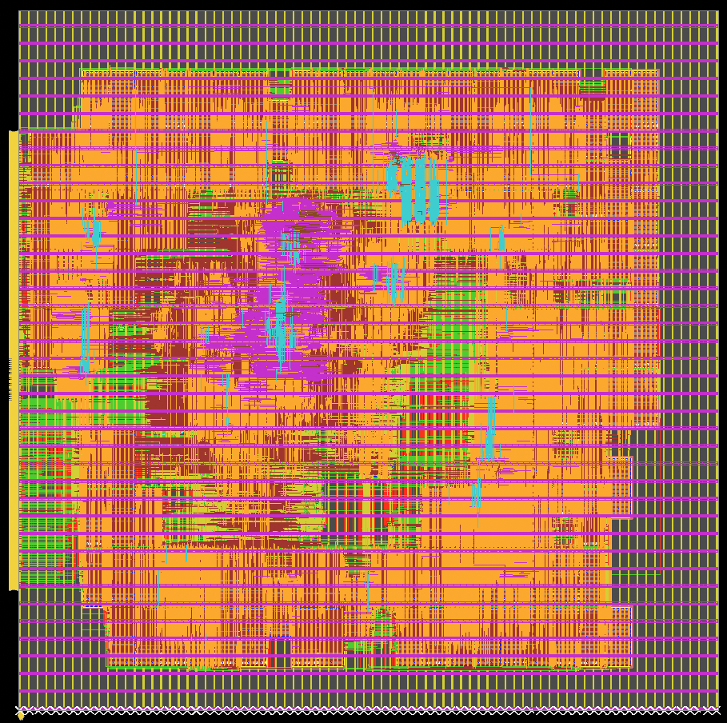

# **Our Progress: A Chronology**
[MacroPlacement](../../) is an open, transparent effort to provide a public, baseline implementation of [Google Brain’s Circuit Training](https://github.com/google-research/circuit_training) (Morpheus) deep RL-based placement method.  In this repo,  we aim to achieve the following.  
- We want to enable anyone to perform RL-based macro placement on their own design, starting from design RTL files.
- We want to enable anyone to train their own RL models based on their own designs in any design enablements, starting from design RTL files.
- We want to demystify important aspects of the Google Nature paper, including aspects unavailable in Circuit Training and aspects where the Nature paper and Circuit Training clearly diverge, in order to help researchers and users better understand the methodology.
- We want to apply learnings from the community’s collective experiences with the Google Brain team’s arXiv result, Nature paper and Circuit Training repo – and demonstrate how communication of research results might be improved in our community going forward. A clear theme from the past months’ experience:  “There is no substitute for source code.”  

In order to achieve the above goals,  our initial focus has been on the following efforts.  
- **Generating correct inputs and setup for Circuit Training.** Since Circuit Training uses protocol buffer format to represent designs, we must translate standard LEF/DEF representation to the protocol buffer format. We must also determine how to correctly feed all necessary design information into the [Google Brain’s Circuit Training](https://github.com/google-research/circuit_training)  flow, e.g., halo width, canvas size, and constraints.  If we accomplish this, then we can run [Google Brain’s Circuit Training](https://github.com/google-research/circuit_training) to train our own RL models or perform RL-based macro placement for our own designs.
- **Replicating important but missing parts of the [Google Nature paper](https://www.nature.com/articles/s41586-021-03544-w).** Several aspects of Circuit Training are not clearly documented in the Nature paper, nor in the code and scripts that are visible in Circuit Training. Over time, these have included hypergraph-to-graph conversion; gridding, grouping and clustering; force-directed placement; various hyperparameter settings; and more. As we keep moving forward, based on our experiments and continued Q&A and feedback from Google, we will summarize the miscorrelations between the Google Nature paper and [Google Brain’s Circuit Training](https://github.com/google-research/circuit_training), as well as corrective steps. In this way, the Circuit Training methodology and the results published in the Nature paper can be better understood by all.

**June 6 - Aug 5:** We have developed and made publicly available the SP&R [flow](../../Flows/) using commercial tools Cadence Genus and Innovus, and open-source tools Yosys and OpenROAD, for [Ariane](../../Testcases/ariane136/) (two variants – one with [136 SRAMs](../../Testcases/ariane136/) and another with [133 SRAMs](../../Testcases/ariane133/)), [MemPool tile](../../Testcases/mempool/) and [NVDLA](../../Testcases/nvdla/) designs on [NanGate45](../../Enablements/NanGate45/), [ASAP7](../../Enablements/ASAP7/) and [SKY130HD](../../Enablements/SKY130HD/) open enablement. We applaud and thank Cadence Design Systems for allowing their tool runscripts to be shared openly by researchers, enabling reproducibility of results obtained via use of Cadence tools. This was an important milestone for the EDA research community. Please see Dr. David Junkin’s [presentation](https://open-source-eda-birds-of-a-feather.github.io/doc/slides/BOAF-Junkin-DAC-Presentation.pdf) at the recent DAC-2022 “Open-Source EDA and Benchmarking Summit” birds-of-a-feather [meeting](https://open-source-eda-birds-of-a-feather.github.io/).  

The following describes our learning related to testcase generation and its implementation using different tools on different platforms.  
1. The [Google Nature paper](https://www.nature.com/articles/s41586-021-03544-w) uses the Ariane testcase (contains 133 256x16-bit SRAMs) for their experiment. [Here](../../Testcases/ariane136/) we show that just instantiating 256x16 bit SRAMs results in 136 SRAMs in the synthesized netlist. Based on our investigations, we have provided the [detailed steps](../../Testcases/ariane133/) to convert the Ariane design with 136 SRAMs to a Ariane design with 133 SRAMs.
2. We provide the required SRAM lef, lib along with the description to reproduce the provided SRAMs or generate a new SRAM for each [enablement](../../Enablements/).
3. The SKY130HD enablement has only five metal layers, while SRAMs have routing up through the M4 layer. This causes P&R failure due to very high routing congestion. We therefore developed FakeStack-extended P&R enablement, where we replicate the first four metal layers to generate a nine metal layer enablement. We call this [SKY130HD-FakeStack](../../Enablements/SKY130HD/) and have used it to implement our testcases. We also provide a [script](../../Enablements/SKY130HD/lef/genTechLef.tcl) for researchers to generate FakeStack enablements with different configurations.
4. We provide power grid generation [scripts](../../Flows/util/pdn_flow.tcl) for Cadence Innovus. During the power grid (PG) generation process we made sure the routing resource used by the PG is in the range of ~20%, matching the guidance given in Circuit Training.
5. Also we provide an Innovus Tcl [script](../../Flows/util/extract_report.tcl) to extract the metrics reported in Table 1 of “[A graph placement methodology for fast chip design](https://www.nature.com/articles/s41586-021-03544-w)”, **at three stages of the post-floorplanning P&R flow, i.e., pre-CTS, post-CTSOpt, and post-RouteOpt (final)**. This [script](../../Flows/util/extract_report.tcl) is included in the P&R flow. The extracted metrics for all of our designs, on different enablements, are available [here](../../ExperimentalData/).  
  

**June 10:** [grouper.py](https://github.com/google-research/circuit_training/blob/main/circuit_training/grouping/grouper.py) was released in CircuitTraining. **This revealed that protobuf input to the hypergraph clustering into soft macros included the (x,y) locations of the nodes**. (A [grouper.py](https://github.com/google-research/circuit_training/blob/main/circuit_training/grouping/grouper.py) script had been shown to Prof. Kahng during a meeting at Google on May 19.) The use of (x,y) locations from a physical synthesis tool was very unexpected, since it is not mentioned in “Methods” or other descriptions given in the Nature paper. We raised [issue #25](https://github.com/google-research/circuit_training/issues/25#issue-1268683034) to get clarification about this. [**July 10**: The [README](https://github.com/google-research/circuit_training/blob/main/circuit_training/grouping/README.md#faq) added to [the grouping area](https://github.com/google-research/circuit_training/tree/main/circuit_training/grouping) of CircuitTraining confirmed that the input netlist has all of its nodes **already placed**.]  
 
We currently use the physical synthesis tool **Cadence Genus iSpatial** to obtain (x,y) placed locations per instance as part of the input to Grouping. The Genus iSpatial post-physical-synthesis netlist is the starting point for how we produce the clustered netlist and the *.plc file which we provide as open inputs to CircuitTraining. From post-physical-synthesis netlist to clustered netlist generation can be divided into the following steps, which we have implemented as open-source in our CodeElements area:
1. **June 6**: [Gridding](../../CodeElements/Gridding/) determines a dissection of the layout canvas into some number of rows and some number of columns of gridcells.
2. **June 10**: [Grouping](../../CodeElements/Grouping/) groups closely-related logic with the corresponding hard macros and clumps of IOs.
3. **June 12**: [Clustering](../../CodeElements/Clustering/) clusters of millions of standard cells into a few thousand clusters (soft macros).
 
**June 22:** We added our [flow-scripts](../../CodeElements/CodeFlowIntegration/) that run our gridding, grouping and clustering implementations to generate a final clustered netlist in **protocol buffer format**. Google’s [netlist protocol buffer format](https://github.com/google-research/circuit_training/blob/main/docs/NETLIST_FORMAT.md) documentation available in the [CircuitTraining repo](https://github.com/google-research/circuit_training) was very helpful to our understanding of how to convert a placed netlist to protobuf format. Our scripts enable clustered netlists in protobuf format to be produced from placed netlists in either LEF/DEF or Bookshelf format.
 
**July 12:**  As stated in the “What is your timeline?” FAQ response [see also note [5] [here](https://docs.google.com/document/d/1vkPRgJEiLIyT22AkQNAxO8JtIKiL95diVdJ_O4AFtJ8/edit?usp=sharing)], we presented progress to date in this [MacroPlacement talk](https://open-source-eda-birds-of-a-feather.github.io/doc/slides/MacroPlacement-SpecPart-DAC-BOF-v5.pdf) at the DAC-2022 “Open-Source EDA and Benchmarking Summit” birds-of-a-feather [meeting](https://open-source-eda-birds-of-a-feather.github.io/). 
 
**July 26:** Replication of the wirelength component of proxy cost. The wirelength is similar to HPWL where given a netlist, we take the width and height and sum them up for each net. One caveat is that for soft macro pins, there could be a weight factor which implies the total connections between the source and sink pins. If not defined, the default value is 1. This weight factor needs to be multiplied with the sum of width and height to replicate Google’s API. We provide the following table as a comparison between [our implementations](../../CodeElements/Plc_client/) and Google’s API.

<table>
<thead>
  <tr>
    <th>Testcase</th>
    <th>Notes</th>
    <th>Canvas width/height</th>
    <th>Grid col/row</th>
    <th>Google</th>
    <th>Our</th>
  </tr>
</thead>
<tbody>
  <tr>
    <td>Ariane</td>
    <td>Google’s Ariane</td>
    <td>356.592 / 356.640</td>
    <td>35 / 33</td>
    <td>0.7500626080261634</td>
    <td>0.7500626224300161</td>
  </tr>
  <tr>
    <td>Ariane133</td>
    <td>From MacroPlacement</td>
    <td>1599.99 / 1598.8</td>
    <td>50 / 50</td>
    <td>0.6522555375409593</td>
    <td>0.6522555172428797</td>
  </tr>
</tbody>
</table>

**July 31:** The [netlist protocol buffer](https://github.com/google-research/circuit_training/blob/main/docs/NETLIST_FORMAT.md) format documentation also helped us to write this Innovus-based  [tcl script](../../Flows/util/gen_pb.tcl) which converts physical synthesized netlist to protobuf format in Innovus.  [This script was written and developed by ABKGroup students at UCSD. However, the underlying commands and reports are copyrighted by Cadence. We thank Cadence for granting permission to share our research to help promote and foster the next generation of innovators.] We use this post-physical-synthesis protobuf netlist as input to the grouping code to generate the clustered netlist. Fixes that we made while running Google’s grouping code resulted in [this [08/01/2022] pull request](https://github.com/google-research/circuit_training/pull/33). [08/05/2022: Google’s grouping code has been updated based on this [PR](https://github.com/google-research/circuit_training/pull/33).]

**July 22-August 4:** We shared with Google engineers our (flat) [post-physical-synthesis-protobuf netlist (ariane.pb.txt)](https://drive.google.com/file/d/1dVltyKwjWcCAPRRKlcN2CRSeaxuaScPI/view?usp=sharing) of [our Ariane design with 133 SRAMs on the NanGate45 platform](https://drive.google.com/file/d/1BvqqSngFiWXk5WNAFDO8KMPq3eqI5THf/view?usp=sharing), along with the corresponding [clustered netlist and the legalized.plc file (clustered netlist: netlist.pb.txt)](https://drive.google.com/file/d/1dVltyKwjWcCAPRRKlcN2CRSeaxuaScPI/view?usp=sharing) generated using the [CircuitTraining grouping code](https://github.com/google-research/circuit_training). The goal here was to verify our steps and setup up to this point. Also, we provide [scripts](../../Flows/util/) (using both our [CodeElements](../../CodeElements/) and [CT-grouping](https://github.com/google-research/circuit_training/tree/main/circuit_training/grouping)) to integrate the clustered netlist generation with the SP&R flow. 
 
**August 5:** The following table compares the clustering results for [Ariane133-NG45](../../Flows/NanGate45/ariane133/) design generated by the Google engineer (internally to Google) and the clustering results generated by us using [CT grouping code](https://github.com/google-research/circuit_training/tree/main/circuit_training/grouping).

<table>
<thead>
  <tr>
    <th></th>
    <th>Google Internal flow (from Google)</th>
    <th>Our use of CT Grouping code </th>
  </tr>
</thead>
<tbody>
  <tr>
    <td>Number of grid rows x columns</td>
    <td>21 x 24</td>
    <td>21 x 24</td>
  </tr>
  <tr>
    <td>Number of soft macros</td>
    <td>736</td>
    <td>738</td>
  </tr>
  <tr>
    <td>HPWL</td>
    <td>4171594.811</td>
    <td>4179069.884</td>
  </tr>
  <tr>
    <td>Wirelength cost</td>
    <td>0.072595</td>
    <td>0.072197</td>
  </tr>
  <tr>
    <td>Congestion cost</td>
    <td>0.727798</td>
    <td>0.72853</td>
  </tr>
</tbody>
</table>

**August 11:** We received information from Google that when a standard cell has multiple outputs, it merges all of them in the protobuf netlist (example: a full adder cell would have its outputs merged). The possible vertices of a hyperedge are macro pins, ports, and standard cells. Our Innovus-based protobuf netlist generation [tcl script](../../Flows/util/gen_pb.tcl) takes care of this.
 
**August 15:** We received information from Google engineers that in the proxy cost function, the density weight is set to 0.5 for their internal runs.
 
**August 17:** The proxy wirelength cost which is usually a value between 0 and 1, is related to the HPWL we computed earlier. We deduce the formulation as the following:

|netlist| is the total number of nets and it takes into account the weight factor defined on soft macro pins. Here is [our proxy wirelength](../../CodeElements/Plc_client/) compared with Google’s API:

<table>
<thead>
  <tr>
    <th>Testcase</th>
    <th>Notes</th>
    <th>Canvas width/height</th>
    <th>Google</th>
    <th>Our</th>
  </tr>
</thead>
<tbody>
  <tr>
    <td>Ariane</td>
    <td>Google’s Ariane</td>
    <td>356.592 / 356.640</td>
    <td>0.05018661999974192</td>
    <td>0.05018662006439473</td>
  </tr>
  <tr>
    <td>Ariane133</td>
    <td>From MacroPlacement</td>
    <td>1599.99 / 1598.8</td>
    <td>0.04456188308735019</td>
    <td>0.04456188299072617</td>
  </tr>
</tbody>
</table>

Replication of the density component of proxy cost. We now have a verified density cost computation. Density cost computation depends on gridcell density. Gridcell density is the ratio of the total area occupied by standard cells, soft macros and hard macros to the total area of the grid. If there are cell overlaps then it may result in grid density greater than one. To get the density cost, we take the average of the top 10% of the densest gridcells. Before outputting it, we multiply it by 0.5. Notice that this **0.5 is not the “weight” of this cost function**, but simply another factor applied besides the weight factor from the cost function.

<table>
<thead>
  <tr>
    <th>Testcase</th>
    <th>Notes</th>
    <th>Canvas width/height</th>
    <th>Grid col/row</th>
    <th>Google</th>
    <th>Our</th>
  </tr>
</thead>
<tbody>
  <tr>
    <td>Ariane</td>
    <td>Google’s Ariane</td>
    <td>356.592 / 356.640</td>
    <td>35 / 33</td>
    <td>0.7500626080261634</td>
    <td>0.7500626224300161</td>
  </tr>
  <tr>
    <td>Ariane133</td>
    <td>From MacroPlacement</td>
    <td>1599.99 / 1598.8</td>
    <td>50 / 50</td>
    <td>0.6522555375409593</td>
    <td>0.6522555172428797</td>
  </tr>
</tbody>
</table>

**August 18:** The flat post-physical-synthesis protobuf netlist of [Ariane133-NanGate45](../../Flows/NanGate45/ariane133/) design is used as input to [CT grouping](https://github.com/google-research/circuit_training/tree/main/circuit_training/grouping) code to generate the clustered netlist. We then use this clustered netlist in Circuit Training. [Coordinate Descent](https://github.com/google-research/circuit_training/blob/main/circuit_training/environment/coordinate_descent_placer.py) is (by [default](https://github.com/google-research/circuit_training/blob/9e7097fa0c2a82030f43b298259941fc8ca6b7ae/circuit_training/learning/eval.py#L50-L52)) not applied to any macro placement solution. Here is the [link](https://tensorboard.dev/experiment/eCRHe29LQvi1sdAPD61Q6A/#scalars) to our tensorboard. We ran Innovus P&R starting from the macro placement generated using CT, through the end of detailed routing (RouteOpt) and collection of final PPA / “Table 1” metrics. Following are the metrics and screen shots of the P&R database. **Throughout the SP&R flow, the target clock period is 4ns**. The power grid overhead is 18.46% in the actual P&R setup, matching the 18% [mentioned](https://github.com/google-research/circuit_training/blob/9e7097fa0c2a82030f43b298259941fc8ca6b7ae/circuit_training/environment/placement_util.py#L183-L186) in the Circuit Training repo. **All results are for DRC-clean final routing produced by the Innovus tool**.   
[In the immediately-following content, we also show comparison results using other macro placement methods, collected since August 18.]  
[As of August 24 onward, we refer to this testcase as “Our Ariane133-NanGate45_51” since it has 51% area utilization. A second testcase, “Our Ariane133-NanGate45_68”, has 68% area utilization which exactly matches that of the Ariane in Circuit Training.]

### Circuit Training Baseline Result on “Our Ariane133-NanGate45_51”.

<table>
<thead>
  <tr>
    <th colspan="10">Macro placement generated by Circuit Training on Our Ariane-133 (NG45), with post-macro placement flow using Innovus21.1</th>
  </tr>
</thead>
<tbody>
  <tr>
    <td>Physical Design Stage</td>
    <td>Core Area (um^2)</td>
    <td>Standard Cell Area (um^2)</td>
    <td>Macro Area (um^2)</td>
    <td>Total Power (mW)</td>
    <td>Wirelength (um)</td>
    <td>WS  (ns)</td>
    <td>TNS  (ns)</td>
    <td>Congestion (H)</td>
    <td>Congestion (V)</td>
  </tr>
  <tr>
    <td>preCTS</td>
    <td>2560080</td>
    <td>214555</td>
    <td>1018356</td>
    <td>287.79</td>
    <td>4343214</td>
    <td>0.005</td>
    <td>0</td>
    <td>0.01%</td>
    <td>0.02%</td>
  </tr>
  <tr>
    <td>postCTS</td>
    <td>2560080</td>
    <td>216061</td>
    <td>1018356</td>
    <td>301.31</td>
    <td>4345969</td>
    <td>0.010</td>
    <td>0</td>
    <td>0.01%</td>
    <td>0.02%</td>
  </tr>
  <tr>
    <td>postRoute</td>
    <td>2560080</td>
    <td>216061</td>
    <td>1018356</td>
    <td>300.38</td>
    <td>4463660</td>
    <td>0.359</td>
    <td>0</td>
    <td></td>
    <td></td>
  </tr>
</tbody>
</table>

**Comparison 1: “Human Gridded”.** For comparison, a  baseline “human, gridded” macro placement was generated by a human for the same canvas size, I/O placement and gridding, with results as follows.

<table>
<thead>
  <tr>
    <th colspan="10">Macro placement generated by a human on Our Ariane-133 (NG45), with post-macro placement flow using Innovus21.1</th>
  </tr>
</thead>
<tbody>
  <tr>
    <td>Physical Design Stage</td>
    <td>Core Area (um^2)</td>
    <td>Standard Cell Area (um^2)</td>
    <td>Macro Area (um^2)</td>
    <td>Total Power (mW)</td>
    <td>Wirelength (um)</td>
    <td>WS  (ns)</td>
    <td>TNS  (ns)</td>
    <td>Congestion (H)</td>
    <td>Congestion (V)</td>
  </tr>
  <tr>
    <td>preCTS</td>
    <td>2560080</td>
    <td>215188.9</td>
    <td>1018356</td>
    <td>285.96</td>
    <td>4470832</td>
    <td>-0.002</td>
    <td>-0.005</td>
    <td>0.00%</td>
    <td>0.00%</td>
  </tr>
  <tr>
    <td>postCTS</td>
    <td>2560080</td>
    <td>216322.9</td>
    <td>1018356</td>
    <td>299.62</td>
    <td>4472866</td>
    <td>0.001</td>
    <td>0</td>
    <td>0.00%</td>
    <td>0.00%</td>
  </tr>
  <tr>
    <td>postRoute</td>
    <td>2560080</td>
    <td>216322.9</td>
    <td>1018356</td>
    <td>298.60</td>
    <td>4587141</td>
    <td>0.284</td>
    <td>0</td>
    <td></td>
    <td></td>
  </tr>
</tbody>
</table>

**Comparison 2: RePlAce.** The standalone RePlAce placer was run on the same (flat) netlist with the same canvas size and I/O placement, with results as follows.

<table>
<thead>
  <tr>
    <th colspan="10">Macro placement generated by RePlAce (standalone, from <a href="https://github.com/mgwoo/RePlAce">HERE</a>) on Our Ariane-133 (NG45), with post-macro placement flow using Innovus21.1</th>
  </tr>
</thead>
<tbody>
  <tr>
    <td>Physical Design Stage</td>
    <td>Core Area (um^2)</td>
    <td>Standard Cell Area (um^2)</td>
    <td>Macro Area (um^2)</td>
    <td>Total Power (mW)</td>
    <td>Wirelength (um)</td>
    <td>WS  (ns)</td>
    <td>TNS  (ns)</td>
    <td>Congestion (H)</td>
    <td>Congestion (V)</td>
  </tr>
  <tr>
    <td>preCTS</td>
    <td>2560080</td>
    <td>214910.71</td>
    <td>1018356</td>
    <td>288.654</td>
    <td>4178509</td>
    <td>0.003</td>
    <td>0</td>
    <td>0.03%</td>
    <td>0.07%</td>
  </tr>
  <tr>
    <td>postCTS</td>
    <td>2560080</td>
    <td>216006.63</td>
    <td>1018356</td>
    <td>302.013</td>
    <td>4184690</td>
    <td>0.007</td>
    <td>0</td>
    <td>0.05%</td>
    <td>0.08%</td>
  </tr>
  <tr>
    <td>postRoute</td>
    <td>2560080</td>
    <td>216006.63</td>
    <td>1018356</td>
    <td>301.260</td>
    <td>4315157</td>
    <td>-0.207</td>
    <td>-0.41</td>
    <td></td>
    <td></td>
  </tr>
</tbody>
</table>

**Comparison 3: [RTL-MP](https://vlsicad.ucsd.edu/Publications/Conferences/389/c389.pdf).**  The RTL-MP macro placer described in [this ISPD-2022 paper](https://vlsicad.ucsd.edu/Publications/Conferences/389/c389.pdf) and used as the default macro placer in OpenROAD was run on the same (flat) netlist with the same canvas size and I/O placement, with results as follows.

<table>
<thead>
  <tr>
    <th colspan="10">Macro placement generated using <a href="https://vlsicad.ucsd.edu/Publications/Conferences/389/c389.pdf">RTL-MP</a> on Our Ariane-133 (NG45), with post-macro placement flow using Innovus21.1</th>
  </tr>
</thead>
<tbody>
  <tr>
    <td>Physical Design Stage</td>
    <td>Core Area (um^2)</td>
    <td>Standard Cell Area (um^2)</td>
    <td>Macro Area (um^2)</td>
    <td>Total Power (mW)</td>
    <td>Wirelength (um)</td>
    <td>WS  (ns)</td>
    <td>TNS  (ns)</td>
    <td>Congestion (H)</td>
    <td>Congestion (V)</td>
  </tr>
  <tr>
    <td>preCTS</td>
    <td>2560080</td>
    <td>216420.26</td>
    <td>1018356</td>
    <td>289.435</td>
    <td>5164199</td>
    <td>0.020</td>
    <td>0</td>
    <td>0.04%</td>
    <td>0.05%</td>
  </tr>
  <tr>
    <td>postCTS</td>
    <td>2560080</td>
    <td>217938.32</td>
    <td>1018356</td>
    <td>303.757</td>
    <td>5185004</td>
    <td>0.001</td>
    <td>0</td>
    <td>0.05%</td>
    <td>0.07%</td>
  </tr>
  <tr>
    <td>postRoute</td>
    <td>2560080</td>
    <td>217938.32</td>
    <td>1018356</td>
    <td>302.844</td>
    <td>5306735</td>
    <td>0.104</td>
    <td>0</td>
    <td></td>
    <td></td>
  </tr>
</tbody>
</table>

**Comparison 4:** The Hier-RTLMP macro placer was run on the same (flat) netlist with the same canvas size and I/O placement, with results as follows. [The Hier-RTLMP paper is in submission as of August 2022; availability in OpenROAD and OpenROAD-flow-scripts is planned by end of September 2022. Please email [abk@eng.ucsd.edu](abk@eng.ucsd.edu) if you would like a preprint, not for further redistribution.]

<table>
<thead>
  <tr>
    <th colspan="10">Macro placement generated using Hier-RTLMP on Our Ariane-133 (NG45), with post-macro placement flow using Innovus21.1</th>
  </tr>
</thead>
<tbody>
  <tr>
    <td>Physical Design Stage</td>
    <td>Core Area (um^2)</td>
    <td>Standard Cell Area (um^2)</td>
    <td>Macro Area (um^2)</td>
    <td>Total Power (mW)</td>
    <td>Wirelength (um)</td>
    <td>WS  (ns)</td>
    <td>TNS  (ns)</td>
    <td>Congestion (H)</td>
    <td>Congestion (V)</td>
  </tr>
  <tr>
    <td>preCTS</td>
    <td>2560080</td>
    <td>214783.83</td>
    <td>1018356</td>
    <td>288.356</td>
    <td>4397005</td>
    <td>0.005</td>
    <td>0</td>
    <td>0.02%</td>
    <td>0.05%</td>
  </tr>
  <tr>
    <td>postCTS</td>
    <td>2560080</td>
    <td>215911.67</td>
    <td>1018356</td>
    <td>302.176</td>
    <td>4419305</td>
    <td>0.009</td>
    <td>0</td>
    <td>0.04%</td>
    <td>0.06%</td>
  </tr>
  <tr>
    <td>postRoute</td>
    <td>2560080</td>
    <td>215911.67</td>
    <td>1018356</td>
    <td>301.468</td>
    <td>4537458</td>
    <td>0.311</td>
    <td>0</td>
    <td></td>
    <td></td>
  </tr>
</tbody>
</table>

**August 20:** Matching the area utilization. We revisited the area utilization of Our Ariane133 and realized that it (51%) is lower than that of Google’s Ariane (68%). So that this would not devalue our study, we created a second variant,  “**Our Ariane133-NanGate45_68**”, which matches the area utilization of Google’s Ariane. Results are as given below.

### **Circuit Training Baseline Result on “Our Ariane133-NanGate45_68”. **
<table>
<thead>
  <tr>
    <th colspan="10">Macro Placement generated Using CT (Ariane 68% Utilization)</th>
  </tr>
</thead>
<tbody>
  <tr>
    <td>Physical Design Stage</td>
    <td>Core Area (um^2)</td>
    <td>Standard Cell Area (um^2)</td>
    <td>Macro Area (um^2)</td>
    <td>Total Power (mW)</td>
    <td>Wirelength (um)</td>
    <td>WS  (ns)</td>
    <td>TNS  (ns)</td>
    <td>Congestion (H)</td>
    <td>Congestion (V)</td>
  </tr>
  <tr>
    <td>preCTS</td>
    <td>1814274</td>
    <td>215575.444</td>
    <td>1018355.73</td>
    <td>288.762</td>
    <td>4170253</td>
    <td>0.002</td>
    <td>0</td>
    <td>0.01%</td>
    <td>0.01%</td>
  </tr>
  <tr>
    <td>postCTS</td>
    <td>1814274</td>
    <td>217114.520</td>
    <td>1018355.73</td>
    <td>302.607</td>
    <td>4186888</td>
    <td>0.001</td>
    <td>0</td>
    <td>0.00%</td>
    <td>0.01%</td>
  </tr>
  <tr>
    <td>postRoute</td>
    <td>1814274</td>
    <td>217114.520</td>
    <td>1018355.73</td>
    <td>301.722</td>
    <td>4295572</td>
    <td>0.336</td>
    <td>0</td>
    <td></td>
    <td></td>
  </tr>
</tbody>
</table>

